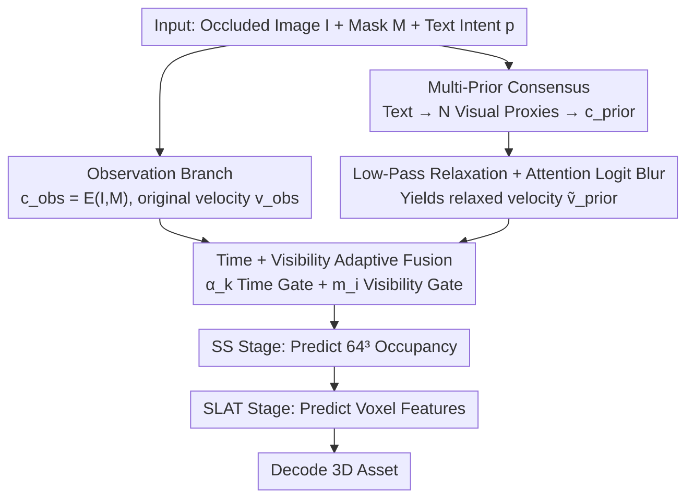

# RelaxFlow: Text-Driven Amodal 3D Generation

**Conference**: ICML 2026 Spotlight  
**arXiv**: [2603.05425](https://arxiv.org/abs/2603.05425)  
**Code**: https://github.com/viridityzhu/RelaxFlow  
**Area**: 3D Vision / Diffusion Models / Multimodal VLM  
**Keywords**: amodal 3D generation, text-driven, training-free, low-pass relaxation, dual-branch flow model

## TL;DR
RelaxFlow formalizes "completing occluded 3D objects via text" as a **dual-objective control granularity decoupling** problem. It proposes a training-free dual-branch inference framework: an observation branch maintains pixel-level hard constraints, while a semantic prior branch achieves low-pass relaxation through "multi-prior consensus + Gaussian blur on attention logits." The authors theoretically prove that this relaxation is equivalent to low-pass filtering the generative vector field. This approach reduces Point-FID from 100.38 to 81.11 on SOTA models like SAM3D and TRELLIS.

## Background & Motivation
**Background**: Feedforward image-to-3D generation (e.g., TRELLIS, SAM3D, Trellis-XL) can transform a single image into usable 3D assets by feeding image tokens into a conditioned rectified flow to predict sparse structures (occupancy grids) and structured latents (appearance).

**Limitations of Prior Work**: When input images are heavily occluded, visible pixels are insufficient to uniquely determine the object category (e.g., a backboard could be a bed, sofa, or dresser). Since feedforward models only accept image tokens, they **collapse into a "most common interpretation" overfitted to observations** when encountering semantic under-determination, leaving users unable to intervene. Conversely, optimization-based SDS-style editing methods, while following text, often over-smooth or destroy visible evidence because semantic and reconstruction gradients conflict directly.

**Key Challenge**: Existing methods use a **unified control granularity** to enforce two objectives simultaneously—observations must be **rigidly followed** (visual fidelity), while text acts only as **soft structural guidance** (tolerating local deviations to fit observations). When both are placed in the same conditional branch competing for attention, a trade-off is inevitable: either the text is suppressed, or the observation is destroyed.

**Goal**: (1) Formalize the new task of text-driven amodal 3D generation; (2) Design a training-free inference-time solution that satisfies both "hard observation constraints + soft text guidance"; (3) Provide an interpretable theoretical explanation for the stable convergence of this approach.

**Key Insight**: The authors observe that the oracle "semantic transport vector field" $\bm{v}_{\rm sem}$ is **band-limited** in the frequency domain—category-level geometry ("the shape of a bed") occupies only low frequencies, while instance details and texture conflicts introduced by conditioned tokens are **high-frequency noise**. Therefore, low-pass filtering the velocity field of the semantic branch preserves the "global geometric corridor" while discarding high-frequency jitters that damage observations.

**Core Idea**: The generation process is split into **two ODE flows sharing the same state but independent conditions**. The observation branch runs the original $v_\theta(x_t, t, c_{\rm obs})$, while the semantic branch computes a relaxed velocity field $\tilde v_\theta = \mathcal R_\sigma[v_\theta(x_t, t, c_{\rm prior})]$ via **Gaussian blur on attention logits**. These are fused using time-dependent weights, relying on semantics for global modes early on and observations for fine details later.

## Method

### Overall Architecture
RelaxFlow addresses the issue where feedforward image-to-3D generators collapse into a "most common explanation" for occluded images, ignoring user text intent. It splits the generation process into **two ODE flows sharing a single state but using independent conditions**: the observation branch strictly follows pixel evidence, while the semantic prior branch, after "low-pass filtering," contributes only coarse-grained category geometry. These are fused with weights based on time and visibility. The module is training-free and can be plugged into any "image token + rectified flow" generator (the paper uses TRELLIS and SAM3D).

Inputs consist of an occluded image $I$, a visibility mask $M$, and a text prompt $p$. The outputs are complete 3D assets decoded after two-stage flow sampling: Sparse Structure (SS, predicting $64^3$ occupancy) and Structured Latent (SLAT, predicting voxel-level features). Specifically, at each Euler update step, the original single-condition update:

$$x_{k+1}=x_k+\Delta t\,v(x_k,t_k,c)$$

is replaced by an interpolation across two branches. The observation branch receives $c_{\rm obs}=E(I,M)$ as usual. The semantic branch converts text into $N=3$ visual proxy images encoded as $c_{\rm prior}$, applies logit blurring to obtain the relaxed velocity $\tilde v_{\rm prior}$, and fuses the two using time weights $\alpha_k$ and visibility weights $m_i$.

### Key Designs

**1. Multi-prior consensus: Translating text into native visual tokens while removing instance-specific noise.**
Modern 3D generators use visual tokens rather than text embeddings. To follow text without expensive retraining, the authors "translate" text into visual proxies. For a prompt, they retrieve or generate $N$ visual references $\{(I_p^n, M_p^n)\}$ sharing the same semantics but with different appearances. These tokens are concatenated into one long sequence for cross-attention. Shared attributes accumulate higher attention, while conflicting textures are naturally diluted. This consensus approximates the residual term $\delta_{\rm prior}$ in the Wasserstein upper bound (§3.2).

**2. Low-Pass Relaxation + Attention Logit Blur: Filtering the semantic velocity field to keep global geometry and remove texture conflicts.**
Directly weighting two prompts (like SDS/CFG) causes high-frequency instance conflicts to fragment the "semantic corridor." The key insight is that the oracle semantic transport field $\bm v_{\rm sem}$ is **band-limited** (category geometry is low-frequency), while instance conflicts are **high-frequency noise**. By applying low-pass filtering $\tilde v_\theta = \mathcal R_\sigma[v_\theta]$, the semantic corridor is thickened. Theoretically (Proposition A.4 + Theorem A.9), if the band-limited assumption holds, this relaxation strictly reduces the $L_2$ path norm semantic error $\mathcal E_{\rm sem}$, tightening the Wasserstein distance upper bound:

$$\mathcal W_2(p,\hat p)\le C\big(\mathcal E_{\rm obs}+\mathcal E_{\rm sem}(\tilde v)+\delta_{\rm prior}\big)$$

Implementationally, instead of expensive convolutions on the vector field, a 1D Gaussian convolution is applied to the prior branch's cross-attention logit matrix $L_{i,j}=q_i^\top k_j/\sqrt d$ along query and key indices: $\tilde L = G_\sigma^{(q)} *_q L *_k G_\sigma^{(k)}$. This is equivalent to a separable 2D Gaussian blur and induces a corresponding velocity field relaxation.

**3. Time + Visibility Sensing Fusion: Directing semantic priors to "early steps + occluded voxels."**
To prevent the semantic branch from over-editing visible regions, weights are gated in time and space. Time-wise, a linear cutoff $\alpha_k=\max(1-k/K,\,0)\cdot\mathbb 1[k\le\lfloor\rho K\rfloor]$ is used, matching the inductive bias that diffusion models determine global structure early and fine details later. Space-wise, soft visibility weights $m_i \in (0,1]$ are derived from a z-buffer projection. The SLAT fusion is defined as:

$$v_i=v_{\rm obs,i}+(1-m_i)\,\alpha_k\,(\tilde v_{\rm prior,i}-v_{\rm obs,i})$$

Visible voxels retain observation velocity, while only occluded voxels accept the prior shift.

### Loss & Training
**Completely training-free and fine-tuning-free.** All backbone parameters (SAM3D/TRELLIS) are frozen. The method only modifies cross-attention computation and Euler updates during inference. It uses $N=3$ prior images, $\sigma=1.0$, and $\rho=0.2$ by default, running on a single A40 GPU.

## Key Experimental Results

### Main Results

**ExtremeOcc-3D** (264 cases with occlusion ≥80%):

| Backbone | Method | CLIP_img↑ | CLIP_txt↑ | FID↓ | LPIPS↓ | Point-FID↓ |
|---|---|---|---|---|---|---|
| TRELLIS | baseline | 0.78 | 23.14 | 122.68 | 0.83 | 141.48 |
| TRELLIS | **+ RelaxFlow** | 0.80 | 24.09 | 100.75 | 0.80 | **97.79** |
| SAM3D | baseline | 0.84 | 24.08 | 50.73 | 0.54 | 100.38 |
| SAM3D | **+ RelaxFlow** | **0.87** | **27.26** | **39.44** | **0.51** | **81.11** |

Both backbones improved across all metrics. CLIP_img and LPIPS did not degrade, showing semantic priors only act when necessary.

**AmbiSem-3D** (21 multi-solution cases + user study, n=32):

| Method | CLIP_img↑ | CLIP_txt↑ | Text Align.↑ | 3D Fidelity↑ | Preference↑ |
|---|---|---|---|---|---|
| SAM3D | 0.85 | 26.29 | 4.84% | 13.59% | 9.22% |
| SDXL → SAM3D | 0.79 | 26.71 | 11.41% | 6.09% | 8.75% |
| **RelaxFlow (Ours)** | **0.87** | **27.23** | **73.91%** | **63.13%** | **68.52%** |

User preference is overwhelmingly positive (68.52%), and RelaxFlow outperforms baselines in both observation fidelity and text alignment on ambiguous cases.

### Ablation Study

| Configuration | Point-FID↓ | 说明 |
|---|---|---|
| Full RelaxFlow | **81.1** | Full model |
| w/o Low-Pass Relax | 87.1 | Attention blur removed; semantic noise leaks in |
| w/o Visibility Mask | 92.3 | Highest degradation; prior pollutes visible area |
| Cutoff $\rho=0.4$ | 86.5 | Prior involved for too long |
| Cutoff $\rho=1.0$ | 89.9 | Full-duration prior destroys details |

### Key Findings
- **Visibility mask is more critical than relaxation**: Removing the mask causes an 11.2 Point-FID drop, whereas removing relaxation causes a 6.0 drop. This confirms that "when to listen" is more important than "how clean the signal is."
- **Optimal $\sigma$ and $\rho$**: Increasing $\rho$ to 1.0 or $\sigma$ to 2.5 degrades performance. Low-pass relaxation must be precisely balanced.
- **Robustness to prior sources**: Performance is similar using retrieved vs. generated (Z-Image) priors (81.1 vs 82.7).

## Highlights & Insights
- **Decoupling Control Granularity**: This framing elegantly reconciles the conflict between rigid observation and soft semantic guidance by using different frequency bands for their respective velocity fields.
- **Theory-Implementation Duality**: The mapping from the theoretical low-pass operator $\mathcal R_\sigma$ to implementation via Gaussian blur on attention logits is mathematically sound and highly effective.
- **Non-Invasive and Extensibile**: Being training-free allows it to be integrated into any cross-attention-based generator without distribution shifts.
- **Broad Applicability**: The "low-pass attention logit" trick could potentially be applied to image editing, video generation, or controllable LLM generation.

## Limitations & Future Work
- **Backbone Restriction**: The method relies on cross-attention structures and is not directly applicable to MLP-only or discrete token generators.
- **Inference Overhead**: Running dual branches with logit convolution roughly doubles the runtime.
- **Pose Dependency**: The visibility mask requires pose estimation (e.g., via ExtremeOcc-3D); its absence in models like TRELLIS limits performance gains.
- **Scale**: The ambiguity-specific benchmark (AmbiSem-3D) is small.
- **Future Directions**: Exploring self-supervised visibility masks (e.g., via SAM + depth) and adaptive relaxation (spatially varying blur levels).

## Related Work & Insights
- **Vs. Feedforward Models**: Standard models like SAM3D "blindly guess" interpretations. RelaxFlow introduces user text control with superior Point-FID.
- **Vs. Two-Stage Pipelines (2D Edit → 3D)**: RelaxFlow avoids the geometric inconsistent artifacts inherent in lifting 2D edits to 3D.
- **Vs. CFG/FlowEdit**: Unlike standard weight-averaging, RelaxFlow exploits the different spectral properties of conditions.
- **Vs. Smoothed Energy Guidance**: While similar in terms of attention blurring, RelaxFlow utilizes it as an arbitrator between conflicting conditional branches within a multi-objective framework.

## Rating
- Novelty: ⭐⭐⭐⭐⭐ Elegant framing and mathematical justification for a real-world task.
- Experimental Thoroughness: ⭐⭐⭐⭐ Excellent coverage across backbones and benchmarks; slightly limited by the small size of AmbiSem-3D.
- Writing Quality: ⭐⭐⭐⭐⭐ Very clear structure; excellent use of conceptual diagrams and theoretical proofs.
- Value: ⭐⭐⭐⭐⭐ Plug-and-play nature for 3D generation with potential cross-domain impact.

<!-- RELATED:START -->

## Related Papers

- [\[AAAI 2026\] NURBGen: High-Fidelity Text-to-CAD Generation through LLM-Driven NURBS Modeling](../../AAAI2026/3d_vision/nurbgen_high-fidelity_text-to-cad_generation_through_llm-driven_nurbs_modeling.md)
- [\[CVPR 2026\] Text–Image Conditioned 3D Generation](../../CVPR2026/3d_vision/text-image_conditioned_3d_generation.md)
- [\[CVPR 2026\] Are We Ready for RL in Text-to-3D Generation? A Progressive Investigation](../../CVPR2026/3d_vision/are_we_ready_for_rl_in_text-to-3d_generation_a_progressive_investigation.md)
- [\[ICCV 2025\] Amodal Depth Anything: Amodal Depth Estimation in the Wild](../../ICCV2025/3d_vision/amodal_depth_anything_amodal_depth_estimation_in_the_wild.md)
- [\[CVPR 2026\] Multimodal Semantic Bias Mitigation for Diverse Text-To-3D Generation](../../CVPR2026/3d_vision/multimodal_semantic_bias_mitigation_for_diverse_text-to-3d_generation.md)

<!-- RELATED:END -->
