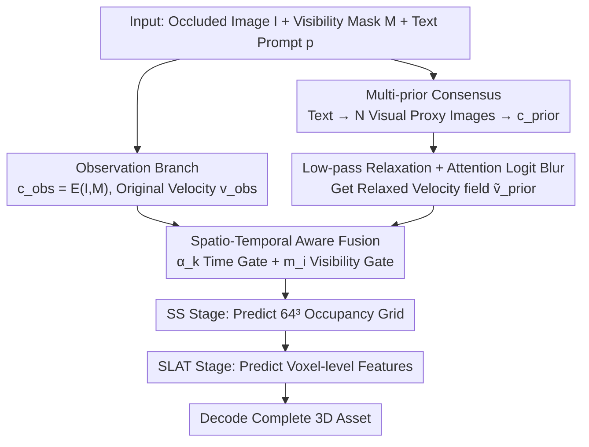

# RelaxFlow: Text-Driven Amodal 3D Generation

**Conference**: ICML 2026 Spotlight  
**arXiv**: [2603.05425](https://arxiv.org/abs/2603.05425)  
**Code**: https://github.com/viridityzhu/RelaxFlow  
**Area**: 3D Vision / Diffusion Models / Multimodal VLM  
**Keywords**: amodal 3D generation, text-driven, training-free, low-pass relaxation, dual-branch flow model

## TL;DR
RelaxFlow formulates "text-driven completion of occluded 3D objects" as a problem of **decoupling control granularity for dual objectives**. It proposes a training-free dual-branch inference framework: an observation branch maintains pixel-level hard constraints, while a semantic prior branch achieves low-pass relaxation through "multi-prior consensus + Gaussian blur on attention logits." The work theoretically proves that this relaxation is equivalent to low-pass filtering the generative vector field, reducing Point-FID from 100.38 to 81.11 on SOTA models like SAM3D/TRELLIS.

## Background & Motivation
**Background**: Feed-forward image-to-3D generation models (e.g., TRELLIS, SAM3D, Trellis-XL) can transform a single image into usable 3D assets by feeding image tokens into conditioned rectified flow to predict sparse structures (occupancy grids) and structured latents (appearance).

**Limitations of Prior Work**: When the input image is severely occluded, visible pixels are insufficient to uniquely determine the object category (e.g., a backboard could be a bed, sofa, or dresser). Feed-forward models, accepting only image tokens, **collapse into an "observation-overfitted" most common interpretation** under such "semantic under-determination," leaving users no way to intervene. Conversely, optimization-based SDS-style editing methods, while following text, often over-smooth or destroy visible evidence because semantic gradients conflict directly with pixel reconstruction gradients.

**Key Challenge**: Existing methods impose two objectives simultaneously using a **unified control granularity**: observations must be **rigidly followed** (visual fidelity), while text serves as **flexible structural guidance** (tolerating local deviations to adapt to observations). When both compete for attention in the same conditional branch, a trade-off is inevitable: either the text is suppressed, or the observation is corrupted.

**Goal**: (1) Formalize the new task of text-driven amodal 3D generation; (2) Design a training-free inference-time solution that satisfies both "hard observation constraints + soft text guidance"; (3) Provide an interpretable theoretical explanation for stable convergence.

**Key Insight**: The authors observe that the oracle "semantic transport vector field" $\bm{v}_{\rm sem}$ is **band-limited** in the frequency domain—category-level geometry ("the shape of a bed") occupies low frequencies, while instance details and texture conflicts introduced by text/image tokens are **high-frequency noise**. Thus, low-pass filtering the velocity field of the semantic branch retains the "global geometric corridor" while discarding high-frequency jitters that destroy observations.

**Core Idea**: The generation process is split into **two ODE flows sharing the same state but with independent conditions**. The observation branch runs the original $v_\theta(x_t,t,c_{\rm obs})$, while the semantic branch computes a relaxed velocity field $\tilde v_\theta=\mathcal R_\sigma[v_\theta(x_t,t,c_{\rm prior})]$ via **Gaussian blur on attention logits**. These are fused using time-dependent weights, where the semantic prior dominates global mode capture in early stages and observations refine details in later stages.

## Method

### Overall Architecture
RelaxFlow addresses the dilemma where severely occluded images fed into feed-forward models result in a collapse to a "most likely" interpretation. The solution splits the generation into **two ODE flows sharing a single state with independent conditions**: the observation branch strictly follows pixel evidence, and the semantic prior branch, after "low-pass filtering," contributes only coarse category geometry. These are fused with weights favoring the semantic prior early on for global structure and the observation later for detail. This module is training-free and can be plugged into any "image token + rectified flow" generator (the paper uses TRELLIS and SAM3D).

Inputs are the occluded image $I$, visibility mask $M$, and text prompt $p$. Outputs are decoded 3D assets after two stages of flow sampling: Sparse Structure (SS, $64^3$ occupancy grid) and Structured Latent (SLAT, voxel-level features). Specifically, at each Euler step, the original single-condition update:

$$x_{k+1}=x_k+\Delta t\,v(x_k,t_k,c)$$

is replaced by an interpolation of dual branches sharing the state: the observation branch uses $c_{\rm obs}=E(I,M)$, and the semantic branch converts text into $N=3$ visual proxy images encoded as $c_{\rm prior}$, applies logit blurring for relaxed velocity $\tilde v_{\rm prior}$, and merges them using time weight $\alpha_k$ and visibility weight $m_i$.

### Key Designs

**1. Multi-prior Consensus: Translating text into native visual tokens while removing instance style pollution.**
Since modern feed-forward 3D generators use visual tokens rather than text embeddings as conditional interfaces, the authors "translate" text into visual proxies using $N$ reference images $\{(I_p^n,M_p^n)\}$ (e.g., generating several images of a "red-billed bird" with varying body shapes). These token sequences are **concatenated and fed into cross-attention simultaneously**. Shared attributes repeat, accumulating higher attention, while conflicting textures are naturally diluted. This consensus approximates the residual term $\delta_{\rm prior}$ in the Wasserstein bound (§3.2), enabling text following without adapters.

**2. Low-pass Relaxation + Attention Logit Blur: Filtering the semantic velocity field to keep global geometry and discard instance noise.**
Directly weighting two prompts (like SDS/CFG) causes high-frequency instance conflicts to fragment the "semantic corridor." The key insight is that the oracle semantic field $\bm v_{\rm sem}$ is **band-limited** (category geometry is low-frequency). By applying low-pass filtering $\tilde v_\theta=\mathcal R_\sigma[v_\theta]$ to the semantic branch, the semantic corridor is thickened. Theoretically (Proposition A.4 + Theorem A.9), if the band-limited assumption holds, this relaxation strictly reduces the $L_2$ path norm semantic error $\mathcal E_{\rm sem}$, tightening the Wasserstein bound:

$$\mathcal W_2(p,\hat p)\le C\big(\mathcal E_{\rm obs}+\mathcal E_{\rm sem}(\tilde v)+\delta_{\rm prior}\big)$$

Implementationally, instead of expensive convolution on the vector field, a 1D Gaussian convolution is applied to the cross-attention logit matrix $L_{i,j}=q_i^\top k_j/\sqrt d$ along query and key indices: $\tilde L=G_\sigma^{(q)}*_q L *_k G_\sigma^{(k)}$. This is equivalent to separable 2D Gaussian blur on logs, inducing the required velocity field relaxation (Appendix A.4).

**3. Spatio-Temporal Aware Fusion: Ensuring semantic priors act only during "early stages + occluded voxels."**
In the temporal dimension, a linear cutoff is used: $\alpha_k=\max(1-k/K,\,0)\cdot\mathbb 1[k\le\lfloor\rho K\rfloor]$ (default $\rho=0.2$, meaning the prior acts only in the first 20% of steps). In the spatial dimension, soft visibility weights $m_i\in(0,1]$ are calculated via z-buffer projection. The SLAT stage fusion is:

$$v_i=v_{\rm obs,i}+(1-m_i)\,\alpha_k\,(\tilde v_{\rm prior,i}-v_{\rm obs,i})$$

Visible voxels retain observation velocity, while occluded voxels receive prior offsets. Ablations show removing this mask hurts performance more than removing low-pass relaxation (81.1→92.3 vs 81.1→87.1).

### Loss & Training
**Completely training-free and fine-tuning-free.** All backbones (SS + SLAT flow models in SAM3D/TRELLIS) have frozen parameters. Modifications are made only during inference to cross-attention calculations and Euler updates. Defaults use $N=3$ prior images, $\sigma=1.0$, and $\rho=0.2$.

## Key Experimental Results

### Main Results

**ExtremeOcc-3D** (264 samples with occlusion rate ≥80%, category-level text priors):

| Backbone | Method | CLIP_img↑ | CLIP_txt↑ | FID↓ | LPIPS↓ | Point-FID↓ |
|---|---|---|---|---|---|---|
| TRELLIS | baseline | 0.78 | 23.14 | 122.68 | 0.83 | 141.48 |
| TRELLIS | **+ RelaxFlow** | 0.80 | 24.09 | 100.75 | 0.80 | **97.79** |
| SAM3D | baseline | 0.84 | 24.08 | 50.73 | 0.54 | 100.38 |
| SAM3D | Amodal2D+SAM3D | 0.76 | 21.59 | 94.38 | 0.56 | 127.27 |
| SAM3D | Amodal3R | 0.77 | 22.29 | 118.49 | 0.60 | 129.46 |
| SAM3D | **+ RelaxFlow** | **0.87** | **27.26** | **39.44** | **0.51** | **81.11** |

**AmbiSem-3D** (21 ObjaverseXL disambiguation samples + User Study, n=32):

| Method | CLIP_img↑ | CLIP_txt↑ | Text Alig.↑ | 3D Fid.↑ | Overall Pref.↑ |
|---|---|---|---|---|---|
| SAM3D | 0.85 | 26.29 | 4.84% | 13.59% | 9.22% |
| **Ours** | **0.87** | **27.23** | **73.91%** | **63.13%** | **68.52%** |

User preference is overwhelmingly in favor of RelaxFlow (68.52%), demonstrating that it follows text without hallucinating incorrect geometry.

### Ablation Study

| Configuration | Point-FID↓ | Description |
|---|---|---|
| Full RelaxFlow | **81.1** | Complete model |
| w/o Low-Pass Relax | 87.1 | Attention blur removed; semantic noise leaks in |
| w/o Visibility Mask | 92.3 | Prior pollutes visible regions; largest performance drop |
| cutoff $\rho=0.4$ | 86.5 | Prior acts for too long |
| LP Relax $\sigma=2.5$ | 95.2 | Over-blurring; semantic signal is lost |

### Key Findings
- **Visibility mask is more crucial than low-pass relaxation**: Removing the mask drops Point-FID by 11.2, whereas removing relaxation drops it by 6.0. This confirms that "knowing when to listen" is more important than "signal cleanliness."
- **Optimal Hyperparameters**: $\rho$ and $\sigma$ follow an "inverting U" property. Over-prioritization or over-blurring significantly degrades quality.
- **Robustness to Prior Source**: Results for generated priors (82.7) are close to retrieved priors (81.1), meaning T2I models can generate proxy images effectively.

## Highlights & Insights
- **Elegant Framing**: It re-interprets the conflict in multi-prompt optimization as a mismatch in spectral properties of required velocity fields.
- **Theory-Implementation Duality**: The theoretical low-pass velocity field is implemented as 2D Gaussian blur on logits, a design that is both mathematically sound and computationally efficient.
- **Non-Invasive Portability**: Since it requires no retraining, it can be plugged into any cross-attention-based feed-forward 3D generator.
- **High Generalizability**: The concept of "low-pass semantic decoupling" could potentially be extended to image/video editing and LLM control.

## Limitations & Future Work
- **Backbone Dependency**: It relies on generators having a cross-attention structure.
- **Inference Overhead**: Running dual branch estimation roughly doubles the runtime.
- **Dependency on Pose for Masking**: Without accurate pose estimation (as in the TRELLIS experiments), the visibility mask cannot be used, leading to reduced performance.
- **Future Directions**: Self-supervised inference of visibility (e.g., via SAM/Depth-anything) and adaptive token-wise blurring.

## Related Work & Insights
- Compared to **SAM3D/TRELLIS**, RelaxFlow introduces text control without retraining or "guessing" interpretations for occluded areas.
- Compared to **SDXL → 3D pipelines**, it avoids geometric inconsistent artifacts caused by 2D editing before lifting to 3D.
- Compared to **Smoothed Energy Guidance**, RelaxFlow utilizes attention blurring as a mediator between conflicting conditional branches rather than a simple regularizer.

## Rating
- Novelty: ⭐⭐⭐⭐⭐ (Formulates a neglected task with strong mathematical grounding)
- Experimental Thoroughness: ⭐⭐⭐⭐ (Extensive across backbones/benchmarks, though small sample size for AmbiSem-3D)
- Writing Quality: ⭐⭐⭐⭐⭐ (Clear logic and完备 proofs)
- Value: ⭐⭐⭐⭐⭐ (Broadly applicable paradigm for training-free controllable generation)

<!-- RELATED:START -->

## Related Papers

- [\[CVPR 2026\] Text-Driven 3D Hand Motion Generation from Sign Language Data](../../CVPR2026/3d_vision/text-driven_3d_hand_motion_generation_from_sign_language_data.md)
- [\[AAAI 2026\] NURBGen: High-Fidelity Text-to-CAD Generation through LLM-Driven NURBS Modeling](../../AAAI2026/3d_vision/nurbgen_high-fidelity_text-to-cad_generation_through_llm-driven_nurbs_modeling.md)
- [\[CVPR 2026\] Text–Image Conditioned 3D Generation](../../CVPR2026/3d_vision/text-image_conditioned_3d_generation.md)
- [\[CVPR 2026\] Are We Ready for RL in Text-to-3D Generation? A Progressive Investigation](../../CVPR2026/3d_vision/are_we_ready_for_rl_in_text-to-3d_generation_a_progressive_investigation.md)
- [\[ICLR 2026\] PAT3D: Physics-Augmented Text-to-3D Scene Generation](../../ICLR2026/3d_vision/pat3d_physics-augmented_text-to-3d_scene_generation.md)

<!-- RELATED:END -->
## Related Papers

- [\[CVPR 2026\] Text-Driven 3D Hand Motion Generation from Sign Language Data](../../CVPR2026/3d_vision/text-driven_3d_hand_motion_generation_from_sign_language_data.md)
- [\[AAAI 2026\] NURBGen: High-Fidelity Text-to-CAD Generation through LLM-Driven NURBS Modeling](../../AAAI2026/3d_vision/nurbgen_high-fidelity_text-to-cad_generation_through_llm-driven_nurbs_modeling.md)
- [\[CVPR 2026\] Text–Image Conditioned 3D Generation](../../CVPR2026/3d_vision/text-image_conditioned_3d_generation.md)
- [\[CVPR 2026\] Are We Ready for RL in Text-to-3D Generation? A Progressive Investigation](../../CVPR2026/3d_vision/are_we_ready_for_rl_in_text-to-3d_generation_a_progressive_investigation.md)
- [\[CVPR 2026\] Multimodal Semantic Bias Mitigation for Diverse Text-To-3D Generation](../../CVPR2026/3d_vision/multimodal_semantic_bias_mitigation_for_diverse_text-to-3d_generation.md)

<!-- RELATED:END -->
