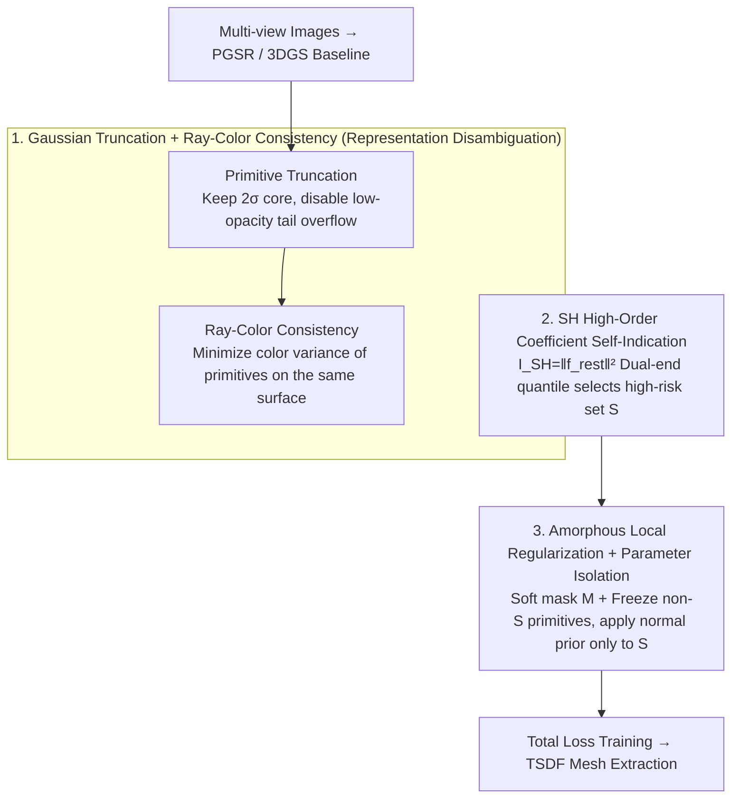

# Revisiting Photometric Ambiguity for Accurate Gaussian-Splatting Surface Reconstruction

**Conference**: ICML 2026  
**arXiv**: [2605.12494](https://arxiv.org/abs/2605.12494)  
**Code**: Project Page https://fictionarry.github.io/AmbiSuR-Proj/  
**Area**: 3D Vision / Surface Reconstruction / Gaussian Splatting  
**Keywords**: Photometric ambiguity, Gaussian truncation, Ray-color consistency, SH self-indication, Sparse regularization

## TL;DR
AmbiSuR explicitly models two types of endogenous photometric ambiguities in Gaussian Splatting (primitive edge overflow and pixel-mixing under-constraint) and disambiguates them using truncation and ray-color consistency. It further leverages high-order Spherical Harmonic (SH) coefficients as "self-indicators" to identify high-risk primitives, applying amorphous local prior regularization. AmbiSuR reduces the average Chamfer distance on DTU to 0.46, surpassing the previous state-of-the-art GeoSVR (0.47).

## Background & Motivation
**Background**: Transforming multi-view images into 3D surfaces has shifted from implicit SDFs (NeuS, Neuralangelo) to the explicit 3DGS family (2DGS, GOF, PGSR, MILo, GeoSVR), the latter offering significant advantages in efficiency and detail. The common premise of these methods is "multi-view photometric consistency"—the idea that the color of a spatial point should be consistent across different views.

**Limitations of Prior Work**: In reality, photometric consistency is almost never perfectly met. Textureless regions, reflective surfaces, shadows, and insufficient coverage make multi-view triangulation severely ill-posed. Existing mitigation strategies either involve complex ray modeling for reflections (limited to specific scenes) or apply coarse-grained regularization using large MonoDepth/Normal models (which tend to "smooth out" the entire image), failing to address the root cause within the 3DGS representation itself.

**Key Challenge**: The 3DGS rendering equation $\mathbf{C} = \sum_i c_i \tilde\alpha_i \prod_{j<i}(1-\tilde\alpha_j)$ aims for "weighted sum equals ground truth." While sufficient for pixel color synthesis, this is severely under-constrained for "recovering a unique surface"—any set of $\{c_i, w_i\}$ that sums to $\mathbf{C}_{gt}$ is considered correct, causing the reconstruction to be misled by "pseudo-geometry + view-dependent effects."

**Goal**: To disambiguate at both the representation and supervision levels—mitigating the inherent geometric ambiguity of Gaussians during forward computation and actively identifying supervision ambiguities to provide directed prior compensation.

**Key Insight**: After systematically decomposing the 3DGS pipeline, the authors identified two types of endogenous representation ambiguities (low-opacity long tails of primitives and excessive degrees of freedom in color mixing). Simultaneously, they observed that SH coefficients can serve as "natural detectors" for supervision ambiguity—abnormally large high-order SH values suggest fitting view-dependent residuals, while abnormally small values suggest insufficient supervision.

**Core Idea**: Use "primitive truncation + ray-color variance" as gentle constraints to address representation-level ambiguity. Then, use dual-end indications (upper/lower quantiles) of high-order SH coefficients to identify problematic primitives, followed by amorphous local normal regularization for minimal-intrusive refinement.

## Method

### Overall Architecture
AmbiSuR addresses the long-tolerated "photometric ambiguity" in 3DGS surface reconstruction, where erroneous primitive combinations can produce correct pixels despite inconsistent geometry. It tackles this in two layers: representation-side ambiguity (from the primitives themselves) and supervision-side ambiguity (from unreliable imagery). The method integrates two modifications into the PGSR pipeline. The first is Gaussian Splatting photometric disambiguation, which truncates the low-opacity edges of primitives and adds a ray-color consistency constraint during forward rendering. The second is SH high-order coefficient self-indication, using the energy $I_{SH} = \|f_{\text{rest}}\|_2^2$ as a probe to select a set $\mathcal{S}$ of high-risk primitives. Local geometric priors are then supplemented only within their projected regions, while other primitives remain frozen. Training is driven by the total loss $\mathcal{L} = \mathcal{L}_{photo} + \tau\mathcal{L}_{geo} + \mu_1\mathcal{N} + \mu_2\mathcal{R}$.

### Key Designs

**1. Gaussian Primitive Truncation + Ray-Color Consistency: Blocking Representation Ambiguities**

The 3DGS representation contains two inherent flaws: First, each Gaussian has a long tail with low opacity. These "nearly transparent" overflows are repeatedly mismatched across views, creating non-existent geometry. Second, pixel color is a weighted average where individual primitive colors can be arbitrary as long as the sum is correct. Truncation addresses the first flaw by dividing the Gaussian projection into a core region $\mathcal{G}_{core}$ and an edge region $\mathcal{G}_{edge}$, keeping only the core: $\tilde\alpha_{\mathcal{T}}(\mathbf{x}) = \alpha\,\mathcal{G}_{core}(\mathbf{x})\cdot\mathbb{1}(\|\mathbf{x}-\mu_i\|\le \gamma\sigma_i)$. Setting $\gamma=2$ forces each primitive to "speak" only within its $2\sigma$ range, physically disabling long-tail mismatches. Ray-color consistency addresses the second flaw by viewing alpha-blending as a probability distribution along a ray, requiring primitives representing the same surface to have similar colors:

$$\mathcal{R}(\mathbf{r}) = \sum_i w_i\|c_i - \mathbf{C}\|_2^2$$

Only the color term $c_i$ receives gradients. This upgrades the weak "weighted sum" constraint to a stronger "mutual consistency" constraint, forcing primitives to fit true optical properties rather than cheating via mixing.

**2. SH High-order Coefficients as Self-Indicators: Locating Supervision Pathologies**

Without an external oracle for supervision reliability, the authors found that the learned SH coefficients are natural probes. Expanding the color function via SH, $C(\mathbf{d}) = \bar C + \sum_i \beta_i Y_i(\mathbf{d})$, the energy of view-dependent deviations is proportional to $\sum_i \beta_i^2$. Thus, $I_{SH} = \|f_{\text{rest}}\|_2^2$ serves as an indicator. The key is "dual-end indication": abnormally high $I_{SH}$ (top $\eta_U$ quantile) indicates primitives memorizing residuals (supervision inconsistency), while abnormally low $I_{SH}$ (bottom $\eta_L$ quantile) indicates insufficient supervision or baked-in appearance. The union $\mathcal{S} = \mathcal{S}_U\cup\mathcal{S}_L$ defines the high-risk set. Since SH is a byproduct of training, this is a "free-lunch" indicator covering both view-dependent overfitting and underfitting.

**3. Amorphous Local Regularization + Parameter Isolation: Targeted Prior Intervention**

Standard practices apply global geometric priors, which often smooth out well-reconstructed areas. AmbiSuR uses two layers of localization. Layer one freezes the parameters of non-ambiguous primitives and excludes opacity $\alpha$ and scale $s$ from regularization to avoid destroying converged shapes. Layer two accumulates a soft mask $\mathbf{M}$ based on the indicator set $\mathcal{S}$:

$$\mathbf{M} = \sum_i \mathbb{1}(i\in\mathcal{S})\,\tilde\alpha_i\prod_{j<i}(1-\tilde\alpha_j)$$

The angular difference between the rendered depth normal $\mathbf{N}_{\mathbf{D}}$ and the prior normal $\mathbf{N}_P$ is weighted by this mask: $\mathcal{N} = \mathrm{Mean}(\mathbf{M}\cdot(1 - \mathbf{N}_{\mathbf{D}}\cdot\mathbf{N}_P))$. This ensures priors only take effect in the projection regions of ambiguous primitives, maintaining compatibility with various prior sources (monocular, multi-view, etc.).

### Loss & Training
Total objective: $\mathcal{L} = \mathcal{L}_{photo} + \tau\mathcal{L}_{geo} + \mu_1\mathcal{N} + \mu_2\mathcal{R}$, with $\tau=0.1, \mu_1=0.1, \mu_2=10^{-5}$. Training lasts 30k iterations. The metric version uses Depth Anything V2 multi-view depth, while the Mono version uses monocular depth. Surfaces are extracted via TSDF.

## Key Experimental Results

### Main Results

| Dataset | Metric | Prev. SOTA | AmbiSuR | Remarks |
|--------|------|----------|---------|------|
| DTU Avg. | Chamfer ↓ | 0.47 (GeoSVR) | 0.46 | 0.6h training |
| DTU 24/37/40 | Chamfer ↓ | 0.32/0.51/0.30 | 0.32/0.48/0.31 | Comparable or superior |
| Tanks&Temples | F1 ↑ | Best competitor | Highest F1 | Large scenes with high ambiguity |
| Training Time | — | NeuS >12h | 0.6h | Explicit + Efficient |

### Ablation Study

| Configuration | Key Metric | Description |
|------|---------|------|
| PGSR baseline | 0.52 (DTU Chamfer) | Starting point |
| + Truncation | Limited gain | Fixes representation ambiguity only |
| + Ray-color consistency | Additive gain | Suppresses mixing ambiguity |
| + Dual-end SH Indicator | Final 0.46 | Fixes supervision-side ambiguity |
| Dual vs. Single-end | Dual is more stable | Low SH also indicates ambiguity |
| Global vs. Amorphous Reg. | Amorphous preserves detail | Validates selective regularization |

### Key Findings
- The low-opacity long tail of "representative" primitives is a neglected source of ambiguity; simple truncation yields significant gains.
- High-order SH coefficients are "free ambiguity detectors," ideal for industrial 3D reconstruction where extra classifier or large model costs are sensitive.
- AmbiSuR-Mono approaches the performance of the metric version, demonstrating that robustness arises from "where to apply the prior" rather than the specific prior source.

## Highlights & Insights
- "SH as an indicator" is a rare "free-lunch"—repurposing existing parameters as functional indicators with zero extra computation. This is transferable to other explicit representations (e.g., uncertainty in 3DGS-SLAM).
- Ray-color variance upgrades "weighted sum correctness" to "distribution tightness," providing an elegant optimization for under-constrained supervision.
- The three-layer control (primitive freezing + soft mask + orientation-only parameters) is a crucial engineering trick for amorphous regularization, emphasizing that "where to regularize" is more important than "what to regularize."

## Limitations & Future Work
- Truncation threshold $\gamma$ and quantiles $\eta_U, \eta_L$ still require manual tuning across datasets; an adaptive mechanism is needed.
- Not yet deeply validated on transparent objects or strong specularities (where BRDF and SH assumptions clash).
- The indicator is currently per-frame; it does not yet exploit temporal or cross-view consistency for dynamic scenes.

## Related Work & Insights
- **vs 2DGS / GOF / PGSR / GeoSVR**: These focus on "geometry alignment + mesh extraction." Ours traces back to "photometric ambiguity" and provides a dual solution for representation and supervision.
- **vs MonoSDF / Neuralangelo**: SDF series rely on high-capacity MLPs (training for hours). AmbiSuR achieves better results in 0.6h using explicit 3DGS.
- **vs VCR-GauS / Global Priors**: Previous works applied priors uniformly. Ours uses SH indicators to focus priors on "information-deficient" regions, avoiding the common pitfall of over-smoothing details.

## Rating
- Novelty: ⭐⭐⭐⭐ First use of "SH high-order energy" as an ambiguity indicator combined with ray-color variance.
- Experimental Thoroughness: ⭐⭐⭐⭐ Comprehensive DTU + T&T evaluation; lacking specific stress tests for refraction/transparency.
- Writing Quality: ⭐⭐⭐⭐ Clear argumentation layered by representation/supervision; good formula-visualization synergy.
- Value: ⭐⭐⭐⭐ Surpasses SOTA in 0.6h and is robust to prior quality; highly practical for industrial deployment.

<!-- RELATED:START -->

## Related Papers

- [\[AAAI 2026\] MeshSplat: Generalizable Sparse-View Surface Reconstruction via Gaussian Splatting](../../AAAI2026/3d_vision/meshsplat_generalizable_sparse-view_surface_reconstruction_via_gaussian_splattin.md)
- [\[AAAI 2026\] SparseSurf: Sparse-View 3D Gaussian Splatting for Surface Reconstruction](../../AAAI2026/3d_vision/sparsesurf_sparse-view_3d_gaussian_splatting_for_surface_reconstruction.md)
- [\[NeurIPS 2025\] GeoSVR: Taming Sparse Voxels for Geometrically Accurate Surface Reconstruction](../../NeurIPS2025/3d_vision/geosvr_taming_sparse_voxels_for_geometrically_accurate_surface_reconstruction.md)
- [\[ICCV 2025\] SurfaceSplat: Connecting Surface Reconstruction and Gaussian Splatting](../../ICCV2025/3d_vision/surfacesplat_connecting_surface_reconstruction_and_gaussian_splatting.md)
- [\[CVPR 2026\] Distilling Unsigned Distance Function for Surface Reconstruction from 3D Gaussian Splatting](../../CVPR2026/3d_vision/distilling_unsigned_distance_function_for_surface_reconstruction_from_3d_gaussia.md)

<!-- RELATED:END -->
