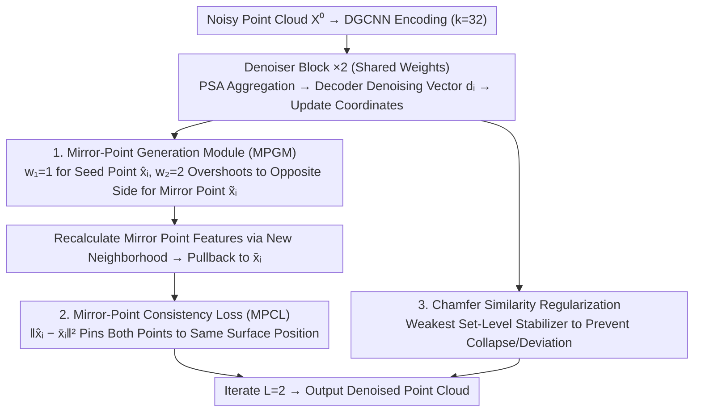

# SIMPC: Learning Self-Induced Mirror-Point Consistency for Unsupervised Point Cloud Denoising

**Conference**: ICML 2026  
**arXiv**: [2605.26894](https://arxiv.org/abs/2605.26894)  
**Code**: None  
**Area**: 3D Vision  
**Keywords**: Point Cloud Denoising, Unsupervised Learning, Mirror-Point Consistency, Geometric Prior, Deterministic Correspondence

## TL;DR
SIMPC proposes performing a "symmetric extension" along the denoising vector of the **same noisy point** to obtain a mirror point on the opposite side of the surface. A Mirror-Point Consistency Loss is then used to force the denoising targets of both points to coincide. This shifts unsupervised point cloud denoising from "finding statistical correspondences across multiple noise variants" to "finding deterministic geometric correspondences within a single point." It achieves performance significantly surpassing unsupervised SOTA and even beats several supervised methods on PUNet/PCNet synthetic data and Paris-Rue-Madame / Kinect real scans.

## Background & Motivation

**Background**: Point cloud denoising is a critical preprocessing step for downstream tasks such as surface reconstruction and semantic understanding. Supervised methods (PD-Refiner, StraightPCF, PD-LTS, etc.) rely on paired noisy–clean data synthesized from CAD, which limits generalization. Conversely, devices like LiDAR continuously generate massive amounts of raw noisy scans, making **unsupervised point cloud denoising** a more realistic direction.

**Limitations of Prior Work**: Image denoising can align multiple noise observations to the same clean pixel via pixel indices (e.g., Noise2Noise / Noise2Void). However, point clouds **lack fixed spatial indices**, and noise directly perturbs the point coordinates themselves (which carry both position and geometry), making point correspondences across variants naturally fragmented. Existing unsupervised routes are incomplete:
- Noise-based (Noise4Denoise, Noise2Score3D) injects extra noise $u\sim\mathcal{N}(0,\Delta\sigma)$ to let the network predict reverse noise $-u$, but this correspondence is driven purely by random noise and **does not point to the real surface**. Inference also relies on additional assumptions about noise distributions for scaling and extrapolation.
- EMD-based (NoiseMap, U-CAN) uses Earth Mover's Distance for optimal transport between two noise variants. While more structured than noise-based methods, the transport occurs at the **point set distribution level**, failing to guarantee that "two matched points actually come from the same surface segment," essentially remaining a blurred correspondence.

**Key Challenge**: Existing methods place "finding correspondences" between **multiple independently sampled noise observations**. As long as observations are independently sampled, correspondences necessarily involve randomness, causing the denoising target to drift. To stabilize unsupervised denoising, a different data source must be used to construct correspondences.

**Goal**: Without introducing new noise observations or distribution assumptions, construct an associated point **from a single noisy point itself** that has a strict one-to-one correspondence and deterministically falls on the "other side" of the underlying surface, forcing the denoising targets of both points to converge to the same location.

**Key Insight**: The denoising vector $d_i$ itself is the network's estimate of "how much and in which direction this point should move toward the surface"—it is an implicit geometric prior. If a point is moved near the surface by $w_1=1$ times $d_i$ to get $\hat{x}_i$, and then overshot to the **other side** of the surface by $w_2=2$ times $d_i$ to get a mirror point $\tilde{x}_i$, then $\hat{x}_i$ and $\tilde{x}_i$ are "geometrically symmetric" relative to the surface. Subsequent denoising of both points into $\hat{x}_i$ and $\bar{x}_i$ **must point to the same surface area**—a deterministic correspondence induced by the model itself without external observations.

**Core Idea**: Use "overshoot-pullback" to split a single noisy point into a pair of geometrically symmetric mirror points, then apply MSE to force both sides to pull back to the same target, replacing "blurred cross-observation correspondence" with "self-induced deterministic correspondence."

## Method

### Overall Architecture

The core challenge SIMPC addresses is the lack of a reliable "where the surface is" supervision signal in unsupervised denoising, which previously relied on aligning independently sampled noise observations, leading to inherent randomness. Its solution moves "finding correspondence" from the data space into the model—using the denoising vector $d_i$ predicted by the network as a geometric prior to create a deterministic symmetric companion point from a single point, then forcing both to pull back to the same location.

The pipeline follows an iterative denoising paradigm. A noisy point cloud $X^0\in\mathbb{R}^{N\times3}$ is first encoded by $T=3$ DGCNN layers ($k=32$, neighborhood features concatenated as $[g_i\|g_j-g_i]$ followed by an MLP) to obtain initial features $U^0\in\mathbb{R}^{N\times 256}$. This is followed by two weight-sharing Denoiser Blocks ($L=2$). Inside each Block, there are three steps: first, Point Self-Attention aggregates features $f_i=\sum_{j\in\hat{\mathcal{N}}_i}\alpha_{ij}\odot h(u_j)$ over spatial neighbors $\hat{\mathcal{N}}_i=\mathrm{KNN}(x_i, X^l, k)$; next, a Decoder (MLP+tanh) solves for the normalized point-level denoising vector $d_i\in\mathbb{R}^3$; finally, coordinates are updated as $x_i^l = x_i^{l-1} + d_i^l$. The novelty of SIMPC lies entirely on top of $d_i$: each Block additionally uses $d_i$ to generate mirror points and applies consistency constraints. During training, two independently sampled noise variants $X_a, X_b$ are used following the U-CAN protocol, but **no** EMD alignment is performed between them; instead, the mirror-point process is run on each. At inference, the denoising results are output after $L$ iterations on a single point cloud.

### Key Designs

**1. Mirror-Point Generation Module (MPGM): Splitting a Noisy Point into Geometrically Symmetric Mirror Points**

Correspondences in old methods come from two independently sampled noise observations; as long as observations are independent, the pairing is inevitably random, causing the denoising target to drift. MPGM breaks this by self-inducing a companion point from a single noisy point $x_i$: the predicted denoising vector $d_i$ is treated as an implicit estimate of the "surface direction + distance to surface." A normal step with $w_1=1$ yields the seed denoised point $\hat{x}_i = x_i + w_1 d_i$. Then, a **symmetric extension** with $w_2=2$ overshoots the point to the other side of the surface to get the mirror point $\tilde{x}_i = x_i + w_2 d_i$—geometrically equivalent to reflecting $\hat{x}_i$ across the underlying surface. Once the mirror point is at its new position, features $\tilde{f}_i=\mathrm{PSA}([u_i\|\tilde{x}_i], \{[u_j\|x_j]\}_{j\in\tilde{\mathcal{N}}_i})$ are recalculated using a **new neighborhood** $\tilde{\mathcal{N}}_i=\mathrm{KNN}(\tilde{x}_i, X^l\setminus\{x_i\}, k)$, and a mirror denoising vector $\tilde{d}_i$ is obtained via the same Decoder to pull it back to $\bar{x}_i=\tilde{x}_i+\tilde{d}_i$.

The resulting correspondence is **entirely determined by the same $x_i$ and $d_i$**, making it deterministic rather than sampled. Furthermore, because the mirror point is on the other side of the surface with a different neighborhood, the model observes the same surface area from two complementary perspectives, providing more information than a single denoising step. The value $w_2=2$ is derived geometrically rather than searched: it ensures that $\hat{x}_i$ and $\tilde{x}_i$ are strictly equidistant from the surface. Ablations show that $w_2=1.5$ (too close) and $w_2=2.5$ (overshot too far) both lead to performance drops, confirming that symmetry is the sweet spot.

**2. Mirror-Point Consistency Loss (MPCL): Pinning Pullback Points to the Same Surface Position**

The deterministic pairing requires an optimizable signal. The difficulty in learning surface positions unsupervised stems from the lack of a **point-level** positional anchor. MPGM provides a pair of explicitly symmetric points that should coincide. MPCL applies a direct point-to-point hard consistency constraint:

$$\mathcal{L}_{\mathrm{MPC}}=\sum_{i=1}^{N}\|\hat{x}_i - \bar{x}_i\|_2^2$$

Unlike Chamfer, which only requires "set-level alignment," or EMD, which performs soft distribution matching, MPCL requires every noisy seed and its mirror to converge to the same physical position. Crucially, this loss reaches 0 only when both $\hat{x}_i$ and $\bar{x}_i$ fall exactly on the underlying surface. Thus, the optimal solution is geometrically pinned to the surface, mitigating the "aligned but globally deviated from the surface" phenomenon common in EMD methods—evidenced by the abnormally high P2M (18.87) relative to CD for EMD-only configurations in ablations.

**3. Chamfer-only Similarity Regularization: Set-level Prior as a Baseline against Collapse**

By delegating the responsibility of finding correspondences to MPCL, the similarity constraint across variants only needs to ensure that the point set does not collapse or drift away from the original distribution. Consequently, the authors degrade this to the simplest Chamfer regularization, completely abandoning EMD:

$$\mathcal{L}_{\mathrm{SR}}^l = \mathrm{CD}(X_a^l, X_b^l) + \mathrm{CD}(X_a^{l-1}, X_b^l) + \mathrm{CD}(X_b^{l-1}, X_a^l)$$

Ablation studies clarify this division of labor: using only $\mathcal{L}_{\mathrm{SR}}(\mathrm{CD})$ at 3% noise causes P2M to skyrocket to 36.20; using only $\mathcal{L}_{\mathrm{SR}}(\mathrm{EMD})$ only reaches 18.87. However, $\mathcal{L}_{\mathrm{MPC}}+\mathcal{L}_{\mathrm{SR}}(\mathrm{CD})$ drops P2M to 13.85. Deterministic correspondence is the primary performance driver; set-level regularization only requires the simplest CD. In fact, more complex EMD can pollute the hard correspondence of MPCL with its inherent ambiguity.

### Loss & Training

The total loss is the sum of MPCL and CD regularization for each Denoiser Block: $\mathcal{L}_{\mathrm{total}}=\sum_{l=1}^{L}(\mathcal{L}_{\mathrm{MPC}}^l + \mathcal{L}_{\mathrm{SR}}^l)$, with $L=2$. Training data consists of PUNet 40 shapes with Gaussian noise injected at 0.5%–2% of the bounding sphere radius. Optimizer: Adam, lr $=1\times10^{-4}$, 100 epochs, batch size 16, using a single RTX 4090.

## Key Experimental Results

### Main Results

PUNet Gaussian Noise (CD/P2M $\times 10^5$, lower is better; excerpts for 1% @ 50K and 3% @ 10K):

| Dataset/Level | Metric | Prev. Unsupervised SOTA | SIMPC | Gain | Control: Supervised SOTA |
|------|------|----------------|-------|------|----------------|
| PUNet 50K 1% | CD↓ | 8.33 (Noise2Score3D) | **5.81** | -30% | PD-Refiner 4.66 |
| PUNet 50K 1% | P2M↓ | 2.65 (Score-U) | **1.02** | -61% | PD-Refiner 0.45 |
| PUNet 50K 3% | CD↓ | 24.34 (Noise2Score3D) | **12.58** | -48% | PD-LTS 18.52 (Overtaken by SIMPC) |
| PUNet 50K 3% | P2M↓ | 17.04 (Noise2Score3D) | **6.45** | -62% | PD-LTS 10.67 (Overtaken by SIMPC) |
| PUNet 10K 3% | CD↓ | 36.66 (U-CAN) | **34.42** | -6% | PD-Refiner 30.77 |
| PUNet 10K 3% | P2M↓ | 18.42 (U-CAN) | **13.85** | -25% | PathNet 24.04 (Overtaken by SIMPC) |

PCNet Gaussian + Kinect Real Scans:

| Dataset/Level | Metric | Strongest Unsupervised Baseline | SIMPC | Note |
|------|------|---------------------|-------|------|
| PCNet 50K 3% | CD↓ / P2M↓ | Score-U 39.28 / 11.74 | **18.62 / 4.15** | Beats supervised HybridPF (19.10/4.80) |
| Kinect Real Scans | CD↓ / P2M↓ | Score-U 15.85 / 7.33 | **13.01 / 6.35** | Beats 4 supervised methods (Best: StraightPCF 13.46/7.39) |

### Ablation Study (PUNet 10K, three levels of Gaussian noise, CD/P2M $\times 10^5$)

| Config | 1% CD / P2M | 2% CD / P2M | 3% CD / P2M | Description |
|------|--------------|--------------|--------------|------|
| $\mathcal{L}_{\mathrm{SR}}(\mathrm{CD})$ only | 18.91 / 2.47 | 37.84 / 13.91 | 65.73 / 36.20 | Set-level CD fails at high noise |
| $\mathcal{L}_{\mathrm{SR}}(\mathrm{EMD})$ only | 26.54 / 7.64 | 31.88 / 12.41 | 41.04 / 18.87 | EMD correspondence is blurred, high P2M |
| **Full: $\mathcal{L}_{\mathrm{MPC}}+\mathcal{L}_{\mathrm{SR}}(\mathrm{CD})$** | **20.25 / 3.60** | **28.82 / 7.13** | **34.42 / 13.85** | MPCL is the primary driver |
| $w_2=1.5$ (Near) | 20.77 / 4.06 | 29.31 / 7.68 | 35.10 / 14.55 | Asymmetric (too close) |
| $w_2=2$ (Symmetry) | 20.25 / 3.60 | 28.82 / 7.13 | 34.42 / 13.85 | Geometric symmetry is optimal |
| $w_2=2.5$ (Far) | 21.39 / 4.84 | 30.13 / 8.54 | 36.33 / 15.25 | Overshoot introduces extra noise |

### Key Findings
- **MPCL is the absolute workhorse**: Switching the loss from EMD to MPCL slashes 3% noise P2M from 18.87 to 13.85 (-27%) and CD from 41.04 to 34.42 (-16%).
- **Geometric symmetry $w_2=2$ is the sweet spot**: Deviating from $w_2=2$ (whether 1.5 or 2.5) consistently reduces performance, confirming the theoretical explanation that symmetry ensures points on both sides are equidistant from the surface.
- **P2M improvements are generally larger than CD**: This indicates SIMPC's denoised results are not just "point-cloud-like" in distribution but are truly adhered to the surface—this is the direct target of deterministic correspondence optimization.
- **Strongest generalization under non-Gaussian noise**: For Discrete noise at 50K 1%, SIMPC's P2M is 0.32, approaching the supervised best PD-Refiner (0.12) and far lower than the second-best unsupervised Score-U (0.82). This shows SIMPC does not overfit training noise distributions like noise-based methods.

## Highlights & Insights
- **Moving correspondence from data-space to model-space**: Previous unsupervised denoising focused on "how to construct better multiple noise observations" (Noisier2Noise, N2N3D, U-CAN). SIMPC takes the opposite approach: since multiple observations lead to stochasticity, **use only one observation** and let the model's own prediction $d_i$ act as a geometric prior to generate correspondence. This transforms correspondence from a data problem into a network self-feedback problem.
- **Overshoot-pullback as a transferable "self-supervised geometric construction"**: It converts the implicit goal of "being on the surface" into an explicit MSE goal of "two distinctly symmetric points must coincide." This logic could theoretically extend to unsupervised surface reconstruction, SDF fitting, or even unsupervised 3D registration—any task where correspondence is hard to define but local geometric priors are accessible.
- **Minimalist loss beats complex transport**: Abandoning EMD in favor of simple Chamfer stabilization allows MPCL's deterministic constraints to take the lead. It proves that when a strong consistency signal exists, distribution-level soft alignment should be as simple as possible to avoid polluting hard correspondences with EMD's ambiguity.
- **Outperforming supervised methods is noteworthy**: SIMPC surpasses multiple supervised methods on PCNet 3% and Kinect real scans. This is likely because supervised methods rely on noise assumptions from CAD-synthesized data, whereas SIMPC's geometric prior is extracted from the noisy point cloud **itself**, making it more robust to real-world noise—an inherent advantage of the unsupervised path in out-of-distribution scenarios.

## Limitations & Future Work
- The authors acknowledge that MPGM relies entirely on the current $d_i$ prediction. In the **cold-start phase**, $d_i$ reflects high noise and poor direction estimation, potentially placing mirror points incorrectly. Iterative denoising ($L=2$) mitigates this, but convergence curves for early training are not reported.
- **Fixed $w_1, w_2$ values rely on a "locally planar surface" assumption**: In high-curvature regions, "symmetric extension" might not actually land the mirror point on the opposite side. This may explain why the CD improvement on PCNet (containing more details) is smaller than on PUNet (30% vs 48% @ 3%). Adaptive $w_2$ prediction based on local curvature is a potential improvement.
- **Evaluation is focused on mathematical noise (Gaussian/Laplacian/Discrete)**; real complex noise like LiDAR multi-path, specular reflection, or dynamic artifacts are only addressed qualitatively with Kinect/Paris scans, lacking quantitative analysis.
- **Iterative limit of $L=2$ may be a performance bottleneck**: Diffusion-based denoising (PD-Refiner, PD-LTS) typically uses more steps, but SIMPC's mirror-point calculation and double PSA double the cost per step. Lightweight mirror-point variants could enable deeper architectures.

## Related Work & Insights
- **vs. Noise4Denoise / Noise2Score3D (Noise-based)**: These rely on injected noise $u$ to construct "dirtier–cleaner" pairs and require extrapolation during inference. SIMPC injects no noise; correspondence is self-induced by $d_i$, requiring **no noise distribution assumptions**, leading to significant gains on non-Gaussian noise.
- **vs. NoiseMap / U-CAN (EMD-based)**: These use EMD for distribution alignment, but points may not strictly land on the surface. SIMPC uses MPCL to pin correspondences at the point-level, resulting in proportional drops in both CD and P2M.
- **vs. PD-Refiner / StraightPCF / PD-LTS (Supervised)**: These rely on synthesized noisy–clean pairs. SIMPC trains on raw noisy scans and outperforms them on real scans (Kinect, Paris-Rue-Madame), proving that "self-supervised geometric priors are closer to real distributions than synthesized noise priors."
- **vs. IterativePFN**: The architecture borrows the DGCNN and iterative design but replaces the supervised signal with MPCL, serving as an elegant example of "unsupervised adaptation of an existing architecture."

## Rating
- **Novelty**: ⭐⭐⭐⭐⭐ Using the model's own predicted denoising vector to construct symmetric mirror points is a clean, explainable idea directly aligned with the geometric essence of point cloud denoising, breaking the "correspondence must come from multiple observations" mindset.
- **Experimental Thoroughness**: ⭐⭐⭐⭐ Covers PUNet/PCNet synthetic data with 3 levels of Gaussian noise + 4 types of non-Gaussian noise + 2 real datasets (Kinect/Paris). Ablations precisely isolate MPCL and $w_2$. Deducted 1 star for lack of training dynamics analysis and high-curvature failure case visualization.
- **Writing Quality**: ⭐⭐⭐⭐ The four-quadrant comparison in Fig. 1 clearly illustrates the paradigm shift. The method section structure addresses reader questions effectively; minor symbol inconsistencies (e.g., $\bar{x}_i$ vs. $\mathrm{x}_i$).
- **Value**: ⭐⭐⭐⭐⭐ Provides a general paradigm for "model self-feedback to generate geometric correspondence" for unsupervised 3D tasks, transferable to SDF fitting, unsupervised surface reconstruction, and point cloud completion.

<!-- RELATED:START -->

## Related Papers

- [\[NeurIPS 2025\] U-CAN: Unsupervised Point Cloud Denoising with Consistency-Aware Noise2Noise Matching](../../NeurIPS2025/3d_vision/u-can_unsupervised_point_cloud_denoising_with_consistency-aware_noise2noise_matc.md)
- [\[ICCV 2025\] Noise2Score3D: Tweedie's Approach for Unsupervised Point Cloud Denoising](../../ICCV2025/3d_vision/noise2score3d_tweedies_approach_for_unsupervised_point_cloud_denoising.md)
- [\[CVPR 2026\] Routing on Demand: DSNet for Efficient Progressive Point Cloud Denoising](../../CVPR2026/3d_vision/routing_on_demand_dsnet_for_efficient_progressive_point_cloud_denoising.md)
- [\[CVPR 2026\] Topology-aware Feature Propagation for Unsupervised Non-rigid Point Cloud Correspondence](../../CVPR2026/3d_vision/topology-aware_feature_propagation_for_unsupervised_non-rigid_point_cloud_corres.md)
- [\[ECCV 2024\] P2P-Bridge: Diffusion Bridges for 3D Point Cloud Denoising](../../ECCV2024/3d_vision/p2p-bridge_diffusion_bridges_for_3d_point_cloud_denoising.md)

<!-- RELATED:END -->
