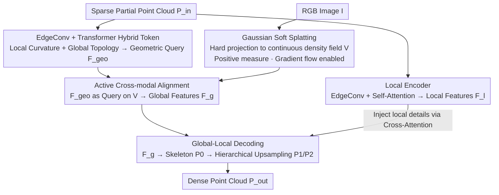

# SplAttN: Bridging 2D and 3D with Gaussian Soft Splatting and Attention for Point Cloud Completion

**Conference**: ICML 2026 Spotlight  
**arXiv**: [2605.01466](https://arxiv.org/abs/2605.01466)  
**Code**: https://github.com/zay002/SplAttN (Available)  
**Area**: 3D Vision / Point Cloud Completion / Multi-modal Fusion  
**Keywords**: Point Cloud Completion, Differentiable Gaussian Splatting, Cross-Modal Entropy Collapse, Multi-modal Learning Theory, KITTI counter-factual

## TL;DR
This paper points out that "hard projection" in multi-modal point cloud completion, which directly maps 3D points onto a 2D grid, causes the support set to have zero Lebesgue measure and truncates gradients via Dirac delta functions (termed Cross-Modal Entropy Collapse). By replacing hard projection with continuous density estimation via differentiable Gaussian Soft Splatting, combined with a hybrid encoder (EdgeConv for local + Transformer for global) and a global-local decoder, the method achieves SOTA on PCN/ShapeNet-55/34. Furthermore, a counter-factual evaluation on KITTI demonstrates that baselines actually degenerate into "unimodal template retrievers."

## Background & Motivation

**Background**: Point cloud completion has evolved from early purely geometric methods (PCN, FoldingNet) to multi-modal paradigms (SVDFormer, GeoFormer, etc.) that introduce 2D images as semantic priors by projecting sparse 3D partial point clouds onto the image plane to query visual features. Multi-modal learning theory (Lu, 2023) guarantees that as long as both "Heterogeneity" and "Connection" are satisfied, the generalization bound can be improved by $O(\sqrt{n})$.

**Limitations of Prior Work**: The authors find that while existing SOTA multi-modal completion methods perform well on PCN/ShapeNet, the "Connection" aspect is illusory. The reason is that when a sparse 3D point cloud is hard-projected onto the image plane via $\pi: \mathbb{R}^3 \to \mathbb{R}^2$, the resulting support set $\mathcal{S}_{hard} = \{\pi(p)\}$ is a discrete set of points with a Lebesgue measure $\mu(\mathcal{S}_{hard}) = 0$, occupying almost no pixels.

**Key Challenge**: Under hard projection, the conditional density $P_{hard}(v|\mathcal{P}_{in}) = \tfrac{1}{N}\sum_p \delta(v - \pi(p))$ is a sum of Dirac deltas. According to the chain rule, $\nabla_p \mathcal{L} = \tfrac{\partial \mathcal{L}}{\partial v} \cdot \tfrac{\partial v}{\partial \pi(p)} \cdot \nabla_p \delta(v - \pi(p))$. Since the derivative of a Dirac delta is zero almost everywhere, the gradient from visual supervision cannot propagate back to the geometric point positions. Visual features are "hung" on discrete locations with zero area, preventing the encoder from obtaining dense semantics, and causing the model to degenerate into a "geometric template retriever." The authors name this phenomenon Cross-Modal Entropy Collapse.

**Goal**: (1) Provide a Measure Theory and Information Theory formalization for the failure of hard projection; (2) Design a lossless projection alternative with non-zero measure support to allow gradient flow; (3) Design geometric tokens capable of "active querying" for visual features; (4) Provide a counter-factual evaluation protocol to verify if the model truly utilizes visual information.

**Key Insight**: Since the problem lies in the zero measure of the support set, each projected point is expanded into a disk using a Gaussian kernel. This ensures the support set $\mathcal{S}_{soft} = \bigcup_p \{v: \|v - \pi(p)\| < 3\sigma\}$ has a positive measure, making the density continuous and gradients naturally non-zero. This echoes the success of differentiable rendering (Softmax Splatting, 3DGS) in replacing hard sampling with differentiable density estimation.

**Core Idea**: Replace hard projection with differentiable Gaussian Soft Splatting and use a hybrid token (EdgeConv for local curvature + Transformer for global topology) to actively query this continuous visual density field, followed by a global-local decoder to generate points from coarse to fine.

## Method

### Overall Architecture

The core objective is to allow 2D visual features to truly backpropagate gradients to 3D geometric points, thereby fixing the Cross-Modal Entropy Collapse caused by hard projection. The input consists of a sparse partial point cloud $\mathcal{P}_{in} = \{p_i\}_{i=1}^N \subset \mathbb{R}^3$ and a corresponding RGB image $\mathcal{I}$; the output is the completed dense point cloud $\mathcal{P}_{out}$. The architecture utilizes dual-branch encoding and a hierarchical decoder. The GS-Bridge branch first extracts local geometric tokens from $\mathcal{P}_{in}$ using EdgeConv, followed by a Transformer to obtain global geometric queries $\mathcal{F}_{geo}$. Simultanously, visual feature maps are converted into a continuous density field $\mathcal{V}$ with positive measure support via Gaussian Soft Splatting. $\mathcal{F}_{geo}$ utilizes cross-attention to actively query $\mathcal{V}$, resulting in fused global features $\mathcal{F}_g$. A parallel Local Encoder uses EdgeConv + Multi-Head Self-Attention to extract topology-aware local features $\mathcal{F}_l$. Both features enter the Global-Local Decoder: first, a skeleton $\mathcal{P}_0$ is predicted from $\mathcal{F}_g$ via MLP and injected with input priors using $\mathcal{P}_{in}$-Merge; then, upsampling proceeds progressively $\mathcal{P}_0 \to \mathcal{P}_{1} \to \mathcal{P}_{2}$. Each upsampling stage maintains geometric consistency via Structure Self-Attention and refines details by injecting $\mathcal{F}_l$ through Cross-Attention.

### Key Designs

**1. Gaussian Soft Splatting: Replacing hard projection with positive measure continuous density fields to enable gradient flow.**

The pain point is entropy collapse: hard projection maps 3D points to discrete pixels, resulting in zero measure support where visual supervision gradients are truncated by Dirac deltas. This method expands each projected point $\pi(p)$ into a disk with a Gaussian kernel, defining a soft density $P_{soft}(v|\mathcal{P}_{in}) = \tfrac{1}{N}\sum_p \alpha_p \mathcal{G}(v; \pi(p), \sigma)$. For any sub-pixel query $\mathbf{q}$ on the image plane, visual features are defined and aggregated as:

$$\mathcal{V}(\mathbf{q}) = \frac{\sum_{k \in \mathcal{N}(\mathbf{q})} w_k(\mathbf{q}) f_k}{\sum_k w_k + \epsilon}, \qquad w_k(\mathbf{q}) = \exp\!\Big(-\frac{\|\mathbf{u}_k - \mathbf{q}\|^2}{2\sigma^2}\Big) \cdot (z_k + \epsilon)^{-1}.$$

The spatial Gaussian kernel acts as a low-pass filter, and the inverse depth term $(z_k+\epsilon)^{-1}$ serves as a soft Z-buffer to approximate occlusions differentiably. The key benefit is that measure subadditivity strictly implies the soft support set $\mu(\mathcal{S}_{soft}) > 0$. The density field has positive measure support, so the gradient $\nabla_{\mathbf{u}} \mathcal{L}$ is non-zero, allowing the update of geometric coordinates—Gaussian tails provide gradient signals even for "slight alignment errors," essentially reconnecting the truncated cross-modal gradients.

**2. EdgeConv + Transformer Hybrid Geometric Tokenization: Capturing both local curvature and global topology.**

Purely local operators capture details but ignore global topology, while pure Transformers lose local precision. Visual queries must occur at the correct granularity. This method uses a hybrid architecture to generate geometric queries $\mathcal{F}_{geo}$: EdgeConv first constructs dynamic k-NN graphs on $\mathcal{P}_{in}$ where $\mathbf{h}_i = \max_{j \in \mathcal{N}(i)} \phi_\theta(p_i,\, p_j - p_i)$. The authors interpret this max-aggregation as a discretization of the Laplace-Beltrami operator, enabling the approximation of tangent spaces and mean curvature to capture thin structures like chair legs. A Transformer encoder then treats self-attention as a fully connected graph model for global message passing to infer global invariants such as holes and symmetries. This corresponds to the dual geometric invariance of "local isometry + global homeomorphism."

**3. Active Cross-Modal Alignment + Global-Local Decoding: Active visual querying by geometric tokens.**

Passive concatenation is prone to background noise and fails to selectively utilize semantic priors. Here, geometric tokens act as Queries to actively retrieve semantics from the visual density field $\mathcal{V}$:

$$\mathcal{F}_g = \mathcal{F}_{geo} + \mathrm{Softmax}\!\Big(\frac{(\mathcal{F}_{geo}\mathbf{W}_Q)(\mathcal{V}\mathbf{W}_K)^\top}{\sqrt{d}}\Big)(\mathcal{V}\mathbf{W}_V),$$

equivalent to a "differentiable dictionary lookup." The decoding side focuses generation pressure on missing regions rather than uniform global distribution: Chamfer Distance is used as a proxy for local reconstruction uncertainty. This geometric error is mapped to a high-dimensional embedding, allowing Structure Self-Attention to densify features in high-entropy (missing) areas. Cross-Attention then injects local high-curvature information from $\mathcal{F}_l$, which is the key inductive bias for hierarchical upsampling to补 refine details.

### Loss & Training

Weighted Arc-CD is used: $\mathcal{L}_{\mathrm{warc}}(X, Y; \lambda) = \lambda \cdot \mathrm{arccosh}(1 + \mathcal{L}_{\mathrm{CD}}(X, Y))$. The non-linearity of $arccosh$ naturally compresses outliers while maintaining sensitivity to details. Losses for the three stages are summed with equal weights: $\mathcal{L}_{total} = \mathcal{L}_{\mathrm{warc}}(\mathcal{P}_0, \mathbf{P}_{gt}) + \sum_{k=1}^{2} \mathcal{L}_{\mathrm{warc}}(\mathcal{P}_k, \mathbf{P}_{gt})$. Implementation uses PyTorch + AdamW + one-cycle cosine scheduling on 4 × RTX 4090, with Gaussian kernel size = 4.

## Key Experimental Results

### Main Results

| Dataset | Metric | Ours (SplAttN) | SVDFormer | GeoFormer | AdaPoinTr |
|---------|--------|----------------|-----------|-----------|-----------|
| PCN | CD-Avg ↓ ($\times 10^3$) | **6.36** | 6.54 | 6.42 | 6.53 |
| PCN | F1 ↑ | **0.854** | 0.841 | 0.853 | 0.845 |
| PCN | DCD ↓ | **0.523** | 0.536 | 0.526 | – |
| ShapeNet-55 | CD-Avg ↓ ($\times 10^3$) | **0.77** | 0.82 | – | – |
| ShapeNet-55 | F1 ↑ | **0.520** | 0.444 | – | – |
| ShapeNet-34 (seen) | CD-Avg ↓ | **0.65** | 0.75 | – | 0.73 |
| ShapeNet-34 (21 unseen) | CD-Avg ↓ | **1.22** | 1.28 | – | 1.23 |
| ShapeNet-34 (21 unseen) | F1 ↑ | **0.481** | 0.427 | – | 0.416 |

### Ablation Study

| Configuration | Key Metrics | Description |
|---------------|-------------|-------------|
| Full SplAttN | PCN CD 6.36, ShapeNet-55 F1 0.520 | Complete method |
| Hard projection instead of GSS | Significant degradation | Verifies causal link of "hard projection → entropy collapse" |
| EdgeConv only, no Transformer | Global topology corrupted | Verifies hybrid token necessity |
| Passive concat instead of Active Attention | Lower cross-modal dependency | Verifies importance of "active query" |

### Key Findings

- **SOTA across all 6 benchmarks**: SplAttN leads on PCN, ShapeNet-55/34 (seen/unseen), and KITTI real-world scenes. The F1 improvement in unseen classes is particularly significant (0.481 vs 0.427 of SVDFormer), confirming generalization gains once the "Connection" is truly established.
- **KITTI counter-factual evaluation is a highlight**: The authors ran the PCN-trained model on 2401 real-world car instances and proposed the Semantic Consistency Score—observing changes in model output when visual input is removed (feed null image). Baselines remained almost unchanged (indicating they degenerated into "geometry → template" unimodal retrievers), while SplAttN's output changed significantly (proving visual participation).
- **Significant improvement in thin structures**: Qualitative results show that SplAttN's recovery of thin structures (chair legs, lamps) is significantly better than SOTA, consistent with the design of the hybrid encoder capturing both curvature and topology.
- **Greater improvement in DCD metric**: Since DCD is more sensitive to density distribution, this suggests SplAttN not only achieves closer average points but also matches the density distribution of the true manifold more accurately.

## Highlights & Insights

- Formalizing the engineering failure of "hard projection" as a Measure Theory proposition involving "zero Lebesgue measure and Dirac delta gradient truncation" provides a clean theoretical anchor for the work.
- The "KITTI counter-factual evaluation" is a valuable methodological contribution, exposing how many multi-modal methods do not actually use the secondary modality. This stress test paradigm is applicable to other multi-modal fusion tasks.
- Reversing the logic of 3D Gaussian Splatting (using differentiable density estimation) back to the 2D projection plane is a clever "reverse transfer" of ideas.
- Utilizing $1/(z + \epsilon)$ for a soft Z-buffer is a practical engineering trick that maintains differentiability while approximating occlusion.

## Limitations & Future Work

- The Gaussian kernel size $\sigma$ is fixed (kernel size = 4) rather than learnable or adaptive. For scenes with varying density (e.g., objects at different distances), a fixed $\sigma$ may result in over-blurring or insufficient coverage.
- The quality of the visual source (RGB) is assumed to be high; performance might degrade under heavy occlusion or modal mismatch (e.g., LiDAR + night-time RGB).
- The KITTI counter-factual was only evaluated on the "car" class; additional class evaluations would be beneficial.
- The architecture is computationally heavier than purely geometric methods; no latency comparison was provided for real-time applications.

## Related Work & Insights

- **vs SVDFormer / GeoFormer**: These also use "3D points to query visual features" but rely on hard projection, causing them to degenerate into unimodal baselines. SplAttN repairs the "Connection" using Gaussian Splatting.
- **vs Softmax Splatting**: Originally for video frame interpolation, this work adapts the concept to point cloud-image projection.
- **vs 3DGS**: While 3DGS uses Gaussians to render images, SplAttN uses Gaussians to project image features into a 3D query space.
- **vs Pure Geometric methods (PoinTr, SeedFormer)**: Pure geometric methods reach a CD of 6.7~6.9 on PCN; SplAttN's 6.36 proves that the marginal utility of visual information is real, provided the connection is effective.

## Rating
- Novelty: ⭐⭐⭐⭐⭐ The formalization of entropy collapse via measure theory is unique in point cloud completion; the KITTI counter-factual is a paradigm-shifting contribution.
- Experimental Thoroughness: ⭐⭐⭐⭐ Complete benchmarks across PCN, ShapeNet, and KITTI; however, lacks latency and $\sigma$ sensitivity analysis.
- Writing Quality: ⭐⭐⭐⭐ Clear mathematical notation and high-density figures; the "Cross-Modal Entropy Collapse" naming is effective.
- Value: ⭐⭐⭐⭐ Not just a new method, it exposes an implicit bug (pseudo-multi-modality) in existing SOTA methods and sets a new evaluation standard.

<!-- RELATED:START -->

## Related Papers

- [\[AAAI 2026\] Rethinking Multimodal Point Cloud Completion: A Completion-by-Correction Perspective](../../AAAI2026/3d_vision/rethinking_multimodal_point_cloud_completion_a_completion-by-correction_perspect.md)
- [\[AAAI 2026\] DAPointMamba: Domain Adaptive Point Mamba for Point Cloud Completion](../../AAAI2026/3d_vision/dapointmamba_domain_adaptive_point_mamba_for_point_cloud_completion.md)
- [\[AAAI 2026\] DANCE: Density-Agnostic and Class-Aware Network for Point Cloud Completion](../../AAAI2026/3d_vision/dance_density-agnostic_and_class-aware_network_for_point_cloud_completion.md)
- [\[CVPR 2026\] Hyper-PCN: Hypergraph-Based Point Cloud Completion via High-Order Correlation Modeling](../../CVPR2026/3d_vision/hyper-pcn_hypergraph-based_point_cloud_completion_via_high-order_correlation_mod.md)
- [\[AAAI 2026\] Simba: Towards High-Fidelity and Geometrically-Consistent Point Cloud Completion via Transformation Diffusion](../../AAAI2026/3d_vision/simba_towards_high-fidelity_and_geometrically-consistent_point_cloud_completion_.md)

<!-- RELATED:END -->
