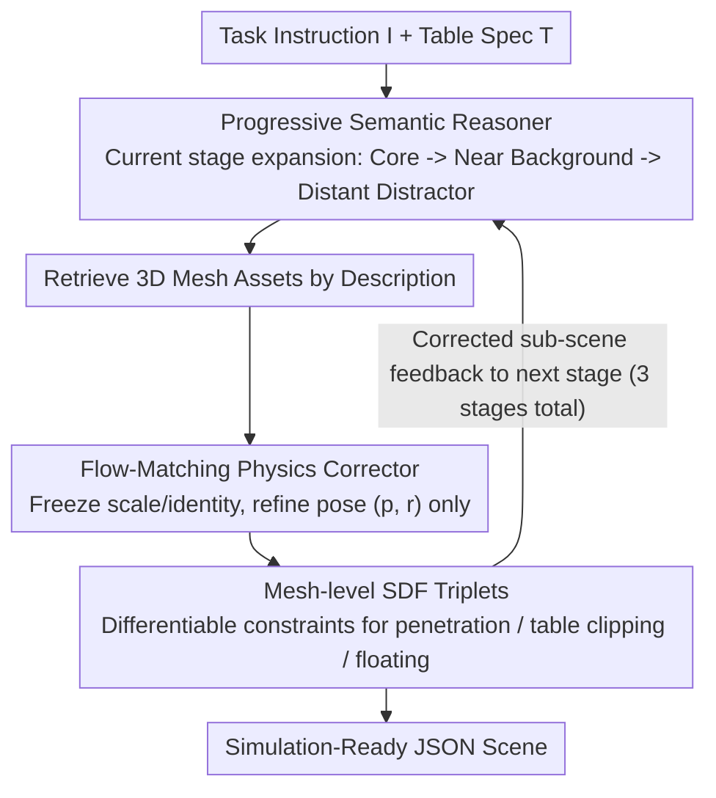

# STABLE: Simulation-Ready Tabletop Layout Generation via a Semantics–Physics Dual System

**Conference**: ICML 2026  
**arXiv**: [2605.16137](https://arxiv.org/abs/2605.16137)  
**Code**: https://stable-tabletop.github.io  
**Area**: 3D Vision / Embodied AI / Scene Generation  
**Keywords**: Tabletop scene generation, semantics-physics dual system, Flow Matching, SDF collision loss, progressive inference

## TL;DR
STABLE decomposes the process of "task instructions → simulation-ready tabletop scenes" into an LLM-based Semantic Reasoner (generating coarse layouts) and a flow-matching-based Physics Corrector with SDF losses (refining poses). By iterating through three stages—task-critical, important background, and secondary background—the system reduces object collisions to zero while achieving 99.0% scene alignment (AwS) on the MesaTask-10K dataset.

## Background & Motivation

**Background**: Embodied AI training increasingly relies on synthetic data. Generating tabletop scenes that directly interface with simulators based on operational instructions (e.g., "place the apple to the left of the banana") is a critical component of robotic manipulation data production. Current mainstream approaches utilize LLMs (via zero-shot prompting, multi-turn prompts, or SFT on scene data) to directly output scene JSONs—represented by works like LayoutGPT, I-Design, Holodeck, and MesaTask.

**Limitations of Prior Work**: Pure LLM approaches exhibit structural weaknesses in 3D spatial reasoning: (1) Discretizing continuous coordinates into tokens lacks sufficient precision, leading to frequent **object penetration, floating, and table clipping**, which causes simulators to crash. (2) Post-processing optimization (such as Steerable's physical post-proc) may eliminate collisions but often shifts object positions significantly—for instance, pushing the apple to the **right** of the banana—thereby violating the instruction semantics. Consequently, "task alignment" and "physical feasibility" goals are often in conflict.

**Key Challenge**: LLMs are proficient in semantics but poor at continuous geometry; optimizers excel at geometry but lack semantic understanding. Simply concatenating them serially often leads to the latter overriding the former.

**Goal**: (1) Confine the LLM to provide only a coarse semantic layout without requiring physically precise poses. (2) Employ a lightweight, geometry-aware corrector to update only $(\mathbf{p}, r)$ while preserving object identities, dimensions, and relationships. (3) Prevent mutual interference between "object addition" and "pose correction" through stage-wise alternating iterations.

**Key Insight**: The authors draw an analogy to the "System 1 / System 2" VLA approach in Helix—a division between fast and slow systems. The Semantic Reasoner acts as the slow-thinking semantic system, while the Physics Corrector serves as the fast-response geometric system. These systems **interact frequently** rather than in a one-shot process.

**Core Idea**: A "Semantic-Physics Dual System" (SR + PC) is used to progressively expand the scene. After each batch of objects is added, flow-matching and mesh-level SDF losses are applied to project the poses back into the physically feasible region, achieving simulation-ready results without sacrificing task semantics.

## Method

### Overall Architecture
STABLE addresses the conflict between semantic alignment and physical feasibility in generating simulation-ready tabletops from single instructions. The core strategy involves alternating between two complementary subsystems. The input consists of a task instruction $I$ and a tabletop specification $T$, and the output is a structured JSON scene $J=\{T, \{O_i\}_{i=1}^N\}$, where each object $O_i=\{\mathbf{p}_i, r_i, s_i, d_i\}$ includes 3D translation, yaw rotation, bbox dimensions, and text description, associated with a mesh $a_i$ retrieved from a 3D asset library.

The pipeline follows a three-stage progressive loop: First, the Semantic Reasoner (SR) outputs a task-oriented object set $O^t$ (objects explicitly named in the instruction). After asset retrieval, the Physics Corrector (PC) refines their poses into a physically feasible state. Next, the SR adds important background objects $O^B$ (physically touching or adjacent to $O^t$) given $(I, T, O^t)$, followed by another PC refinement. Finally, the SR adds secondary background objects $O^b$ (distant distractors) given $(I, T, O^t, O^B)$, with a final PC refinement. Corrected poses from each stage are fed back as context for the next SR stage, preventing geometric error accumulation. This process can be pipelined across batches—while scene A runs through the PC, scene B can concurrently utilize the SR.

### Key Designs

**1. Progressive Semantic Reasoner: Locking Core Objects Before Filling Background**

The primary issue with one-shot LLM generation is weak task-grounding—critical objects mentioned in instructions are often missed or buried by background clutter. STABLE restructures MesaTask-10K labels into sequences of $(O^t, O^t\cup O^B, O^t\cup O^B\cup O^b)$ for SFT, forcing the LLM to expand outward. During inference, it follows the sequence $O^t \leftarrow \mathrm{SR}(I, T)$, $O^B \leftarrow \mathrm{SR}(I, T, O^t)$, and $O^b \leftarrow \mathrm{SR}(I, T, O^t, O^B)$. The division between $O^B$ and $O^b$ is automatically determined by bbox intersection thresholds. Training also omits Chain-of-Thought reasoning to compress tokens. This approach locks core objects early, improving alignment and facilitating local PC correction. Ablations show AwT increased from 89.9% to 99.4%, and Distractor Rate from 78.6% to 86.1%, indicating that progression enhances grounding and scene richness.

**2. Geometry-Aware Flow-Matching Physics Corrector: Preserving Semantic Skeleton**

The PC is positioned as a "corrector rather than a generator": it keeps $(s_i, d_i, a_i)$ constant and only performs continuous refinement on the pose vector $\mathbf{x}=[\mathbf{p}_1,\dots,\mathbf{p}_N, r_1,\dots,r_N]\in\mathbb{R}^{4N}$. This avoids semantic destruction where "clearing collisions inadvertently moves an apple to the right of the banana." To handle cases like stacking or containment, the PC uses frozen PointTransformer-V3 to extract mesh-level geometric embeddings $\mathbf{g}_i=\phi(\mathcal{P}_i)$ from surface point clouds, forming the condition $\mathcal{C}=(\mathbf{x}^c, \mathbf{G})$.

The correction uses flow matching because it requires "small local calibrations." During training, the coarse pose $\mathbf{x}^c$ from the SR is augmented with Gaussian noise to obtain $\mathbf{x}_0=\mathbf{x}^c+\sigma\boldsymbol{\epsilon}$, with the GT pose as $\mathbf{x}_1$. Interpolation follows $\mathbf{x}_t=(1-t)\mathbf{x}_0+t\mathbf{x}_1$, and a U-Net learns the velocity field $\mathbf{v}_\theta$ to fit $\mathbf{v}_{\mathrm{target}}=\mathbf{x}_1-\mathbf{x}_0$:

$$\mathcal{L}_{\mathrm{flow}}=\mathbb{E}\big\|\mathbf{v}_\theta(\mathbf{x}_t, t, \mathcal{C})-(\mathbf{x}_1-\mathbf{x}_0)\big\|_2^2$$

During inference, ODE integration starts from $\mathbf{x}(0)=\mathbf{x}^c$ and runs to $t=1$. This design ensures the model learns local correction flows in the neighborhood of $\mathbf{x}^c$, which is more stable than generating from pure noise.

**3. Mesh-level SDF Physical Constraints: Explicitly Targeting Failure Modes**

Pure data-driven flow loss often leaves residual intersections. STABLE adds three differentiable SDF losses to explicitly constrain "inter-object intersection, table clipping, and floating." Each mesh $m$ pre-calculates an SDF $D_m(\mathbf{x})$ (negative values inside). Intersection loss is defined as:

$$\mathcal{L}_{\mathrm{obj\text{-}obj}}=\sum_{i<j}\big[\max(0, -\mathrm{dist}_{\mathrm{sdf}}(i,j))\big]^2,\quad \mathrm{dist}_{\mathrm{sdf}}(i,m)=\min_{\mathbf{q}\in\mathcal{Q}_i}D_m(\mathbf{q})$$

Similarly, the table is modeled as an SDF $\tau$ to derive $\mathcal{L}_{\mathrm{obj\text{-}table}}$. The support contact loss samples object bottom points $\mathcal{B}_i$ and support surfaces $\mathcal{S}_i$, defining $\mathcal{L}_{\mathrm{sup}}=\sum_i[\max(0, \mathrm{gap}(i,z_i^{\mathrm{sup}})-\epsilon)]^2$. The total objective is:

$$\mathcal{L}_{\mathrm{PC}}=\mathcal{L}_{\mathrm{flow}}+\lambda_{\mathrm{sdf}}(\mathcal{L}_{\mathrm{obj\text{-}obj}}+\mathcal{L}_{\mathrm{obj\text{-}table}})+\lambda_{\mathrm{sup}}\mathcal{L}_{\mathrm{sup}}$$

### Loss & Training
The PC is trained on all 10K instances from MesaTask-10K. The SR is SFT-ed from an open-source LLM using the three-stage sequences. Batch pipelining is used during inference to optimize throughput.

## Key Experimental Results

### Main Results

| Dataset | Metric | STABLE | Prev. SOTA | Gain |
|--------|------|--------|-----------|------|
| MesaTask-10K | FID ↓ | **38.6** | MesaTask 40.6 | -2.0 |
| MesaTask-10K | AwT (Task Align, %) | **99.4** | Steerable 99.4 | 0 |
| MesaTask-10K | AwS (Scene Graph Align, %) | **99.0** | Steerable 91.1 | +7.9 |
| MesaTask-10K | OC (Object Collision) | **0** | Steerable 0 / MesaTask 15.6 | Consistent w/ Steerable without shifting |
| MesaTask-10K | GPT Avg Score | **9.0** | TabletopGen 8.6 | +0.4 |

| Task | Metric | STABLE | StructDiffusion | LEGO-NET |
|------|------|--------|-----------------|----------|
| Rearrangement | Distance Move ↓ | **0.14** | 0.21 | 0.28 |
| Rearrangement | EMD to GT ↓ | **0.08** | 0.23 | 0.43 |
| Rearrangement | OC ↓ | **0** | 0.25 | 0.32 |

Key Observation: Steerable achieves OC=0 by aggressively moving objects, which drops AwS to 91.1. STABLE maintains OC=0 and AwS=99.0, solving the fundamental trade-off.

### Ablation Study

| Configuration | OC ↓ | Float ↓ | AwT ↑ | Distractor Rate ↑ | Description |
|------|------|---------|-------|--------------------|------|
| Full PC | **0** | **0** | — | — | Full PC mechanism |
| w/o $\mathcal{L}_{\mathrm{sup}}$ | 4.7 | 9.8 | — | — | Floating spikes |
| w/o $\mathcal{L}_{\mathrm{obj\text{-}table}}$ | 13.6 | 5.4 | — | — | "Pseudo" float reduction via table sinking |
| w/o $\mathcal{L}_{\mathrm{obj\text{-}obj}}$ | 11.9 | 15.8 | — | — | Intersection and instability crash |
| One-shot SR | — | — | 89.9 | 78.6 | Unified scene output |
| Progressive SR | — | — | **99.4** | **86.1** | Three-stage progressive |

### Key Findings
- **Coupled SDF Losses**: Removing $\mathcal{L}_{\mathrm{obj\text{-}table}}$ actually *decreases* recorded float because objects sink into the table to bypass support constraints—joint evaluation is essential.
- **Progressive SR Impact**: Shows a 9.5% gain in AwT and a 7.5% gain in Distractor Rate compared to one-shot models, proving it enhances both grounding and scene richness.
- **Robustness**: The PC successfully finds zero-collision solutions even in "heavy collision" buckets (30-40 initial collisions) where Iterative Optimizers fail.

## Highlights & Insights
- **Decoupling Pose from Identity**: PC only modifies $(\mathbf{p}, r)$ and freezes $(s, d)$, effectively "pinning" the semantic skeleton while fine-tuning in physical space.
- **Local Correction Flow**: Training from noisy GT and inferring from coarse SR output forces the model to learn a local correction mapping, which is more robust than global diffusion generation.
- **Portability of Mesh-level SDF**: The triplet (intersection, table, support) provides a differentiable pose refinement module applicable to any robotic task (placement, grasping, AR).

## Limitations & Future Work
- Pose modeling is limited to translation and yaw; it does not yet handle pitch/roll for objects like fallen bottles.
- Dependent on MesaTask-10K assets; performance in domain-shifted environments (e.g., outdoor, kitchens) remains unverified.
- Fixed 3-stage division for the SR might be rigid for massive scenes (e.g., >50 objects).
- Real-time latency for closed-loop robotic control was not extensively analyzed.

## Related Work & Insights
- **vs MesaTask (SFT-LLM)**: MesaTask outputs whole layouts directly (OC=15.6). STABLE proves that offloading geometry to a specialized module (PC) is more scalable.
- **vs Steerable (Post-proc Optimization)**: Steerable fails to converge in highly crowded scenes and sacrifices semantics (AwS=91.1). STABLE's learning-based approach is both faster and more semantic-preserving.
- **vs TabletopGen (Image Intermediary)**: Avoids the ambiguity introduced by using images as bridges between text and 3D.

## Rating
- Novelty: ⭐⭐⭐⭐ The combination of "flow-matching from coarse pose" and stage-wise progressive inference is highly effective for this task.
- Experimental Thoroughness: ⭐⭐⭐⭐ Solid comparisons across 4 baseline types and intensive ablation studies on physical constraints.
- Writing Quality: ⭐⭐⭐⭐ Analogy to System 1/2 is clear; failure mode visualizations are intuitive.
- Value: ⭐⭐⭐⭐ Provides a practical pipeline for robotic manipulation data production with reusable SDF constraint components.

<!-- RELATED:START -->

## Related Papers

- [\[ICML 2026\] PhyScene3D: Physically Consistent Interactive 3D Tabletop Scene Generation](physcene3d_physically_consistent_interactive_3d_tabletop_scene_generation.md)
- [\[NeurIPS 2025\] Gaussian-Augmented Physics Simulation and System Identification with Complex Colliders](../../NeurIPS2025/3d_vision/gaussian-augmented_physics_simulation_and_system_identification_with_complex_col.md)
- [\[CVPR 2025\] MotionAnyMesh: Physics-Grounded Articulation for Simulation-Ready Digital Twins](../../CVPR2025/3d_vision/motionanymesh_physics-grounded_articulation_for_simulation-ready_digital_twins.md)
- [\[ICML 2026\] LabBuilder: Protocol-Grounded 3D Layout Generation for Interactable and Safe Laboratory](labbuilder_protocol-grounded_3d_layout_generation_for_interactable_and_safe_labo.md)
- [\[CVPR 2026\] PhysHead: Simulation-Ready Gaussian Head Avatars](../../CVPR2026/3d_vision/physhead_simulation-ready_gaussian_head_avatars.md)

<!-- RELATED:END -->
