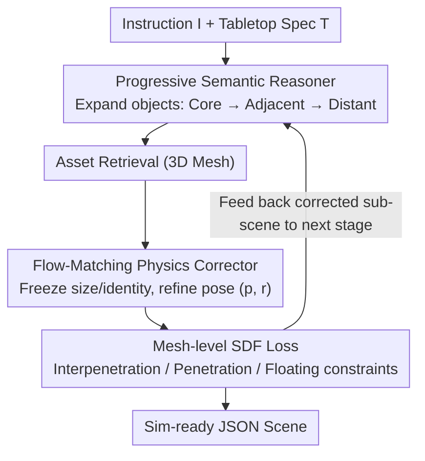

# STABLE: Simulation-Ready Tabletop Layout Generation via a Semantics–Physics Dual System

**Conference**: ICML 2026  
**arXiv**: [2605.16137](https://arxiv.org/abs/2605.16137)  
**Code**: https://stable-tabletop.github.io  
**Area**: 3D Vision / Embodied AI / Scene Generation  
**Keywords**: Tabletop Scene Generation, Semantic-Physics Dual System, Flow Matching, SDF Collision Loss, Progressive Inference

## TL;DR
STABLE decomposes the "task instruction → simulation-ready scene" pipeline into an LLM-based Semantic Reasoner (for coarse layout) and a flow-matching Physics Corrector with SDF loss (for pose refinement). By iterating across three stages (task-critical → background), it achieves zero object collisions and 99.0% Scene Graph Alignment (AwS) on MesaTask-10K.

## Background & Motivation

**Background**: Training for Embodied AI increasingly relies on synthetic data. Generating simulation-ready tabletop scenes from natural language instructions (e.g., "place an apple to the left of the banana") is a critical step in robot manipulation data production. Prevailing methods use LLMs (zero-shot, multi-turn prompting, or SFT) to directly output scene JSONs—represented by works like LayoutGPT, I-Design, Holodeck, and MesaTask.

**Limitations of Prior Work**: Pure LLM approaches suffer from structural weaknesses in 3D spatial reasoning: (1) Discretizing continuous coordinates into tokens lacks precision, leading to frequent **interpenetration, floating, and tabletop penetration**, which causes simulators to crash. (2) Post-processing optimizations (e.g., Steerable) can eliminate collisions but often move objects significantly—potentially pushing the apple to the **right** of the banana—thereby violating instruction semantics.

**Key Challenge**: LLMs excel at semantics but struggle with geometry; optimizers excel at geometry but lack semantic understanding. Serial execution often results in the latter overwriting the former.

**Goal**: (1) Confine the LLM to provide only semantic coarse layouts without requiring physically precise poses. (2) Use a lightweight, geometry-aware corrector to update only poses $(\mathbf{p}, r)$ while preserving object identities, scales, and relations. (3) Prevent semantic corruption through a phased alternating iteration between object placement and pose correction.

**Key Insight**: The authors draw an analogy to the "System 1 / System 2" VLA approach—dividing labor between fast and slow systems. The Semantic Reasoner is the slow-thinking semantic system, while the Physics Corrector is the fast-responding geometric system. They **interact frequently** rather than executing in a single pass.

**Core Idea**: A "Semantic-Physics Dual System" (SR + PC) progressively expands the scene. Every time a batch of objects is added, flow-matching and mesh-level SDF losses immediately pull poses back into the physically feasible region, achieving simulation-ready outputs without sacrificing task semantics.

## Method

### Overall Architecture
STABLE addresses the conflict between semantic alignment and physical feasibility in generating simulation-ready tabletops from instructions. The input is a task instruction $I$ and tabletop specification $T$; the output is a structured JSON scene $J=\{T, \{O_i\}_{i=1}^N\}$, where each object $O_i=\{\mathbf{p}_i, r_i, s_i, d_i\}$ includes 3D translation, yaw rotation, bbox size, and text description, associated with a mesh $a_i$ retrieved from a 3D asset library.

The pipeline follows a three-stage progressive loop: First, the Semantic Reasoner (SR) outputs task-oriented objects $O^t$ based on the instruction. After asset retrieval, the Physics Corrector (PC) refines their poses. Next, SR adds important background objects $O^B$ (physically contacting or adjacent to $O^t$) conditioned on $(I, T, O^t)$, followed by another PC pass. Finally, SR adds secondary background objects $O^b$ (distant distractors) conditioned on $(I, T, O^t, O^B)$, with a final PC refinement. Corrected poses from each stage are fed back as context for the next SR stage to prevent geometric error accumulation.

### Key Designs

**1. Progressive Semantic Reasoner: Locking Core Objects before Background**
A one-shot LLM approach often misses task-critical objects amidst background noise. STABLE reformulates MesaTask-10K into $(O^t, O^t\cup O^B, O^t\cup O^B\cup O^b)$ sequences for SFT. This forces the LLM to expand outward: $O^t \leftarrow \mathrm{SR}(I, T)$, then $O^B \leftarrow \mathrm{SR}(I, T, O^t)$, and finally $O^b \leftarrow \mathrm{SR}(I, T, O^t, O^B)$. Background segments are determined by bbox intersection thresholds. Removing Chain-of-Thought in favor of direct JSON output reduces token overhead. This ensures grounding while allowing the PC to perform local corrections on smaller sets—Ablations show AwT increased from 89.9% to 99.4%.

**2. Geometry-aware Flow-Matching Physics Corrector: Pose Revision only**
The PC acts as a corrector, not a generator. It keeps $(s_i, d_i, a_i)$ fixed and only updates the pose vector $\mathbf{x}=[\mathbf{p}_1,\dots,\mathbf{p}_N, r_1,\dots,r_N]\in\mathbb{R}^{4N}$. To handle complex geometric relationships like containment (not capturable by bboxes), PC utilizes frozen PointTransformer-V3 to extract mesh-level embeddings $\mathbf{g}_i=\phi(\mathcal{P}_i)$ from surface points.

Refinement uses flow matching for local calibration. During training, SR's coarse pose $\mathbf{x}^c$ is corrupted with Gaussian noise to get $\mathbf{x}_0=\mathbf{x}^c+\sigma\boldsymbol{\epsilon}$, while the GT pose is $\mathbf{x}_1$. Interpolating as $\mathbf{x}_t=(1-t)\mathbf{x}_0+t\mathbf{x}_1$, a U-Net learns the velocity field $\mathbf{v}_\theta$ to fit $\mathbf{v}_{\mathrm{target}}=\mathbf{x}_1-\mathbf{x}_0$:
$$\mathcal{L}_{\mathrm{flow}}=\mathbb{E}\big\|\mathbf{v}_\theta(\mathbf{x}_t, t, \mathcal{C})-(\mathbf{x}_1-\mathbf{x}_0)\big\|_2^2$$
At inference, the ODE integrates from $\mathbf{x}(0)=\mathbf{x}^c$ to $t=1$. This ensures the model learns local correction flows around $\mathbf{x}^c$.

**3. Mesh-level SDF Physics Constraints: Targeting Three Failure Modes**
Data-driven flow loss alone leaves fatal interpenetrations. STABLE introduces three differentiable mesh-level SDF losses to constrain "Interpenetration, Tabletop Penetration, and Floating." Using mesh-level SDF $D_m(\mathbf{x})$ allows for precise handling of containment. The object-object interpenetration loss is:
$$\mathcal{L}_{\mathrm{obj\text{-}obj}}=\sum_{i<j}\big[\max(0, -\mathrm{dist}_{\mathrm{sdf}}(i,j))\big]^2,\quad \mathrm{dist}_{\mathrm{sdf}}(i,m)=\min_{\mathbf{q}\in\mathcal{Q}_i}D_m(\mathbf{q})$$
Simultaneously, the tabletop is modeled as SDF $\tau$ for $\mathcal{L}_{\mathrm{obj\text{-}table}}$. Support contact loss $\mathcal{L}_{\mathrm{sup}}$ samples bottom points and penalizes gaps from the nearest supporting surface. The total PC objective is:
$$\mathcal{L}_{\mathrm{PC}}=\mathcal{L}_{\mathrm{flow}}+\lambda_{\mathrm{sdf}}(\mathcal{L}_{\mathrm{obj\text{-}obj}}+\mathcal{L}_{\mathrm{obj\text{-}table}})+\lambda_{\mathrm{sup}}\mathcal{L}_{\mathrm{sup}}$$

### Loss & Training
PC is trained on all 10K MesaTask scenes. SR is SFT-ed on an open-source LLM using the three-stage sequence. Inference utilizes batch pipelining, where PC for one scene runs concurrently with SR for another.

## Key Experimental Results

### Main Results

| Dataset | Metric | STABLE | Prev. SOTA | Gain |
|--------|------|--------|-----------|------|
| MesaTask-10K | FID ↓ | **38.6** | MesaTask 40.6 | -2.0 |
| MesaTask-10K | AwT (Task Align, %) | **99.4** | Steerable 99.4 | Parity |
| MesaTask-10K | AwS (Scene Align, %) | **99.0** | Steerable 91.1 | +7.9 |
| MesaTask-10K | OC (Object Collision) | **0** | Steerable 0 | Parity |
| MesaTask-10K | GPT Avg Score | **9.0** | TabletopGen 8.6 | +0.4 |

| Task | Metric | STABLE | StructDiffusion | LEGO-NET |
|------|------|--------|-----------------|----------|
| Rearrangement | Distance Move ↓ | **0.14** | 0.21 | 0.28 |
| Rearrangement | EMD to GT ↓ | **0.08** | 0.23 | 0.43 |
| Rearrangement | OC ↓ | **0** | 0.25 | 0.32 |

Key Insight: While Steerable reaches OC=0 by moving objects, its AwS drops to 91.1. STABLE is the first to achieve OC=0 and high AwS (99.0%) simultaneously.

### Ablation Study

| Config | OC ↓ | Float ↓ | AwT ↑ | Distractor Rate ↑ | Note |
|------|------|---------|-------|--------------------|------|
| Full PC | **0** | **0** | — | — | Full PC |
| w/o $\mathcal{L}_{\mathrm{sup}}$ | 4.7 | 9.8 | — | — | Significant floating |
| w/o $\mathcal{L}_{\mathrm{obj\text{-}table}}$ | 13.6 | 5.4 | — | — | Objects sink into table |
| w/o $\mathcal{L}_{\mathrm{obj\text{-}obj}}$ | 11.9 | 15.8 | — | — | Multi-failure |
| One-shot SR | — | — | 89.9 | 78.6 | All-at-once |
| Progressive SR | — | — | **99.4** | **86.1** | 3-stage |

### Key Findings
- SDF losses are highly coupled: Removing $\mathcal{L}_{\mathrm{obj-table}}$ lowers the floating metric because objects sink into the table to satisfy support constraints, indicating that metrics must be evaluated jointly.
- Progressive SR improves AwT by 9.5 points and increases Distractor Rate by 7.5, making scenes more complete.
- PC succeeds on "severe collision" scenarios (30-40 collisions) where post-processing optimizers (50K iterations) fail, demonstrating superior robustness.

## Highlights & Insights
- **Decoupling Semantics and Physics**: By fixing $(s, d)$ and only refining $(\mathbf{p}, r)$, the PC preserves the "semantic skeleton" while adjusting the physical space.
- **Local Correction Flow**: Training with noise and inferring from coarse poses allows PC to learn a neighborhood correction flow rather than trying to generate the whole scene from noise.
- **Reusable SDF Framework**: The object-object, object-table, and support constraints are modular and applicable to furniture layout or robot grasping tasks.

## Limitations & Future Work
- Pose refinement is limited to translation and yaw; pitch/roll are not yet modeled, which restricts placement of tipped or tilted objects.
- High dependence on specific asset libraries; retrieval failures or unseen environments (e.g., kitchens) may reduce performance.
- Progressive stages are fixed at 3; scaling to hyper-complex scenes (>50 objects) might require dynamic stage allocation.

## Related Work & Insights
- **vs MesaTask**: MesaTask's end-to-end LLM has OC=15.6. STABLE proves that offloading geometry to a specialized module is more scalable.
- **vs Steerable**: Steerable fails to converge in dense collision cases (>20 collisions); learnable PC is more reliable in crowded spaces.
- **vs TabletopGen**: Directly operating on 3D structures avoids the ambiguity of using images as intermediates.

## Rating
- Novelty: ⭐⭐⭐⭐ The combination of flow-matching from coarse poses, mesh-level SDF, and progressive iteration is a highly effective integration for this task.
- Experimental Thoroughness: ⭐⭐⭐⭐ Strong coverage of baselines and diverse metrics, though SE(3) analysis is missing.
- Writing Quality: ⭐⭐⭐⭐ High; the System 1/2 analogy and visualization of failure modes contribute to clarity.
- Value: ⭐⭐⭐⭐ High engineered value for simulator data generation pipelines.

<!-- RELATED:START -->

- **MesaTask**: Generating Tabletop Scenes via Large Language Models (CVPR 2024)
- **Steerable**: Post-optimization for Collision-free Layouts (ICRA 2023)

<!-- RELATED:END -->

## Related Papers

- [\[ICML 2026\] PhyScene3D: Physically Consistent Interactive 3D Tabletop Scene Generation](physcene3d_physically_consistent_interactive_3d_tabletop_scene_generation.md)
- [\[NeurIPS 2025\] Gaussian-Augmented Physics Simulation and System Identification with Complex Colliders](../../NeurIPS2025/3d_vision/gaussian-augmented_physics_simulation_and_system_identification_with_complex_col.md)
- [\[ICML 2026\] LabBuilder: Protocol-Grounded 3D Layout Generation for Interactable and Safe Laboratory](labbuilder_protocol-grounded_3d_layout_generation_for_interactable_and_safe_labo.md)
- [\[CVPR 2025\] MotionAnyMesh: Physics-Grounded Articulation for Simulation-Ready Digital Twins](../../CVPR2025/3d_vision/motionanymesh_physics-grounded_articulation_for_simulation-ready_digital_twins.md)
- [\[CVPR 2026\] PhysHead: Simulation-Ready Gaussian Head Avatars](../../CVPR2026/3d_vision/physhead_simulation-ready_gaussian_head_avatars.md)

<!-- RELATED:END -->
