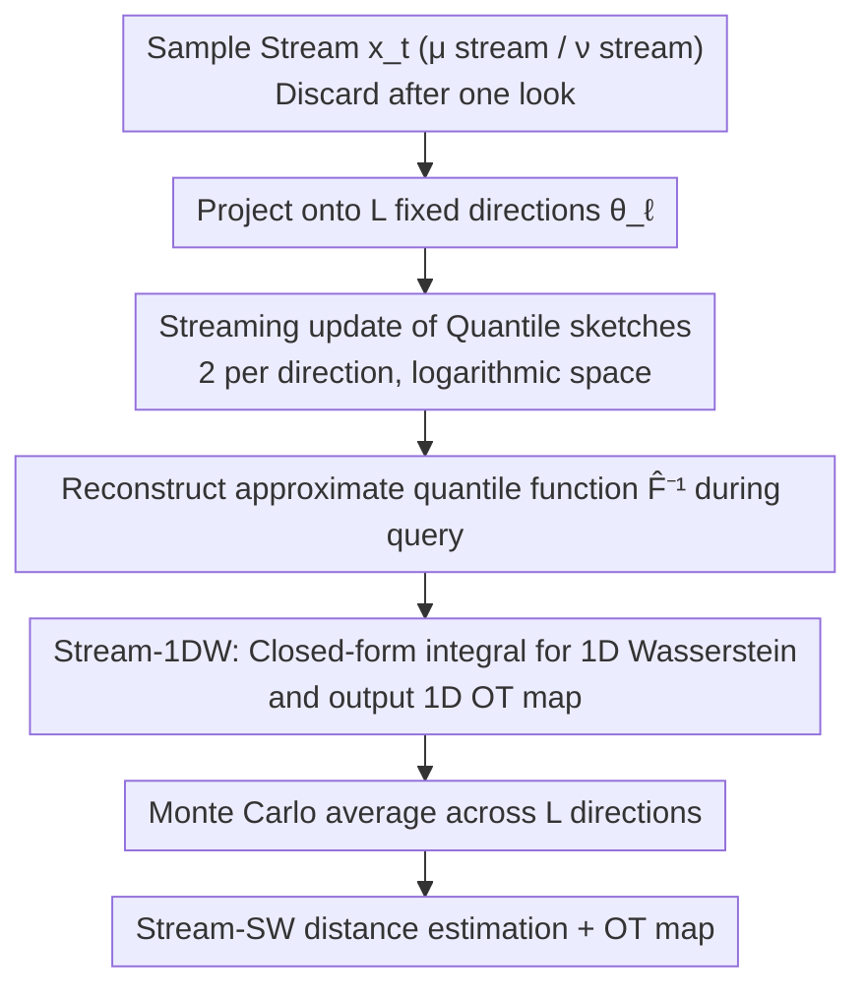

# Streaming Sliced Optimal Transport

**Conference**: ICML 2026  
**arXiv**: [2505.06835](https://arxiv.org/abs/2505.06835)  
**Code**: https://github.com/khainb/StreamSW  
**Area**: Optimal Transport / Sliced Wasserstein / Streaming Algorithms / Point Clouds / 3D Vision  
**Keywords**: Streaming OT, Quantile Sketch, Stream-SW, Single-pass, Low Memory

## TL;DR
Stream-SW is the first algorithm capable of estimating Sliced Wasserstein (SW) distance on a "sample stream": it utilizes KLL/quantile sketches on each 1D projection to maintain an approximate quantile function, transforming the closed-form 1D Wasserstein integral into a streamable estimator. The space complexity is only logarithmic relative to the number of samples, bringing SOT to "one-look-and-discard" scenarios such as IoT and edge devices.

## Background & Motivation

**Background**: Although Wasserstein distance is widely used in GANs, autoencoders, flow matching, Bayesian inference, and point cloud analysis, its computational complexity $\mathcal{O}(n^3\log n)$ and sample complexity $\mathcal{O}(n^{-1/d})$ make it infeasible for high-dimensional and large-scale data. Sliced Wasserstein (SW) reduces complexity to $\mathcal{O}(n\log n)$ and improves sample complexity to $\mathcal{O}(n^{-1/2})$ by taking 1D Radon projections, thereby bypassing the curse of dimensionality.

**Limitations of Prior Work**: All existing SW estimators are **offline**—they require storing both sets of samples in memory for sorting and calculating the quantile function. In IoT, sensor streams, and online learning scenarios, samples are "seen once and discarded," making memory extremely tight. Online Sinkhorn (Mensch & Peyré 2020) attempts to online-ify entropic OT, but its time complexity is $\mathcal{O}(n^2)$ and its space complexity is $\mathcal{O}(n)$ because it must retain historical samples; Compressed Online Sinkhorn uses Gaussian quadrature but remains trapped in hypercube complexity with a compression rate of $\mathcal{O}(m^{-1/d})$ coupled with dimensionality.

**Key Challenge**: The low cost of SW stems from the 1D closed-form quantile function $F^{-1}_\mu(q)$. However, obtaining an accurate quantile function requires "all samples"—this creates a contradiction between "streamable estimation" and "leveraging closed-form solutions."

**Goal**: (i) Construct an approximate estimator for 1D Wasserstein (1DW) that can be updated in a single pass over a sample stream; (ii) integrate this 1D streaming estimator across all projection directions to form Stream-SW; (iii) provide provable probabilistic error bounds and complexity analysis; (iv) verify downstream performance on simulations, point cloud classification, point cloud gradient flows, and streaming change-point detection.

**Key Insight**: Tools for "streaming" distribution comparison already exist in the database domain—namely, quantile sketches (e.g., KLL, t-digest). The authors observed that the closed-form expression of 1DW, $W_p^p(\mu,\nu)=\int_0^1|F^{-1}_\mu(q)-F^{-1}_\nu(q)|^p dq$, is entirely determined by the quantile functions. Thus, they bridge the two independent literatures of "streaming quantile approximation" and "sliced OT."

**Core Idea**: Use the quantile sketch data structure as a streaming estimator for the CDF/quantile function. By connecting it to each direction of the Monte Carlo projection loop, they derive the first SW streaming estimator while maintaining logarithmic space complexity relative to the sample size $n$.

## Method

### Overall Architecture

Stream-SW addresses a specific problem: estimating the Sliced Wasserstein distance between two distributions in a streaming scenario where samples are discarded after one look, and memory cannot grow linearly with the stream length $n$. The overall approach adapts the two-layer structure of offline SW: the outer layer is a Monte Carlo average of $L$ 1D Radon projections, and the inner layer is the 1DW distance for each direction. The modification occurs solely at the innermost layer: replacing "storing all samples to sort for the quantile function" with "using a logarithmic-space quantile sketch to approximate the quantile function on the fly."

The pipeline is as follows: At initialization, projection directions $\theta_1,\dots,\theta_L\sim U(\mathbb{S}^{d-1})$ are sampled, and two quantile sketches are created for each direction (one for the $\mu$ stream and one for $\nu$). Whenever a sample $x_t\sim\mu$ ($x_t\in\mathbb{R}^d$) arrives, it is projected onto all $L$ directions. The resulting scalar $\theta_\ell^\top x_t$ is pushed into the corresponding sketch $\mathcal{Q}^\mu_\ell$, and the original sample is immediately discarded. The same applies to the $\nu$ stream. To query the distance at any time step, approximate quantile functions $\widehat F^{-1}_{\theta_\ell\sharp\mu},\widehat F^{-1}_{\theta_\ell\sharp\nu}$ are reconstructed from each pair of sketches to calculate the 1DW, which is then averaged across $L$ directions to yield $\widehat{\mathrm{SW}}_p^p(\mu,\nu)$.

### Key Designs

**1. Quantile sketch as a streaming estimator for CDF/Quantile functions: Replacing "full sorting" with "approximate quantiles"**

The pivot of this method is the observation that 1DW depends only on the quantile function. Therefore, there is no need to save all sorted results; a sufficiently accurate approximate quantile function suffices. This is exactly what quantile sketches in database stream processing have addressed for decades. The authors use the KLL sketch (Karnin–Lang–Liberty) as a representative tool: it maintains multi-level sample buffers and performs "compacting" when a buffer is full, reducing the sample count by half while doubling the weight of retained samples. Consequently, the sketch size grows only logarithmically with the stream length $n$ while maintaining bounded relative rank error. Key to this is the uniform probability bound $\Pr[\sup_q |\widehat F^{-1}_\mu(q)-F^{-1}_\mu(q)|>\delta]\le\eta$, which serves as the foundation for all subsequent error analysis.

**2. Stream-1DW: Rewriting 1D Wasserstein as a streaming estimator on sketches and providing the OT map**

With streaming quantile functions, 1DW can be reformulated. Its closed-form expression is:

$$W_p^p(\mu,\nu)=\int_0^1\big|F^{-1}_\mu(q)-F^{-1}_\nu(q)\big|^p\,dq,$$

The authors replace the true quantile functions with the sketch-reconstructed $\widehat F^{-1}_\mu$ and $\widehat F^{-1}_\nu$, then perform numerical integration over $[0,1]$. In practice, this is a piecewise summation at the quantile breakpoints of both sketches, equivalent to the northwest corner algorithm. Using the uniform quantile error bound, it is proven that $|\widehat W_p-W_p|$ is controlled by a term linearly related to $\delta$ with a probability of at least $1-\eta$. Additionally, they output a streaming estimate of the 1D OT map $\widehat F^{-1}_\nu\circ\widehat F_\mu$ with pointwise error bounds. Retaining the map is essential because downstream tasks like point cloud gradient flows require the transport mapping rather than just a scalar distance.

**3. Stream-SW: Applying Stream-1DW to $L$ projections for logarithmic space complexity relative to $n$**

The outer layer replicates offline SW, but with Stream-1DW for every 1D channel. At startup, $\theta_1,\dots,\theta_L$ are sampled. Each new sample is projected onto all directions and fed into respective sketches. The final estimate is the Monte Carlo average:

$$\widehat{\mathrm{SW}}_p^p=\frac{1}{L}\sum_{\ell=1}^{L}\widehat W_p^p(\theta_\ell\sharp\mu,\theta_\ell\sharp\nu).$$

The space complexity is $\mathcal{O}(L\cdot s\log n)$ (where $s$ is the initial sketch size), and the per-sample processing time is approximately $\mathcal{O}(L\cdot\log n)$. The total error bound is a summation of the sketch error from each 1D channel and the MC error from the $L$ directions. This design preserves the inherent scalability of SW—parallelization and closed-form 1D solutions—while achieving $\log n$ space complexity. This is the core advantage of Stream-SW over random subsampling in long-stream, memory-constrained scenarios.

### Training Strategy

This work presents a pure algorithmic estimator; no training is involved. All "parameters" are structural: sketch size $s$, number of projections $L$, and error tolerances $\epsilon, \delta, \eta$. The paper provides analytical trade-offs among these to guide selection.

## Key Experimental Results

### Main Results

| Task | Metric | Stream-SW vs. Random Subsampling (Same Memory) | Advantage |
|---|---|---|---|
| Gaussian/GMM Distance Estimation | $|\text{Est} - \text{True}|$ | Significantly smaller | Lower approximation error for same memory |
| Gaussian/GMM Estimation | Memory Usage | Smaller for same accuracy | Logarithmic sketch vs. linear subsampling |
| Point Cloud KNN Classification | Top-1 Acc | Higher | Sketches retain distribution tail information |
| Point Cloud Gradient Flow | Final Wasserstein Error | Lower | More stable OT map estimation |
| Kinect Streaming Change-point Detection | F1 Score | Higher | Fast response to mutations via streaming updates |

### Ablation Study

| Configuration | Key Change | Conclusion |
|---|---|---|
| Increase initial sketch size $s$ | Error decreases | Monotonic improvement, following $\mathcal{O}(s^{-1})$ |
| Increase projections $L$ | Error decreases + Time cost increases | Follows $\mathcal{O}(L^{-1/2})$ MC convergence |
| Increase stream length $n$ | Space remains nearly constant | Verifies $\log n$ space bound |
| vs. Compressed Online Sinkhorn | Faster for same accuracy | Avoids hypercubic cost of Gaussian quadrature |
| Increase dimension $d$ | Stream-SW error stable | Unaffected by curse of dimensionality (inherits SW property) |

### Key Findings
- When the memory budget is fixed, sketches are almost always more accurate than random subsampling—especially in long-stream scenarios or for distribution tails where subsampling fails by "forgetting" early samples.
- The streaming OT map estimation allows Stream-SW to drive point cloud gradient flows directly, where driving forces are updated as points arrive.
- It is insensitive to dimension $d$, maintaining a sample complexity of $\mathcal{O}(n^{-1/2})$, a key advantage over Online Sinkhorn.

## Highlights & Insights
- **Clean bridging of "1D closed-form formulas + streaming quantile estimation"**: The sliced OT and database sketch literatures had little overlap; this work connects the most mature tools from both, providing the first streaming SW version with high research leverage.
- **Retention of the OT map**: Many papers stop at "calculating a scalar distance." Providing the map means Stream-SW can immediately drive OT applications requiring gradients (flow matching, point cloud deformation, generative training).
- **Logarithmic space complexity with probabilistic bounds**: This makes it highly attractive for edge/IoT scenarios where memory is budgeted and theory must be controllable.

## Limitations & Future Work
- The sketch error bounds rely on the i.i.d. assumption; analysis for real-world streams (with temporal correlation or drift) needs refinement.
- Projection directions $\theta_1,\dots,\theta_L$ are fixed at startup; long streams might miss the most discriminative directions for current distributions. This could be integrated with max-sliced or adaptive projection for "streaming direction selection."
- Currently only proves the streaming version of classic SW; variants like Generalized, Spherical, or Hilbert SW require different sketch designs.

## Related Work & Insights
- **vs. Online Sinkhorn (Mensch & Peyré 2020)**: They online-ify entropic OT, but with linear space and quadratic time; this work uses the SW route to compress space to logarithmic levels.
- **vs. Compressed Online Sinkhorn (Wang 2023)**: They use Gaussian quadrature, which still suffers from dimensionality; Stream-SW bypasses this via SW's dimension independence.
- **vs. Standard/Generalized SW**: This serves as a unified streaming base that only modifies how the 1D estimation is performed.

## Rating
- Novelty: ⭐⭐⭐⭐ First streaming SW estimator, elegantly bridging two fields.
- Experimental Thoroughness: ⭐⭐⭐⭐ Good coverage across simulations and three downstream tasks.
- Writing Quality: ⭐⭐⭐⭐ Clear theoretical narrative from 1DW bounds to Stream-SW complexity.
- Value: ⭐⭐⭐⭐ High drop-in value for streaming, IoT, and online distribution comparison.

<!-- RELATED:START -->

## Related Papers

- [\[ICML 2026\] AvAtar: Learning to Align via Active Optimal Transport](avatar_learning_to_align_via_active_optimal_transport.md)
- [\[ICML 2026\] Convex Distance Operator Transport: A Convex and Geometry-Preserving Formulation](convex_distance_operator_transport_a_convex_and_geometry-preserving_formulation.md)
- [\[ICLR 2026\] SceneTransporter: Optimal Transport-Guided Compositional Latent Diffusion for Single-Image Structured 3D Scene Generation](../../ICLR2026/3d_vision/scenetransporter_optimal_transport-guided_compositional_latent_diffusion_for_sin.md)
- [\[CVPR 2025\] NoPain: No-box Point Cloud Attack via Optimal Transport Singular Boundary](../../CVPR2025/3d_vision/nopain_no-box_point_cloud_attack_via_optimal_transport_singular_boundary.md)
- [\[ICLR 2026\] Fast Estimation of Wasserstein Distances via Regression on Sliced Wasserstein Distances](../../ICLR2026/3d_vision/fast_estimation_of_wasserstein_distances_via_regression_on_sliced_wasserstein_di.md)

<!-- RELATED:END -->
