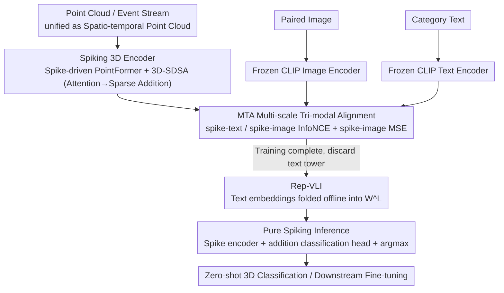

# SVL: Spike-based Vision-Language Pretraining for Efficient 3D Open-World Understanding

**Conference**: ICML 2026 Spotlight  
**arXiv**: [2505.17674](https://arxiv.org/abs/2505.17674)  
**Code**: Yes (Marked as "Code is available at SVL" in the paper)  
**Area**: 3D Vision / Multimodal VLM / Spiking Neural Networks  
**Keywords**: Spiking Neural Networks, 3D Open-World Understanding, Vision-Language Pretraining, Tri-modal Alignment, Neuromorphic Hardware

## TL;DR
SVL injects open-world understanding capabilities into Spiking Neural Networks (SNNs) through "3D-Image-Text" tri-modal contrastive pretraining. By "reparameterizing" the text encoder into a set of classification weights, the inference stage becomes entirely independent of the text tower, maintaining a pure spike-driven execution. It achieves 85.4% zero-shot classification on ModelNet40 while consuming only 0.5%–11% of the energy of comparable ANN methods.

## Background & Motivation

**Background**: SNNs are considered natural high-efficiency alternatives for 3D spatio-temporal perception (point clouds, event streams) due to their event-driven nature and sparse addition operations. The power consumption of neuromorphic chips like Speck can be as low as 0.7 mW. However, compared to ANNs, SNNs remain at the stage of "training small individual models for specific tasks."

**Limitations of Prior Work**: Existing SNN pretraining routes have significant flaws: STDP initialization fails rapidly as network/data complexity increases; knowledge distillation methods like SpikeBert/SpikeCLIP rely on ANN weight initialization and use non-neuromorphic-friendly LayerNorm; SpikformerV2 / Spike-driven Transformer V3 use masked image modeling to improve scalability but lack multimodal interfaces and are computationally expensive; classic 3D VLMs (OpenShape, ULIP series) can perform open-world 3D classification but require a large text encoder (tens to hundreds of millions of parameters) during inference, completely negating the power advantages of SNNs at the edge.

**Key Challenge**: The "low power + sparse addition" nature of SNNs is in fundamental conflict with the "large text tower + dense matrix multiplication" of classic three-encoder VLMs in the inference path. Sacrificing multimodal capability for efficiency or efficiency for zero-shot capability creates a dilemma where both are hard to achieve simultaneously.

**Goal**: (i) Design a pretraining framework that can align 3D-Image-Text modalities "without labels" while remaining purely spike-driven; (ii) Ensure the inference stage is completely free of the text encoder; (iii) Provide a truly "fully spiked" point cloud Transformer backbone for this framework.

**Key Insight**: Since CLIP has already aligned "Image $\leftrightarrow$ Text", one only needs to align the spiking 3D encoder to CLIP's image space (fine-grained) and text space (semantic level). Furthermore, in zero-shot tasks, the text encoder essentially computes embeddings for a fixed set of category prompts repeatedly. This means it can be "folded" offline into a $K \times C$ linear classification head, allowing the text tower to be discarded during deployment.

**Core Idea**: Use a triple contrastive loss to align spiking 3D features with the frozen CLIP image and text spaces (MTA), then reparameterize text embeddings into classification weights (Rep-VLI). Coupled with a fully spiked point cloud Transformer (Spike-driven PointFormer), this achieves "multimodal during training, pure spike-driven during inference."

## Method

### Overall Architecture
SVL addresses a seemingly contradictory requirement: enabling SNNs with CLIP-like open-world recognition without carrying the heavy text tower during inference, which would destroy the sparse addition benefits of SNNs. The solution decouples "obtaining semantics" from "performing inference" into training and deployment phases. During training, it uses three towers: point clouds and event streams are unified into a point set $D^t=\{\mathcal{P}, \mathcal{F}\}$ (event streams use a sliding window to normalize timestamps as z-coordinates $z_i = (t_i - t_{\min})/(t_{\max}-t_{\min})$). For each sample $(D_i^t, I_i^t, T_i^t)$, data is fed into the spiking 3D encoder $\mathcal{E}_\theta^S$ (outputting $\mathcal{F}^S \in \mathbb{R}^{T \times C}$) and frozen CLIP image/text encoders $\mathcal{E}_\theta^I, \mathcal{E}_\theta^T$. The MTA loss pulls the spike firing rates into the CLIP spaces. During deployment, the architecture collapses into a single tower: candidate category prompts are processed offline through the text encoder to fix the weights $W^L \in \mathbb{R}^{K \times C}$ (Rep-VLI). The inference path then consists only of the "spiking encoder + one addition-based classification head." For the backbone, the authors supplement Spike PointNet and E-3DSNN with a Spike-driven PointFormer, compressing attention into sparse additions so that the entire path contains no dense matrix multiplications.

### Key Designs

**1. MTA — Multi-scale Tri-modal Alignment: Aligning spiking 3D features to CLIP image and text spaces without labels**

Since SNNs lack semantics when trained from scratch, MTA leverages a frozen CLIP. After normalizing the firing rate as $\mathbf{x}_i = (\mathcal{F}^S/T) / \|\mathcal{F}^S/T\|_2$, it performs symmetric InfoNCE with normalized text features $\mathbf{y}_i$ for "semantic level" alignment $\mathcal{L}^{\text{NCE}}_{(S,T)}$, and with normalized image features $\mathbf{b}_i$ for "fine-grained" alignment $\mathcal{L}^{\text{NCE}}_{(S,I)}$. An additional MSE loss $\mathcal{L}^{\text{MSE}}_{(S,I)} = \sum_i \|\mathcal{F}_i^S - \mathcal{F}_i^I\|^2$ is used for point-to-point granularity. The total loss is:

$$\mathcal{L}_{\text{total}} = \lambda_1 \mathcal{L}^{\text{NCE}}_{(S,T)} + \lambda_2 \mathcal{L}^{\text{NCE}}_{(S,I)} + \lambda_3 \mathcal{L}^{\text{MSE}}_{(S,I)}, \quad \lambda_1=\lambda_2=\lambda_3=1$$

Ablations show that using only text alignment yields 21.9% zero-shot accuracy, only image alignment yields 24.8%, while the full tri-modal alignment + MSE reaches 33.6% (Objaverse-LVIS).

**2. Rep-VLI — Folding the text encoder offline into a classification layer**

In traditional three-encoder VLMs, the text tower often accounts for 70%+ of parameters (e.g., ULIP-2's text tower is 202.5M vs 21.9M for the point encoder), making it a bottleneck for memory and power. By pre-calculating embeddings for $K$ candidate prompts $\{T_1,\dots,T_K\}$ as $W^L_j = \tau \mathcal{E}_\theta^T(T_j)$, the inference uses "spike count decision" instead of softmax:

$$\text{logits}_{i,j} = \frac{1}{T}\sum_{t=1}^T W^L_j \cdot \mathcal{E}_\theta^S(D_i^t)$$

The text tower is discarded during deployment, preserving the sparse addition nature of SNNs.

**3. Spike-driven PointFormer + 3D-SDSA — Completing the fully spiking Point Transformer**

SVL introduces an end-to-end spike-driven Transformer. After local neighborhood grouping via FPS+kNN, tokens are spiked via an I-LIF neuron $\mathcal{SN}(\cdot)$ to produce $S = \mathcal{SN}(\text{MLP}(X))$. These pass through $L$ SDF residual blocks. The 3D-SDSA rearranges attention calculations:

$$\mathcal{SN}(Q_S(K_S^\top V_S)) = \mathcal{SN}((Q_S K_S^\top) V_S)$$

Since all matrices are binary spike tensors, matrix multiplications degrade into sparse additions (address-event accumulation).

### Loss & Training
The pretraining loss is the weighted sum from MTA. I-LIF neurons emit integers during training (scaled by $D^t$) and are expanded to binary spikes during inference. The CLIP encoders are frozen throughout. The default time step is $T\times D = 1\times 4$. For DVS tasks, $T$ is increased to 6.

## Key Experimental Results

### Main Results

Zero-shot 3D Classification on ModelNet40 / Objaverse-LVIS:

| Type | Method | Params (M, Point+Text) | Energy (mJ) | Obj. | M40. |
|------|------|---------------------|-----------|------|------|
| ANN | OpenShape (Sparseconv-L) | 41.3+202.5 | 73.8 | 43.4 | 83.4 |
| ANN | ULIP-2 (Point-BERT) | 21.9+202.5 | 152.3 | 50.6 | 84.7 |
| SNN | SpikeCLIP* | 9.5+22.8 | 11.0 | 0.5 | 5.1 |
| SNN | Spike PointNet + SVL | 3.57 | **0.27** | 24.9 | 76.3 |
| SNN | Spike-driven PointFormer-L + SVL | 22.1 | 9.4 | 43.4 | 83.1 |
| SNN | E-3DSNN-L + SVL | 17.7 | 0.64 | 43.9 | 84.6 |
| SNN | E-3DSNN-H + SVL | 46.7 | **0.79** | **47.0** | **85.4** |

Ours (E-3DSNN-H + SVL) outperforms ULIP-2 while consuming only $\sim$0.5% (0.79 mJ vs 152.3 mJ) of the energy.

### Ablation Study

MTA Loss components (Obj. / M40 zero-shot, E-3DSNN-S backbone):

| $\mathcal{L}^{\text{NCE}}_{(S,T)}$ | $\mathcal{L}^{\text{NCE}}_{(S,I)}$ | $\mathcal{L}^{\text{MSE}}_{(S,I)}$ | Obj. | M40 |
|:--:|:--:|:--:|------|-----|
| ✗ | ✗ | ✗ | 0.5 | 5.1 |
| ✗ | ✓ | ✗ | 24.8 | 73.1 |
| ✓ | ✗ | ✗ | 21.9 | 70.1 |
| ✓ | ✓ | ✗ | 31.7 | 77.8 |
| ✓ | ✓ | ✓ | **33.6** | **79.6** |

### Key Findings
- **Image alignment is more critical than text alignment**: Removing spike-text alignment drops Obj. by 8.8, while removing spike-image alignment drops it by 11.7. CLIP's image space provides stronger geometric shape priors.
- **MSE acts as a stabilizer**: Adding MSE to InfoNCE improves results by +1.9, forcing spike means to strictly match image embeddings.
- **Increasing firing bit-width is more efficient than increasing time steps**: $T=1, D=4$ consumes 0.04 mJ (Obj. 33.6), whereas $T=4, D=1$ consumes 0.10 mJ (Obj. 32.9).
- **SVL provides a "magnification effect" for weak backbones**: While PointFormer gains +1.8, Spike PointNet sees gains up to +6.1 on ScanObjectNN.

## Highlights & Insights
- **Reparameterizing the text encoder is the primary engineering insight**: This converts the VLM from a symmetric dual-tower to a "training-time tri-tower, inference-time single-tower + linear layer" structure.
- **Frozen CLIP + 3D training** makes tri-modal alignment computationally feasible for SNNs.
- **3D-SDSA** successfully migrates Transformer capabilities into the spiking domain by exploiting the binary nature of $Q_S K_S^\top$.
- **Unifying event streams as point clouds** via timestamp normalization allows for a generic backbone design without separate temporal modules.

## Limitations & Future Work
- **Frozen CLIP bias**: 3D spatial understanding is bound to the semantic structure of 2D CLIP; biases toward certain categories are inherited.
- **Zero-shot focus on single objects**: Performance on scene-level zero-shot segmentation remains low (15.6% mIoU on SemanticKITTI).
- **LLM Pipeline energy**: The energy analysis often excludes the LLM component in 3D QA tasks.
- **Fixed category set**: Rep-VLI assumes categories are known at deployment; new classes require re-computation.

## Related Work & Insights
- **vs OpenShape / ULIP-2**: SVL achieves comparable or better accuracy while reducing inference energy consumption by over 100$\times$ by discarding the text tower.
- **vs SpikeCLIP**: SpikeCLIP only distilled the vision tower for 2D; SVL handles 3D and uses tri-modal alignment to achieve significantly higher accuracy (47% vs 0.5% on Obj.).
- **vs Spike-driven Point Transformer**: SVL's PointFormer achieves true full-spike attention through 3D-SDSA, unlike prior hybrids.

## Rating
- Novelty: ⭐⭐⭐⭐
- Experimental Thoroughness: ⭐⭐⭐⭐
- Writing Quality: ⭐⭐⭐⭐
- Value: ⭐⭐⭐⭐⭐

<!-- RELATED:START -->

## Related Papers

- [\[CVPR 2026\] LightSplat: Fast and Memory-Efficient Open-Vocabulary 3D Scene Understanding in Five Seconds](../../CVPR2026/3d_vision/lightsplat_fast_and_memory-efficient_open-vocabulary_3d_scene_understanding_in_f.md)
- [\[ECCV 2024\] SceneVerse: Scaling 3D Vision-Language Learning for Grounded Scene Understanding](../../ECCV2024/3d_vision/sceneverse_scaling_3d_vision-language_learning_for_grounded_scene_understanding.md)
- [\[ICCV 2025\] 3D Gaussian Map with Open-Set Semantic Grouping for Vision-Language Navigation](../../ICCV2025/3d_vision/3d_gaussian_map_with_openset_semantic_grouping_for_visionlan.md)
- [\[ICLR 2026\] EgoNight: Towards Egocentric Vision Understanding at Night with a Challenging Benchmark](../../ICLR2026/3d_vision/egonight_towards_egocentric_vision_understanding_at_night_with_a_challenging_ben.md)
- [\[AAAI 2026\] OpenScan: A Benchmark for Generalized Open-Vocabulary 3D Scene Understanding](../../AAAI2026/3d_vision/openscan_a_benchmark_for_generalized_open-vocabulary_3d_scene_understanding.md)

<!-- RELATED:END -->
