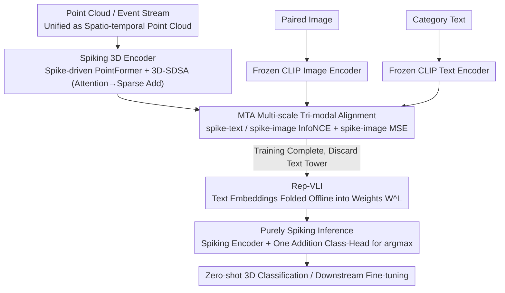

# SVL: Spike-based Vision-Language Pretraining for Efficient 3D Open-World Understanding

**Conference**: ICML 2026 Spotlight  
**arXiv**: [2505.17674](https://arxiv.org/abs/2505.17674)  
**Code**: Available (Noted in the paper as "Code is available at SVL")  
**Area**: 3D Vision / Multi-modal VLM / Spiking Neural Networks  
**Keywords**: Spiking Neural Networks, 3D Open-World Understanding, Vision-Language Pre-training, Tri-modal Alignment, Neuromorphic Hardware

## TL;DR
SVL injects open-world understanding into Spiking Neural Networks (SNNs) via "3D-Image-Text" tri-modal contrastive pre-training. By "reparameterizing" the text encoder into a set of classification weights, the inference stage becomes entirely free of the text tower, remaining purely spike-driven. It achieves 85.4% zero-shot classification on ModelNet40 while consuming only 0.5%–11% of the energy of equivalent ANN methods.

## Background & Motivation

**Background**: SNNs, characterized by event-driven processing and sparse addition, are considered naturally compatible low-power alternatives for 3D spatio-temporal perception (point clouds, event streams). Neuromorphic chips like Speck can achieve power consumption as low as 0.7 mW. However, compared to ANNs, SNNs are still at the stage of "training small individual models for specific tasks."

**Limitations of Prior Work**: Existing SNN pre-training routes have significant drawbacks—STDP initialization fails rapidly as network/data complexity increases; knowledge distillation methods like SpikeBert/SpikeCLIP rely on ANN weight initialization and use LayerNorm, which is unfriendly to neuromorphic hardware; SpikformerV2 / Spike-driven Transformer V3 use masked image modeling for scalability but are computationally expensive and lack multi-modal interfaces. Classic 3D VLMs (OpenShape, ULIP series) can perform open-world 3D classification, but must attach a large text encoder (tens to hundreds of millions of parameters) during inference, completely negating the power advantages of SNNs for edge deployment.

**Key Challenge**: The "low power + sparse addition" nature of SNNs fundamentally conflicts with the "large text tower + dense matrix multiplication" inference path of classic three-encoder VLMs. One must either sacrifice multi-modal capability for efficiency or sacrifice efficiency for zero-shot capability; the two are difficult to reconcile.

**Goal**: (i) Design a pre-training framework that can align 3D-image-text modalities "unsupervised" while remaining purely spike-driven; (ii) Eliminate the text encoder entirely during inference; (iii) Provide a truly "fully spiking" point cloud Transformer backbone for this framework.

**Key Insight**: CLIP has already aligned "image $\leftrightarrow$ text." Therefore, one only needs to align the spiking 3D encoder to CLIP's image space (fine-grained) and text space (semantic level) to leverage its power. Furthermore, in zero-shot tasks, the text encoder essentially computes embeddings for a fixed set of category prompts repeatedly. This means it can be "folded" offline into a $K \times C$ linear classification head, allowing the text tower to be discarded during deployment.

**Core Idea**: Use a tri-modal contrastive loss to align spiking 3D features to frozen CLIP image and text spaces (MTA), then reparameterize text embeddings as a classification weight layer (Rep-VLI), supported by a fully spiking point cloud Transformer (Spike-driven PointFormer). This achieves "multi-modal during training, purely spiking during inference."

## Method

### Overall Architecture
SVL addresses a seemingly contradictory requirement: enabling the Spiking Neural Network (SNN) with open-world recognition capabilities like CLIP without the burden of a heavy text tower during inference. The approach decouples "semantic acquisition" from "inference." During training, it uses three towers: point clouds and event streams are unified into a point set $D^t=\{\mathcal{P}, \mathcal{F}\}$ (event streams are normalized using a sliding window so that timestamps become z-coordinates $z_i = (t_i - t_{\min})/(t_{\max}-t_{\min})$). For each sample, a triplet $(D_i^t, I_i^t, T_i^t)$ is constructed and fed into the spiking 3D encoder $\mathcal{E}_\theta^S$ (outputting $\mathcal{F}^S \in \mathbb{R}^{T \times C}$) and the frozen CLIP image encoder $\mathcal{E}_\theta^I$ and text encoder $\mathcal{E}_\theta^T$ (outputting $\mathbb{R}^C$ features). Multi-modal alignment loss (MTA) pulls the spike firing rates into the CLIP image and text spaces. During deployment, the architecture collapses into a single tower: candidate category prompts are passed through the text encoder offline and solidified into a classification weight $W^L \in \mathbb{R}^{K \times C}$ (Rep-VLI). The inference path consists only of the "spiking encoder + a single addition-based classification head." For the backbone, the authors supplement Spike PointNet and E-3DSNN with a Spike-driven PointFormer, which compresses attention into sparse additions.

### Key Designs

**1. MTA — Multi-scale Tri-modal Alignment: Aligning spiking 3D features to CLIP image and text spaces without labels**

The challenge is that training an SNN 3D encoder from scratch lacks both labels and semantics. Since CLIP has already aligned image-text, SVL leverages this by only training the spiking encoder to align with frozen image/text features. MTA uses two complementary granularities of loss: after normalizing spike firing rates as $\mathbf{x}_i = (\mathcal{F}^S/T) / \|\mathcal{F}^S/T\|_2$, a symmetric InfoNCE $\mathcal{L}^{\text{NCE}}_{(S,T)}$ provides "semantic-level" alignment with normalized text features $\mathbf{y}_i$, and $\mathcal{L}^{\text{NCE}}_{(S,I)}$ provide "fine-grained" alignment with normalized image features $\mathbf{b}_i$. An additional MSE loss $\mathcal{L}^{\text{MSE}}_{(S,I)} = \sum_i \|\mathcal{F}_i^S - \mathcal{F}_i^I\|^2$ further refines the granularity. The weighted sum is:

$$\mathcal{L}_{\text{total}} = \lambda_1 \mathcal{L}^{\text{NCE}}_{(S,T)} + \lambda_2 \mathcal{L}^{\text{NCE}}_{(S,I)} + \lambda_3 \mathcal{L}^{\text{MSE}}_{(S,I)}, \quad \lambda_1=\lambda_2=\lambda_3=1$$

All three terms are necessary because text provides semantic anchors, images provide fine-grained shape priors, and MSE ensures point-to-point proximity of spike means to image embeddings.

**2. Rep-VLI — Offline folding of the text encoder into a classification weight layer**

In traditional three-encoder VLMs, the text tower often accounts for over 70% of total parameters (e.g., ULIP-2's text tower is 202.5M vs. the point encoder's 21.9M). Rep-VLI observes that in zero-shot tasks, the text encoder repeatedly computes embeddings for a fixed set of prompts. Thus, it can be computed once offline: $W^L_j = \tau \mathcal{E}_\theta^T(T_j)$ for $K$ candidate prompts. During inference, "spike count decision-making" replaces softmax:

$$\text{logits}_{i,j} = \frac{1}{T}\sum_{t=1}^T W^L_j \cdot \mathcal{E}_\theta^S(D_i^t)$$

By taking the argmax, the open-world semantic capability is "pre-stored" in the fixed weights, while the inference efficiency remains driven by the SNN.

**3. Spike-driven PointFormer + 3D-SDSA — Filling the gap for fully spiking point cloud Transformers**

Previous spiking point cloud backbones either mixed non-spiking operators or were limited by inductive biases. SVL introduces a Spike-driven PointFormer using FPS+kNN for local neighborhoods, pointwise embedding with I-LIF neurons $\mathcal{SN}(\cdot)$ for spike features $S = \mathcal{SN}(\text{MLP}(X))$, and $L$ layers of SDF residual blocks. The core 3D-SDSA reorders attention using the associative law:

$$\mathcal{SN}(Q_S(K_S^\top V_S)) = \mathcal{SN}((Q_S K_S^\top) V_S)$$

Since all multipliers are binary spike tensors, all matrix multiplications degrade into address-event accumulation (sparse addition).

### Loss & Training
The pre-training loss is the weighted sum of the three MTA terms with $\lambda_1=\lambda_2=\lambda_3=1$. I-LIF neurons fire integers during training and binary spikes during inference. CLIP encoders are frozen. The default time step configuration is $T\times D = 1\times 4$. For DVS tasks, $T$ is increased to 6.

## Key Experimental Results

### Main Results

Zero-shot 3D Classification on ModelNet40 / Objaverse-LVIS (Selected from Tab 1, "Energy" is the estimated energy for the full inference path):

| Type | Method | Params (M, Point+Text) | Energy (mJ) | Obj. | M40. |
|------|------|---------------------|-----------|------|------|
| ANN | OpenShape (Sparseconv-L) | 41.3+202.5 | 73.8 | 43.4 | 83.4 |
| ANN | ULIP-2 (Point-BERT) | 21.9+202.5 | 152.3 | 50.6 | 84.7 |
| ANN | ULIP (Point-BERT) | 21.9+227.8 | 161.8 | 34.9 | 69.6 |
| SNN | SpikeCLIP* | 9.5+22.8 | 11.0 | 0.5 | 5.1 |
| SNN | Spike PointNet + SVL | 3.57 | **0.27** | 24.9 | 76.3 |
| SNN | Spike-driven PointFormer-L + SVL | 22.1 | 9.4 | 43.4 | 83.1 |
| SNN | E-3DSNN-L + SVL | 17.7 | 0.64 | 43.9 | 84.6 |
| SNN | E-3DSNN-H + SVL | 46.7 | **0.79** | **47.0** | **85.4** |

Key comparison: E-3DSNN-H + SVL outperforms ULIP-2 (84.7%) and OpenShape (83.4%) at 85.4%, with energy consumption only $\sim$0.5% of ULIP-2 (0.79 mJ vs 152.3 mJ).

### Ablation Study

MTA Loss Terms (Tab 6, zero-shot accuracy on Obj. / M40, backbone E-3DSNN-S):

| $\mathcal{L}^{\text{NCE}}_{(S,T)}$ | $\mathcal{L}^{\text{NCE}}_{(S,I)}$ | $\mathcal{L}^{\text{MSE}}_{(S,I)}$ | Obj. | M40 | Description |
|:--:|:--:|:--:|------|-----|------|
| ✗ | ✗ | ✗ | 0.5 | 5.1 | No alignment (random init) |
| ✗ | ✓ | ✗ | 24.8 | 73.1 | Image alignment only |
| ✓ | ✗ | ✗ | 21.9 | 70.1 | Text alignment only |
| ✓ | ✓ | ✗ | 31.7 | 77.8 | Dual alignment |
| ✓ | ✓ | ✓ | **33.6** | **79.6** | Dual + MSE refinement |

### Key Findings
- **Image alignment is more critical than text**: Removing spike-text alignment dropped Obj. from 33.6 to 24.8 (−8.8), while removing spike-image alignment dropped it to 21.9 (−11.7). The shape priors inherent in CLIP's image space contribute more to 3D representation than text anchors.
- **MSE acts as a binder**: Adding MSE on top of InfoNCE dual alignment increased Obj. by +1.9, indicating that MSE forces the global alignment to be "locked" point-to-point.
- **Increasing firing bits is more efficient than increasing time steps**: The configuration $T=1, D=4$ (0.04 mJ) performed better and more efficiently than $T=4, D=1$ (0.10 mJ). Compressing information into fewer, "stronger" spikes is more energy-efficient than stretching the time axis.

## Highlights & Insights
- **Reparameterizing the text encoder is the primary engineering insight**: It transforms the VLM from a symmetric dual-tower structure into a "three-tower training, single-tower inference" model. This is particularly suitable for hardware-constrained edge IoT or medical wearables.
- **Freezing CLIP + training only the 3D encoder** is significantly cheaper than joint training from scratch. It decouples "acquiring open-world semantics" from "acquiring 3D geometry."
- **3D-SDSA utilizes the 0/1 property of $Q_S K_S^\top$ matrices** to reduce Transformer attention to sparse accumulation, a concept applicable to all naturally sparse modalities like event cameras or LiDAR.

## Limitations & Future Work
- **Dependence on CLIP biases**: Freezing CLIP means the 3D space is "bound" to the semantic structure of 2D CLIP. Biases against certain categories will be transmitted to the 3D side.
- **Zero-shot focus is currently on single-object classification**: Benchmarks like Obj./M40 use clean, single-instance data. Scene-level zero-shot segmentation remains challenging (e.g., 15.6% mIoU on SemanticKITTI).
- **LLM-pipeline energy coverage**: The 3D object description/QA section uses an LLM (e.g., Vicuna) whose power consumption was not included in the inference calculation.
- **Rep-VLI assumes fixed categories**: If new categories appear after deployment, the text encoder must be rerun.

## Related Work & Insights
- **vs OpenShape / ULIP-2**: These methods require a large text tower during inference (~70 mJ). SVL uses Rep-VLI to achieve 100x+ energy efficiency with comparable accuracy.
- **vs SpikeCLIP**: SpikeCLIP distills CLIP into an SNN for 2D classification (0.5% on Obj.). SVL addresses 3D inputs and reaches 47% on Obj.
- **vs E-3DSNN**: SVL adds a pre-training interface to E-3DSNN, increasing ScanObjectNN performance by 2.8%, proving that general pre-training is effective for SNN backbones.

## Rating
- Novelty: ⭐⭐⭐⭐ (First end-to-end SNN open-world 3D framework).
- Experimental Thoroughness: ⭐⭐⭐⭐ (Extensive downstream tasks, though scene-level metrics are weak).
- Writing Quality: ⭐⭐⭐⭐ (Clear structure and rigorous mathematical definitions).
- Value: ⭐⭐⭐⭐⭐ (Successfully bridges open-world VLMs and neuromorphic hardware).

<!-- RELATED:START -->

## Related Papers

- [\[CVPR 2026\] LightSplat: Fast and Memory-Efficient Open-Vocabulary 3D Scene Understanding in Five Seconds](../../CVPR2026/3d_vision/lightsplat_fast_and_memory-efficient_open-vocabulary_3d_scene_understanding_in_f.md)
- [\[ECCV 2024\] SceneVerse: Scaling 3D Vision-Language Learning for Grounded Scene Understanding](../../ECCV2024/3d_vision/sceneverse_scaling_3d_vision-language_learning_for_grounded_scene_understanding.md)
- [\[CVPR 2026\] Scenes as Tokens: Multi-Scale Normal Distributions Transform Tokenizer for General 3D Vision-Language Understanding](../../CVPR2026/3d_vision/scenes_as_tokens_multi-scale_normal_distributions_transform_tokenizer_for_genera.md)
- [\[ICCV 2025\] 3D Gaussian Map with Open-Set Semantic Grouping for Vision-Language Navigation](../../ICCV2025/3d_vision/3d_gaussian_map_with_openset_semantic_grouping_for_visionlan.md)
- [\[ICLR 2026\] EgoNight: Towards Egocentric Vision Understanding at Night with a Challenging Benchmark](../../ICLR2026/3d_vision/egonight_towards_egocentric_vision_understanding_at_night_with_a_challenging_ben.md)

<!-- RELATED:END -->
