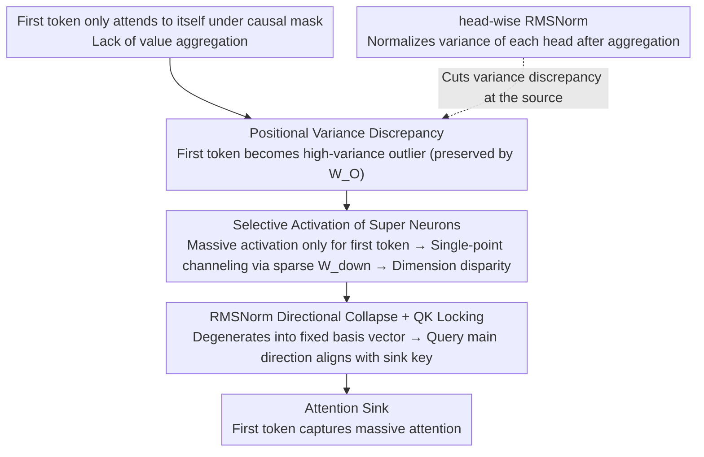

# The Structural Origin of Attention Sink: Variance Discrepancy, Super Neurons, and Dimension Disparity

**Conference**: ICML 2026  
**arXiv**: [2605.06611](https://arxiv.org/abs/2605.06611)  
**Code**: None  
**Area**: Interpretability / Transformer Mechanism / LLM Optimization  
**Keywords**: attention sink, variance discrepancy, super neurons, dimension collapse, head-wise RMSNorm

## TL;DR
This paper reveals the structural root of "attention sinking to the first token" in LLMs: the lack of value aggregation for the first token under causal masking leads to variance discrepancy, which is selectively amplified by super neurons in the FFN to form extreme dimensional disparity, eventually locking QK projections to force attention sinks. Based on this, head-wise RMSNorm is proposed to suppress sinks from the root during the pre-training stage.

## Background & Motivation

**Background**: Attention sink (the phenomenon where the first token in decoder-only Transformers mysteriously captures massive attention scores) is a universal phenomenon in GPT/LLaMA-class models. It is both utilized (KV cache compression in StreamingLLM) and criticized (causing activation outliers, representation collapse, and low-bit quantization difficulties). Previous explanations include Softmax needing to "receive residual probability mass," byproducts of position encoding, or spectral subspace issues (Xiao et al. 2023, Yan et al. 2024, Cancedda 2024).

**Limitations of Prior Work**: These explanations are either phenomenological (stating "Softmax needs a sink") or only cover partial cases (position encoding theory cannot explain why sinks appear suddenly at Layer 2 rather than Layer 0). None fully answer the chain of phenomena: **"Why specifically the first token, why at specific layers, and why does the norm suddenly explode?"**

**Key Challenge**: The authors find that the onset of attention sink is a **structural invariant**—in Llama-2, regardless of input, the sink consistently appears at Layer 2, accompanied by a synchronous surge in the $\ell_2$-norm of the first token's representation. This suggests the sink is not an emergent property but is inevitably triggered by a **deterministic causal chain** at a fixed layer, yet the nature of this chain and whether it can be intervened upon remained unclear.

**Goal**: To fully map the three-stage causal chain from "token-level statistical differences → neuron-level amplification in FFN → locking of attention patterns," and verify causality through controlled experiments at each stage.

**Key Insight**: Start with the **positional asymmetry** of value aggregation—under causal masking, the first token $i=0$ can only attend to itself ($a_{0,0}=1$), while subsequent tokens perform a convex combination of $i+1$ vectors. Variance naturally decays monotonically, making the first token a natural variance outlier. This simple observation is the source of the entire chain.

**Core Idea**: Attention sink = **Variance Discrepancy (introduced by value aggregation) → Selective Activation of Super Neurons (FFN amplification) → Dimension Disparity (sparse channeling in down-projection) → QK Locking (RMSNorm projecting the first token to a fixed direction)**. Once this chain is understood, variance discrepancy can be suppressed at the source using head-wise RMSNorm.

## Method

### Overall Architecture
The authors first perform "phenomenon diagnosis" (Sec 3), proving Layer 2 onset and synchronous norm surge. Then, "causal localization" (Sec 4.1-3.2) proves value aggregation introduces positional variance discrepancy and replicates sinks at **arbitrary positions** using two controlled interventions (mask intervention and variable amplification). This is followed by "propagation chain analysis" (Sec 4), tracing how variance discrepancy is preserved by $\mathbf{W}_O$, triggers super neurons, forms dimension disparity via sparse $\mathbf{W}_{\text{down}}$, and finally degrades into a single basis vector via RMSNorm to lock QK into a sink. Finally, "engineering intervention" (Sec 5) proposes head-wise RMSNorm to suppress variance discrepancy at the root.

### Key Designs

**1. Positional Variance Discrepancy: Pinning "Why specifically the first token" to the value aggregation step**

The source of the causal chain must explain why the first token is always "favored." Using fully random token sequences (excluding BOS bias) on Llama-2-7B, the authors measured dimension-wise variance after value aggregation in Layer 1. They found the variance at position 0 is much higher than others and decays monotonically with position. The reason is simple: under causal masking, the first token only attends to itself ($a_{0,0}=1$), while subsequent tokens perform a convex combination of $i+1$ value vectors, which naturally smooths variance. Only the first token remains un-averaged, becoming a natural high-variance outlier. To establish causality: (a) **Mask Intervention**—changing the mask of the $k$-th token to attend only to itself transforms $k$ into a new sink. (b) **Variance Amplification**—directly amplifying variance at any position using $\mathbf{o}_k'^{(l)}=\boldsymbol{\mu}^{(l)}+\lambda\cdot(\mathbf{o}_k^{(l)}-\boldsymbol{\mu}^{(l)})$ ($\lambda>1$) creates a sink out of thin air. Crucially, simply scaling the norm $\lambda\cdot\mathbf{o}_k$ **does not** create a sink, cleanly isolating variance as the root cause rather than magnitude.

**2. Selective Activation of Super Neurons: Variance discrepancy is exponentially amplified by a few neurons in FFN**

This step explains how token-level statistical differences are translated into parameter-level geometric collapse. For SwiGLU $\text{FFN}(\mathbf{x})=(\text{SiLU}(\mathbf{x}\mathbf{W}_{\text{gate}})\odot \mathbf{x}\mathbf{W}_{\text{up}})\mathbf{W}_{\text{down}}$, the authors found a tiny number of column vectors in $\mathbf{W}_{\text{gate}}$/$\mathbf{W}_{\text{up}}$ with extremely large norms (super neurons). Tracking their response, $\cos(\mathbf{x}_{\text{norm}}, \mathbf{w}_{\text{gate}}^{(index)})$ is high for the first token but near 0 for others. Thus, super neurons "open the gate" almost **exclusively for the first token**, outputting massive activation. Subsequently, the corresponding row in $\mathbf{W}_{\text{down}}$ is **heavy-tailed and sparse**—most dimensions are near 0, but specific ones (e.g., dim 2533) are huge, channeling the massive activation into those outlier dimensions. The Dominance Ratio $\text{DomRatio}(\mathbf{h}_0)=\max_j|\mathbf{h}_{0,j}|/(\frac{1}{d}\sum_k|\mathbf{h}_{0,k}|)$ quantifies this, soaring to 200+ in shallow layers. This also explains the fixed layer onset (Layer 2): super neurons are fixed structures learned during pre-training, and variance discrepancy must accumulate across layers to trigger them.

**3. RMSNorm Directional Collapse + QK Locking: Why dimension disparity translates to attention lock-in**

The final link closes the chain. When $\mathbf{x}_0$ has an overwhelmingly large value $\lambda$ in dimension $c$, the RMSNorm normalization constant is dominated by $\lambda$. The output is compressed into a fixed basis vector direction: $\text{RMSNorm}(\mathbf{x}_0)\approx \text{sgn}(\lambda)\sqrt{d}\gamma_c\cdot\mathbf{e}_c$. After key projection, $\mathbf{k}_0^{(h)}\approx\pm\sqrt{d}\cdot(\mathbf{W}_K^{(h)})_{c,:}$ degenerates into the $c$-th row of $\mathbf{W}_K$—the first token's key is locked to a fixed direction independent of input content. Using SVD to extract the primary direction $\mathbf{u}_1^{(h)}$ of the query matrix, the authors found its cosine alignment with $\mathbf{k}_0^{(h)}$ is high, and QK dot products for these heads are positive across **all** tokens (positive ratio ~100%). Queries structurally point to the sink key, forcing high attention scores regardless of the current token.

### Loss & Training
**Head-wise RMSNorm Intervention** (Sec 5.1): Apply RMSNorm to each head output after value aggregation but before output projection $\mathbf{W}_O$: $\hat{\mathbf{o}}_t^{(h)}=\frac{\mathbf{o}_t^{(h)}}{\text{RMS}(\mathbf{o}_t^{(h)})}\odot \boldsymbol{\lambda}$, where $\boldsymbol{\lambda}\in\mathbb{R}^{d_k}$ is a learnable scaling vector shared across heads. This ensures: (i) variance of aggregated vectors is normalized across positions, and (ii) contributions of low-entropy (high variance) and high-entropy (low variance) heads to the residual flow are balanced. Verified by pre-training a 152M parameter model on 20B tokens of OpenWebText.

## Key Experimental Results

### Main Results: Comparison of Three Architectures (Llama-2 config, mean of 4 seeds)

| Metric | Baseline (Softmax) | Sigmoid Attention | **Ours (HeadNorm)** |
|------|---------------------|-------------------|---------------------|
| Train Loss ↓ | 2.7483 ± 0.0118 | — | **2.7073 ± 0.0095** |
| Validation Loss ↓ | 2.7812 ± 0.0109 | (Slower & Higher) | **2.7421 ± 0.0066** |
| Effective Rank ↑ (Layer mean) | 343.71 ± 15.63 | High | **445.96 ± 5.37** |
| Dimension Disparity ↓ (Layer mean) | 82.67 ± 8.09 | Low | **33.74 ± 2.73** |
| Attention Sink Eliminated? | No (from Layer 5) | Yes | **Yes** |

### Ablation Study

| Experiment | Phenomenon | Conclusion |
|------|------|------|
| Mask block at $k=10$ | $k$ immediately becomes sink | Variance discrepancy is the causal start |
| Variance amplify $\lambda\uparrow$ at $k=10$ | sink score rises monotonically | Strong evidence for causality |
| Scale norm $\lambda\cdot \mathbf{o}_k$ (control) | No sink appears | Ruling out magnitude as the root cause |
| $\mathbf{W}_O$ Kendall $\tau$ vs $\boldsymbol{\sigma}_{in}$ | Mean 0.32 (Positive bias) | $\mathbf{W}_O$ structurally amplifies variance |
| After RMSNorm on Layer 2 outlier dim 2533 | DomRatio 262.88× | Direction almost entirely collapses to $\mathbf{e}_{2533}$ |

### Key Findings
- **Sigmoid attention eliminates sinks but performs worse**: Confirms variance discrepancy as the root cause while showing that simple activation replacement isn't a free lunch—$\sigma$ output magnitude scales with sequence length, introducing instability.
- **HeadNorm eliminates sinks and accelerates convergence**: An empirical bonus where variance normalization improves optimization landscape conditioning, allowing AdamW to descend on a flatter surface.
- **Effective rank increased from 343 → 446**: Sinks are not just an attention phenomenon; they are accompanied by manifold collapse in hidden states. HeadNorm restores representation capacity.
- **Super neurons are learned structures**: Their positions are fixed after pre-training (e.g., index 7890), and they correspond to sparse rows in $\mathbf{W}_{\text{down}}$, providing a root cause for outlier handling in low-bit quantization.

## Highlights & Insights
- **Three-stage causal chain + controlled interventions**: Transforms attention sink from an "empirical phenomenon" into a "fixable engineering problem." The mask and variance amplification experiments are elegant and conclusive.
- **HeadNorm is an elegant and low-cost solution**: A single line of code (RMSNorm + learnable $\boldsymbol{\lambda}$) that doesn't change attention math or Softmax. It is easily integrated into existing LLaMA-style pre-training pipelines.
- **Unified perspective on Super Neurons + sparse down-projection**: Unifies attention sinks, activation outliers, quantization difficulties, and representation collapse under the same FFN structural explanation.

## Limitations & Future Work
- Intervention experiments primarily focused on Llama-2-7B. While other open-source LLMs were verified in the appendix, they belong to the same architecture family (decoder-only + SwiGLU + RMSNorm). Generalization to LayerNorm or DeepNorm is not fully tested.
- Pre-training verification for HeadNorm was limited to 152M parameters / 20B tokens. Scaling law trends to 7B+ are not guaranteed.
- Impact on downstream long-context performance (especially methods like StreamingLLM that depend on sinks for KV compression) was not analyzed.
- Future work could explore "Mixture-of-Norm," deciding where and when to normalize dynamically based on head behavior.

## Related Work & Insights
- **vs Xiao et al. 2023 (StreamingLLM)**: They discovered sinks and used them for compression; this paper digs deeper to show sinks are avoidable structural artefacts. The works are complementary.
- **vs Cancedda 2024 (spectral subspace)**: While Cancedda explains sinks via QK spectral subspaces, this paper explains *why* the subspace behaves that way—RMSNorm projecting the first token to specific rows of $\mathbf{W}_K$.
- **vs Liu et al. 2024 (activation outliers)**: This paper proves outliers and sinks share a common root (super neurons + sparse down-proj), suggesting that solving sinks inherently mitigates quantization challenges.

## Rating
- Novelty: ⭐⭐⭐⭐⭐ The three-stage causal chain and super neuron perspective provide a genuinely new explanation.
- Experimental Thoroughness: ⭐⭐⭐⭐⭐ Controlled interventions and multi-LLM replication (appendix) are very solid.
- Writing Quality: ⭐⭐⭐⭐⭐ The progression from phenomenon to hypothesis to verification to fix is exceptionally clear.
- Value: ⭐⭐⭐⭐ HeadNorm is immediately applicable, and the mechanism offers insights for quantization and long-context research.

<!-- RELATED:START -->

## Related Papers

- [\[ICLR 2026\] Spiking Discrepancy Transformer for Point Cloud Analysis](../../ICLR2026/3d_vision/spiking_discrepancy_transformer_for_point_cloud_analysis.md)
- [\[ICLR 2026\] Reducing Class-Wise Performance Disparity via Margin Regularization](../../ICLR2026/3d_vision/reducing_class-wise_performance_disparity_via_margin_regularization.md)
- [\[CVPR 2026\] Dynamic-Static Decomposition for Novel View Synthesis of Dynamic Scenes with Spiking Neurons](../../CVPR2026/3d_vision/dynamic-static_decomposition_for_novel_view_synthesis_of_dynamic_scenes_with_spi.md)
- [\[CVPR 2026\] Beyond Geometry: Artistic Disparity Synthesis for Immersive 2D-to-3D](../../CVPR2026/3d_vision/beyond_geometry_artistic_disparity_synthesis_for_immersive_2d-to-3d.md)
- [\[AAAI 2026\] Arbitrary-Scale 3D Gaussian Super-Resolution](../../AAAI2026/3d_vision/arbitrary-scale_3d_gaussian_super-resolution.md)

<!-- RELATED:END -->
