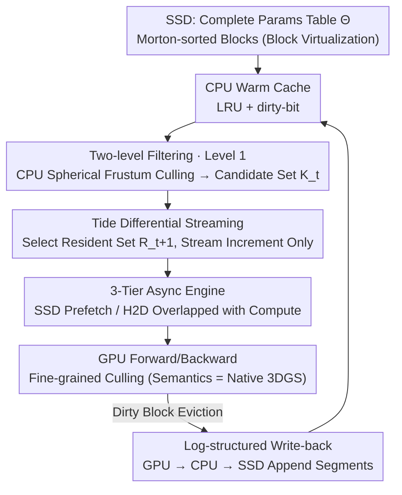

# TideGS: Scalable Training of Over One Billion 3D Gaussian Splatting Primitives via Out-of-Core Optimization

**Conference**: ICML 2026 Spotlight  
**arXiv**: [2605.20150](https://arxiv.org/abs/2605.20150)  
**Code**: To be confirmed  
**Area**: 3D Vision / 3D Gaussian Splatting / System Optimization  
**Keywords**: 3DGS, out-of-core, SSD-CPU-GPU three-tier storage, visibility sparsity, trajectory differential streaming

## TL;DR
TideGS moves the 3DGS parameter table to SSD, virtualizes it into "blocks," and uses GPU VRAM as a cache for the frustum-visible working set. Coupled with a three-tier asynchronous pipeline and trajectory-adaptive differential streaming, it successfully scales trainable Gaussians from ~11M (native 3DGS) / 105M (CLM) to **over 1 billion** on a single 24 GB GPU for the first time, achieving reconstruction quality superior to all evaluated single-card baselines for large-scale scenes.

## Background & Motivation

**Background**: 3D Gaussian Splatting (3DGS) has become the mainstream explicit representation for neural radiance fields. Each Gaussian point carries a set of learnable parameters, and real-time rasterization is achieved via splatting. Compared to implicit representations like NeRF, 3DGS places model capacity directly into a "primitive table"—theoretically, more Gaussians lead to finer reconstruction, but at the cost of extreme VRAM pressure.

**Limitations of Prior Work**: Under standard SH-degree-3 configurations, each Gaussian has $D=59$ fp32 parameters. Including gradients and Adam first/second moments, the required storage is approximately 8× the parameter size. A scene with 100 million Gaussians requires ~90 GB, significantly exceeding the 24 GB limit of commercial consumer GPUs. In practice, native 3DGS peaks at ~11.5M Gaussians on a 24 GB card, ZeRO-Offload style Naive Offload hits a wall at ~50M (due to the need to move all parameters to GPU for rasterization), and even CLM (which offloads SH coefficients to CPU) only reaches ~105M before the radix-sort buffer exhausts the VRAM.

**Key Challenge**: 3DGS ties model capacity to GPU VRAM, yet **the number of Gaussians actually accessed per iteration is extremely low**. In city-scale scenes like MatrixCity BigCity, an average of only 0.39% Gaussians are activated per viewpoint (1.06% in the worst case), indicating massive visibility sparsity. Furthermore, adjacent camera frustums overlap significantly, showing strong temporal locality in the active set. Keeping all parameters permanently in VRAM is highly inefficient.

**Goal**: (i) Break the "permanent VRAM residency" constraint by treating VRAM as a cache for the current working set; (ii) Expand the storage hierarchy from GPU↔CPU to SSD, enabling billion-scale training on a single consumer GPU; (iii) Maintain consistency in forward/backward semantics and final reconstruction quality with native 3DGS.

**Key Insight**: Treat 3DGS training as **sparse embedding-table training**—stream only the "rows used in the current batch" to the GPU while keeping the rest on CPU/SSD. Given the low bandwidth and high latency of SSDs, a naive offload would fail; thus, a combination of "block alignment + asynchronous pipeline + differential streaming" is required.

**Core Idea**: Use "blocks" as the unified unit for storage, caching, and transmission, leveraging Morton sorting to preserve spatial locality. Use coarse-grained frustum culling on the CPU to determine which blocks enter the GPU. Implement **trajectory-adaptive differential streaming**—transmitting only the increment $\mathcal{S}_t^+ = \mathcal{R}_{t+1} \setminus \mathcal{R}_t$ between the resident sets of adjacent iterations—ensuring the cross-tier traffic scales with the "change in working set" rather than the "model size."

## Method

### Overall Architecture
The core problem TideGS solves is decoupling model capacity from GPU memory by treating VRAM as a cache for the working set. It builds an out-of-core training system based on a three-tier SSD-CPU-GPU storage hierarchy. The complete parameter table $\Theta \in \mathbb{R}^{N \times D}$ ($D=59$) resides on SSD in **blocks**. CPU DRAM maintains a warm LRU cache with dirty bits, and GPU VRAM stores only the **capacity-constrained resident set** $\mathcal{R}_t$ required for current rasterization.

The training step is a pipeline: first, block-level frustum culling is performed on the CPU for the camera batch to obtain the candidate working set $\mathcal{K}_t$; then, asynchronous prefetching moves missing blocks from SSD/CPU to VRAM; next, standard 3DGS forward/backward passes are executed on the GPU with full semantic parity; finally, evicted dirty blocks are asynchronously moved back to the CPU cache, and eventually flushed to SSD in bulk. Culling, ingestion, and eviction are handled via independent CUDA streams and I/O threads to overlap with computation.

### Key Designs

**1. Block Virtualization + Two-level Filtering: Converting random Gaussian access to coarse-grained I/O and pre-filtering invisible blocks.**

SSDs struggle with scattered random reads; peak bandwidth requires large, aligned access. TideGS sorts Gaussians by the Morton code of their centers and partitions them into contiguous blocks of size $B=4096$. Each block occupies $4096 \times 59 \times 4$ B ≈ 944 KiB, aligning naturally with filesystem/page cache granularities and transforming random reads into sequential access at ~3.3 GB/s. Each block is represented by a bounding sphere $(\mathbf{c}_k, r_k)$ for coarse visibility testing.

The filtering occurs in two stages: Level 1 on the CPU performs 6-plane frustum-sphere culling for the camera batch $\mathcal{B}_t$ to derive the candidate set $\mathcal{K}_t = \bigcup_{c \in \mathcal{B}_t}\{k \mid \mathrm{visible}(k, c)\}$. Level 2 on the GPU performs standard 3DGS fine-grained culling on the resident Gaussians to get the actual contribution set $\mathcal{I}_t$. This preserves local spatial continuity and **maintains the exact rendering semantics of native 3DGS**.

**2. Three-tier Async Engine + Log-structured Write-back: Maintaining GPU utilization under high-latency SSD backends.**

To avoid stalling the GPU due to SSD latency, TideGS overlaps (i) SSD prefetch, (ii) H2D ingestion, (iii) GPU computation, and (iv) D2H eviction + SSD flush using dedicated I/O threads and CUDA streams. A double-buffering mechanism moves the increment $\mathcal{S}_t^+$ for the next iteration while the current one is being computed.

For write-backs, TideGS uses an append-only segment structure on SSD to avoid random write amplification. Updated blocks are appended to a patch segment during cache flushes. An index table $\mathrm{Index}[k] = (\mathrm{file\_id}, \mathrm{offset}, \mathrm{size}, \mathrm{version})$ tracks the latest version. This transforms "in-place overwrites" into "sequential appends." Dirty blocks stay in the CPU warm cache until eviction, ensuring that frequently updated "hot" blocks do not trigger expensive disk I/O.

**3. Tide: Trajectory-adaptive Differential Streaming—exploiting workset overlap to minimize cross-tier traffic.**

Even with culling, re-transmitting $\mathcal{K}_t$ every step generates heavy PCIe traffic. By sorting camera sequences via TSP clustering, TideGS maximizes working set overlap between adjacent iterations. For each step, it selects the next resident set $\mathcal{R}_{t+1}$ from the candidate pool $\mathcal{C}_t = \mathcal{R}_t \cup \mathcal{K}_{t+1}$ based on a scoring function:

$$s(k) = \lambda \cdot \mathbf{1}[k \in \mathcal{K}_{t+1}] + (1-\lambda) \cdot \mathrm{Recency}(k)$$

If the candidate set exceeds VRAM capacity ($|\mathcal{K}_{t+1}| > C$), a camera-balanced Top-$C$ selection is used to ensure view coverage. TideGS then only transfers the set difference $\mathcal{S}_t^+ = \mathcal{R}_{t+1} \setminus \mathcal{R}_t$. Optimizer states are instantiated only for resident blocks and reset upon eviction, effectively trading "transient moment states" for "reduced VRAM footprint and PCIe traffic."

### Loss & Training
The system uses native 3DGS photometric loss, SH-3 representation, and the Adam optimizer with a block size $B=4096$. Morton sorting and initial base segment writes are one-time preprocessing steps, taking ~21.2 minutes for 1.1B Gaussians (<0.5% of total training time).

## Key Experimental Results

### Main Results

Scalability boundary (Maximum trainable Gaussians on a 24 GB GPU):

| Method | VRAM Complexity | Limiting Factor | $N_{\max}$ |
|------|------|------|------|
| Native 3DGS | $O(N)$ | Resides in VRAM | ~11.5M |
| Naive Offload | $O(N)$ | Per-step Params (SH) | ~50M |
| CLM | $O(N)$ | Rasterization buffer | ~105M |
| **TideGS (Ours)** | $O(\|\mathcal{R}_t\|)$ | Resident set budget | **>1B** |

MatrixCity Throughput and Traffic:

| Method | Scale $N$ | Backend | PCIe (GB/iter) ↓ | GPU Util (%) ↑ | Iter (ms) ↓ |
|------|------|------|------|------|------|
| Naive Offload | ~102M | DRAM | — OOM — | — | — |
| CLM | ~102M | DRAM | 0.41 | 37.0 | 100.8 |
| **TideGS** | ~102M | NVMe SSD | **0.10** | 43.3 | **90.7** |
| **TideGS** | ~1.1B | NVMe SSD | 0.97 | 49.5 | 525.6 |

Quality alignment: TideGS achieves 28.92 dB PSNR on Mip-NeRF 360 vs. 29.03 dB for native 3DGS (a negligible 0.11 dB difference). On MatrixCity, scaling to 1.1B Gaussians increases PSNR to **26.1 dB**, whereas CLM OOMs at 25.0 dB (~102M).

### Ablation Study

| Configuration | Iter (ms) ↓ | PCIe (GB/iter) ↓ | CPU Cache Hit (%) ↑ |
|------|------|------|------|
| Full TideGS | **90.7** | **0.10** | **95.2** |
| w/o Tide (Diff. Stream) | 145.3 | 0.85 | 95.2 |
| w/o Overlap (Async Pipe) | 210.5 | 0.10 | 95.2 |
| w/o Morton (Locality) | 115.8 | 0.45 | 42.1 |

### Key Findings
- **Differential streaming is the primary traffic reducer**: Disabling Tide increases PCIe traffic by 8.5×, nearly doubling iteration time.
- **Asynchronous pipelining is the primary latency hider**: Removing overlap spikes iteration time from 90.7 ms to 210.5 ms.
- **Morton sorting is vital for CPU caching**: Random block layouts drop the hit rate from 95.2% to 42.1% and increase PCIe traffic by 4.5×.

## Highlights & Insights
- **Analogy to Sparse Embeddings**: Borrowing established mechanisms from industrial recommendation system training (LRU, dirty-bit, log-structured writes) and applying them to 3DGS is a powerful architectural insight.
- **System-driven Modeling Choices**: Using TSP clustering for camera sequences rather than random shuffling is a deliberate system-level optimization that sacrifices i.i.d. sampling for an 8.5× reduction in PCIe traffic.
- **Visibility as a Lever**: The observation that only 0.39% of data is needed per view allows for an "out-of-core" leverage that decouples total parameters from hardware limits.
- **Cold-start Optimizer States**: Resetting moments upon eviction is a bold trade-off that significantly reduces VRAM footprint with minimal impact on convergence for spatial models.

## Limitations & Future Work
- **Trajectory Dependency**: Benefits of differential streaming rely on smooth camera movement. Random viewpoint sampling (e.g., in some style transfer tasks) would degrade performance.
- **Fixed Block Assignment**: If Gaussians drift significantly, bounding spheres grow larger, reducing culling efficiency. Periodic re-blocking may be necessary for very long training runs.
- **SSD Dependency**: Performance requires high-end NVMe SSDs; SATA or QLC drives may introduce bottlenecks not fully explored.

## Related Work & Insights
- **vs CLM**: While CLM offloads SH coefficients to CPU, TideGS offloads everything to SSD, lowering PCIe traffic by 4× and pushing limits by an order of magnitude.
- **vs Multi-GPU 3DGS**: Systems like RetinaGS use horizontal scaling (more VRAM). TideGS provides a vertical storage alternative, making billion-scale training accessible on single-card workstations.

## Rating
- Novelty: ⭐⭐⭐⭐ (While individual components exist in systems literature, the holistic integration for 3DGS is novel).
- Experimental Thoroughness: ⭐⭐⭐⭐⭐ (Comprehensive coverage of quality, scalability, and system metrics).
- Writing Quality: ⭐⭐⭐⭐ (Logical flow and clear system/modeling trade-offs).
- Value: ⭐⭐⭐⭐⭐ (A major leap in accessibility for large-scale 3D reconstruction).

## Related Papers

- [\[ICCV 2025\] A Unified Interpretation of Training-Time Out-of-Distribution Detection](../../ICCV2025/3d_vision/a_unified_interpretation_of_training-time_out-of-distribution_detection.md)
- [\[CVPR 2026\] Off The Grid: Detection of Primitives for Feed-Forward 3D Gaussian Splatting](../../CVPR2026/3d_vision/off_the_grid_detection_of_primitives_for_feed-forward_3d_gaussian_splatting.md)
- [\[CVPR 2026\] FastGS: Training 3D Gaussian Splatting in 100 Seconds](../../CVPR2026/3d_vision/fastgs_training_3d_gaussian_splatting_in_100_seconds.md)
- [\[CVPR 2026\] Faster-GS: Analyzing and Improving Gaussian Splatting Optimization](../../CVPR2026/3d_vision/faster-gs_analyzing_and_improving_gaussian_splatting_optimization.md)
- [\[CVPR 2026\] 3D sans 3D Scans: Scalable Pre-training from Video-Generated Point Clouds](../../CVPR2026/3d_vision/3d_sans_3d_scans_scalable_pre-training_from_video-generated_point_clouds.md)

<!-- RELATED:END -->

<!-- RELATED:START -->

## Related Papers

- [\[ICML 2026\] Revisiting Photometric Ambiguity for Accurate Gaussian-Splatting Surface Reconstruction](revisiting_photometric_ambiguity_for_accurate_gaussian-splatting_surface_reconst.md)
- [\[CVPR 2026\] Off The Grid: Detection of Primitives for Feed-Forward 3D Gaussian Splatting](../../CVPR2026/3d_vision/off_the_grid_detection_of_primitives_for_feed-forward_3d_gaussian_splatting.md)
- [\[ICML 2026\] SplAttN: Bridging 2D and 3D with Gaussian Soft Splatting and Attention for Point Cloud Completion](splattn_bridging_2d_and_3d_with_gaussian_soft_splatting_and_attention_for_point_.md)
- [\[CVPR 2026\] FastGS: Training 3D Gaussian Splatting in 100 Seconds](../../CVPR2026/3d_vision/fastgs_training_3d_gaussian_splatting_in_100_seconds.md)
- [\[CVPR 2026\] 3D sans 3D Scans: Scalable Pre-training from Video-Generated Point Clouds](../../CVPR2026/3d_vision/3d_sans_3d_scans_scalable_pre-training_from_video-generated_point_clouds.md)

<!-- RELATED:END -->
