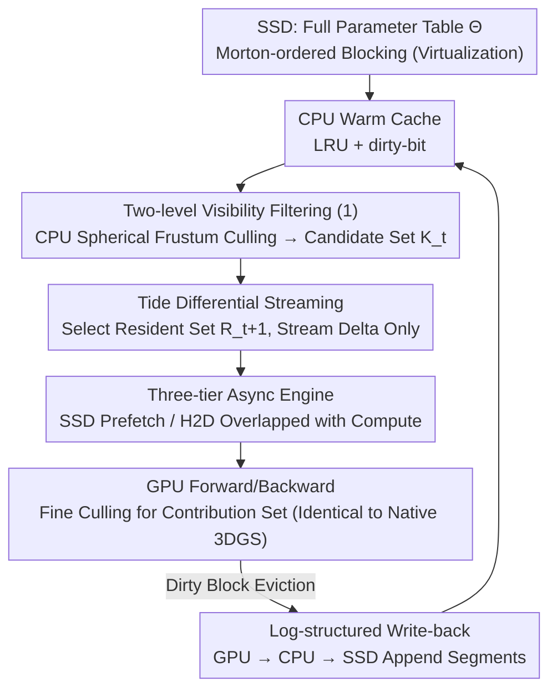

# TideGS: Scalable Training of Over One Billion 3D Gaussian Splatting Primitives via Out-of-Core Optimization

**Conference**: ICML 2026 Spotlight  
**arXiv**: [2605.20150](https://arxiv.org/abs/2605.20150)  
**Code**: To be confirmed  
**Area**: 3D Vision / 3D Gaussian Splatting / System Optimization  
**Keywords**: 3DGS, out-of-core, SSD-CPU-GPU tiered storage, visibility sparsity, trajectory differential streaming  

## TL;DR
TideGS migrates the 3DGS parameter table to an SSD, virtualizing it into "blocks" while utilizing GPU VRAM as a cache for the view-frustum visibility working set. Coupled with a three-stage asynchronous pipeline and trajectory-adaptive differential streaming, it pushes the scale of trainable Gaussians from approximately 11M (native 3DGS) or 105M (CLM) to **over 1 billion** on a single 24 GB GPU, achieving large-scene reconstruction quality superior to all evaluated single-GPU baselines.

## Background & Motivation

**Background**: 3D Gaussian Splatting (3DGS) has become a dominant explicit representation for neural rendering, where each Gaussian point carries a set of learnable parameters for real-time rasterization. Compared to implicit representations like NeRF, 3DGS moves model capacity directly into a "primitive table"—more Gaussians theoretically allow for finer reconstruction, but at the cost of significantly higher VRAM pressure.

**Limitations of Prior Work**: Under a standard SH-degree-3 configuration, each Gaussian has $D=59$ fp32 parameters. Including gradients and Adam first/second moments, approximately 8× the storage space is required. A scene with 100 million Gaussians would require ~90 GB, far exceeding the 24 GB limit of commercial consumer GPUs. Empirically, native 3DGS on a 24 GB card reaches its limit at ~11.5M Gaussians. ZeRO-Offload-style Naive Offload reaches ~50M (due to the need to move all parameters to the GPU for rasterization), and CLM (offloading SH coefficients to the CPU) manages ~105M before the radix-sort buffer consumes all remaining VRAM.

**Key Challenge**: 3DGS ties model capacity to GPU VRAM, yet **the number of Gaussians actually accessed during a single iteration is extremely low**. In urban-scale scenes like MatrixCity BigCity, an average of only 0.39% of Gaussians are activated per view (1.06% in the worst case), indicating significant visibility sparsity. Furthermore, view frustums of adjacent cameras overlap heavily, showing strong temporal locality in the active sets. Permanently storing all parameters in VRAM is therefore highly inefficient.

**Goal**: (i) Break the "VRAM residence" constraint by treating VRAM as a cache for the current working set; (ii) extend the storage hierarchy from GPU↔CPU to include SSDs, enabling billion-scale training on a single consumer GPU; (iii) ensure that forward/backward semantics and final reconstruction quality remain identical to native 3DGS.

**Key Insight**: Treat 3DGS training analogously to **sparse embedding-table training**, where only the "rows used in the current batch" are streamed into the GPU while others remain on CPU/SSD. Since SSDs suffer from low bandwidth and high latency, a naive offload fails; a combination of "block alignment + asynchronous pipelines + differential streaming" is required.

**Core Idea**: Use blocks as the unified storage, cache, and transmission unit, utilizing Morton sorting to preserve spatial locality. The CPU performs coarse-grained view-frustum culling to determine which blocks enter the GPU. This is paired with **trajectory-adaptive differential streaming**, which only transmits the increment $\mathcal{S}_t^+ = \mathcal{R}_{t+1} \setminus \mathcal{R}_t$ between adjacent iterations, allowing cross-tier traffic to scale with the "change in working set" rather than the "total model scale."

## Method

### Overall Architecture
The core problem TideGS addresses is that 3DGS ties model capacity to GPU VRAM, although single-step access is sparse. The system transitions from "permanent VRAM residence" to "VRAM caching the current working set" to achieve billion-scale training on a single GPU. It implements an out-of-core training system structured around an SSD–CPU–GPU three-tier storage hierarchy: the complete parameter table $\Theta \in \mathbb{R}^{N \times D}$ ($D=59$) resides on the SSD in **blocks**. The CPU DRAM maintains an LRU warm cache with dirty-bits, while GPU VRAM holds only the **capacity-constrained resident set** $\mathcal{R}_t$ needed for the current iteration.

Each training step functions as a pipeline: the CPU performs block-level view culling on the camera batch to obtain a conservatively visible candidate set $\mathcal{K}_t$. Asynchronous prefetching moves missing blocks from SSD via CPU to VRAM. The GPU then runs standard 3DGS forward/backward passes with identical semantics to native 3DGS. Finally, evicted dirty blocks are asynchronously moved back to the CPU cache and eventually written back to the SSD in batches. All I/O tasks—culling, swapping in, and swapping out—use independent CUDA streams and I/O threads to overlap with GPU computation, hiding SSD/PCIe latency and minimizing GPU idle time.

### Key Designs

**1. Block Virtualization + Two-level Visibility Filtering: Converting random Gaussian access to coarse-grained I/O and filtering invisible blocks before movement.**

SSDs perform poorly with scattered random reads; bandwidth peaks require large-block alignment. Native 3DGS access (per-Gaussian) is the worst-case scenario. TideGS sorts Gaussians by the Morton code of their centers and partitions them into continuous blocks of size $B=4096$. Each block weighs $\approx 944$ KiB, naturally aligning with file system page sizes to transform random small reads into sequential large reads reaching 3.3 GB/s. Each block is represented by a bounding sphere $(\mathbf{c}_k, r_k)$ for coarse visibility testing.

Culling occurs in two stages to prevent cross-tier traffic from scaling linearly with $N$: First, the CPU performs 6-plane frustum culling against the camera batch $\mathcal{B}_t$ to identify the conservatively visible candidate set $\mathcal{K}_t$. Second, the GPU performs standard 3DGS fine-grained culling on Gaussians within the resident blocks. Morton sorting ensures spatial compactness, keeping bounding spheres small and CPU culling precise. Block membership is fixed upon initialization; weight updates only refresh the bounding sphere, maintaining batch I/O efficiency without altering rendering semantics.

**2. Three-tier Async Engine + Log-structured Write-back: Maintaining GPU utilization under low-bandwidth SSD backends and converting small updates to sequential writes.**

Naive offloading suffers from serial I/O stalls. TideGS executes (i) SSD prefetching, (ii) H2D transfer, (iii) GPU computation, and (iv) D2H eviction + SSD flush on dedicated I/O threads and CUDA streams. Utilizing double-buffered block slots, the system prefetches the increment $\mathcal{S}_t^+$ for the next iteration while the current one computes.

To avoid SSD random-write amplification, updates are organized into append-only segments. The initial model is an immutable base segment, while updated blocks are appended to patch segments during cache flushes. An index table $\mathrm{Index}[k] = (\mathrm{file\_id}, \mathrm{offset}, \mathrm{size}, \mathrm{version})$ points to the latest version. Dirty blocks move from VRAM to the CPU warm cache, and are only flushed to SSD upon eviction from CPU memory or explicit checkpointing. This ensures frequently updated "hot" blocks remain in CPU memory, amortizing I/O costs to capacity misses.

**3. Tide: Trajectory-adaptive Differential Streaming—Reusing resident blocks across iterations and streaming increments to scale traffic with working set changes.**

Even if $\mathcal{K}_t \ll N$, re-transmitting the entire $\mathcal{K}_t$ for urban scenes results in hundreds of MBs of PCIe traffic. Tide observes that smooth camera trajectories lead to highly overlapping working sets. By applying TSP-clustering to camera sequences, the system maximizes this overlap. For each iteration, the next resident set $\mathcal{R}_{t+1}$ is selected from the candidate pool $\mathcal{C}_t = \mathcal{R}_t \cup \mathcal{K}_{t+1}$ based on the score:

$$s(k) = \lambda \cdot \mathbf{1}[k \in \mathcal{K}_{t+1}] + (1-\lambda) \cdot \mathrm{Recency}(k)$$

The first term prioritizes next-step visibility, while the second retains LRU heat. When candidates exceed the VRAM budget ($|\mathcal{K}_{t+1}| > C$), camera-balanced Top-$C$ selection ensures view coverage. Only the delta $\mathcal{S}_t^+ = \mathcal{R}_{t+1} \setminus \mathcal{R}_t$ is moved across tiers. Optimizer states are instantiated only for resident blocks and discarded upon eviction (cold-restarted upon re-entry), trading footprint for traffic.

### Loss & Training
The system uses standard 3DGS photometric loss, SH degree 3, and the Adam optimizer. Block size $B=4096$. Morton sorting and base segment writing are one-time pre-processing steps: 102M Gaussians take 1.9 mins, and 1.1B take 21.2 mins (<0.5% of total training time).

## Key Experimental Results

### Main Results

Scalability limits on a single 24 GB GPU:

| Method | VRAM Complexity | Limiting Factor | $N_{\max}$ |
|------|------|------|------|
| Native 3DGS | $O(N)$ | Residing states | ~11.5M |
| Naive Offload | $O(N)$ | Iteration params (SH) | ~50M |
| CLM | $O(N)$ | Rasterization buffer | ~105M |
| **TideGS (Ours)** | $O(\|\mathcal{R}_t\|)$ / $O(\|\mathcal{I}_t\|)$ | Resident budget / SSD | **>1B** |

Training throughput and traffic on MatrixCity:

| Method | Scale $N$ | Backend | PCIe (GB/iter) ↓ | GPU Util (%) ↑ | Iter (ms) ↓ |
|------|------|------|------|------|------|
| Naive Offload | ~102M | DRAM | — OOM — | — | — |
| CLM | ~102M | DRAM | 0.41 | 37.0 | 100.8 |
| **TideGS** | ~102M | NVMe SSD | **0.10** | 43.3 | **90.7** |
| CLM | ~1.1B | DRAM | — OOM — | — | — |
| **TideGS** | ~1.1B | NVMe SSD | 0.97 | 49.5 | 525.6 |

Quality alignment (Mip-NeRF 360): TideGS achieves 28.92 dB PSNR vs. Native 29.03 dB, a marginal difference of 0.11 dB, proving virtualization preserves the optimization objective. On MatrixCity, scaling to 1.1B Gaussians improves quality to **26.1 dB** over CLM's 25.0 dB.

### Ablation Study

| Configuration | Iter (ms) ↓ | PCIe (GB/iter) ↓ | CPU Cache Hit (%) ↑ |
|------|------|------|------|
| Full TideGS | **90.7** | **0.10** | **95.2** |
| w/o Tide (Differential) | 145.3 | 0.85 | 95.2 |
| w/o Overlap (Async) | 210.5 | 0.10 | 95.2 |
| w/o Morton (Locality) | 115.8 | 0.45 | 42.1 |

### Key Findings
- **Differential streaming dominates the traffic axis**: Disabling Tide increases PCIe traffic by 8.5×, nearly doubling iteration time.
- **Asynchronous pipeline dominates the latency axis**: Serializing execution increases iteration time from 90.7 ms to 210.5 ms, showing that GPU utilization depends on overlap.
- **Morton sorting is vital for CPU caching**: Random block layouts drop the hit rate from 95.2% to 42.1% and quadruple PCIe traffic.
- **System optimizations do not affect quality**: Ablations show negligible impact on PSNR/SSIM, validating the decoupling of system and modeling.

## Highlights & Insights
- Treating 3DGS training as **sparse embedding-table training** is a powerful analogy, allowing the translation of decades of systems knowledge (LRU, dirty-bits, log-structured writes) to 3D vision.
- **TSP clustering** for camera sequences is a counter-intuitive but system-efficient trade-off, sacrificing i.i.d. sampling for an 8.5× reduction in PCIe traffic.
- **Visibility-driven culling** (0.39% per-view access) serves as a data-driven justification for out-of-core designs, applicable to any "large total table, sparse step-wise access" scenario like MoE or large-vocabulary LM heads.
- The choice to **discard optimizer states** upon eviction significantly reduces the VRAM footprint, with minimal convergence impact due to trajectory smoothing.

## Limitations & Future Work
- **Dependency on smooth trajectories**: Differential streaming gains would collapse in scenarios with high-frequency view switching or purely random sampling.
- **Long-term impact of cold-restarting optimizer states**: While churn statistics are provided, potential "stale" updates in specific texture regions require further study.
- **Rigid block membership**: While Morton sorting helps, Gaussians that drift significantly might bloat bounding spheres, reducing culling efficiency. Periodic re-blocking may be necessary.
- **SSD Performance**: The 3.3 GB/s NVMe target is a sweet spot; performance on lower-tier consumer SSDs (QLC/SATA) remains unquantified.

## Related Work & Insights
- **vs. CLM (Zhao et al., 2026)**: CLM offloads only SH coefficients to CPU. TideGS offloads the entire table to SSD and manages a capacity-bounded active set in VRAM, enabling a 10× scale increase.
- **vs. Naive Offload (ZeRO-Offload)**: Naive offloading fails because 3DGS bottlenecks are in the parameters themselves, not just the optimizer. TideGS acknowledges sparsity.
- **vs. Multi-GPU 3DGS (RetinaGS)**: Where multi-GPU systems scale horizontally with hardware, TideGS scales vertically via storage hierarchy, making billion-scale modeling accessible on consumer hardware.

## Rating
- Novelty: ⭐⭐⭐⭐ (While components are known in systems, the systematic application to 3DGS at such scale is a first.)
- Experimental Thoroughness: ⭐⭐⭐⭐⭐ (Covers quality alignment, scalability, system metrics, and quality-scaling.)
- Writing Quality: ⭐⭐⭐⭐ (Logical flow and clear technical explanations.)
- Value: ⭐⭐⭐⭐⭐ (Significant accessibility leap for urban-scale reconstruction on consumer GPUs.)

<!-- RELATED:START -->

## Related Papers

- [\[ICCV 2025\] A Unified Interpretation of Training-Time Out-of-Distribution Detection](../../ICCV2025/3d_vision/a_unified_interpretation_of_training-time_out-of-distribution_detection.md)
- [\[CVPR 2026\] Off The Grid: Detection of Primitives for Feed-Forward 3D Gaussian Splatting](../../CVPR2026/3d_vision/off_the_grid_detection_of_primitives_for_feed-forward_3d_gaussian_splatting.md)
- [\[CVPR 2026\] Scal3R: Scalable Test-Time Training for Large-Scale 3D Reconstruction](../../CVPR2026/3d_vision/scal3r_scalable_test-time_training_for_large-scale_3d_reconstruction.md)
- [\[CVPR 2026\] FastGS: Training 3D Gaussian Splatting in 100 Seconds](../../CVPR2026/3d_vision/fastgs_training_3d_gaussian_splatting_in_100_seconds.md)
- [\[CVPR 2026\] 3D sans 3D Scans: Scalable Pre-training from Video-Generated Point Clouds](../../CVPR2026/3d_vision/3d_sans_3d_scans_scalable_pre-training_from_video-generated_point_clouds.md)

<!-- RELATED:END -->
