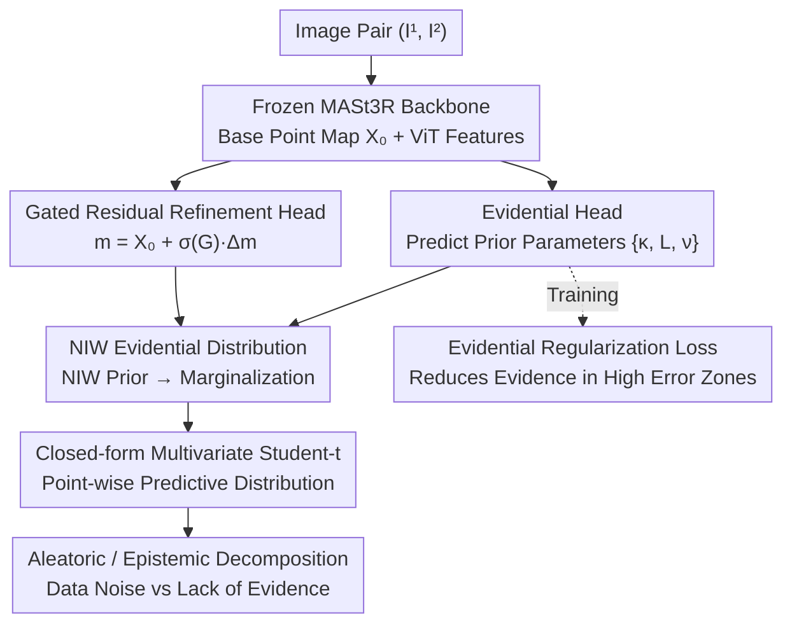

# Trust3R: Evidential Uncertainty for Feed-Forward 3D Reconstruction

**Conference**: ICML 2026  
**arXiv**: [2605.19539](https://arxiv.org/abs/2605.19539)  
**Code**: https://trust3r-z.github.io/  
**Area**: 3D Vision / Uncertainty Quantification  
**Keywords**: Evidential Learning, Uncertainty Quantification, 3D Reconstruction, Point Maps, Geometric Foundation Models

## TL;DR
Trust3R introduces a probabilistic evidential learning framework for feed-forward 3D reconstruction models like MASt3R. By utilizing a Normal-Inverse-Wishart prior to predict a closed-form multivariate Student-t distribution for each 3D point, it replaces heuristic confidence scores. This allows for the output of probabilistically interpretable point-wise uncertainty in a single forward pass, reducing AURC by 25% and AUSE by 41% on ScanNet++.

## Background & Motivation

**Background**: Geometric foundation models such as DUSt3R and MASt3R directly perform feed-forward regression of dense 3D point maps without iterative optimization, becoming key components for real-time SLAM and robotic perception. These models simultaneously output a per-pixel "confidence" map as a reliability indicator.

**Limitations of Prior Work**: Existing confidence scores are heuristically learned weights rather than predictive uncertainty in a probabilistic sense. This leads to two issues: confidence may be over-estimated in difficult conditions such as occlusion, low texture, or distribution shifts despite high actual errors; heuristic confidence cannot propagate across views or form a probabilistically consistent combination with downstream geometric optimizations (e.g., SLAM weighting).

**Key Challenge**: Feed-forward 3D reconstruction is inherently ambiguous—repetitive textures, occlusions, and low-texture regions can produce multiple geometrically plausible but distinct interpretations. To characterize uncertainty in a "probabilistically interpretable" way, traditional methods either require running multiple forward passes via MC dropout or training several ensemble models, which is too costly for dense point maps. Directly regressing variance often leads to unstable training and difficulty in ranking error points.

**Goal**: Design a lightweight, single-pass, probabilistically interpretable uncertainty head that maintains foundation model accuracy while outputting a closed-form predictive distribution for each 3D point.

**Key Insight**: Evidential learning allows networks to directly predict "evidential parameters" (parameters of a prior distribution), obtaining a closed-form predictive distribution in a single forward pass. Multivariate evidential regression with an NIW prior yields a multivariate Student-t distribution, which naturally models the covariance between $x, y, z$ coordinates, fitting the non-independent nature of 3D geometric coordinates.

**Core Idea**: Use an NIW evidential head to predict $\{\mathbf{m}, \kappa, \boldsymbol{\Psi}, \nu\}$ for each pixel, then use a gated residual head to selectively fine-tune the pre-trained point map. This outputs multivariate Student-t uncertainty in a single forward pass and analytically decomposes it into aleatoric and epistemic components.

## Method

### Overall Architecture

Trust3R aims to enable feed-forward 3D reconstruction models to output "probabilistically interpretable" point-wise uncertainty in a single forward pass, rather than the heuristic confidence of MASt3R. The approach treats a frozen geometric foundation model as a backbone, stacking two lightweight heads on top, and leverages evidential learning to upgrade the network output from "one point + one weight" to "a complete predictive distribution."

Specifically, an input image pair $(I^1, I^2)$ passes through a frozen MASt3R backbone to obtain a base point map $\mathbf{X}_0$ and ViT features. The gated residual head predicts a residual $\Delta\mathbf{m}$ and a gate $\mathbf{G}$ on $\mathbf{X}_0$ to provide a refined mean $\mathbf{m}$. Simultaneously, the evidential head predicts prior parameters $\{\kappa, \mathbf{L}, \nu\}$ from the same features ($\mathbf{L}$ is the Cholesky factor of the covariance scale $\boldsymbol{\Psi}$ to ensure positive definiteness). By substituting these parameters into the NIW prior and marginalizing the latent variables, each pixel directly obtains a closed-form multivariate Student-t predictive distribution. This allows for analytic reading of point-wise uncertainty without sampling or multiple forward passes, further decomposing into aleatoric and epistemic parts.

### Key Designs

**1. Normal-Inverse-Wishart Evidential Distribution: Single-Pass Predictive Distribution with Coordinate Covariance**

The pain point is that characterizing dense point map uncertainty probabilistically typically requires multiple passes (MC dropout) or multiple models (ensembles), which is costly. Evidential learning enables the network to predict "parameters of the prior distribution" instead of points, obtaining the predictive distribution analytically in one pass. Trust3R assumes each 3D point $\mathbf{X}_i \sim \mathcal{N}(\boldsymbol{\mu}_i, \boldsymbol{\Sigma}_i)$ and places an NIW conjugate prior on the unknown $(\boldsymbol{\mu}, \boldsymbol{\Sigma})$. The network outputs prior parameters $\boldsymbol{\theta}=\{\mathbf{m}, \kappa, \boldsymbol{\Psi}, \nu\}$, where $\mathbf{m}$ is the mean, $\kappa$ represents "confidence in the mean," $\nu$ is the degrees of freedom, and $\boldsymbol{\Psi}$ is the covariance scale. After marginalizing latent variables, the predictive distribution is a closed-form multivariate Student-t:

$$p(\mathbf{X}\mid\boldsymbol{\theta}) = \mathrm{St}\!\left(\mathbf{X} \mid \mathbf{m},\ \frac{\boldsymbol{\Psi}(\kappa+1)}{\kappa(\nu-2)},\ \nu-2\right).$$

Choosing NIW over the coordinate-independent NIG is crucial as it explicitly models the covariance between $x, y, z$ coordinates, corresponding to the coordinate correlation caused by multi-view triangulation. On the challenging ETH3D dataset, NIW reduces AURC from 0.3213 (NIG) to 0.3040. Furthermore, the negative log-likelihood of Student-t is directly differentiable, and inference complexity remains the same as a single-pass prediction.

**2. Evidential Regularization Loss: Forcing the Model to Admit Ignorance in High-Error Zones**

Pure evidential NLL suffers from a common issue: the model can still output "high evidence" (pretending to be confident) in erroneously predicted areas, leading to degenerate solutions where uncertainty decouples from actual error. Trust3R adopts the standard regularization term from deep evidential regression, defining total evidence $e_i = \kappa_i + \nu_i$ and adding a penalty coupled with error:

$$\mathcal{L}_{\mathrm{evi}} = \|\mathbf{X}^{\mathrm{true}}_i - \mathbf{m}_i\|_2^2 \cdot e_i.$$

This term heavily penalizes cases where the predicted mean is far from the ground truth while $e_i$ is large. Thus, the model is forced to learn low evidence/high uncertainty in high-error zones, ensuring the output uncertainty truly ranks error points.

**3. Gated Residual Refinement Head: Data-Driven Trade-off Between "Modifying Geometry" and "Trusting Pre-training"**

Directly fine-tuning the backbone with evidential loss can degrade geometric accuracy, especially under OOD conditions. The gated residual head provides a switch for each point: the mean is taken as $\mathbf{m} = \mathbf{X}_0 + \sigma(\mathbf{G}) \odot \Delta\mathbf{m}$. When the gate $\sigma(\mathbf{G})\to 0$, the geometry is frozen, fully trusting the pre-trained point map; when $\to 1$, adjustments are allowed. The gate is initialized as a no-op to ensure stable cold starts. This allows the model to decide which points to move and which to keep in a data-driven manner. On KITTI, MAE/RMSE only slightly increased while AURC/AUSE improved significantly, indicating it prefers "increasing uncertainty" over "erroneously modifying coordinates" at difficult points.

**4. Aleatoric / Epistemic Closed-form Decomposition: Distinguishing "Noisy Data" from "Unseen Scenarios"**

The NIW predictive distribution allows for an analytic separation of the two types of uncertainty:

$$\Sigma_{\mathrm{alea}} = \mathbb{E}[\boldsymbol{\Sigma}] = \frac{\boldsymbol{\Psi}}{\nu - 4},\qquad \Sigma_{\mathrm{epi}} = \mathrm{Var}[\boldsymbol{\mu}] = \frac{\boldsymbol{\Psi}}{\kappa(\nu - 4)}.$$

Since they only differ by a factor of $1/\kappa$, epistemic uncertainty increases as $\kappa$ (confidence in the mean) decreases. Experiments show that the epistemic component provides the best ranking quality, suggesting that Trust3R primarily captures "lack of evidence."

## Key Experimental Results

### Main Results: Uncertainty Ranking Quality

| Dataset | Method | AURC↓ | AUSE↓ | Spearman ρ↑ | Inference Mode |
|--------|------|-------|-------|-------------|---------|
| ScanNet++ | MASt3R (Heuristic) | 0.1649 | 0.0747 | 0.2837 | Single-pass |
| ScanNet++ | Hetero (Heteroscedastic) | 0.1616 | 0.0715 | 0.3545 | Single-pass |
| ScanNet++ | **Trust3R (NIW)** | **0.1233** | **0.0444** | **0.4946** | Single-pass |
| TUM RGB-D | MASt3R | 0.1649 | 0.0747 | 0.2837 | Single-pass |
| TUM RGB-D | Trust3R | **0.1233** | **0.0444** | **0.4930** | Single-pass |
| KITTI | MASt3R | 0.0538 | 0.0233 | 0.4812 | Single-pass |
| KITTI | Trust3R | **0.0481** | **0.0178** | **0.5169** | Single-pass |
| Average | MC Dropout (16×) | 0.4902 | 0.2726 | 0.3249 | Multi-pass |
| Average | Deep Ensembles (5×) | 0.2992 | 0.0916 | 0.4556 | Multi-pass |
| Average | **Trust3R** | 0.3861 | 0.1684 | **0.4898** | **Single-pass** |

### Ablation Study

| Ablation Aspect | Configuration | AURC↓ | AUSE↓ | Spearman ρ↑ |
|---------|------|-------|-------|-------------|
| Uncertainty Source (ETH3D) | Aleatoric only | 0.3175 | 0.1452 | 0.3093 |
| | Total | 0.3064 | 0.1341 | 0.3455 |
| | **Epistemic** | **0.3040** | **0.1318** | **0.3483** |
| Evidential Distribution (ETH3D) | NIG (Independent) | 0.3213 | 0.1493 | 0.3229 |
| | **NIW (Covariance)** | **0.3040** | **0.1318** | **0.3483** |
| Gated Residual (ScanNet++) | Off | 0.1788 | 0.0887 | — |
| | **On** | **0.1349** | **0.0512** | — |

### Key Findings

- On the indoor ScanNet++ dataset, AURC decreased by 25.2% and Spearman ρ increased by 74% compared to MASt3R's heuristic confidence, approaching the ranking quality of a 5× Deep Ensemble in a single pass.
- In OOD outdoor KITTI scenarios, geometric accuracy slightly decreased (MAE +3.4%), but uncertainty significantly improved, showing that the gated refinement steers "hard points" toward "high uncertainty" rather than "incorrect coordinates."
- The Epistemic component showed the highest ranking quality across all datasets, indicating the model captures "lack of evidence" rather than just "observation noise."
- Replacing heuristic confidence with Trust3R uncertainty weighting in downstream SLAM (TUM RGB-D) reduced RPE by 13.4%.

## Highlights & Insights

- **Probabilistic over Heuristic**: Upgrades MASt3R's "learned confidence weights" to a predictive distribution with NIW Bayesian interpretation, supporting analytic aleatoric/epistemic decomposition and consistency for downstream geometric optimization.
- **Closed-form Single-pass vs Multi-pass Ensemble**: Inference cost is only 1.6× that of the heuristic (80.9ms vs 49.4ms), yet achieves ranking quality close to 5× Deep Ensembles, which is a qualitative shift for real-time SLAM/robotics.
- **Gated Residual Stabilization**: Controlling the "override" of pre-trained geometry via a sigmoid gate initialized to 0 is a simple yet effective stabilization trick for stacking uncertainty heads on frozen backbones.
- **Transferability Across Foundation Models**: Spearman ρ improved from 0.3162 to 0.6419 on a VGGT backbone, demonstrating that the head is general and not limited to MASt3R.

## Limitations & Future Work

- The Student-t is a unimodal distribution; it can only label multi-modal ambiguities (e.g., from repetitive textures or heavy occlusion) as generally "high uncertainty" without separating hypotheses.
- The pixel-level mean-field assumption does not explicitly model spatial correlation between adjacent pixels (e.g., planarity constraints), potentially leading to over-optimism in textured foreground areas.
- OOD generalization remains an open problem, and performance under extreme domain shifts (synthetic to real, near to far) requires further validation.
- Downstream integration was only empirically verified in SLAM weighting; deeper applications like fusion, loop closure, or filtering are not yet covered.

## Related Work & Insights

- **vs MASt3R / DUSt3R**: They produce deterministic point maps + heuristic confidence; this work proves that stacking an evidential head yields probabilistically interpretable uncertainty with almost no loss in geometric precision.
- **vs MC Dropout / Deep Ensembles**: Replaces "multi-pass sampling" with a "single-pass closed-form," offering a 4–20× speedup for real-time geometric tasks.
- **vs Heteroscedastic Regression**: Hetero only regresses variance and assumes coordinate independence; NIW significantly outperforms it on difficult datasets, proving that covariance modeling is geometrically meaningful.
- **vs Conformal Prediction**: CP provides distribution-free guarantees but is often conservative; evidential learning follows a parametric path to tighter estimates.

## Rating

- Novelty: ⭐⭐⭐⭐⭐ First application of NIW evidential learning to dense point map uncertainty with gated residual stabilization.
- Experimental Thoroughness: ⭐⭐⭐⭐⭐ Comprehensive evaluation across indoor/outdoor/OOD data, comparisons with Heuristic/Hetero/MCD/DeepEns, full ablation, and SLAM validation.
- Writing Quality: ⭐⭐⭐⭐ Clear motivation and rigorous formulas, though some details (e.g., post-upsampling smoothing) are in the appendix.
- Value: ⭐⭐⭐⭐⭐ Directly addresses the need for "efficient and reliable uncertainty" in real-time 3D systems. Single-pass closed-form + open source + transferable head makes it highly valuable for the SLAM/robotics community.

<!-- RELATED:START -->

## Related Papers

- [\[CVPR 2026\] VGG-T3: Offline Feed-Forward 3D Reconstruction at Scale](../../CVPR2026/3d_vision/vgg-t3_offline_feed-forward_3d_reconstruction_at_scale.md)
- [\[CVPR 2026\] PanoVGGT: Feed-Forward 3D Reconstruction from Panoramic Imagery](../../CVPR2026/3d_vision/panovggt_feed-forward_3d_reconstruction_from_panoramic_imagery.md)
- [\[CVPR 2026\] Gen3R: 3D Scene Generation Meets Feed-Forward Reconstruction](../../CVPR2026/3d_vision/gen3r_3d_scene_generation_meets_feed-forward_reconstruction.md)
- [\[CVPR 2026\] Evidential Neural Radiance Fields](../../CVPR2026/3d_vision/evidential_neural_radiance_fields.md)
- [\[CVPR 2026\] Any4D: Unified Feed-Forward Metric 4D Reconstruction](../../CVPR2026/3d_vision/any4d_unified_feed-forward_metric_4d_reconstruction.md)

<!-- RELATED:END -->
