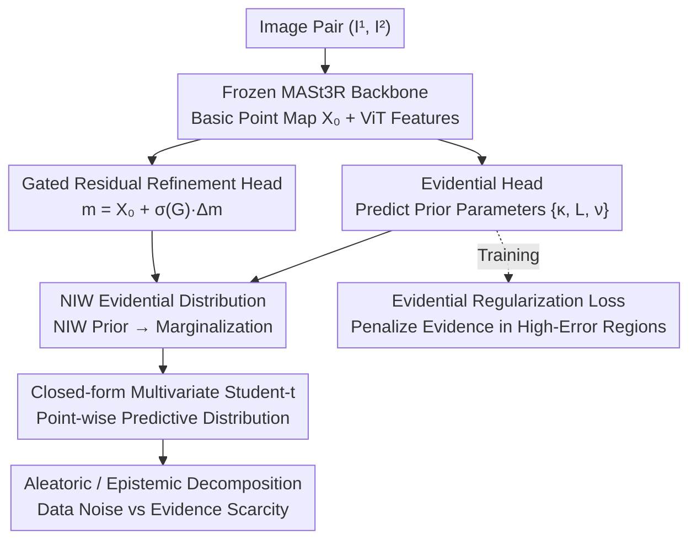

# Trust3R: Evidential Uncertainty for Feed-Forward 3D Reconstruction

**Conference**: ICML 2026  
**arXiv**: [2605.19539](https://arxiv.org/abs/2605.19539)  
**Code**: https://trust3r-z.github.io/  
**Area**: 3D Vision / Uncertainty Quantification  
**Keywords**: Evidential Learning, Uncertainty Quantification, 3D Reconstruction, Point Map, Geometric Foundation Models

## TL;DR
Trust3R introduces a probabilistic evidential learning framework for feed-forward 3D reconstruction models like MASt3R. By using a Normal-Inverse-Wishart prior to predict a closed-form multivariate Student-t distribution for each 3D point, it replaces heuristic confidence with point-wise uncertainty that has probabilistic interpretability in a single-pass inference. It reduces AURC by 25% and AUSE by 41% on ScanNet++.

## Background & Motivation

**Background**: Geometric foundation models such as DUSt3R and MASt3R directly regress dense 3D point maps in a feed-forward manner without iterative optimization, becoming key components for real-time SLAM and robotic perception. These models simultaneously output a per-pixel "confidence" map as a reliability indicator.

**Limitations of Prior Work**: Existing confidence scores are heuristic learned weights rather than predictive uncertainty in a probabilistic sense. This leads to two issues: confidence may be over-estimated under difficult conditions (e.g., occlusion, low-texture, distribution shift) despite high actual errors; heuristic confidence cannot propagate across views or form a probabilitically consistent combination with downstream geometric optimization (e.g., SLAM weighting).

**Key Challenge**: Feed-forward 3D reconstruction is naturally ambiguous—repetitive textures, occlusions, and low-texture regions can produce multiple geometrically plausible but distinct explanations. To characterize uncertainty with "probabilistic interpretability," traditional methods typically require multiple forward passes for MC dropout or training several ensemble models, which is too costly for dense point maps. Directly regressing variance often leads to unstable training and difficulty in ranking error points.

**Goal**: Design a lightweight, single-pass, probabilitically interpretable uncertainty head that maintains the accuracy of foundation models while outputting closed-form predictive distributions for each 3D point.

**Key Insight**: Evidential learning allows networks to directly predict "evidential parameters" (parameters of a prior distribution), obtaining a closed-form predictive distribution in a single pass. Multivariate evidential regression using an NIW prior generates a multivariate Student-t distribution, which naturally models the covariance between $x, y, z$ coordinates, fitting the non-independent nature of coordinates in 3D geometry.

**Core Idea**: Use an NIW evidential head to predict $\{\mathbf{m}, \kappa, \boldsymbol{\Psi}, \nu\}$ for each pixel, then use a gated residual head to selectively fine-tune the pre-trained point map. This outputs a multivariate Student-t uncertainty in a single-pass and analytically decomposes it into aleatoric and epistemic components.

## Method

### Overall Architecture

Trust3R aims to enable feed-forward 3D reconstruction models to output point-wise uncertainty with "probabilistic interpretability" in a single forward pass, rather than the heuristic confidence found in MASt3R. The approach treats a frozen geometric foundation model as the backbone, stacking two lightweight heads on top, and upgrades the network output from "one point + one weight" to "a complete predictive distribution" via evidential learning.

Specifically, the input image pair $(I^1, I^2)$ passes through a frozen MASt3R backbone to obtain a basic point map $\mathbf{X}_0$ and ViT features. The gated residual head predicts a residual $\Delta\mathbf{m}$ and a gate $\mathbf{G}$ on $\mathbf{X}_0$ to yield a refined mean $\mathbf{m}$. Simultaneously, the evidential head predicts prior parameters $\{\kappa, \mathbf{L}, \nu\}$ from the same features ($\mathbf{L}$ is the Cholesky factor of the covariance scale $\boldsymbol{\Psi}$ to ensure positive definiteness). By substituting these parameters into the NIW prior and marginalizing the latent variables, each pixel yields a closed-form multivariate Student-t predictive distribution. This allows for analytical extraction of point-wise uncertainty and its decomposition into aleatoric and epistemic components without any sampling or multiple forward passes.

### Key Designs

**1. Normal-Inverse-Wishart Evidential Distribution: Single-Pass Coordinate Covariance Prediction**

The limitation is that interpreting dense point map uncertainty probabilitistically usually requires dozens of MC dropout passes or multiple ensemble models. Evidential learning enables the network to predict the "parameters of the prior distribution" instead of just points, giving a predictive distribution analytically. Trust3R assumes each 3D point $\mathbf{X}_i \sim \mathcal{N}(\boldsymbol{\mu}_i, \boldsymbol{\Sigma}_i)$ and places an NIW conjugate prior over the unknown $(\boldsymbol{\mu}, \boldsymbol{\Sigma})$. The network outputs parameters $\boldsymbol{\theta}=\{\mathbf{m}, \kappa, \boldsymbol{\Psi}, \nu\}$, where $\mathbf{m}$ is the mean, $\kappa$ represents "confidence in the mean," $\nu$ is the degrees of freedom, and $\boldsymbol{\Psi}$ is the covariance scale. After marginalizing the latent variables, the final predictive distribution is a closed-form multivariate Student-t:

$$p(\mathbf{X}\mid\boldsymbol{\theta}) = \mathrm{St}\!\left(\mathbf{X} \mid \mathbf{m},\ \frac{\boldsymbol{\Psi}(\kappa+1)}{\kappa(\nu-2)},\ \nu-2\right).$$

Choosing NIW over NIG (which assumes independent coordinates) is crucial because it explicitly models the covariance between $x, y, z$, specifically addressing coordinate correlations resulting from multi-view triangulation. On the ETH3D dataset, NIW reduces AURC from 0.3213 (NIG) to 0.3040. Furthermore, the negative log-likelihood of Student-t is directly differentiable, and inference complexity remains the same as a single-pass prediction.

**2. Evidential Regularization Loss: Penalizing Overconfidence in High-Error Regions**

Standard evidential NLL has a drawback: the model might output "high evidence" (fake confidence) even for incorrect predictions, causing uncertainty to decouple from actual error. Trust3R adopts the standard regularization term from deep evidential regression, defining total evidence $e_i = \kappa_i + \nu_i$ and adding a penalty coupled with the error:

$$\mathcal{L}_{\mathrm{evi}} = \|\mathbf{X}^{\mathrm{true}}_i - \mathbf{m}_i\|_2^2 \cdot e_i.$$

When the predicted mean is far from the ground truth and $e_i$ is large, this term suffers a heavy penalty. Thus, the model is forced to learn low evidence (high uncertainty) in high-error regions, ensuring the uncertainty helps rank error points effectively.

**3. Gated Residual Refinement Head: Data-Driven Trade-off between Refinement and Trust**

Directly fine-tuning the backbone with evidential loss can damage geometric accuracy, especially under OOD conditions. The gated residual head avoids hard changes by providing a switch for each point: the mean is $\mathbf{m} = \mathbf{X}_0 + \sigma(\mathbf{G}) \odot \Delta\mathbf{m}$. When the gate $\sigma(\mathbf{G})\to 0$, the geometry is frozen, trusting the pre-trained map entirely. When $\to 1$, adjustments are allowed. The gate is initialized as a no-op for cold-start stability. This enables the model to decide which points to modify; on KITTI, MAE/RMSE only slightly increased while AURC/AUSE improved significantly, indicating a preference for "raising uncertainty" over "arbitrarily changing coordinates."

**4. Closed-form Aleatoric / Epistemic Decomposition: Distinguishing Data Noise from Model Ignorance**

The NIW distribution allows for analytical separation of two types of uncertainty. Aleatoric uncertainty stems from observation noise or inherent ambiguity (expectation of covariance), while epistemic uncertainty results from evidence scarcity or distribution shift (variance of the mean):

$$\Sigma_{\mathrm{alea}} = \mathbb{E}[\boldsymbol{\Sigma}] = \frac{\boldsymbol{\Psi}}{\nu - 4},\qquad \Sigma_{\mathrm{epi}} = \mathrm{Var}[\boldsymbol{\mu}] = \frac{\boldsymbol{\Psi}}{\kappa(\nu - 4)}.$$

As they only differ by a factor of $1/\kappa$, epistemic uncertainty grows as $\kappa$ decreases. Experiments show the epistemic component provides the best ranking quality, suggesting Trust3R primarily captures "evidence scarcity."

## Key Experimental Results

### Main Results: Uncertainty Ranking Quality

| Dataset | Method | AURC↓ | AUSE↓ | Spearman ρ↑ | Inference Mode |
|--------|------|-------|-------|-------------|---------|
| ScanNet++ | MASt3R (Heuristic) | 0.1649 | 0.0747 | 0.2837 | Single-pass |
| ScanNet++ | Hetero (Heteroscedastic) | 0.1616 | 0.0715 | 0.3545 | Single-pass |
| ScanNet++ | **Trust3R (NIW)** | **0.1233** | **0.0444** | **0.4946** | Single-pass |
| TUM RGB-D | MASt3R | 0.1649 | 0.0747 | 0.2837 | Single-pass |
| TUM RGB-D | Trust3R | **0.1233** | **0.0444** | **0.4930** | Single-pass |
| KITTI | MASt3R | 0.0538 | 0.0233 | 0.4812 | Single-pass |
| KITTI | Trust3R | **0.0481** | **0.0178** | **0.5169** | Single-pass |
| Average | MC Dropout (16×) | 0.4902 | 0.2726 | 0.3249 | Multi-pass |
| Average | Deep Ensembles (5×) | 0.2992 | 0.0916 | 0.4556 | Multi-pass |
| Average | **Trust3R** | 0.3861 | 0.1684 | **0.4898** | **Single-pass** |

### Ablation Study

| Dimension | Configuration | AURC↓ | AUSE↓ | Spearman ρ↑ |
|---------|------|-------|-------|-------------|
| Uncertainty Source (ETH3D) | Aleatoric only | 0.3175 | 0.1452 | 0.3093 |
| | Total | 0.3064 | 0.1341 | 0.3455 |
| | **Epistemic** | **0.3040** | **0.1318** | **0.3483** |
| Distribution (ETH3D) | NIG (Independent) | 0.3213 | 0.1493 | 0.3229 |
| | **NIW (Covariance)** | **0.3040** | **0.1318** | **0.3483** |
| Gated Residual (ScanNet++) | Off | 0.1788 | 0.0887 | — |
| | **On** | **0.1349** | **0.0512** | — |

### Key Findings

- On indoor ScanNet++, AURC decreased by 25.2% and Spearman ρ increased by 74% compared to MASt3R's heuristic confidence, approaching 5× Deep Ensemble quality in a single pass.
- In OOD outdoor KITTI, geometric accuracy slightly decreased (MAE +3.4%), but uncertainty significantly improved, showing the gated refinement directs "difficult points" towards "high uncertainty" rather than "incorrect coordinate modification."
- Epistemic components show the best ranking quality, capturing "model ignorance."
- Using Trust3R uncertainty for SLAM weighting (TUM RGB-D) reduced RPE by 13.4% compared to heuristic weighting.

## Highlights & Insights

- **Probabilistic over Heuristic**: Upgrades MASt3R’s "heuristic learned weights" to predictive distributions with NIW Bayesian interpretation, supporting analytical aleatoric/epistemic decomposition and consistency for downstream optimization.
- **Closed-form Single-pass Efficiency**: Inference cost is only 1.6× heuristic (80.9ms vs 49.4ms) but achieves nearly the ranking quality of 5× Deep Ensembles—a qualitative shift for real-time robotic systems.
- **Gated Residual Stability**: Initializing the sigmoid gate to 0 for a no-op refinement is a simple yet effective trick for adding uncertainty heads to frozen backbones.
- **Foundation Model Transferability**: Gains in Spearman ρ were also observed when applied to VGGT backbones (0.3162 to 0.6419), demonstrating the universality of the head.

## Limitations & Future Work

- The Student-t is unimodal; for multi-modal ambiguities (e.g., strong repeated textures or heavy occlusions), it can only flag "high uncertainty" without separating hypotheses.
- The pixel-wise mean-field assumption neglects spatial correlation (e.g., co-planarity), potentially leading to over-optimism on textured foregrounds.
- OOD generalization remains open; performance under extreme shifts (Synthetic to Real, Near to Far) requires further validation.
- Downstream integration is only proven in SLAM weighting; deeper applications like loop closure or filtering are not yet covered.

## Related Work & Insights

- **vs MASt3R / DUSt3R**: They output deterministic maps + heuristic confidence; Ours demonstrates that adding an evidential head yields probabilistic interpretability without sacrificing geometric accuracy.
- **vs MC Dropout / Deep Ensembles**: Replaces multiple sampling passes with a single closed-form pass, achieving 4–20× speedup for real-time geometry tasks.
- **vs Heteroscedastic Regression**: Hetero only regresses variance and assumes independent coordinates; NIW significantly outperforms it on difficult datasets, proving the value of covariance modeling.
- **vs Conformal Prediction**: CP provides distribution-free guarantees but is often conservative; the evidential parametric path yields tighter estimates.

## Rating

- Novelty: ⭐⭐⭐⭐⭐ First application of NIW evidential learning to dense point map uncertainty with gated residual stabilization.
- Experimental Thoroughness: ⭐⭐⭐⭐⭐ Covers indoor/outdoor/OOD data, compares against Heuristic/Hetero/MCD/DeepEns, and provides downstream SLAM validation.
- Writing Quality: ⭐⭐⭐⭐ Clear motivation and rigorous formulas; some details (e.g., post-upsampling smoothing) are relegated to the appendix.
- Value: ⭐⭐⭐⭐⭐ Directly addresses the need for efficient, reliable uncertainty in real-time 3D systems. The single-pass closed-form nature and transferable head are highly valuable for the robotics community.

<!-- RELATED:START -->

## Related Papers

- [\[CVPR 2026\] Speed3R: Sparse Feed-forward 3D Reconstruction Models](../../CVPR2026/3d_vision/speed3r_sparse_feed-forward_3d_reconstruction_models.md)
- [\[CVPR 2026\] VGG-T3: Offline Feed-Forward 3D Reconstruction at Scale](../../CVPR2026/3d_vision/vgg-t3_offline_feed-forward_3d_reconstruction_at_scale.md)
- [\[CVPR 2026\] PanoVGGT: Feed-Forward 3D Reconstruction from Panoramic Imagery](../../CVPR2026/3d_vision/panovggt_feed-forward_3d_reconstruction_from_panoramic_imagery.md)
- [\[CVPR 2026\] Evidential Neural Radiance Fields](../../CVPR2026/3d_vision/evidential_neural_radiance_fields.md)
- [\[CVPR 2026\] AMB3R: Accurate Feed-forward Metric-scale 3D Reconstruction with Backend](../../CVPR2026/3d_vision/amb3r_accurate_feed-forward_metric-scale_3d_reconstruction_with_backend.md)

<!-- RELATED:END -->
