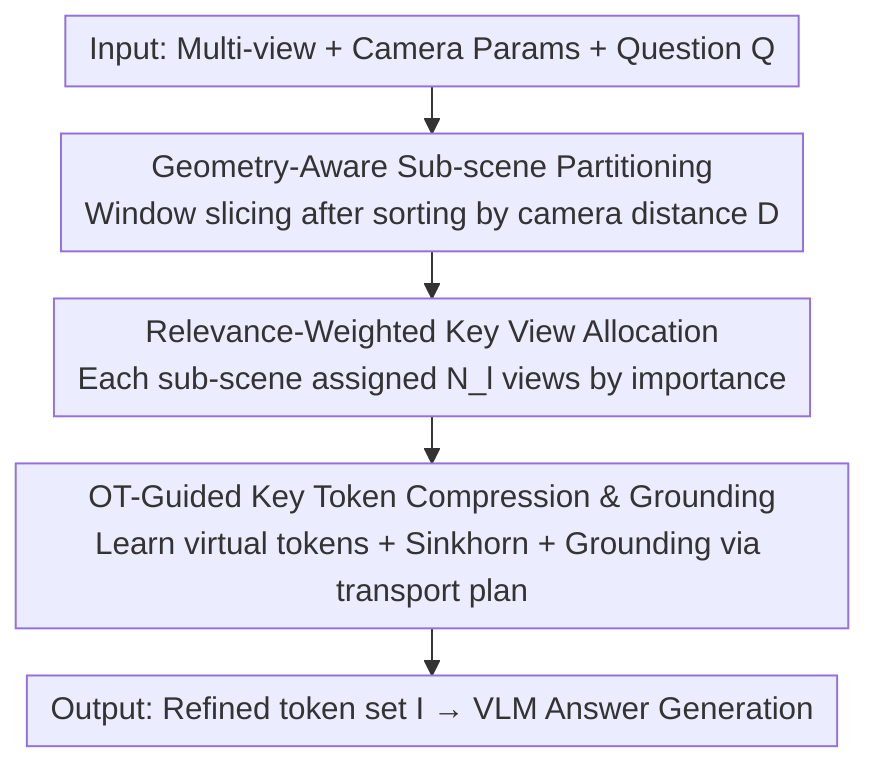

# Zero-Shot 3D Question Answering via Hierarchical View-to-Token Transportation

**Conference**: ICML2026  
**arXiv**: [2606.03100](https://arxiv.org/abs/2606.03100)  
**Code**: TBD  
**Area**: 3D Vision / Multimodal VLM  
**Keywords**: 3D QA, Zero-shot, Key view selection, Optimal Transport, Token compression

## TL;DR
KeyVT decomposes the process of feeding multi-view images sampled from 3D point clouds into 2D VLMs for 3D QA into a two-level hierarchical workflow: "key view selection" followed by "key token selection." At the view level, it uses camera geometry to partition the scene into spatially continuous sub-scenes and allocates token budgets based on relevance. At the token level, it employs Optimal Transport (OT) to eliminate cross-view redundancy. This training-free method approaches or exceeds the performance of supervised models on ScanQA, SQA3D, and VSI-Bench.

## Background & Motivation
**Background**: Using 2D Vision-Language Models (VLMs, e.g., GPT-4o, Qwen-VL) for 3D scene understanding is an emerging direction. By sampling 2D views from 3D point clouds and feeding them into pretrained VLMs, models can answer questions about the scene. Compared to 3D-LLMs that require massive "point-text" pairs to align geometry and language, this approach bypasses scarce 3D annotations and offers better scalability.

**Limitations of Prior Work**: VLMs have limited input budgets (token counts), which cannot accommodate all views of a scene (denoted as $S\ll|\mathcal{M}|_t$). Consequently, a small subset of "key views" (e.g., 8 or 16) must be selected. However, existing selection methods focus almost exclusively on "semantic relevance between views and the question," often missing secondary evidence not explicitly mentioned in the question but critical for answering (e.g., the surrounding environment). Furthermore, selected key views often have high semantic overlap, wasting budget on redundant tokens.

**Key Challenge**: There is a fundamental conflict between "preserving as much task-relevant 3D detail as possible" and the "restricted capacity for views/tokens" under a fixed input budget. Pure semantic retrieval ignores spatial structure and fails to handle cross-view redundancy, wasting budget on repetitive information.

**Goal**: Find the optimal input context $\mathcal{I}=f(\mathcal{M},Q,S)$ within budget constraints that is spatially continuous, task-relevant, and non-redundant.

**Key Insight**: The authors observe that each view is associated with camera parameters (position, orientation), which naturally characterize spatial relationships in the 3D world—spatially closer objects often have stronger interactions. Thus, geometry is explicitly introduced into view selection. Simultaneously, reducing redundant tokens is modeled as a distribution alignment problem.

**Core Idea**: Use a hierarchical "geometry-aware view selection + OT-based token selection" workflow to replace pure semantic retrieval, allowing for more diverse and representative 3D evidence within the same budget.

## Method

### Overall Architecture
KeyVT is a tuning-free hierarchical input context constructor positioned between "multi-view sampling" and "VLM inference." The input is a set of multi-view images $\mathcal{M}=\{V_1,\dots,V_{|\mathcal{M}|}\}$ (with camera parameters) and a question $Q$. The output is a refined token set $\mathcal{I}$ satisfying budget $S$, used by the VLM to generate an answer $A = \text{VLM}(\mathcal{I}, Q)$. The pipeline first uses geometry at the **view level** to partition the scene and allocate key views (KeyV) by relevance, then uses Optimal Transport at the **token level** to compress cross-view redundancy and ground "virtual tokens" back to real patches (KeyT).

### Key Designs

**1. Geometry-Aware Sub-scene Partitioning: Using camera parameters for spatially continuous blocks**

Pure semantic retrieval only asks "how relevant is this view to the question," ignoring whether views are adjacent or far apart in 3D space. This can result in spatially scattered views that lose the continuous context around target objects. KeyVT defines a view distance that measures both **positional and orientation differences** between the first view $V_0$ and the $i$-th view $V_i$:

$$D(V_0,V_i)=\|\mathbf{C}_0-\mathbf{C}_i\|+\theta(\mathbf{R}_0,\mathbf{R}_i)$$

where $\mathbf{C}=-\mathbf{R}^\top\boldsymbol{t}$ is the camera center in world coordinates, and the angular difference is $\theta(\mathbf{R}_0,\mathbf{R}_i)=\arccos\big(\frac{\text{tr}(\mathbf{R}_0^\top\mathbf{R}_i)-1}{2}\big)$. This distance characterizes the spatial trajectory. After sorting views by $D$, a fixed window size $\delta$ (set to 11) is used to partition them into sub-scenes $\{L_1,\dots,L_{|L|}\}$. Views within each sub-scene are spatially continuous, capturing local 3D details together. This preserves "surrounding context" naturally. For datasets like VSI-Bench without geometry, the authors estimate camera parameters from RGB frames using FastVGGT.

**2. Relevance-Weighted Key View Allocation: Allocating limited view budget by sub-scene importance**

How should $K$ key views be distributed across sub-scenes? Uniform distribution is inefficient; sub-scenes more relevant to the question deserve more budget. KeyVT uses a pretrained BLIP2 to calculate relevance scores $r_l$ for sub-scene $L_l$ by summing the "maximum" and "average" similarities: $r_l=\max(O_l)+\text{mean}(O_l)$, where $O_{l,i}=\text{BLIP2}(V_i,Q)$. This captures both globally relevant sub-scenes and those with localized significant views. Quotas are allocated as follows:

$$N_l=\Big\lfloor K\cdot\frac{W_l}{\sum_{l'}W_{l'}}\Big\rfloor,\quad W_l=r_l\cdot\sqrt{|L_l|}$$

The weight $W_l$ includes the square root of the sub-scene size—larger sub-scenes typically contain more diversity, but the $\sqrt{\cdot}$ term prevents a single large sub-scene from consuming the entire budget. Top-$N_l$ relevant views are then selected within each sub-scene.

**3. OT-Guided Key Token Compression & Grounding: Using Optimal Transport for representative cross-view tokens**

Even after view selection, cross-view overlap remains high. While clustering is common, it is sensitive to dense features and may miss diverse tokens. KeyVT uses Optimal Transport (OT) to find a smaller set of **virtual tokens** $\mathbf{Q}=\{\mathbf{c}_1,\dots,\mathbf{c}_M\}$ that cover the original $N$ tokens $\mathbf{P}=\{\mathbf{e}_1,\dots,\mathbf{e}_N\}$ where ($M<N$). Representing them as discrete distributions $\mathbf{P}=\sum_n\alpha_n\boldsymbol{e}_n$ and $\mathbf{Q}=\sum_m\beta_m\boldsymbol{c}_m$, and using cosine distance $\mathbf{C}_{n,m}=1-\cos(\boldsymbol{e}_n,\boldsymbol{c}_m)$ as the cost, the goal is to minimize the OT distance $d_\mathbf{C}(\mathbf{P},\mathbf{Q})=\min_{\mathbf{T}\in U(\alpha,\beta)}\langle\mathbf{T},\mathbf{C}\rangle$. For efficiency, the Sinkhorn distance with entropy regularization makes the objective differentiable, allowing lightweight optimization of virtual tokens via Adam (learning rate 1e-2, 10–15 iterations).

OT provides a transport plan $\mathbf{T}$—measuring the "transport probability" from virtual tokens to view tokens. Since virtual tokens are learned in embedding space and do not correspond to real image patches, KeyVT **grounds** them: for each $\mathbf{c}_m$, the Top-$\frac{S}{M}$ real tokens are selected based on the $m$-th column of $\mathbf{T}$: $\text{Nei}(\boldsymbol{c}_m,\mathbf{T})=\{\boldsymbol{e}_i\mid i\in\text{Top-K}(\frac{S}{M},\mathbf{T}_{\cdot,m})\}$.

## Key Experimental Results

### Main Results
Evaluations were conducted on ScanQA/SQA3D (ScanNet-based indoor 3D-QA) and VSI-Bench across three 2D VLM backbones. For fair comparison, compression methods (DivPrune/FLoC/KeyVT) initially select 16 frames and compress them to 8 frames (denoted as $8^{\text{eq}}$).

| Backbone | Method | ScanQA CIDEr | ScanQA ROUGE-L | SQA3D EM-1 |
|------|------|--------------|----------------|------------|
| LLaVA-OV-7B | base | 84.0 | 43.1 | 53.9 |
| LLaVA-OV-7B | +AKS | 90.2 | 45.2 | 56.2 |
| LLaVA-OV-7B | +FLoC | 91.1 | 45.6 | 54.8 |
| LLaVA-OV-7B | **+KeyVT** | **93.8** | **46.7** | **57.1** |
| LLaVAVideo-7B | +FLoC | 99.4 | 48.5 | 57.2 |
| LLaVAVideo-7B | **+KeyVT** | **100.7** | **48.8** | **57.9** |

On VSI-Bench, KeyVT achieved the best training-free performance across LLaVA-OV, LLaVAVideo, and Qwen2.5-VL. Notably, with LLaVAVideo, the ScanQA CIDEr (100.7) exceeded a trained Video-3D LLM under the same input settings (100.6).

### Ablation Study

| Configuration | ScanQA CIDEr | Description |
|------|--------------|------|
| KeyVT (Full) | 100.7 | Geometry partitioning + Relevance allocation + OT compression |
| w/o Geometry design | 93.8 | Removing camera geometry drops performance by 6.9 |
| w/o Sub-scene partition | 99.8 | No window slicing |
| w/o Relevance scoring | 99.4 | No weighted budget allocation |

A separate view-selection-only comparison (Table 3) shows KeyV (37.7) outperforming AKS (36.4) on VSI-Bench with a Qwen backbone, proving the strength of geometry-aware selection alone.

### Key Findings
- **Geometry is the primary contributor**: Removing geometry-aware designs dropped CIDEr from 100.7 to 93.8 (−6.9), far exceeding the impact of removing partitioning (−0.9) or relevance weighting (−1.3).
- **Robustness to camera noise**: Performance remained stable under 1%/5%/10% parameter noise (100.1 / 100.0 / 98.4 CIDEr). Using VGGT-estimated parameters (100.0) nearly matched ground truth (100.7).
- **OT Compression superiority**: Compared to semantic/clustering compression (DivPrune, FLoC), OT preserves more diverse and representative tokens by minimizing transportation distance.

## Highlights & Insights
- **Camera Extrinsics as a "Free" Geometric Prior**: Since rotation and translation parameters are attached to each view, using a simple "position + orientation" distance to partition the scene offers massive gains at near-zero extra cost.
- **Grounding via OT Transport Plan**: KeyVT elegantly reuses the transport plan $\mathbf{T}$ to rank and select real tokens, solving the "unreadable virtual token" problem for VLMs without adding black-box modules.
- **Hierarchical "View then Token" Budget Reuse**: Compressing redundant tokens allows for more views (e.g., 16 compressed to 8 equivalent frames). This "save to spend" budget strategy can be applied to any task with tight input constraints, like long video understanding.

## Limitations & Future Work
- **Dependency on BLIP2 Relevance**: View relevance is measured by BLIP2; any semantic bias in BLIP2 propagates to sub-scene allocation, potentially failing in fine-grained or specialized domains.
- **Fixed Window Size**: The parameter $\delta=11$ is used globally. It does not adapt to scene scale, which may be sub-optimal for very large or very small scenes.
- **OT Optimization Overhead**: Virtual tokens require 10–15 Adam steps per scene. While lightweight, this introduces more inference latency than pure forward-pass selection methods.

## Related Work & Insights
- **vs 3D-LLM (PointLLM / LL3DA)**: These models use 3D point clouds directly and rely on 3D-text alignment losses. KeyVT uses 2D patches, is training-free, and surprisingly outperforms some trained models in fine-grained 3D-QA.
- **vs Video Keyframe Selection (AKS / BOLT)**: These methods target long videos but only consider query-frame relevance, ignoring 3D spatial geometry. KeyVT’s geometry-aware partitioning is better suited for 3D environments.
- **vs Clustering/Semantic Compression (DivPrune / FLoC)**: KeyVT overcomes the sensitivity of clustering to dense features by modeling representation as a distribution alignment problem via OT.

## Rating
- Novelty: ⭐⭐⭐⭐ Integrating camera geometry and OT into input construction for zero-shot 3D-QA is a logical and novel approach.
- Experimental Thoroughness: ⭐⭐⭐⭐ Comprehensive evaluation across multiple backbones, benchmarks, and noise scenarios.
- Writing Quality: ⭐⭐⭐⭐ Clear motivation, complete formulas, and well-explained hierarchical workflow.
- Value: ⭐⭐⭐⭐ Approaching trained performance with a training-free method; the budget reuse strategy is highly transferable.

## Related Papers

- [\[CVPR 2025\] DSPNet: Dual-vision Scene Perception for Robust 3D Question Answering](../../CVPR2025/3d_vision/dspnet_dual-vision_scene_perception_for_robust_3d_question_answering.md)
- [\[CVPR 2026\] MV3DIS: Multi-View Mask Matching via 3D Guides for Zero-Shot 3D Instance Segmentation](../../CVPR2026/3d_vision/mv3dis_multi-view_mask_matching_via_3d_guides_for_zero-shot_3d_instance_segmenta.md)
- [\[CVPR 2025\] MVSAnywhere: Zero-Shot Multi-View Stereo](../../CVPR2025/3d_vision/mvsanywhere_zero-shot_multi-view_stereo.md)
- [\[ICML 2026\] HOI-PAGE: Zero-Shot Human-Object Interaction Generation with Part Affordance Guidance](hoi-page_zero-shot_human-object_interaction_generation_with_part_affordance_guid.md)
- [\[CVPR 2026\] Zoo3D: Zero-Shot 3D Object Detection at Scene Level](../../CVPR2026/3d_vision/zoo3d_zero-shot_3d_object_detection_at_scene_level.md)

<!-- RELATED:END -->

<!-- RELATED:START -->

## Related Papers

- [\[ICML 2026\] HOI-PAGE: Zero-Shot Human-Object Interaction Generation with Part Affordance Guidance](hoi-page_zero-shot_human-object_interaction_generation_with_part_affordance_guid.md)
- [\[ICML 2026\] DynaTok: Token-Based 4D Reconstruction from Partial Point Clouds](dynatok_token-based_4d_reconstruction_from_partial_point_clouds.md)
- [\[ICML 2026\] RelaxFlow: Text-Driven Amodal 3D Generation](relaxflow_text-driven_amodal_3d_generation.md)
- [\[ICML 2026\] Trust3R: Evidential Uncertainty for Feed-Forward 3D Reconstruction](trust_it_or_not_evidential_uncertainty_for_feed-forward_3d_reconstruction_with_t.md)
- [\[ICML 2026\] EPS3D: End-to-End Feed-Forward 3D Panoptic Segmentation](eps3d_end-to-end_feed-forward_3d_panoptic_segmentation.md)

<!-- RELATED:END -->
