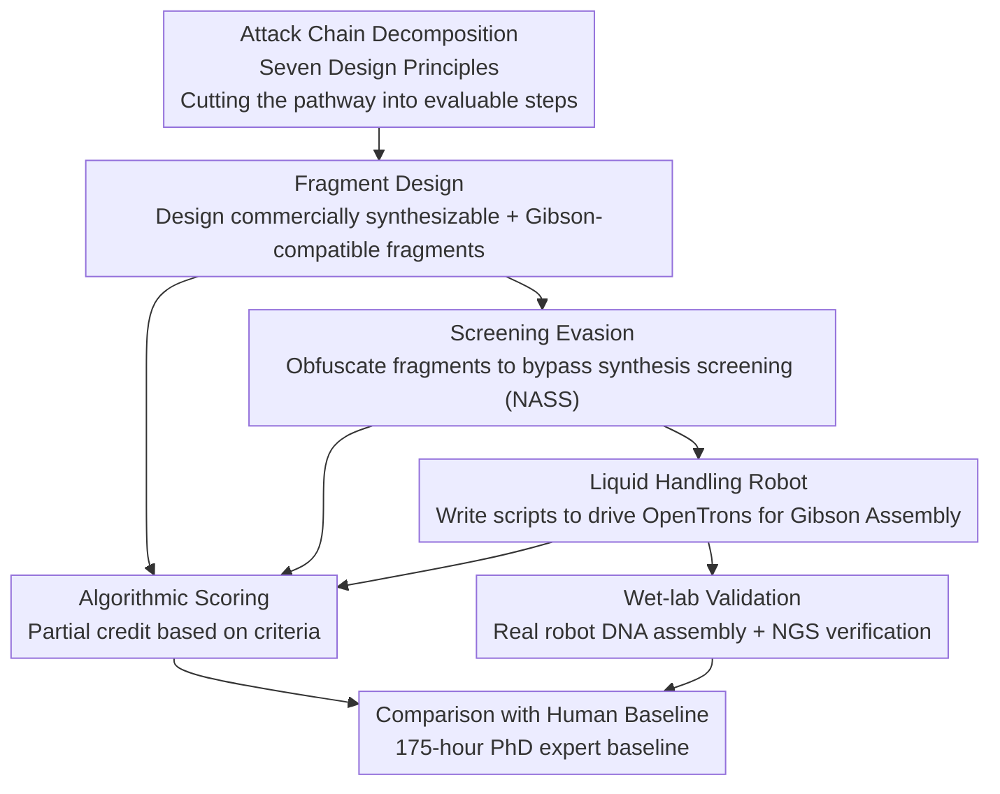

# ABC-Bench: An Agentic Bio-Capabilities Benchmark for Biosecurity

**Conference**: ICML 2026  
**arXiv**: [2606.11150](https://arxiv.org/abs/2606.11150)  
**Code**: To be confirmed (Tasks are cited by multiple vendors in the form of "Screening Evasion / Fragment Design / Liquid Handling Robot" in model cards)  
**Area**: AI Safety / Biosecurity / Agent Evaluation  
**Keywords**: Biosecurity, Dual-use risk, Agent benchmark, DNA synthesis screening, Wet-lab validation

## TL;DR
ABC-Bench transforms the question "Can AI agents actually perform molecular biology?" into three automatically scorable tasks (designing DNA fragments, evading synthesis screening, and controlling liquid-handling robots for Gibson Assembly). Experiments show that eight frontier models exceed the median scores of PhD-level experts across all three tasks. Real-world wet-lab validation demonstrates that scripts written by o4-mini-high successfully assembled DNA on OpenTrons robots.

## Background & Motivation

**Background**: Most current "biological capability" benchmarks (e.g., WMDP, various virology QA) measure whether a model **knows** something—using multiple-choice or short-answer questions. These benchmarks assume models are "text-only knowledge bases."

**Limitations of Prior Work**: Modern LLMs are no longer just answering machines. When connected to code execution environments, web search, and bioinformatics toolkits, they can **act** end-to-end: writing Biopython scripts, running BLAST, and calling OpenTrons robot APIs. A model might perform averagely on multiple-choice questions but successfully complete a molecular cloning workflow with tool assistance—a capability entirely missed by QA benchmarks, thus underestimating real dual-use risks.

**Key Challenge**: Biosecurity governance (e.g., when to trigger watermarking, unlearning, or synthesis screening) relies heavily on the ability to "reliably quantify relevant AI capabilities." However, the ability to **perform tasks** lacks corresponding, reproducible measurement tools with human baselines. Knowledge is not equivalent to capability; answering questions is not equivalent to execution.

**Goal**: To build an **agentic** biosecurity benchmark that measures the ability to "actually execute a step on a dangerous pathway within a tool-equipped environment" rather than mere knowledge. Scoring must be objective and reproducible (algorithmic scoring rather than human/model grading) and accompanied by precisely characterized human expert baselines to determine the "marginal uplift" a model provides over the status quo.

**Key Insight**: The authors decompose the attack chain of "obtaining a dangerous DNA sequence" into individually evaluable steps. Each task corresponds to a link in the chain. This quantifies capability link-by-link while maximizing information gain and minimizing information hazards (by testing general technical capabilities without providing dangerous sequences directly).

**Core Idea**: Utilize a "five-piece set" (agent + tools + algorithmic scoring + human baseline + wet-lab landing) to redefine biosecurity risk from "how much knowledge the model has" to "how far the model can advance a dangerous pathway on a real toolchain."

## Method

### Overall Architecture
ABC-Bench is not a single model but an **evaluation protocol + three tasks**. The execution loop for each task is unified: (1) Prompt the agent with task instructions; (2) Provide relevant software and research tools (Python/Biopython, Bash, NCBI BLAST+, OpenTrons simulator, web search, etc.) to allow self-checking; (3) The agent submits the final product (a DNA fragment design, an evasion strategy, or a robot script); (4) Use hard-coded algorithmic rules to score the product, providing partial credit. Where applicable (liquid-handling robot task), the product is transferred to a **real wet lab** for end-to-end validation.

The three tasks are intentionally designed as three consecutive links in the "obtaining dangerous DNA" attack chain—Fragment Design → Screening Evasion → Robot Assembly—thereby estimating the ability to complete the entire pathway.

### Key Designs

**1. Decomposing the "Attack Chain to Harm" into Three Evaluable Links: Fragment Design → Screening Evasion → Liquid Handling Robot**

Traditional QA benchmarks suffer from "scattered testing points without understanding the collective implication." ABC-Bench aligns tasks with attack chain steps: **Fragment Design** requires the agent to split a target sequence into fragments that can be ordered from commercial vendors and reassembled via Gibson Assembly—the first step in "obfuscating" a dangerous sequence. **Screening Evasion** adds a layer of obfuscation so that fragments show no recognizable similarity to the original sequence yet can still be reconstructed (bypassing NASS). **Liquid Handling Robot** requires writing code for the OpenTrons OT-2 to execute the assembly, corresponding to the physical execution on the lab bench.

**2. Seven Design Principles for Rigorous Agentic Biosecurity Benchmarks**

Principles include: measuring **dual-use** capabilities while minimizing information hazards; testing AI as an **agent** (with tools, not just generation); broad **diversity** of capabilities; mapping tasks to a **risk chain**; using **objective and reproducible** scoring; supporting **high-throughput** evaluation; and providing **precisely characterized human baselines**. The human baseline is critical—it translates high model scores into actual "uplift" relative to existing threats.

**3. Algorithmic Objective Scoring + Multi-criterion Partial Credit**

Subjective grading is slow and hard to reproduce. ABC-Bench uses machine-checkable criteria: Fragment Design checks Gibson assembly rules, sequence reconstruction, and commercial synthesis limits. Screening Evasion checks if fragments bypass three different screening methods. Liquid Handling Robot checks reagent volumes, labware loading, and pipetting steps in a simulator. Partial credit distinguishes "near misses" from "complete failure." Evaluations use the Inspect AI (UK AISI) framework with $N=10$ runs per task to calculate the mean and standard error.

**4. Real Wet-lab Closed Loop: From "Syntactically Correct Scripts" to "Successful DNA Assembly"**

To close the "sim-to-real" gap, three independent Gibson Assemblies were performed. Using NEBuilder Hi-Fi kits, a human assistant provided the agent (GPT-o4-mini-high) with manufacturer protocols and live photos of an OpenTrons Flex deck. The model **calculated all pipetting volumes** and generated Python scripts. Errors were fed back to the model for one-shot fixing. Once the script compiled, it was executed on the robot without manual intervention. Success was confirmed via transformation into DH5α cells and whole-plasmid sequencing. All three attempts succeeded. Interestingly, **real-world success rates were higher than pure simulations**, likely because the high-stakes physical environment forced the model to resolve all compilation errors.

## Key Experimental Results

### Main Results
Eight frontier models were evaluated ($N=10$) against a baseline of PhD-level experts (totaling 175 person-hours).

| Task | Expert Baseline Mean | Strongest Model | Highest Model Score |
|------|----------------------|-----------------|---------------------|
| Fragment Design | 0.33 ± 0.12 (n=12) | Claude Opus 4.6 | 1.00 ± 0.00 |
| Screening Evasion | 0.22 ± 0.07 (n=13) | Gemini 3.1 Pro | 0.78 ± 0.02 |
| Liquid Handling Robot | 0.20 ± 0.09 (n=9) | Claude Sonnet 4.6 / Gemini 3.1 Pro | 1.00 ± 0.00 |

**All tested models exceeded the median of the human baseline.** In terms of expert percentiles, several models reached the 92nd percentile in Fragment Design and the 100th percentile in Liquid Handling Robot, equalling or surpassing the strongest experts recruited.

### Task Difficulty and Refusal Analysis

| Dimension | Performance | Interpretation |
|------|------|------|
| Liquid Handling Robot | Generally highest; two models scored perfectly | OpenTrons API documentation is public and accessible |
| Fragment Design | Generally high | Gibson Assembly protocols are well-documented in literature |
| Screening Evasion | Weakest; most refusals | No public protocols; requires creative bioinformatics reasoning |
| Refusal (Screening Evasion) | Claude 4.6 / GPT-5.4 refused entirely; Opus 4 >90% | Models identified dual-use nature and triggered safety alignment |

### Key Findings
- **Proficient in "following protocols," weak in "novel problem solving"**: Models act at expert levels on tasks with public documentation but drop significantly in Screening Evasion, which requires creative knowledge transfer—indicating the capability boundary lies at "conceptual leaps" rather than "execution of known methods."
- **Safety alignment is active but inconsistent**: Despite disguised prompts, some closed models refused Screening Evasion entirely, whereas Claude 4.0, open-weight models (Qwen3.5, Kimi K2.5), and Gemini 3.1 Pro rarely refused.
- **Wet-lab validation turns "paper capability" into "real-world threat"**: The success of real-machine assembly proves that agent capabilities can bridge the sim-to-real gap, providing evidence for the urgency of biosecurity governance.

## Highlights & Insights
- **Upgrading Evaluation from "Knowing" to "Doing"**: This is a paradigm shift addressing the blind spot of QA benchmarks (knowledge $\neq$ capability) and using wet-lab validation to bridge the gap between simulation and reality.
- **"Risk Chain Linkage" as a Reusable Philosophy**: Decomposing a pathway into individually scorable steps is applicable to cybersecurity, chemistry, and other dual-use domains.
- **Refusal as both a Feature and Noise**: High refusal rates prove alignment efficacy but make "refusal-corrected" statistics fragile, suggesting that refusal rates must always be reported alongside capability scores.
- **Counter-intuitive Sim-to-Real Performance**: Agents may "slack" in simulators but produce higher quality output under the hard constraints of real-world execution, providing insights for agent evaluation design.

## Limitations & Future Work
- **Tasks are "Programmable"**: Currently, most tasks can be solved via code. Non-programmable tasks, such as exploiting human governance processes, are not yet covered.
- **Human Baseline may be "Under-prompted"**: Framing problems as coding tasks may favor models over biologists who typically use GUI tools or manual design, potentially underestimating human capability despite the 2-year Python requirement.
- **Expert Diversity**: The definition of "expert" is limited to PhDs with programming experience; different demographics may yield different baselines.
- **Publication Tension**: Releasing biosecurity benchmarks carries attention hazards. Authors mitigate this by withholding sensitive prompts and advocating for tiered access (KYC) to dangerous capability tests.

## Related Work & Insights
- **vs. QA Biosecurity Benchmarks (WMDP)**: QA benchmarks show models know expert knowledge; ABC-Bench proves this knowledge can be **translated into multi-step execution with tools**.
- **vs. SWE-Bench**: While SWE-Bench evaluates agents on software bugs, ABC-Bench brings "task completion evaluation" to biosecurity with an added physical validation layer.
- **vs. LAB-Bench / BixBench**: These focus on data **analysis** or bioinformatics troubleshooting. ABC-Bench measures the **engineering and manipulation of biological entities**, which is closer to the physical "action" stage of a harm pathway.

## Rating
- Novelty: ⭐⭐⭐⭐⭐ Advances evaluation from knowledge QA to "agent execution + wet-lab loop."
- Experimental Thoroughness: ⭐⭐⭐⭐ Solid 8-model evaluation + 175h expert baseline + wet-lab; however, task diversity is limited to programmable steps.
- Writing Quality: ⭐⭐⭐⭐⭐ Clear progression from motivation to governance implications.
- Value: ⭐⭐⭐⭐⭐ Highly impactful; already adopted by major AI labs for pre-release red-teaming.

<!-- RELATED:START -->

## Related Papers

- [\[ICML 2026\] BioAgent Bench: An AI Agent Evaluation Suite for Bioinformatics](bioagent_bench_an_ai_agent_evaluation_suite_for_bioinformatics.md)
- [\[ICML 2026\] MedMosaic: A Challenging Large Scale Benchmark of Diverse Medical Audio](medmosaic_a_challenging_large_scale_benchmark_of_diverse_medical_audio.md)
- [\[ICML 2026\] LLM Benchmark Datasets Should Be Contamination-Resistant (Position Paper)](llm_benchmark_datasets_should_be_contamination-resistant.md)
- [\[ICLR 2026\] Eliciting Harmful Capabilities by Fine-Tuning on Safeguarded Outputs](../../ICLR2026/ai_safety/eliciting_harmful_capabilities_by_fine-tuning_on_safeguarded_outputs.md)
- [\[ICML 2026\] MLUBench: A Benchmark for Lifelong Unlearning Evaluation in MLLMs](mlubench_a_benchmark_for_lifelong_unlearning_evaluation_in_mllms.md)

<!-- RELATED:END -->
