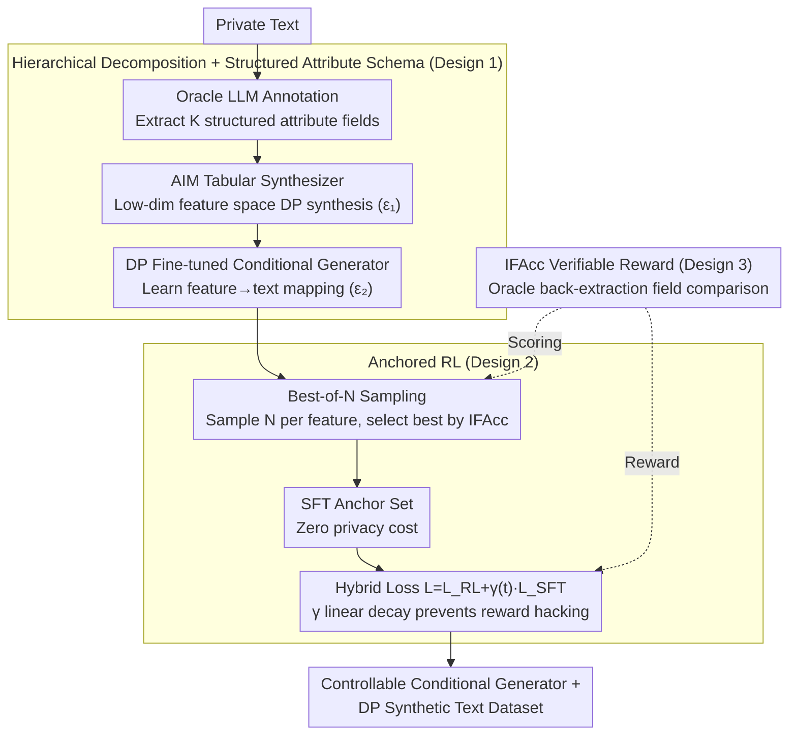

# ACTG-ARL: Differentially Private Conditional Text Generation with RL-Boosted Control

**Conference**: ICML 2026  
**arXiv**: [2510.18232](https://arxiv.org/abs/2510.18232)  
**Code**: https://github.com/actg-arl/ACTG-ARL  
**Area**: Differential Privacy / Text Generation / Reinforcement Learning Alignment  
**Keywords**: Private Synthetic Data, Conditional Text Generation, Attribute Control, Instruction Following, Reward Hacking

## TL;DR
This paper proposes ACTG, a hierarchical framework that decomposes private text generation into two sub-tasks: feature learning and conditional text generation. It further introduces Anchored RL, which enhances the instruction-following capabilities of the conditional generator through a hybrid reinforcement learning objective and SFT anchors based on best-of-N sampling, achieving a 20% improvement in MAUVE on biomedical data compared to prior work while maintaining text fidelity.

## Background & Motivation

**Background**
Modern AI applications rely on massive amounts of user data (mobile input, recommendation history, dialogue preferences, etc.), which carry high privacy risks. Generating private synthetic data is a promising paradigm that allows downstream tasks to reuse synthetic data without additional privacy costs. While DP synthetic text is a trending topic, existing works primarily focus on generating static datasets, overlooking the practical need for fine-grained control.

**Limitations of Prior Work**
1. **CTCL Limitations**: Reliance on pre-trained general topic models may result in a mismatch with private domain data. Forcing fine-grained text into coarse categories leads to inaccurate topic inference. When the dataset size is small relative to the number of topics, histograms contain many null values, causing signals to be drowned in noise after denoising.
2. **Difficulty in Balancing Control and Fidelity**: Traditional RL optimization leads to reward hacking, where models learn to generate outputs that formally satisfy constraints but suffer from degraded text quality (e.g., TL;DR style summaries).

**Key Challenge**
The distribution matching objective encourages sampling from high-density regions of $P(X,Y)$ (areas where the model is already confident), whereas the value of data augmentation stems from low-density regions (uncertain boundaries or under-represented groups). This leads to a goal misalignment between the generator and the augmentation task.

**Goal**
1. Construct a modular framework to identify optimal configurations through systematic ablation.
2. Improve the instruction-following capabilities of the conditional generator while maintaining privacy.

**Key Insight**
Starting from "attribute conditioning," structured tabular patterns are utilized as features, combined with a DP feature generator and a DP fine-tuned conditional generator. Furthermore, reinforcement learning is integrated with feature constraints to construct verifiable reward signals.

**Core Idea**
Hierarchical decomposition: First, structured patterns $\mathcal{D}_{\text{priv}}^f$ are extracted from private data, and a DP tabular synthesizer is used to generate private features $\mathcal{D}_{\text{syn}}^{\tilde{f}}$. Second, DP fine-tuning learns the conditional mapping from features to text. Finally, Anchored RL uses best-of-N data as SFT anchors to prevent reinforcement learning drift, achieving hybrid optimization with $\mathcal{L}=\mathcal{L}_{\text{RL}}+\gamma\cdot\mathcal{L}_{\text{SFT}}$.

## Method

### Overall Architecture
ACTG-ARL decomposes "private conditional text generation" into a pipeline: First, an Oracle LLM extracts a structured attribute matrix from private text; then, a tabular synthesizer performs differential privacy synthesis in a low-dimensional feature space; next, a "feature-to-text" conditional generator $G_{x|f}$ is DP fine-tuned. Finally, Anchored RL further enhances the instruction-following capability of this generator without touching the original private data. The entire pipeline splits the privacy budget into two segments: $\varepsilon_1$ (feature synthesis) and $\varepsilon_2$ (conditional fine-tuning), while the RL phase is essentially "free" as it samples only from the model itself.

### Key Designs

**1. Hierarchical Decomposition + Structured Attribute Schema: Concentrating the Privacy Budget**

Directly DP fine-tuning an LLM to learn the private text distribution end-to-end thins the limited privacy budget across massive tokens, resulting in poor quality. CTCL uses general topics as conditions but faces domain mismatch—pre-trained topic models often do not align with private data, forcing fine text into coarse categories; moreover, when the dataset is small relative to the number of topics, histograms become sparse, and signals are lost in noise. This work splits the problem: the first layer learns only the **marginal distribution of features**—a low-dimensional tabular space where mature synthesizers like AIM can be used, utilizing the privacy budget far more efficiently than working in text space. The second layer learns the **text distribution conditioned on features** $G_{x|f}$ via DP fine-tuning. Crucially, the attribute schema consists of $K$ structured fields (each with predefined options) designed by experts or Oracle LLMs on the private data, naturally fitting the data's inherent structure. This concentrates the privacy budget on "critical dimensions," avoids sparse histograms, and aligns with the natural hierarchy of the data.

**2. Anchored RL: Model Self-Sampling as Anchors for Zero-Cost Prevention of Reward Hacking**

Standard PPO optimization for instruction following often triggers reward hacking—the model learns to satisfy attribute constraints formally while the text quality collapses (standard PPO dropped MAUVE from 0.73 to 0.42 in ablations). This solution draws from RLHF's concept of using a reference KL to anchor the policy near a reference distribution, but replaces it with a non-private anchor source: for each feature $f$, $N$ candidates are sampled from the already DP fine-tuned $G_{x|f}$, and the one with the highest instruction-following accuracy (IFAcc) is selected to build an SFT anchor set $D_{\text{SFT}_N}$. Since these samples originate entirely from the privatized model, constructing anchors **incurs no additional privacy cost**. During training, a hybrid loss $\mathcal{L}=\mathcal{L}_{\text{RL}}+\gamma(t)\cdot\mathcal{L}_{\text{SFT}}$ is used, where the weight $\gamma(t)$ decays linearly—maintaining high fidelity early on and allowing room for instruction-following improvement later. This ultimately increases IFAcc from 0.53 to 0.62 while maintaining MAUVE.

**3. Instruction Following Accuracy (IFAcc): Turning Constraint Adherence into Verifiable Rewards**

A major difficulty for RL in generation tasks is the lack of clear, automatically evaluable rewards; the structured attribute space naturally provides one. For a generated text, an Oracle LLM back-extracts its attributes $\hat{f}$, which are compared field-by-field with the target features $f$ to define IFAcc:

$$\text{IFAcc}=\mathbb{E}_f\Big[\tfrac{1}{K}\sum_{k=1}^K\mathbb{I}(f_k=\hat{f}_k)\Big]$$

This metric serves a dual purpose: as a reward signal during the RL phase and as a scoring criterion for best-of-N anchor filtering, transforming the fuzzy semantic judgment of "constraint adherence" into a formalized, automatically verifiable attribute extraction problem.

### Loss & Training
The total privacy budget is aggregated over two stages $\varepsilon=\varepsilon_1+\varepsilon_2$. For each total budget $\varepsilon\in\{1,4,\infty\}$, the split $(\varepsilon_1, \varepsilon_2)$ is independently optimized with $\delta=1/(n\log n)$. Experiments indicate that for $\varepsilon=4$, the optimal split is approximately $(1.5, 2.5)$ or $(2, 2)$, suggesting both stages require sufficient budget. The hybrid loss $\mathcal{L}=\mathcal{L}_{\text{RL}}+\gamma(t)\mathcal{L}_{\text{SFT}}$ in the RL phase starts from the $G_{x|f}$ checkpoint, with $\gamma(t)$ decaying linearly to balance fidelity and instruction following.

## Key Experimental Results

### Main Results

| Dataset | Method | MAUVE | F1 Class | NTP Acc | IFAcc | $d_{\text{JS}}^f$ |
|--------|------|-------|--------|--------|-------|----------|
| bioRxiv(ε=4) | Aug-PE | 0.68 | 0.72 | - | - | 0.15 |
| | vanilla DP-FT | 0.62 | 0.68 | 0.41 | 0.53 | 0.18 |
| | CTCL | 0.64 | 0.70 | 0.42 | 0.48 | 0.16 |
| | **Ours** (ACTG) | 0.73 | 0.76 | 0.56 | 0.53 | 0.09 |
| | **Ours** (ACTG-ARL) | **0.74** | **0.79** | **0.58** | **0.62** | **0.08** |
| PMC-Patients(ε=4) | CTCL | 0.59 | 0.64 | 0.38 | 0.48 | 0.20 |
| | **Ours** (ACTG) | **0.71** | 0.75 | 0.51 | 0.50 | 0.10 |
| | **Ours** (ACTG-ARL) | 0.70 | **0.77** | **0.53** | **0.58** | **0.09** |

### Ablation Study

| Component | Remove/Replace | MAUVE | IFAcc | $d_{\text{JS}}^f$ | Description |
|------|---------|-------|-------|----------|------|
| Feature Model | Use CTCL General Topics | 0.64 | 0.48 | 0.16 | Significant drop with general topics |
| Feature Generator | DP-FT instead of AIM | 0.68 | 0.50 | 0.12 | AIM performs better (less budget waste) |
| Conditional Gen. | Prompting instead of DP-FT | 0.61 | 0.55 | 0.14 | Fine-tuned version is more stable |
| Full ACTG | - | 0.73 | 0.53 | 0.09 | Baseline |
| +Standard PPO | No Anchors | 0.42 | 0.68 | 0.22 | Severe reward hacking, MAUVE collapse |
| +Anchored RL | Full Method | 0.74 | 0.62 | 0.08 | Improved IFAcc while maintaining fidelity |

### Key Findings
- **Criticality of Feature Design**: Structured attribute schemas significantly outperform general topics, increasing MAUVE from 0.64 to 0.73 (+14%) on bioRxiv.
- **Table vs. Text Feature Generation**: AIM (tabular) saves privacy budget compared to DP-FT (text), resulting in smaller error $d_{\text{JS}}^f$ (0.12 vs. 0.14).
- **Severity of RL Reward Hacking**: Standard PPO destroys MAUVE (0.73 to 0.42), while Anchored RL recovers it to 0.74 (IFAcc 0.53 $\rightarrow$ 0.62).
- **Effect of Best-of-N**: Selecting the best from N=5 or 10 candidates produces high-quality, diverse SFT datasets without increasing privacy costs.
- **Privacy Budget Split**: For $\varepsilon=4$, the optimal split is roughly $(\varepsilon_1, \varepsilon_2) \approx (1.5, 2.5)$ or $(2, 2)$, showing both stages need adequate funding.

## Highlights & Insights
- **Elegance of Hierarchical Design**: Decomposing complex end-to-end DP text generation into low-dimensional tabular synthesis + conditional text generation improves modularity and allows the use of optimal tools for each task (AIM vs. LLM fine-tuning).
- **Pragmatic Ingenuity of Anchored RL**: Extracting references from the model itself via best-of-N sampling avoids private data access, incurring zero privacy cost while effectively preventing reward hacking—a clever adaptation of RLHF for privacy scenarios.
- **Attribute Matching as Reward**: Using the structured attribute space as the basis for the IFAcc metric transforms semantic understanding into a formalized attribute extraction problem, facilitating automation and verification.

## Limitations & Future Work
- **Limited Scope of Models and Data**: Experiments were conducted only on gemma-3-1b-pt in the biomedical domain, without covering law, finance, or dialogue, nor exploring the performance of larger models.
- **Assumed Attribute Space Design**: The paper does not detail how to automate the design of optimal attribute schemas, currently relying on humans or Oracle LLMs, which may be an application bottleneck.
- **Privacy Budget Split Optimization**: The $(\varepsilon_1, \varepsilon_2)$ split is determined via hyperparameter tuning, lacking theoretical guidance or adaptive strategies.

## Related Work & Insights
- **vs. DP-FT**: Direct application of DP fine-tuning on LLMs without considering conditional control or structured features leads to significant quality degradation. This work improves through hierarchy and attribute conditioning.
- **vs. CTCL**: Both use conditioning, but CTCL uses fixed general topics; this work uses data-specific attribute schemas, significantly improving schema-data alignment.
- **vs. Aug-PE (Private Evolution)**: While PE uses LLM iterative refinement, this work uses direct fine-tuning + RL, proving more stable in the biomedical domain.

## Rating
- Novelty: ⭐⭐⭐⭐ The hierarchical framework and Anchored RL are both new contributions; the idea of zero-cost anchors via best-of-N is clever.
- Experimental Thoroughness: ⭐⭐⭐⭐ Two biomedical datasets, multi-dimensional evaluation, and thorough ablation. A slight drawback is not covering multiple dataset families.
- Writing Quality: ⭐⭐⭐⭐ Clear problem description, complete algorithm pseudocode, and sufficient experimental details.
- Value: ⭐⭐⭐⭐ Practical demand for DP synthetic text is addressed (+20% MAUVE); systematic exploration of conditional control in privacy applications is highly practical.

<!-- RELATED:START -->

## Related Papers

- [\[ICML 2026\] Privacy Amplification in Differentially Private Zeroth-Order Optimization with Hidden States](privacy_amplification_in_differentially_private_zeroth-order_optimization_with_h.md)
- [\[ICML 2026\] Differentially Private Preference Data Synthesis for Large Language Model Alignment](differentially_private_preference_data_synthesis_for_large_language_model_alignm.md)
- [\[ICML 2026\] PRISM: Gauge-Invariant Tangent-Space Differentially Private LoRA](prism_gauge-invariant_tangent-space_differentially_private_lora.md)
- [\[ICML 2026\] Optimizing Token Choice for Code Watermarking: An RL Approach](optimizing_token_choice_for_code_watermarking_an_rl_approach.md)
- [\[CVPR 2026\] One-to-More: High-Fidelity Training-Free Anomaly Generation with Attention Control](../../CVPR2026/ai_safety/one-to-more_high-fidelity_training-free_anomaly_generation_with_attention_control.md)

<!-- RELATED:END -->
