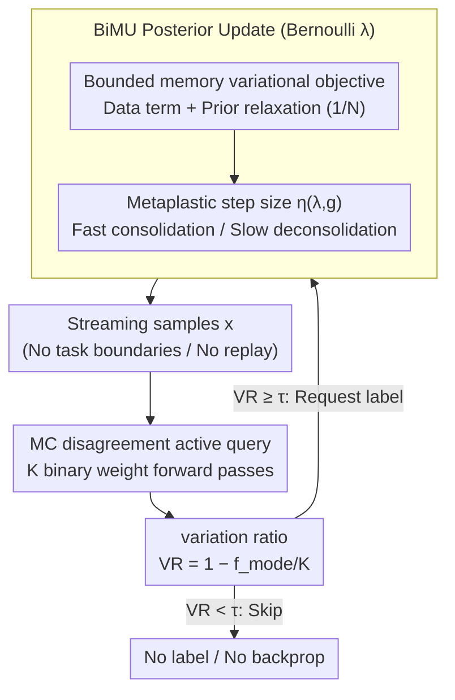

# Active Continual Learning with Metaplastic Binary Bayesian Neural Networks

**Conference**: ICML2026  
**arXiv**: [2605.30198](https://arxiv.org/abs/2605.30198)  
**Code**: https://github.com/kellian-cottart/active-continual-learning-bayesianbinn  
**Area**: Model Compression / Continual Learning / Active Learning  
**Keywords**: Binary Bayesian Neural Networks, Continual Learning, Active Learning, Posterior Uncertainty, Edge Intelligence  

## TL;DR
BiMU designs bounded-memory and uncertainty-aware metaplastic updates for binary Bayesian neural networks to prevent Bernoulli posterior saturation in long-range non-stationary streams, utilizing Monte Carlo disagreement for buffer-free one-shot active queries to significantly reduce label and backpropagation costs.

## Background & Motivation
**Background**: Always-on edge systems require long-term online inference and continual learning as user, sensor, or environment distributions change. Binary Neural Networks (BNNs) reduce storage, MAC operations, and data movement costs using $\{-1,+1\}$ weights and activations; Bayesian BNNs further provide epistemic uncertainty for OOD detection and reliability monitoring.

**Limitations of Prior Work**: Mean-field Bernoulli posteriors are prone to saturation over long data streams. As evidence accumulates, the natural parameter $|\lambda|$ increases, weight sampling becomes nearly deterministic, posterior uncertainty vanishes, and synapses find it difficult to flip signs. For continual learning, this leads to model rigidity and an inability to adapt to new tasks; for active learning, it renders the uncertainty signal ineffective.

**Key Challenge**: Edge devices must stably remember the past without infinite evidence accumulation leading to freezing; they must perform online learning without replay buffers or frequent backpropagation; and they need low-bit inference while retaining sufficient Bayesian uncertainty to decide when to request labels.

**Goal**: The authors aim to derive a fully online, buffer-free continual learning rule for mean-field Bernoulli synapses, enabling binary networks to maintain plasticity and OOD uncertainty in non-stationary streams of up to 1000 tasks, while utilizing this uncertainty for one-shot active queries to reduce labeling and update costs.

**Key Insight**: Starting from bounded-memory Bayesian learning and forgetting, the objective of "retaining only information from the most recent $N$ update windows" is formulated as a variational target. Expanding for Bernoulli posteriors yields a data term, a forgetting term that relaxes toward the prior, and a metaplastic step size that varies with uncertainty and gradient direction.

**Core Idea**: The natural parameter updates of the binary Bayesian posterior are designed as "data-driven + bounded forgetting + uncertainty-aware step size," preventing binary synapses from freezing due to long-term evidence accumulation.

## Method

### Overall Architecture
BiMU addresses the "posterior saturation" problem of binary Bayesian networks in long-range non-stationary streams. Each binary synapse $\omega \in \{-1,+1\}$ is parameterized by a Bernoulli natural parameter $\lambda$, where $\lambda=0$ represents maximum uncertainty. Larger $|\lambda|$ indicates higher weight certainty, and standard Bayesian updates push $|\lambda|$ higher until synapses freeze. BiMU coordinates three mechanisms: current batch data-driven consolidation, a bounded forgetting term (controlled by a memory window) pulling the posterior toward the prior, and an asymmetric step size based on the alignment of the gradient and current sign. During inference, MC disagreement from multiple binary weight samplings is used for one-shot active querying to decide on requesting labels and performing backpropagation. The entire process is buffer-free and does not require task boundaries.

### Key Designs

**1. Bounded-memory Bernoulli variational objective: Allowing forgetting instead of infinite evidence accumulation**

The root cause of rigidity in long-term continual learning is that evidence is infinitely accumulated into $|\lambda|$, making synapses harder to flip. BiMU formulates the variational objective as the sum of three terms: the current data term, a KL stability term toward the previous posterior, and a KL forgetting term toward the initialization prior with a weight of $1/N$, where $N$ is the sliding window size or evidence half-life. The derivative of the Bernoulli posterior includes a prior relaxation term $(\lambda_{t-1}^{(i)}-\lambda_{prior}^{(i)})/(N\cosh^2(\lambda_{t-1}^{(i)}))$, which continuously pulls certain synapses slightly back toward the prior. A smaller $N$ implies faster forgetting and more plasticity, while a larger $N$ approaches cumulative learning and rigidity.

**2. Uncertainty-aware metaplastic step size: Fast consolidation, slow deconsolidation**

Real data streams contain both stable structures and short-term noise. BiMU utilizes a bounded surrogate learning rate $\eta(\lambda,g)$ instead of calculating the expensive Hessian. The step size depends on the relationship between the sign of the current $\lambda$ and the gradient $g$. When $\lambda g < 0$ (gradient reinforces the current sign), the step size approaches the upper bound $\alpha_{max}$ for fast consolidation. When $\lambda g > 0$ (gradient attempts to flip the sign), the step size is reduced, requiring consistent counter-evidence to deconsolidate. This asymmetric dynamic allows synapses to learn new tasks without old memories being easily erased by noise.

**3. One-shot active querying via MC disagreement: Converting retained uncertainty into label savings**

The first two designs preserve epistemic uncertainty, which the third design converts into budget savings. Edge devices cannot buffer unlabeled pools for sorting or handle frequent backpropagation. BiMU performs $K$ Monte Carlo (MC) forwards per sample to obtain multiple predicted classes and calculates the variation ratio $VR=1-f_{mode}/K$. Higher $VR$ indicates higher disagreement and potential learning value. If $VR \ge \tau$, a one-shot label request and BiMU update are triggered; otherwise, the sample is skipped. Since binary forward passes can use bit-level operations, the cost of $K$ samplings is significantly lower than a single backpropagation and weight write.

### Loss & Training
Data term gradients are estimated via Concrete / Gumbel-softmax relaxation, backpropagated through relaxed binary weights, and averaged over $K$ MC samples. Key hyperparameters include the memory window $N$, maximum metaplastic step size $\alpha_{max}$, likelihood/KL scaling coefficients, and the active learning threshold $\tau$. Experiments include 1000-task Permuted-MNIST, OpenLORIS-Object with frozen VGG19 features and online linear heads, and imbalanced active learning on Animals/OpenLORIS.

## Key Experimental Results

### Main Results
1000-task Permuted-MNIST tests long-range continual learning and OOD uncertainty. BiMU is the only binary method maintaining high accuracy after 1000 tasks.

| Method | Task bounds | Last 5 tasks Acc | OOD AUC | MMRR | Single-task Acc | Note |
|------|-------------|------------------|---------|------|-----------------|------|
| BiMU | no | 90.30±0.38 | 0.99±0.00 | 139.47 | 94.67±0.11 | Most stable binary method; no task boundaries |
| BayesBiNN | yes | 41.12±1.62 | 0.57±0.12 | 2.04 | 93.22±0.09 | Rigidity due to posterior saturation |
| Syn. Meta. | yes | 10.27±0.01 | - | 1.64 | 71.40±1.48 | Irreversible strong metaplasticity |
| STE | no | 29.35±0.96 | 0.69±0.04 | 9.32 | 77.56±1.35 | Lacks continual learning mechanism |
| MESU | no | 91.69±0.58 | 0.95±0.03 | 261.10 | 96.10±0.18 | Strong real-valued Bayesian baseline |
| EWC Online | yes | 81.78±0.82 | 0.66±0.11 | 6.63 | 96.06±0.11 | Underperforms BiMU even with task boundaries |

OpenLORIS-Object uses frozen VGG19 features with online linear heads to evaluate nuisance-factor shifts and feature compression.

| Method | Features | Mean Acc | Aleatoric AUC | Epistemic AUC | Note |
|------|----------|----------|---------------|---------------|------|
| BiMU | 1,024 | 73.61±1.53 | 0.96±0.01 | 1.00±0.00 | Retains usability under strong compression |
| BayesBiNN | 1,024 | 72.01±1.69 | 0.93±0.01 | 1.00±0.00 | Close to BiMU on short horizons |
| STE | 1,024 | 52.88±3.39 | 0.73±0.02 | - | Poor performance of deterministic baseline |
| BiMU | 8,192 | 89.19±0.19 | 0.99±0.00 | 1.00±0.00 | High accuracy with ~3x compression |
| BiMU | 25,088 | 90.62±0.22 | 0.93±0.00 | 0.90±0.00 | Outperforms real-valued baselines on raw features |

Active learning results show BiMU converts uncertainty into actual label/update savings.

| Scenario | Method / Setting | Label or Update Ratio | Accuracy | Conclusion |
|------|-------------|----------------|--------|------|
| Animals imbalanced | VR querying | 11% labels | 84.46% | Close to 100% update baseline |
| Animals imbalanced | VR querying | 18% labels | 87.12% | Outperforms 100% update baseline (86.28%) |
| OpenLORIS imbalanced | BiMU VR | 3.1% updates | 88.70% | 32× savings vs. full stream (87.76%) |
| OpenLORIS imbalanced | BiMU VR | 4.0% updates | 90.91% | 25× savings with higher accuracy |

### Ablation Study
Memory window and activation ablation explain the stability-plasticity mechanism of BiMU.

| Ablation | Configuration | Result | Insight |
|------|------|------|------|
| Network Capacity | 2000 hidden units | BiMU 95.20±0.26 Acc | Outperforms real-valued baseline with increased capacity |
| Memory overhead | BiMU | 0.32 MB | Training memory equals inference; no history stored |
| Memory overhead | BayesBiNN | 0.64 MB | Requires extra posterior states |
| Memory overhead | Syn. Meta. | 1.84 MB | High cost due to Adam states and task BN |

| Activation / Method | Last 5 tasks Acc | OOD AUC | MMRR | Note |
|-------------------|------------------|---------|------|------|
| BiMU + Sign | 81.78±0.58 | 0.76±0.08 | 22.25 | Effective mechanism but weaker uncertainty |
| BiMU + RBG | 90.29±0.24 | 0.99±0.01 | 215.52 | RBG enhances representation and uncertainty |
| BayesBiNN + Sign | 66.40±0.97 | 0.54±0.19 | 5.85 | Activation change does not solve rigidity |
| BayesBiNN + RBG | 67.41±1.03 | 0.76±0.17 | 4.99 | Long-term rigidity persists |

Analysis of MC sample count in OpenLORIS active learning.

| MC samples | Accuracy | Data used | Threshold | Note |
|------------|----------|-----------|-----------|------|
| 2 | 89.30±0.88 | 3.30±0.04% | 0.50 | Efficient query with minimal sampling |
| 10 | 90.91±0.98 | 3.97±0.03% | 0.10 | Main experimental setting |
| Full stream baseline | 87.76±0.19 | 100% | - | Active query can surpass full-stream updates |

### Key Findings
- BiMU's primary advantage stems from preventing posterior saturation. While BayesBiNN is accurate on single tasks, it becomes rigid in long streams; BiMU maintains long-term adaptation via bounded forgetting and metaplastic step sizes.
- Uncertainty serves as both a diagnostic metric and a computational saving mechanism. VR querying focuses updates on distribution shifts and low-frequency classes, avoiding redundant majority-class samples.
- MC uncertainty for binary models is practical for edge scenarios. Multiple forward passes can be optimized via bit-level operations, whereas backpropagation and weight writing are the main bottlenecks.
- The memory window $N$ is an interpretable control knob. Low $N$ leads to rapid forgetting, while high $N$ approaches cumulative learning and rigidity.

## Highlights & Insights
- The paper combines "BNN computational efficiency" with "Bayesian uncertainty," rather than treating BNNs solely as compression models. BiMU allows low-bit models to express long-term epistemic uncertainty.
- Deriving binary synapse updates from a bounded-memory Bayesian objective is more principled than heuristic metaplastic rules and explains the consolidation/deconsolidation asymmetry.
- The active learning design is realistic for the edge: no pools, no replay, and no task boundaries, using a single threshold to decide on label and backpropagation costs.
- The finding that active querying can outperform 1000% update baselines suggests that "updating on fewer but correct samples" may be more effective than full-stream online SGD in imbalanced streams.

## Limitations & Future Work
- BiMU still requires MC forward passes to estimate uncertainty. Although binary forwards are cheap, the trade-offs between $K$, threshold, and latency need fine-tuning for ultra-low-power devices.
- Experiments rely heavily on frozen VGG19 features and online linear heads; end-to-end binary CNN/Transformer continual learning requires further validation.
- VR may fail during pure label-function shifts; unlabeled uncertainty may not detect changes in $p(y|x)$ when $p(x)$ remains familiar.
- Multiple hyperparameters ($N$, $\alpha_{max}$, KL/likelihood scaling, $\tau$) require automatic adjustment across different hardware and streams.
- Gradient estimation using Concrete relaxation may introduce training instability due to relaxation temperature and sampling variance.

## Related Work & Insights
- **vs. BayesBiNN**: BayesBiNN provides a Bernoulli posterior but suffers from saturation in long streams; BiMU adds bounded forgetting and metaplastic step sizes to maintain plasticity.
- **vs. MESU**: MESU also uses bounded-memory Bayesian learning but for real-valued Gaussian posteriors; BiMU adapts these ideas to Bernoulli binary synapses, reducing training memory.
- **vs. EWC / SI**: EWC/SI protect old knowledge via importance constraints but require extra states/task boundaries and can lead to rigidity; BiMU requires no task boundaries or replay.
- **vs. pool-based active learning**: Traditional active learning assumes a sorted unlabeled pool; BiMU uses one-shot threshold queries on a stream, better suited for always-on edge devices.

## Rating
- Novelty: ⭐⭐⭐⭐☆ Integrates bounded-memory Bayesian learning, binary posterior metaplasticity, and online active learning comprehensively.
- Experimental Thoroughness: ⭐⭐⭐⭐☆ Extensive evaluation on Permuted-MNIST, OpenLORIS, and Animals, with thorough ablations; could extend to more end-to-end visual models.
- Writing Quality: ⭐⭐⭐⭐☆ Clear derivations and experimental narrative, though symbol density is high.
- Value: ⭐⭐⭐⭐⭐ Direct relevance to edge continual learning, low-bit Bayesian models, and low-cost active labeling.

<!-- RELATED:START -->

## Related Papers

- [\[ICML 2026\] Singular Bayesian Neural Networks](singular_bayesian_neural_networks.md)
- [\[ICML 2026\] Frequency Matching in Spiking Neural Networks for mmWave Sensing](frequency_matching_in_spiking_neural_networks_for_mmwave_sensing.md)
- [\[CVPR 2026\] Federated Active Learning Under Extreme Non-IID and Global Class Imbalance](../../CVPR2026/ai_safety/federated_active_learning_extreme_noniid.md)
- [\[ICML 2026\] How Does Bayesian Sampling Help Membership Inference Attacks?](how_does_bayesian_sampling_help_membership_inference_attacks.md)
- [\[CVPR 2026\] Towards Reliable Evaluation of Adversarial Robustness for Spiking Neural Networks](../../CVPR2026/ai_safety/towards_reliable_evaluation_of_adversarial_robustness_for_spiking_neural_network.md)

<!-- RELATED:END -->
