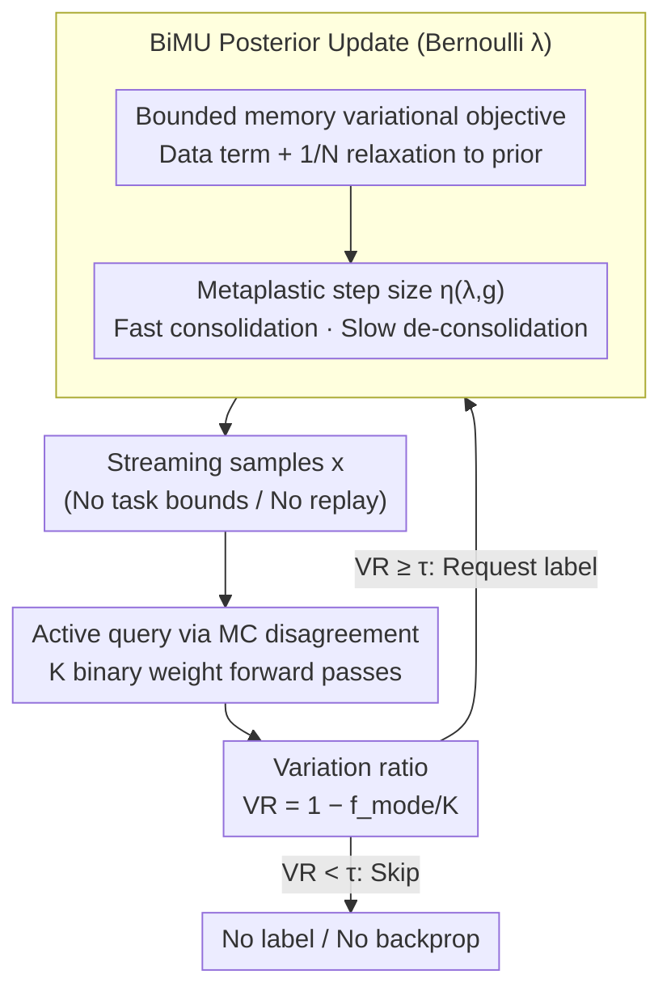

# Active Continual Learning with Metaplastic Binary Bayesian Neural Networks

**Conference**: ICML2026  
**arXiv**: [2605.30198](https://arxiv.org/abs/2605.30198)  
**Code**: https://github.com/kellian-cottart/active-continual-learning-bayesianbinn  
**Area**: Model Compression / Continual Learning / Active Learning  
**Keywords**: Binary Bayesian Neural Networks, Continual Learning, Active Learning, Posterior Uncertainty, Edge AI  

## TL;DR
BiMU designs bounded-memory and uncertainty-aware metaplastic updates for binary Bayesian neural networks to prevent Bernoulli posterior saturation in long-range non-stationary streams. It utilizes Monte Carlo disagreement for buffer-free one-pass active querying, significantly reducing label requirements and backpropagation updates.

## Background & Motivation
**Background**: Always-on edge systems require long-term online inference and continuous learning as user, sensor, or environmental distributions change. Binary Neural Networks (BNNs) reduce storage, MAC, and data movement costs using $\{-1,+1\}$ weights and activations. Bayesian BNNs further provide epistemic uncertainty for OOD detection and reliability monitoring.

**Limitations of Prior Work**: Mean-field Bernoulli posteriors tend to saturate over long data streams. As evidence accumulates, the natural parameter $|\lambda|$ becomes increasingly large, weight sampling becomes almost deterministic, and posterior uncertainty vanishes, making it difficult for synapses to flip signs. For continual learning, this leads to model rigidity and an inability to adapt to new tasks; for active learning, it causes the uncertainty signal to fail.

**Key Challenge**: Edge devices must stably remember the past without freezing due to infinite evidence accumulation. They need to learn online without storing a replay buffer or performing frequent backpropagation, while maintaining sufficient Bayesian uncertainty to decide when to request labels.

**Goal**: The authors aim to derive a fully online, buffer-free continual learning rule for mean-field Bernoulli synapses. The objective is to maintain plasticity and OOD uncertainty even in non-stationary streams of up to 1000 tasks, using this uncertainty for one-pass active querying to reduce labeling and update costs.

**Key Insight**: Starting from bounded-memory Bayesian learning and forgetting, the authors formulate a variational objective to "retain information only from the most recent $N$ update windows." Expanding this for the Bernoulli posterior yields a data-driven term, a forgetting term relaxing toward the prior, and a metaplastic step size that varies with uncertainty and gradient direction.

**Core Idea**: The natural parameter updates of the binary Bayesian posterior are designed with "data-driven consolidation + bounded forgetting + uncertainty-aware step size" to ensure binary synapses do not freeze due to long-term evidence accumulation.

## Method

### Overall Architecture
BiMU addresses the "posterior saturation" problem of binary Bayesian networks in long-range non-stationary streams. Each binary synapse $\omega\in\{-1,+1\}$ is parameterized by a Bernoulli natural parameter $\lambda$, where $\lambda=0$ represents maximum uncertainty. Larger $|\lambda|$ values indicate higher weight certainty. Standard Bayesian updates push $|\lambda|$ to infinity, freezing synapses and eliminating uncertainty. BiMU coordinates three mechanisms: current batch data-driven consolidation, a bounded forgetting term controlled by a memory window to pull the posterior back toward the prior, and an asymmetric step size based on whether the gradient aligns with the current sign. During inference, MC disagreement from multiple binary weight samples is used for one-pass active querying to decide whether to incur label and backpropagation costs. The process uses only the current batch without a replay buffer or task boundaries.

### Key Designs

**1. Bounded-memory Bernoulli variational objective: Forgetting instead of infinite accumulation**

The root cause of rigidity in continual learning is that evidence is infinitely accumulated into $|\lambda|$, making it harder for synapses to flip signs. BiMU formulates the variational objective as a sum of three terms: the current data term, a KL stability term to the previous posterior, and a KL forgetting term to the initialization prior. The forgetting term is weighted by $1/N$, where $N$ represents the sliding window size or evidence half-life. Deriving the update for the Bernoulli posterior introduces a prior relaxation term $(\lambda_{t-1}^{(i)}-\lambda_{prior}^{(i)})/(N\cosh^2(\lambda_{t-1}^{(i)}))$, which continuously pulls certain synapses slightly back toward the prior. A smaller $N$ implies faster forgetting and higher plasticity, while a larger $N$ approaches cumulative learning.

**2. Uncertainty-aware metaplastic step size: Fast consolidation, slow de-consolidation**

Real data streams contain both stable structures and short-term noise or class imbalances. BiMU uses a bounded surrogate learning rate $\eta(\lambda,g)$ instead of calculating the expensive Hessian. The step size depends on the relationship between the sign of the current $\lambda$ and the gradient $g$. When $\lambda g < 0$ (the gradient reinforces the current sign), the step size approaches the upper bound $\alpha_{max}$ for rapid consolidation. When $\lambda g > 0$ (the gradient attempts to flip the sign), the step size is reduced, requiring sustained counter-evidence to trigger de-consolidation. This asymmetric dynamics allows binary synapses to learn new tasks without being easily erased by noise.

**3. One-pass active querying based on MC disagreement: Translating uncertainty into label savings**

The first two designs preserve epistemic uncertainty, which the third design converts into budget savings. Since edge devices cannot buffer unlabeled pools for sorting or handle frequent backpropagation, BiMU performs $K$ binary weight MC forward passes for each incoming sample. The variation ratio $VR=1-f_{mode}/K$ is calculated, where $f_{mode}$ is the frequency of the majority class. A higher $VR$ indicates greater sampler disagreement and higher potential learning value. Labels are requested once if $VR \ge \tau$; otherwise, the sample is skipped. As binary forward passes utilize bit-level operations, the cost of $K$ samplings is significantly lower than a single backpropagation and weight write.

### Loss & Training
Data term gradients are estimated using Concrete / Gumbel-softmax relaxation. Backpropagation is performed on relaxed binary weights and averaged over $K$ MC samples. Key hyperparameters include the memory window $N$, maximum metaplastic step size $\alpha_{max}$, likelihood/KL scaling coefficients, and the active learning threshold $\tau$. Experiments cover 1000-task Permuted-MNIST, online linear heads on frozen VGG19 features for OpenLORIS-Object, and imbalanced active learning on Animals/OpenLORIS.

## Key Experimental Results

### Main Results
1000-tasks Permuted-MNIST tests long-range continual learning and OOD uncertainty. BiMU is the only binary method that maintains high accuracy after 1000 tasks.

| Method | Task bounds | Last 5 tasks Acc | OOD AUC | MMRR | Single-task Acc | Note |
|------|-------------|------------------|---------|------|-----------------|------|
| BiMU | no | 90.30±0.38 | 0.99±0.00 | 139.47 | 94.67±0.11 | Most stable binary method; no task bounds |
| BayesBiNN | yes | 41.12±1.62 | 0.57±0.12 | 2.04 | 93.22±0.09 | Rigidity due to posterior saturation |
| Syn. Meta. | yes | 10.27±0.01 | - | 1.64 | 71.40±1.48 | Irreversible strong metaplasticity |
| STE | no | 29.35±0.96 | 0.69±0.04 | 9.32 | 77.56±1.35 | Lacks continual learning mechanism |
| MESU | no | 91.69±0.58 | 0.95±0.03 | 261.10 | 96.10±0.18 | Strong real-valued Bayesian baseline |
| EWC Online | yes | 81.78±0.82 | 0.66±0.11 | 6.63 | 96.06±0.11 | Underperforms BiMU even with task bounds |

OpenLORIS-Object uses frozen VGG19 features and an online linear head to evaluate nuisance-factor shifts.

| Method | Features | Mean Acc | Aleatoric AUC | Epistemic AUC | Note |
|------|----------|----------|---------------|---------------|------|
| BiMU | 1,024 | 73.61±1.53 | 0.96±0.01 | 1.00±0.00 | Usable under strong compression |
| BayesBiNN | 1,024 | 72.01±1.69 | 0.93±0.01 | 1.00±0.00 | Close to BiMU on short horizons |
| STE | 1,024 | 52.88±3.39 | 0.73±0.02 | - | Poor performance of deterministic BNN |
| BiMU | 8,192 | 89.19±0.19 | 0.99±0.00 | 1.00±0.00 | High accuracy at 3x compression |
| BiMU | 25,088 | 90.62±0.22 | 0.93±0.00 | 0.90±0.00 | Outperforms real-valued baselines |

Active learning results show that BiMU converts uncertainty into real label/update savings.

| Scenario | Method / Setting | Label/Update Ratio | Accuracy | Conclusion |
|------|-------------|----------------|--------|------|
| Animals imbalanced | VR querying | 11% labels | 84.46% | Close to 100% update baseline |
| Animals imbalanced | VR querying | 18% labels | 87.12% | Exceeds 100% update baseline (86.28%) |
| OpenLORIS imbalanced | BiMU VR | 3.1% updates | 88.70% | 32× savings vs. full stream (87.76%) |
| OpenLORIS imbalanced | BiMU VR | 4.0% updates | 90.91% | 25× savings with higher accuracy |

### Ablation Study
Memory window and activation ablations explain the stability-plasticity mechanism of BiMU.

| Ablation | Configuration | Result | Insight |
|------|------|------|------|
| Capacity | 2000 units | 95.20±0.26 Acc | BiMU scales better than real-valued baselines |
| Memory overhead | BiMU | 0.32 MB | Training memory equals inference memory |
| Memory overhead | BayesBiNN | 0.64 MB | Requires extra posterior states |
| Memory overhead | Syn. Meta. | 1.84 MB | Adam states and task BN increase costs |

| Activation / Method | Last 5 tasks Acc | OOD AUC | MMRR | Note |
|-------------------|------------------|---------|------|------|
| BiMU + Sign | 81.78±0.58 | 0.76±0.08 | 22.25 | BiMU mechanism works; weak uncertainty |
| BiMU + RBG | 90.29±0.24 | 0.99±0.01 | 215.52 | RBG enhances representation/uncertainty |
| BayesBiNN + Sign | 66.40±0.97 | 0.54±0.19 | 5.85 | Activation doesn't solve rigidity |

### Key Findings
- BiMU's primary advantage comes from preventing posterior saturation. While BayesBiNN has high single-task accuracy, it quickly becomes rigid; BiMU maintains long-term adaptation.
- Uncertainty is not just a diagnostic metric but a computational saving mechanism. VR querying concentrates updates on distribution shifts and low-frequency classes.
- MC uncertainty for binary models is realistic for edge scenarios. Multiple forward passes are cheap via bit-level operations, whereas backpropagation is the primary cost.
- The memory window $N$ provides an interpretable control knob. Small values lead to fast forgetting; large values lead to rigidity.

## Highlights & Insights
- This work effectively combines binary network efficiency with Bayesian uncertainty rather than treating binary networks solely as compression models.
- Deriving binary synapse updates from a bounded-memory Bayesian objective is more principled than heuristic metaplastic rules and explains asymmetric consolidation.
- The active learning design is tailored for edge realities: no pooling, no replay, and no task boundaries, using a single threshold for labeling decisions.
- In imbalanced streams, "updating less but on the right samples" sometimes outperforms full online SGD.

## Limitations & Future Work
- BiMU still requires MC forward passes to estimate uncertainty. While binary forwards are cheap, $K$ and threshold $\tau$ require careful balancing for extreme low-power devices.
- Experiments rely heavily on frozen VGG19 features; end-to-end binary CNN/Transformer continual learning requires further validation.
- VR may fail for pure label-function shifts where $p(x)$ is familiar but $p(y|x)$ changes.
- Hyperparameters such as $N$, $\alpha_{max}$, and scaling factors require automated tuning across different hardware and data flows.

## Related Work & Insights
- **vs BayesBiNN**: BayesBiNN provides Bernoulli posteriors but suffers from saturation; BiMU introduces bounded forgetting to maintain plasticity.
- **vs MESU**: MESU uses bounded-memory Bayesian learning for real-valued Gaussian posteriors; BiMU adapts this to Bernoulli binary synapses, reducing training memory.
- **vs EWC / SI**: These methods use importance to protect knowledge but require task boundaries and extra states; BiMU is task-boundary free without replay.
- **vs Pool-based AL**: Traditional AL assumes an unlabeled pool for sorting; BiMU performs one-pass threshold querying on a stream.

## Rating
- Novelty: ⭐⭐⭐⭐☆ Solid combination of bounded-memory Bayes, binary metaplasticity, and online AL.
- Experimental Thoroughness: ⭐⭐⭐⭐☆ Extensive testing on Permuted-MNIST and OpenLORIS; end-to-end vision models could be expanded.
- Writing Quality: ⭐⭐⭐⭐☆ Clear derivations and narrative; high symbol density.
- Value: ⭐⭐⭐⭐⭐ Direct relevance for edge continual learning and low-cost active labeling.

<!-- RELATED:START -->

## Related Papers

- [\[ICML 2026\] Singular Bayesian Neural Networks](singular_bayesian_neural_networks.md)
- [\[ICML 2026\] Understanding Generalization and Forgetting in In-Context Continual Learning](understanding_generalization_and_forgetting_in_in-context_continual_learning.md)
- [\[ICML 2026\] Frequency Matching in Spiking Neural Networks for mmWave Sensing](frequency_matching_in_spiking_neural_networks_for_mmwave_sensing.md)
- [\[CVPR 2026\] Federated Active Learning Under Extreme Non-IID and Global Class Imbalance](../../CVPR2026/ai_safety/federated_active_learning_extreme_noniid.md)
- [\[CVPR 2026\] $\varphi$-DPO: Fairness Direct Preference Optimization Approach to Continual Learning in Large Multimodal Models](../../CVPR2026/ai_safety/φ-dpo_fairness_direct_preference_optimization_approach_to_continual_learning_in_.md)

<!-- RELATED:END -->
