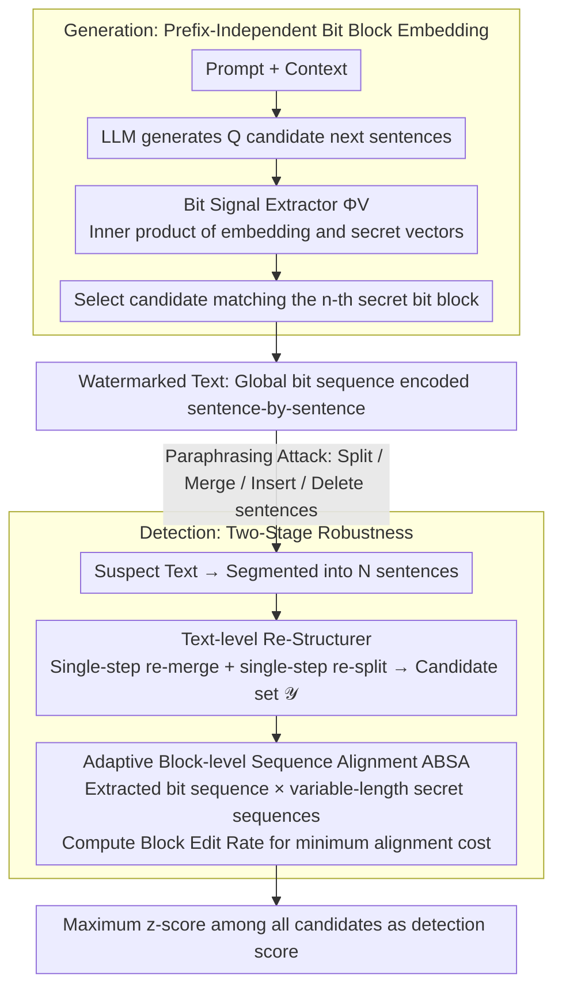

# AliMark: Enhancing Robustness of Sentence-Level Watermarking Against Text Paraphrasing

**Conference**: ICML 2026  
**arXiv**: [2605.29434](https://arxiv.org/abs/2605.29434)  
**Code**: https://github.com/imethanlee/AliMark  
**Area**: LLM Security / Text Watermarking  
**Keywords**: Sentence-level watermarking, Paraphrasing robustness, Sequence alignment, Structural perturbation, Watermark detection

## TL;DR
AliMark reformulates sentence-level text watermarking from "prefix-conditioned sentence-by-sentence detection" to "global secret bit sequence encoding and alignment." By utilizing text reconstruction and adaptive block edit distance, it significantly enhances detection robustness against strong paraphrasing attacks such as DIPPER and GPT-3.5.

## Background & Motivation
**Background**: LLM text watermarking is generally categorized into token-level and sentence-level methods. Token-level methods bias the sampling distribution during decoding and collect statistical signals during detection. Sentence-level methods anchor the watermark in the semantic embedding space, aiming to preserve detection signals after paraphrasing.

**Limitations of Prior Work**: Token-level watermarks are easily destroyed by synonymous substitution and rewriting. Although sentence-level watermarks are more robust against lexical changes, many prioritize KGW-style prefix designs: the watermark signal of a sentence depends on the preceding sentence or context. When a paraphraser splits one sentence into two, merges two into one, or inserts/deletes sentences, the "prefix" for subsequent sentences becomes misaligned, leading to a cascading loss of detection signals.

**Key Challenge**: While sentence-level watermarking relies on semantic stability, prefix conditions bind the detection of each sentence to a local structure. Strong paraphrasers often disrupt sentence boundaries and contextual order rather than semantics; thus, local prefix hashing amplifies structural perturbations into multi-sentence signal failures.

**Goal**: This paper aims to solve three specific problems: how to embed sentence-level signals without depending on local prefixes during generation, how to tolerate sentence splitting and merging during detection, and how to maintain low false-alarm detection capability after strong paraphrasing without significantly sacrificing text quality.

**Key Insight**: The authors observe that GPT-3.5 frequently changes the number of sentences when paraphrasing C4 text, indicating that "sentence boundary changes" are common behaviors of strong paraphrasers rather than edge cases. Consequently, they draw on sequence alignment ideas from token watermarking to treat the entire text as a sequence of bit blocks to be matched against a secret sequence.

**Core Idea**: Use a global secret bit sequence to replace prefix-dependent inter-sentence pseudo-random relationships, and employ text reconstruction and block-level edit distance alignment to absorb offsets caused by sentence splitting, merging, insertion, and deletion.

## Method
The key to AliMark is not the design of a more complex local hash, but rather changing the perspective from "whether each sentence hits a green zone" to "whether the entire text resembles a secret bit sequence." This shift modifies the interface at both generation and detection: during generation, each sentence carries a fixed-length bit block; during detection, block-level insertion, deletion, and substitution are allowed between the extracted bit sequence and the secret sequence.

### Overall Architecture
In the generation phase, given a prompt and context, the LLM generates $Q$ candidate next sentences. AliMark uses a sentence embedder to map each candidate to a semantic vector and computes the inner product with a set of orthogonal secret vectors; the sign of the $m$-th inner product determines the $m$-th watermark bit of the sentence. The global secret sequence is partitioned into blocks of length $M$, where the $n$-th sentence is required to match the $n$-th secret block. If a candidate matches perfectly, it is chosen randomly; otherwise, the one with the most matching bits is selected.

In the detection phase, the input text is first segmented into sentences and then processed through a two-stage robustness pipeline. The first stage, the Re-Structurer, generates potential re-merged or re-split versions of the text, forming a set of candidates including the original text, merged adjacent pairs, and split sentences. The second stage, Adaptive Bit Sequence Alignment (ABSA), extracts bit sequences for each candidate and performs dynamic programming alignment against secret sequences of varying lengths. The maximum watermark score across all candidates is used as the final detection score.

### Key Designs
**1. Prefix-Independent Bit Block Embedding: Anchoring signals to sentences themselves.** The vulnerability of prefix-based sentence watermarking lies in binding the detection zone of each sentence to the previous one. Once a paraphraser changes boundaries, all subsequent "prefixes" shift, causing cascading failures. AliMark uses a global secret bit sequence $\mathbf{s}$ as a context-independent key, divided into blocks of length $M$, where the $n$-th sentence carries the $n$-th block. During generation, the inner product of a candidate's semantic embedding $\mathbf{e}$ and orthogonal secret vectors $\mathbf{v}_m$ determines the bits (sign $<0$ is 0, otherwise 1). By decoupling from prefixes, a single boundary change does not collapse the entire sequence.

**2. Text-level Re-Structurer (RS): Proactively restoring disrupted boundaries.** Since attacks primarily damage boundaries rather than semantics, RS attempts to revert these changes before alignment. For $N$ sentences, it enumerates $N-1$ single-step merged candidates $\mathcal{X}^-$ and $N$ single-step split candidates $\mathcal{X}^+$. These, along with the original text, form the candidate set $\mathcal{Y}$. If the text is watermarked, at least one reconstruction candidate likely restores part of the structure, increasing the alignment score. The paper intentionally limits this to single-step operations to cover the most common DIPPER and GPT-3.5 perturbations with controllable computational cost.

**3. Adaptive Block-level Sequence Alignment (ABSA + BER): Absorbing residual misalignments.** Even after RS, sentence count deviations may persist. ABSA aligns the bit sequence $\mathbf{b}_{\mathbf{Y}}$ of each reconstruction candidate against variable-length secret sequences (with block counts in $[\alpha N', \beta N']$). Alignment cost is measured by Block Edit Rate (BER), which upgrades the standard Levenshtein distance to the block level: insertion and deletion costs are $M$, and substitution cost is the Hamming distance between bit blocks. Dynamic programming finds the minimum normalized block edit distance, converted to a $z$-score. BER is more natural for sentence watermarking as structural perturbations typically affect entire blocks.

### Loss & Training
AliMark is not an end-to-end trained model; it utilizes a frozen LLM, a frozen sentence embedder, and randomly generated secret vectors. The core hyperparameters for generation are block size $M$ and candidate budget $Q$; for detection, they are the number of reconstruction candidates, secret sequence length range $[\alpha N', \beta N']$, and BER dynamic programming parameters. The authors use `all-mpnet-base-v2` as the default embedder and vLLM to reduce KV-cache overhead during candidate generation.

## Key Experimental Results

### Main Results
The paper samples 500 samples each from Booksum and C4, using OPT-1.3B and Qwen3-1.7B as backbones, with Pegasus, Parrot, DIPPER, and GPT-3.5 as paraphraser attacks. The following table showcases TPR@5% results under OPT-1.3B.

| Dataset | Attack | AliMark TPR@5% | Prev. SOTA TPR@5% | Gain |
|---------|--------|----------------|-------------------|------|
| Booksum | DIPPER | 61.6 | 30.4 (PMark) | +31.2 |
| Booksum | GPT-3.5 | 66.6 | 33.0 (PMark) | +33.6 |
| C4 | DIPPER | 49.8 | 29.6 (PMark) | +20.2 |
| C4 | GPT-3.5 | 51.6 | 28.2 (PMark) | +23.4 |
| Booksum | Pegasus | 95.6 | 86.0 (PMark) | +9.6 |
| C4 | Parrot | 91.2 | 89.4 (PMark) | +1.8 |

### Ablation Study
The authors analyze the impact of the embedder, candidate budget, and detection modules.

| Configuration | Key Metric | Description |
|---------------|------------|-------------|
| all-mpnet-base-v2 | Booksum/GPT-3.5 TPR@5% 66.6 | Default embedder, most stable overall. |
| all-distilroberta-v1 | Booksum/GPT-3.5 TPR@5% 56.8 | Valid but shows significant drop under strong paraphrasing. |
| multi-qa-mpnet-base-dot-v1 | Booksum/GPT-3.5 TPR@5% 55.2 | Semantic space less suited for watermark blocks. |
| $Q=8$ | Booksum/GPT-3.5 TPR@5% 29.6 | Insufficient candidates to match secret blocks. |
| $Q=64$ | Booksum/GPT-3.5 TPR@5% 66.6 | Higher budget significantly improves embeddability. |
| AliMark Det. | Time for 128 sentences: 0.34s | RS and adaptive alignment introduce acceptable overhead. |
| w/o RS | Time for 128 sentences: 0.07s | Faster, but detection rate drops sharply under structural perturbation. |
| w/o Ada | Time for 128 sentences: 0.27s | Weakest against deletion and insertion without variable length alignment. |

### Key Findings
- AliMark's primary advantage lies in its resistance to strong paraphrasers like DIPPER and GPT-3.5 that alter sentence structure, suggesting the paper correctly identifies the core failure mode of sentence-level watermarks.
- The Re-Structurer is more critical than adaptive length alignment; removing RS leads to the largest drop in strong paraphrasing scenarios because splitting and merging first destroy sentence boundaries.
- The impact on text quality is minimal. Perplexity (PPL) for OPT-1.3B and Qwen3-1.7B remains close to unwatermarked output, though excessive $M$ values constrain the candidate semantic space.

## Highlights & Insights
- Reformulating sentence-level watermarking as sequence alignment is the paper's strongest abstraction. Instead of patching prefix hashes, it accepts that sentence boundaries drift and treats drift as alignable sequence offsets.
- The BER design fits the task granularity perfectly. Sentence changes are not independent bit errors but block-level misalignments; using block-level edit costs is more natural than bit-level ones.
- Single-step reconstruction is a pragmatic choice. While it cannot solve all complex rewrites, it covers common structural perturbations while keeping detection costs within deployable limits.

## Limitations & Future Work
- RS only performs single-step splitting or merging. Its recovery capability is limited against continuous structural changes, semantic reordering, or paragraph-level paraphrasing.
- The generation side depends on a relatively large candidate budget $Q$. While vLLM mitigates this, it remains a burden for low-latency scenarios.
- Detection relies on sentence segmentation and embedder quality; stability across languages, code-mixed text, or extremely short texts needs further verification.
- Future work could involve learning a lightweight structure restorer to probabilistically select likely split/merged positions instead of enumerating single-step candidates.

## Related Work & Insights
- **vs. KGW / SynthID**: Token-level methods are efficient but rely on surface distribution biases, which vanish under strong paraphrasing. AliMark places signals in semantic blocks.
- **vs. SemStamp / k-SemStamp**: These sentence-level methods rely on prefix relationships; structural perturbations cause cascading failures. AliMark uses global sequences to avoid this.
- **vs. PMark / SimMark**: These are effective under weak paraphrasing but sensitive to sentence splitting. AliMark demonstrates that robustness requires explicit modeling of structural perturbations.
- **Insight**: Any task requiring authentication, provenance, or consistency detection in long-form text can benefit from the "local signal + global sequence alignment" framework to absorb insertion/deletion errors.

## Rating
- Novelty: ⭐⭐⭐⭐☆
- Experimental Thoroughness: ⭐⭐⭐⭐☆
- Writing Quality: ⭐⭐⭐⭐☆
- Value: ⭐⭐⭐⭐☆

<!-- RELATED:START -->

## Related Papers

- [\[CVPR 2026\] PECCAVI: Overcoming the Brittleness of AI Image Watermarking Under Visual Paraphrasing Attacks](../../CVPR2026/ai_safety/peccvai_overcoming_the_brittleness_of_ai_image_watermarking_under_visual_paraphr.md)
- [\[NeurIPS 2025\] Bridging Symmetry and Robustness: On the Role of Equivariance in Enhancing Adversarial Robustness](../../NeurIPS2025/ai_safety/bridging_symmetry_and_robustness_on_the_role_of_equivariance_in_enhancing_advers.md)
- [\[ICLR 2026\] TrojanTO: Action-Level Backdoor Attacks Against Trajectory Optimization Models](../../ICLR2026/ai_safety/trojanto_action-level_backdoor_attacks_against_trajectory_optimization_models.md)
- [\[NeurIPS 2025\] Enhancing Graph Classification Robustness with Singular Pooling](../../NeurIPS2025/ai_safety/enhancing_graph_classification_robustness_with_singular_pooling.md)
- [\[ICML 2026\] Watermarking LLM Agent Trajectories (ACTHOOK)](watermarking_llm_agent_trajectories.md)

<!-- RELATED:END -->
## Related Papers

- [\[CVPR 2026\] PECCAVI: Overcoming the Brittleness of AI Image Watermarking Under Visual Paraphrasing Attacks](../../CVPR2026/ai_safety/peccvai_overcoming_the_brittleness_of_ai_image_watermarking_under_visual_paraphr.md)
- [\[ICML 2026\] Watermarking LLM Agent Trajectories (ACTHOOK)](watermarking_llm_agent_trajectories.md)
- [\[ICML 2026\] PRPO: Paragraph-level Policy Optimization for Vision-Language Deepfake Detection](prpo_paragraph-level_policy_optimization_for_vision-language_deepfake_detection.md)
- [\[NeurIPS 2025\] Bridging Symmetry and Robustness: On the Role of Equivariance in Enhancing Adversarial Robustness](../../NeurIPS2025/ai_safety/bridging_symmetry_and_robustness_on_the_role_of_equivariance_in_enhancing_advers.md)
- [\[ICML 2026\] From Parameter Dynamics to Risk Scoring: Quantifying Sample-Level Safety Degradation in LLM Fine-tuning](from_parameter_dynamics_to_risk_scoring_quantifying_sample-level_safety_degradat.md)

<!-- RELATED:END -->
