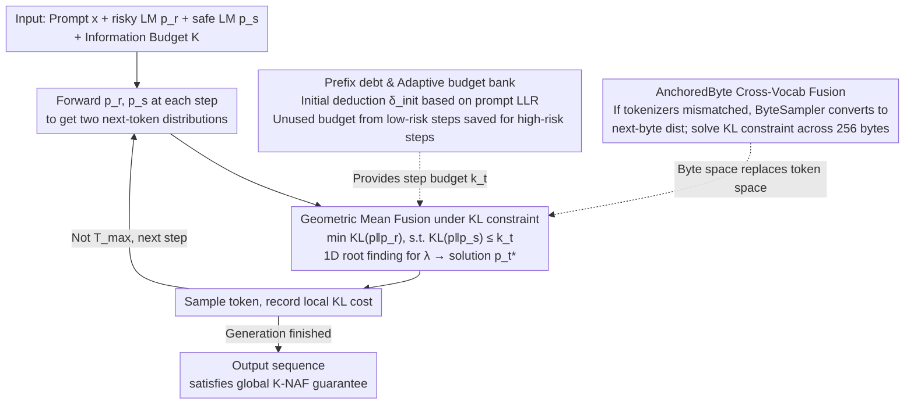

# Anchored Decoding: Provably Reducing Copyright Risk for Any Language Model

**Conference**: ICML2026  
**arXiv**: [2602.07120](https://arxiv.org/abs/2602.07120)  
**Code**: No public code link available (not included in local cache)  
**Area**: LLM Safety / Copyright Risk Mitigation  
**Keywords**: Copyright Memorization, Inference-time Decoding, Safe Reference Model, KL Constraint, ByteSampler  

## TL;DR
This paper proposes Anchored Decoding: an inference-time method that anchors a high-performance but potentially risky LM to a safe LM trained only on permissive data. It provides a formal guarantee on the trade-off between copyright duplication risk and generation quality using a tunable information budget.

## Background & Motivation
**Background**: The capabilities of Large Language Models (LLMs) largely stem from pre-training on massive web-scale corpora, which often mix permissive text, copyrighted content, and source-unclear data. Research shows that models do not just learn abstract patterns but also memorize snippets from the training set, potentially outputting books, news, or other protected texts verbatim under specific prompts.

**Limitations of Prior Work**: Directly removing copyrighted material requires cleaning data and retraining, which is prohibitively expensive for frontier models. Furthermore, copyrighted text is often high-quality, and simple removal sacrifices downstream performance. Deployment-stage strategies such as system prompts, n-gram blocking, or retrieval-based rejection are fragile: system prompts fail to significantly reduce copying, and hard-blocking relies on external snippet libraries while conflating surface-level repetition with genuine infringement risk.

**Key Challenge**: High-capability risky LMs offer superior fluency, factuality, and long-tail knowledge but are more likely to reproduce protected training samples. Safe LMs are trained on cleaner sources but are typically smaller and weaker. The problem is not choosing between "safe-only" or "powerful-only," but controlling how much the risky LM deviates from the safe LM at each generation step, ensuring the output retains the utility of the powerful model without limitlessly following distribution peaks likely derived from memory.

**Goal**: The authors aim for an inference-time method that requires no retraining, no access to original training data, and is compatible with any LM capable of outputting logits. The method requires a user-tunable risk knob, satisfying a sequence-level $K$-NAF information budget constraint relative to the safe LM, while maintaining better utility than existing mitigation methods in real-world long-text duplication benchmarks.

**Key Insight**: The paper treats the safe LM as a "trusted anchor distribution" and the risky LM as a "high-utility candidate distribution." Significant distribution discrepancies often correspond to training data memorization or copyright-sensitive states; thus, the KL divergence between the two can be used as a risk signal, allowing the decoding distribution at each step to be projected back toward the safe LM.

**Core Idea**: Use distribution projection under a KL budget to fuse the next-token distributions of the risky LM and safe LM into a fused distribution that is close to the risky LM but strictly anchored by the safe LM.

## Method
The core of Anchored Decoding is an inference-time dual-model fuser. It does not modify parameters or require knowledge of the specific contents of the risky LM's training set. By obtaining logits from both models given the current prefix, it computes a new sampling distribution at each step. This distribution is derived from a local optimization problem: "maximize proximity to the risky LM while ensuring the KL divergence from the safe LM does not exceed the remaining budget."

### Overall Architecture
The input consists of a user prompt $x$, a risky LM $p_r$ (potentially containing copyright memory), a safe LM $p_s$ trained on permissive data, a maximum length $T_{max}$, and a global information budget $K$. The system first calculates a "prefix debt" to determine if the prompt has already triggered $p_r$'s memorization patterns. During each decoding step, forward passes are run for both $p_r$ and $p_s$ to get next-token distributions.

If the remaining budget is wide, the fused distribution stays closer to $p_r$ to preserve quality; if the prefix appears high-risk or the budget has been depleted by previous steps, it stays closer to $p_s$. Each step's local KL cost is recorded in a cumulative ledger. The paper proves that as long as the sum of step-wise budgets does not exceed $K$, the global sequence distribution satisfies the $K$-NAF guarantee relative to the safe LM.

To overcome shared tokenizer limitations, the paper introduces AnchoredByte Decoding. It uses a ByteSampler to convert token-level LMs into exact next-byte distributions, performing the same KL-constrained fusion across 256 bytes. This allows safe and risky LMs with different BPE tokenizers to be combined at the byte level.

### Key Designs
1.  **Geometric Mean Fusion under KL Constraint**:
    - **Function**: Constructs a new distribution $p_t^*$ at each decoding step that stays as close as possible to the risky LM while remaining within the safe LM's local KL budget.
    - **Mechanism**: The local problem is formulated as $\min_p D_{KL}(p \| p_r)$ subject to $D_{KL}(p \| p_s) \le k_t$. The closed-form solution is the weighted geometric mean: $p_t^* \propto p_s^{\lambda/(1+\lambda)} p_r^{1/(1+\lambda)}$. The Lagrange multiplier $\lambda$ is solved via 1D root finding; $\lambda$ increases (moving towards $p_s$) as the budget decreases.
    - **Design Motivation**: Linear interpolation offers only empirical trade-offs and lacks direct sequence-level guarantees. This projection form is derived from an optimization objective, making "utility maximization" and "risk boundaries" two sides of the same mathematical problem.

2.  **Prefix Debt and Adaptive Budget Bank**:
    - **Function**: Incorporates the risk of the prompt itself into the budget and allows low-risk steps to save budget for subsequent high-risk steps.
    - **Mechanism**: Calculates the log-likelihood ratio (LLR) for each position in the prompt: $\ell_i(x)=\log p_r(x_i|x_{<i})/p_s(x_i|x_{<i})$. The average of the largest positive LLRs is used as $\delta_{init}(x)$. If a prompt strongly favors $p_r$ (e.g., the start of a famous novel), the budget is pre-deducted. The step budget is then $k_t=\max(0,(t+1)k-\sum_{i<t}a_i-\delta_{init})$, where $a_i$ is the actual KL cost.
    - **Design Motivation**: Copying events are often front-loaded; early steps are most prone to sliding into memorized text. Prefix debt ensures "early conservatism," while the budget bank ensures efficiency.

3.  **AnchoredByte for Cross-Vocab Fusion**:
    - **Function**: Enables anchoring when safe and risky LMs do not share a tokenizer.
    - **Mechanism**: ByteSampler marginalizes the token distribution given the current byte prefix to get an exact next-byte distribution. AnchoredByte solves the KL constraint in the byte space $\mathcal{B}=\{0x00,\ldots,0xFF\}$.
    - **Design Motivation**: In copyright scenarios, the most trusted "safe" model might not share a tokenizer with popular "risky" models (e.g., Comma 7B uses a custom tokenizer). Byte-level fusion trades some inference efficiency for broad model compatibility.

### Loss & Training
Anchored Decoding is a pure inference-time algorithm. The only new model introduced is **TinyComma 1.8B**: a decoder-only safe LM trained on 169.5B permissive tokens from the Common Pile. Training involved two stages: 156B tokens from the full Common Pile, followed by a 13.5B token high-quality cooldown mix (70% Wikimedia, 15% DOAB, 15% Data Provenance Initiative). TinyComma uses a 128K Llama 3-style vocabulary. Its purpose is to provide a clear-origin, compatible, and usable safety anchor.

## Key Experimental Results

### Main Results
Copyright risk is evaluated in the Books domain using snippets from 16 novels in CopyBench. Risk is measured via Normalized Copyright Reduction (NCR), an aggregate of ROUGE, MinHash, and LCS metrics. NCR $\ge 75\%$ is defined as the "high-protection operating point." Utility is measured via Prometheus-v2 scores (fluency) on Book continuations and FActScore (supported claim precision) on Bios biography prompts.

| Method | Model Pair / Granularity | Factuality @ High-Prot | Fluency @ High-Prot | Key Insight |
| :--- | :--- | :--- | :--- | :--- |
| Safe reference | TinyComma 1.8B / Llama 3.1 70B, token | 0.09 | 3.00 | Low risk, weak utility |
| MemFree | Same, token | 0.37 | 3.18 | Utility drops significantly at threshold |
| RCAD | Same, token | 0.37 | 3.38 | Better than MemFree, but lower than dual-model |
| CP-Fuse | Same, token | 0.20 | 3.21 | Stronger assumptions, sub-optimal utility |
| TokenSwap | Same, token | 0.44 | 3.77 | Strong baseline, but relies on token seeds |
| **Ours (Anchored)** | Same, token | **0.53** | **4.02** | **Highest utility at high-protection** |
| **Ours (AnchoredByte)** | Comma 7B / Llama 3.1 70B, byte | 0.52 | 4.23 | Outperforms baselines in cross-vocab scenarios |

Anchored Decoding defines the new Pareto frontier. Specifically, it significantly preserves factuality and fluency compared to methods like TokenSwap and RCAD while reaching the target protection level.

### Ablation Study
Ablations on TinyComma 1.8B + Llama 3.1 70B reveal the impact of design choices:
- **NoOpt**: Replacing the KL projection with a simple "sample $p_r$ if within budget, else $p_s$" strategy significantly degrades the Pareto curve.
- **NoDebt**: Removing prefix debt results in a worse risk-utility trade-off, as prompt-level risk signals are critical for stopping early-sequence copying.
- **Fixed vs. Adaptive**: Fixed step-wise budgets are too conservative, wasting budget on low-risk steps and leaving insufficient budget for necessary high-utility/high-risk steps.

### Key Findings
- **Superior Utility**: Anchored Decoding doesn't just reduce risk; it preserves more factuality and fluency than baselines by using the safe LM as a fine-grained guide rather than a hard filter.
- **LLR Tail Statistics**: Prefix debt effectively targets the right tail of the LLR distribution, which accurately identifies prompts most likely to trigger memorization.
- **Efficiency**: Token-level Anchored Decoding incurs a wall-clock TPS slowdown of only ~1.1x, making it practical for deployment.
- **Downstream Generalization**: On TruthfulQA and HumanEval, Anchored Decoding maintains performance close to the base Llama 3.1 70B model, suggesting it does not harm general reasoning or coding capabilities when not triggered by copyright risks.

## Highlights & Insights
- **Copyright as a Distribution Constraint**: Instead of post-processing or prompt engineering, this method treats copyright as a bound on the information distance from a safe reference.
- **Safe LM as Anchor, Not Replacement**: The safe model doesn't need to be state-of-the-art; it only needs to provide a compliant reference distribution.
- **Temporal Sensitivity**: Prefix debt leverages the observation that copying is front-loaded, applying conservatism where it is most needed.
- **Practical Byte-Level Fusion**: Solves the real-world problem of using safety models that don't share tokenizers with large-scale production models.

## Limitations & Future Work
- **Legal vs. Technical**: $K$-NAF guarantees bounded divergence, not a legal certificate of non-infringement. The safe LM's own training data boundary dictates the practical limit of this guarantee.
- **Non-Zero Probability**: As a sampling strategy, it cannot provide a zero-probability guarantee for all protected snippets if they exist in the safe LM's distribution.
- **Knowledge "Collateral Damage"**: KL differences might stem from safe, high-utility long-tail facts. A weak safe LM might cause the anchor to suppress rare historical facts or specialized knowledge.
- **Future Directions**: Potential expansion to images, video, and code safety, or enforcing constraints based on proprietary internal corpora.

## Related Work & Insights
- **Compared to System Prompts**: Anchored Decoding is more robust because it operates at the logit level rather than relying on instruction following.
- **Compared to RCAD/CP-Fuse**: Anchored Decoding assumes an asymmetric pairing (small safe model, large risky model), which is more economically viable for deployment than symmetric pairings or compute-heavy contrastive methods.
- **Insight**: For many safety problems, the goal should not be training a perfect safe model that is equally strong, but rather a "trusted anchor" that constrains the generation of powerful models during inference.

## Rating
- **Novelty**: ⭐⭐⭐⭐⭐ Unifies copyright mitigation, safe references, and dual-model decoding under a formal KL budget framework.
- **Experimental Thoroughness**: ⭐⭐⭐⭐ Solid coverage of model pairs and metrics, though legal risk remains a proxy.
- **Writing Quality**: ⭐⭐⭐⭐⭐ Clear progression from theory to algorithm and deployment constraints.
- **Value**: ⭐⭐⭐⭐⭐ Highly relevant for organizations balancing the utility of frontier models with copyright compliance.

<!-- RELATED:START -->

## Related Papers

- [\[ICML 2026\] One Model to Translate Them All: Universal Any-to-Any Translation for Heterogeneous Collaborative Perception](one_model_to_translate_them_all_universal_any-to-any_translation_for_heterogeneo.md)
- [\[ICML 2026\] dgMARK: Decoding-Guided Watermarking for Diffusion Language Models](dgmark_decoding-guided_watermarking_for_diffusion_language_models.md)
- [\[ICML 2026\] COFT: Counterfactual-Conformal Decoding for Fair Chain-of-Thought Reasoning in Large Language Models](coft_counterfactual-conformal_decoding_for_fair_chain-of-thought_reasoning_in_la.md)
- [\[ICML 2025\] Retraining with Predicted Hard Labels Provably Increases Model Accuracy](../../ICML2025/ai_safety/retraining_with_predicted_hard_labels_provably_increases_model_accuracy.md)
- [\[ICML 2026\] Right Predictions, Misleading Explanations: On the Vulnerability of Vision-Language Model Explanations](right_predictions_misleading_explanations_on_the_vulnerability_of_vision-languag.md)

<!-- RELATED:END -->

## Related Papers

- [\[ICML 2026\] dgMARK: Decoding-Guided Watermarking for Diffusion Language Models](dgmark_decoding-guided_watermarking_for_diffusion_language_models.md)
- [\[ICML 2026\] One Model to Translate Them All: Universal Any-to-Any Translation for Heterogeneous Collaborative Perception](one_model_to_translate_them_all_universal_any-to-any_translation_for_heterogeneo.md)
- [\[ICML 2026\] COFT: Counterfactual-Conformal Decoding for Fair Chain-of-Thought Reasoning in Large Language Models](coft_counterfactual-conformal_decoding_for_fair_chain-of-thought_reasoning_in_la.md)
- [\[ICML 2026\] Differentially Private Preference Data Synthesis for Large Language Model Alignment](differentially_private_preference_data_synthesis_for_large_language_model_alignm.md)
- [\[ICML 2026\] Right Predictions, Misleading Explanations: On the Vulnerability of Vision-Language Model Explanations](right_predictions_misleading_explanations_on_the_vulnerability_of_vision-languag.md)

<!-- RELATED:END -->
