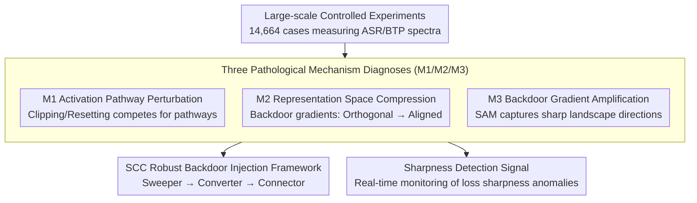

# Angel or Demon: Investigating the Plasticity Interventions' Impact on Backdoor Threats in Deep Reinforcement Learning

**Conference**: ICML 2026  
**arXiv**: [2605.14587](https://arxiv.org/abs/2605.14587)  
**Code**: <https://github.com/maoubo/Plasticity>  
**Area**: AI Security / DRL Backdoor Attack / Plasticity Intervention  
**Keywords**: DRL backdoor, plasticity intervention, SAM, loss landscape sharpness, robust backdoor injection

## TL;DR
The authors provide the first systematic evaluation of the impact of 7 mainstream plasticity interventions (SAM, Shrink&Perturb, Weight Clip, SN, WD, LN, ReDo) on Deep Reinforcement Learning (DRL) backdoor attacks through 14,664 experiments. They discover that only SAM acts as a "demon"—significantly exacerbating backdoor threats. Based on this, they propose a "Sweeper-Converter-Connector" robust backdoor injection framework and identify a detection signal based on loss landscape sharpness.

## Background & Motivation

**Background**: DRL is widely applied in robotic control, UAV navigation, and autonomous driving; simultaneously, it has been found vulnerable to backdoor attacks (TrojDRL, BadRL, SleeperNets, UNIDOOR, etc.). Conversely, DRL training suffers from "plasticity loss" (non-stationary inputs and drifting optimization targets cause agents to gradually lose learning capacity). Consequently, modern DRL pipelines commonly incorporate built-in plasticity interventions: Shrink & Perturb, Weight Clipping, Spectral Normalization, Weight Decay, Layer Normalization, ReDo, SAM, etc.

**Limitations of Prior Work**: (1) Research on backdoors and plasticity has historically developed in isolation, with no systematic investigation into whether plasticity interventions facilitate or hinder backdoors; (2) These technologies almost always co-exist in practical DRL deployments, yet a lack of guidance can lead to "assuming LN/SAM provides performance improvements while they actually introduce security vulnerabilities."

**Key Challenge**: The original intent of plasticity interventions is to stabilize training. Does this introduce side effects on the learning of mappings from "malicious triggers → target actions"? If certain interventions actually help backdoors become more stable or potent, they become unintentional "attack amplifiers."

**Goal**: (1) Quantify the impact of each intervention on ASR (Attack Success Rate) and BTP (Benign Task Performance) under two threat models (TM-Scratch: injection during scratch training; TM-Post: injection into a pre-trained model); (2) Uncover the underlying mechanisms; (3) Design a more robust backdoor injection framework and propose backdoor detection signals based on these mechanisms.

**Key Insight**: Three established pathological metrics from the plasticity domain—**weight magnitude, effective rank, and loss landscape sharpness**—are repurposed as a diagnostic dashboard for internal backdoor properties to rank and analyze backdoored agents under various interventions.

**Core Idea**: Through large-scale (14,664 cases) controlled experiments and three-metric pathological diagnosis, the "intervention effects" are decomposed into three mechanisms (M1: Activation pathway perturbation, M2: Representation space compression, M3: Backdoor gradient amplification). These mechanisms are then reversed to derive robust attack and detection strategies.

## Method

### Overall Architecture
The core problem addressed is whether standard plasticity interventions in DRL pipelines make backdoors easier or harder. The work first measures the impact of each intervention on ASR and BTP via massive controlled experiments, "translates" these figures into internal pathological changes in the network, and finally utilizes the diagnosed mechanisms to design attack and detection tools. The main logic follows a chain of "large-scale measurement → mechanism diagnosis → tool derivation."

### Key Designs

**1. Large-scale Controlled Experiments: Mapping the Interaction Spectrum**

The study addresses the gap where backdoor and plasticity research have operated independently. The authors use a Cartesian product of variables: 2 threat models (TM-Scratch / TM-Post) × 8 interventions × 47 backdoor tasks × 4 attack algorithms (TrojDRL/BadRL/SleeperNets/UNIDOOR) × 3 seeds = 9,024 cases, plus 5,640 cases for intervention combinations, totaling 14,664 cases. The attack side uses transition tampering to inject triggers into $(\text{state}, \text{action}, \text{reward})$ triplets and utilizes backdoor rewards to reinforce "trigger → target action" associations. Tasks cover 4 Gym classic control, 2 physics control, and 3 PyBullet robotics tasks, accounting for discrete/continuous actions, sparse/dense rewards, and cold/non-cold start conditions. Hyperparameters for each intervention follow their original papers.

**2. Three Pathological Mechanisms (M1/M2/M3): Mechanistic Explanations**

To explain counter-intuitive results (e.g., why SAM exacerbates backdoors), the authors employ three pathological metrics: weight magnitude, effective rank, and loss landscape sharpness. **M1 Activation Pathway Perturbation**: Shrink&Perturb, Weight Clipping, and ReDo clip or reset weights, forcing "backdoor pathways" and "benign pathways" to compete for resources. Fig. 6 shows backdoor attacks cause a few weight magnitudes in the actor's second layer to surge (sparse backdoor pathways), while Weight Clipping suppresses them, forcing reconstruction competition. **M2 Representation Space Compression**: Spectral Norm, Weight Decay, and Layer Norm restrict Lipschitz constants or smooth activations, pulling backdoor gradients (originally nearly orthogonal to benign gradients, dot product $\approx 0$) into almost perfect alignment ($\approx 1.0$). Consequently, backdoors shift from sparse single pathways to shared multi-pathway structures, which are ironically more unstable under non-stationary training. **M3 Backdoor Gradient Amplification**: SAM uses adversarial perturbations to capture sharp loss directions. Backdoor samples happen to expand the loss landscape sharpness range by over 6 times (+635.22%), falling directly under SAM's "magnifying glass." SAM amplifies these gradients and leads the backdoor pathway to a flat minimum, making it exceptionally robust to parameter perturbations.

**3. SCC Robust Backdoor Injection Framework (Sweeper-Converter-Connector)**

Reflecting the finding that combined interventions (Plastic/SLac/SSW) are even more potent than SAM alone (ASR $0.178 \to 0.418$, BTP $0.745 \to 0.915$), the authors synthesize a three-step injection process: **Sweeper** uses Shrink&Perturb/Weight Clip/ReDo-like interventions to clear benign pathways to make room for the backdoor (leveraging M1); **Converter** uses Spectral Norm/Weight Decay/LN to pull backdoor gradients from orthogonal to aligned, growing multi-pathway structures (leveraging M2); **Connector** uses SAM to jointly optimize these multi-pathways into flat minima, allowing stable co-existence of backdoor representations (leveraging M3). To quantify danger, they define Pathological Distance $PD(A) = \sum_{i<j} \lVert \mathbf{v}(p_i) - \mathbf{v}(p_j) \rVert_2$. Experiments confirm larger $PD$ corresponds to stronger threats (e.g., SSW with $PD=18.64$ yields the highest ASR).

**4. Sharpness-based Backdoor Detection Signal: Repurposing Pathology for Defense**

Among the three pathologies, sharpness shows the greatest variance (backdoors expand its range by 635.22%). Moreover, almost all interventions (except SAM) further exacerbate this anomaly ($v_{i3} > v_{13}$), making it a natural warning metric. Defenders can monitor sharpness time-series during agent training, treating significant spikes or drops as suspicious. This signal requires no knowledge of the trigger and can be applied to any DRL pipeline as an optimization monitor.

### Loss & Training
Ours does not propose a new loss but rather a platform of evaluation protocols. The attack relies on transition tampering and backdoor rewards. No specific defense is applied other than studying the side effects of interventions. The 47 backdoor tasks cover single and multiple backdoors.

## Key Experimental Results

### Main Results
Representitive ASR/BTP changes in robotic control tasks under the TM-Post scenario (where interventions have a more significant impact):

| Intervention | ASR (Robot) | BTP (Robot) | Primary Pathological Impact |
| :--- | :--- | :--- | :--- |
| None (baseline) | 0.178 ± 0.157 | 0.745 ± 0.230 | — |
| Weight Clipping | ↓ 17.46% | ↓ 20.19% | M1 Pathway Perturbation |
| Spectral Norm | ↓ 11.78% | ↓ Medium | M2 Repr. Compression |
| Layer Norm | ↓ Medium | ↓ 11.93% | M2 Repr. Compression |
| Weight Decay | ↓ Slight | ↓ Slight | M2 Repr. Compression |
| Shrink & Perturb | ↓ Slight | ↓ Slight | M1 Soft Perturbation |
| ReDo | ↓ Slight | ↓ Slight | M1 Neuron Reset |
| **SAM** | **↑ 0.326 (+83%)** | **↑ 0.814 (+9%)** | **M3 Gradient Amplification** |

Intervention combination comparison (Robotic control + SAM series):

| Combination | Includes SAM? | ASR | BTP | Pathological Distance |
| :--- | :--- | :--- | :--- | :--- |
| None | — | 0.178 ± 0.157 | 0.745 ± 0.230 | N/A |
| Plastic | ✓ | 0.368 ± 0.144 | 0.724 ± 0.362 | 9.43 |
| SLac | ✓ | 0.417 ± 0.146 | 0.816 ± 0.276 | 17.42 |
| **SSW** | ✓ | **0.418 ± 0.092** | **0.915 ± 0.131** | **18.64** |
| Swiss Cheese | ✗ | ≈ LN Alone | ≈ LN Alone | 0.52 |

### Ablation Study

| Configuration | Phenomenon | Interpretation |
| :--- | :--- | :--- |
| TM-Scratch | ASR barely moves (LN max -8.84%) | Representations are not yet stable; intervention effects are diluted. |
| TM-Post | Significant ASR/BTP changes | Intervention impacts only manifest on stabilized models. |
| Backdoor vs. Normal | Sharpness +635.22% | Sharpness is the strongest extrinsic sign of a backdoor. |
| Single vs. Combined | Higher $PD$ leads to stronger attacks | Complementary mechanisms are needed for joint amplification. |
| Spectral Norm Analysis | Gradient alignment 0 → 1.00 | Validates M2: representation compression leading to shared pathways. |

### Key Findings
- **Counter-intuitive**: SAM (intended to stabilize training) is the only intervention that exacerbates backdoors because it is sensitive to the sharp loss directions introduced by the backdoor.
- **TM-Post is more sensitive than TM-Scratch**: Pre-stabilized benign representations must "make room" for the backdoor, amplifying the restrictive effects of interventions on parameter flexibility.
- **BTP is more sensitive than ASR**: Benign representations are complex and parameter-dependent; once disrupted, they are hard to reconstruct. Backdoor representations are sparse and localized, allowing easier reconstruction.
- **Intervention combinations are non-additive**: Combinations of the same mechanism (e.g., Swiss Cheese) show little gain, whereas heterogeneous combinations (e.g., SSW) show significant amplification.
- **Sharpness is the most valuable detection metric**: Backdoor attacks cause a 6x increase in sharpness fluctuations.

## Highlights & Insights
- **Large-scale experimental design**: 14,664 cases provide high reliability for the conclusions.
- **Cross-domain bridging**: Connecting "plasticity" and "backdoor security" using pathological metrics is a novel diagnostic approach.
- **"Role Reversal" thinking**: SAM, often viewed as a "remedy" in defense literature, is revealed here as an attack amplifier.
- **From Mechanism to Design**: The SCC triad converts diagnostic results into an attack cookbook, providing $PD$ as a quantifiable metric.
- **Feasibility of Sharpness Detection**: Since sharpness is already monitored in many optimizers, it serves as a low-cost "free" defense signal.

## Limitations & Future Work
- Tasks are concentrated on low-dimensional state spaces; scalability to high-dimensional pixel tasks (Atari/StarCraft) is unknown.
- The SCC framework is currently a conceptual design without a formalized "unified injection algorithm" implementation.
- Sharpness-based detection faces challenges: high baseline variance between different tasks and potential false positives from other training anomalies (reward hacking, etc.).
- The study does not propose an end-to-end defense solution beyond suggesting sharpness monitoring.

## Related Work & Insights
- **vs. TrojDRL/BadRL/SleeperNets**: Previous works only studied attacks under vanilla DRL; Ours adds "modern pipeline standards" to reveal composite effects.
- **vs. Klein et al. 2024 (Plasticity survey)**: Ours adopts their classification framework but shifts the perspective to security side effects.
- **vs. Lee et al. 2023 (SAM for DRL)**: While SAM was proposed as a plasticity-preserving tool, Ours provides a "security warning label" for its use.
- **vs. DL Backdoor Defense (Li et al. 2024b)**: Unlike DL defenses involving pruning, Ours shows weight clipping in DRL involves a significant BTP trade-off.

## Rating
- **Novelty**: ⭐⭐⭐⭐ First to characterize the interaction between plasticity interventions and DRL backdoors.
- **Experimental Thoroughness**: ⭐⭐⭐⭐⭐ 14,664 cases with meticulous pathological diagnosis.
- **Writing Quality**: ⭐⭐⭐⭐ Clear RQ-driven structure and intuitive naming (M1/M2/M3, SCC).
- **Value**: ⭐⭐⭐⭐⭐ Directly impacts security practices for DRL systems using plasticity interventions.

<!-- RELATED:START -->

## Related Papers

- [\[NeurIPS 2025\] Impact of Dataset Properties on Membership Inference Vulnerability of Deep Transfer Learning](../../NeurIPS2025/ai_safety/impact_of_dataset_properties_on_membership_inference_vulnerability_of_deep_trans.md)
- [\[ICML 2026\] Regret-Based Federated Causal Discovery with Unknown Interventions](regret-based_federated_causal_discovery_with_unknown_interventions.md)
- [\[ICLR 2026\] Beware Untrusted Simulators -- Reward-Free Backdoor Attacks in Reinforcement Learning](../../ICLR2026/ai_safety/beware_untrusted_simulators_--_reward-free_backdoor_attacks_in_reinforcement_lea.md)
- [\[ICML 2025\] Adversarial Inception Backdoor Attacks against Reinforcement Learning](../../ICML2025/ai_safety/adversarial_inception_backdoor_attacks_against_reinforcement_learning.md)
- [\[ICML 2026\] TimeGuard: Channel-wise Pool Training for Backdoor Defense in Time Series Forecasting](timeguard_channel-wise_pool_training_for_backdoor_defense_in_time_series_forecas.md)

<!-- RELATED:END -->
