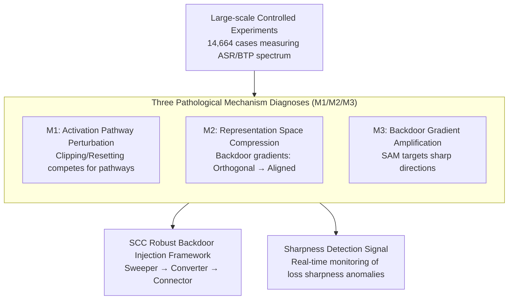

# Angel or Demon: Investigating the Plasticity Interventions' Impact on Backdoor Threats in Deep Reinforcement Learning

**Conference**: ICML 2026  
**arXiv**: [2605.14587](https://arxiv.org/abs/2605.14587)  
**Code**: <https://github.com/maoubo/Plasticity>  
**Area**: AI Security / DRL Backdoor Attack / Plasticity Intervention  
**Keywords**: DRL backdoor, plasticity intervention, SAM, loss landscape sharpness, robust backdoor injection

## TL;DR
The authors provide the first systematic evaluation of the impact of 7 mainstream plasticity interventions (SAM, Shrink & Perturb, Weight Clip, SN, WD, LN, ReDo) on deep reinforcement learning (DRL) backdoor attacks through 14,664 experiments. It is discovered that only SAM acts as a "demon"—significantly intensifying backdoor threats. Consequently, the "Sweeper-Converter-Connector" robust backdoor injection framework is proposed, alongside a detection signal based on the sharpness of the loss landscape.

## Background & Motivation

**Background**: DRL is widely applied in robotic control, UAV navigation, and autonomous driving but has been found vulnerable to backdoor attacks (TrojDRL, BadRL, SleeperNets, UNIDOOR, etc.). Conversely, DRL training suffers from "plasticity loss" (non-stationary inputs and drifting optimization targets cause agents to gradually lose learning capacity). Thus, modern DRL pipelines commonly integrate plasticity interventions: Shrink & Perturb, Weight Clipping, Spectral Normalization, Weight Decay, Layer Normalization, ReDo, and SAM.

**Limitations of Prior Work**: (1) Backdoor research and plasticity research have long operated in isolation, with no systematic investigation into whether plasticity interventions make backdoors easier or harder to inject. (2) In practical DRL agent deployment, these two technologies almost always coexist, yet a lack of guidance may lead to "performance improvements" like LN or SAM inadvertently becoming security vulnerabilities.

**Key Challenge**: The design goal of plasticity interventions is to stabilize training. Does this have a side effect on the learning of the "malicious trigger $\rightarrow$ target action" mapping? If certain interventions help the backdoor become more stable or potent, they become unintentional "attack amplifiers."

**Goal**: (1) Quantify the impact of each intervention on Attack Success Rate (ASR) and Benign Task Performance (BTP) under two threat models (TM-Scratch: injection during training; TM-Post: injection into a pre-trained model); (2) Uncover the underlying mechanisms; (3) Design a more robust backdoor injection framework and propose detection signals based on these mechanisms.

**Key Insight**: Adopting three mature pathological metrics from the plasticity field—**weight magnitude, effective rank, and loss landscape sharpness**—as a diagnostic dashboard for internal backdoor properties to rank and analyze backdoored agents under each intervention.

**Core Idea**: Utilizing large-scale (14,664 cases) controlled experiments combined with pathological diagnosis via the three metrics to decompose "intervention effects" into three mechanisms (M1: Activation pathway perturbation; M2: Representation space compression; M3: Backdoor gradient amplification), then deriving robust attack and detection strategies from these mechanisms.

## Method

### Overall Architecture
The core question addressed is whether standard plasticity interventions in DRL pipelines make backdoors easier or harder. The authors first measure the impact of interventions on ASR and BTP through a massive set of controlled experiments, "translate" these figures into internal pathological changes in the network, and finally utilize the diagnosed mechanisms to design attack and detection tools. The work follows a logical flow of "large-scale measurement $\rightarrow$ mechanism diagnosis $\rightarrow$ tool generation."

### Key Designs

**1. Large-scale Controlled Experiments: Mapping the intervention impact spectrum**

The authors address the lack of systematic measurement between backdoor and plasticity research by using a Cartesian product of variables: 2 Threat Models (TM-Scratch / TM-Post) $\times$ 8 Interventions $\times$ 47 Backdoor Tasks $\times$ 4 Attack Algorithms (TrojDRL/BadRL/SleeperNets/UNIDOOR) $\times$ 3 Seeds = 9,024 cases, plus 5,640 cases for evaluating intervention combinations, totaling 14,664 cases. For the attack side, transition tampering is used to inject triggers into $(\text{state}, \text{action}, \text{reward})$ triplets, and backdoor rewards reinforce the "trigger $\rightarrow$ target action" binding. Tasks cover 4 Gym Classic Control, 2 Physics Control, and 3 PyBullet Robotics, accounting for discrete/continuous actions, sparse/dense rewards, and start-up conditions.

**2. Three Pathological Mechanisms (M1/M2/M3): Reducing phenomena to interpretable internal mechanisms**

To explain why SAM intensifies backdoors, the authors use three pathological metrics: weight magnitude, effective rank, and loss landscape sharpness. **M1 (Activation Pathway Perturbation)**: Shrink & Perturb, Weight Clipping, and ReDo reset weights, forcing "backdoor pathways" and "benign pathways" to compete for resources. Weight Clipping compresses high-magnitude weights, forcing reconstruction competition. **M2 (Representation Space Compression)**: Spectral Norm, Weight Decay, and Layer Norm restrict Lipschitz constants or smooth activations, pulling backdoor gradients—initially orthogonal to benign gradients (dot product $\approx 0$)—toward alignment ($\approx 1.0$). The backdoor shifts from sparse single-pathways to shared multi-pathways. **M3 (Backdoor Gradient Amplification)**: SAM uses adversarial perturbations to capture sharp loss directions. Backdoor samples expand the loss landscape sharpness range by over 6 times ($+635.22\%$), placing them directly under SAM's "magnifying glass." SAM amplifies these gradients and leads the backdoor pathway toward a flat minimum, making it robust to parameter perturbations.

**3. SCC Robust Backdoor Injection Framework (Sweeper-Converter-Connector): Using mechanisms for an attack cookbook**

Observed results show that combined interventions (Plastic/SLac/SSW) are even more potent than SAM alone (ASR $0.178 \to 0.418$, BTP $0.745 \to 0.915$). The authors define a three-step injection process: **Sweeper** uses Shrink & Perturb, Weight Clipping, or ReDo to clear benign pathways (utilizing M1); **Converter** uses Spectral Norm, Weight Decay, or LN to align backdoor gradients with benign ones for a multi-pathway structure (utilizing M2); **Connector** uses SAM to optimize these into flat minima (utilizing M3). The "Pathological Distance" $PD(A) = \sum_{i<j} \lVert \mathbf{v}(p_i) - \mathbf{v}(p_j) \rVert_2$ identifies the most dangerous combinations (e.g., SSW with $PD=18.64$ yields the highest ASR).

**4. Sharpness-based Backdoor Detection: Turning the strongest pathology into a defense metric**

Among the pathologies, sharpness shows the most significant variance (backdoors expand the range by $635.22\%$). Almost all interventions (except SAM) further exacerbate this anomaly ($v_{i3} > v_{13}$), making it an ideal warning signal. Defenders can monitor sharpness time series during training; significant spikes or drops are treated as suspicious. This signal requires no knowledge of the trigger and can be applied to any DRL training pipeline with low deployment costs.

### Loss & Training
No new loss functions are proposed; the focus is on the evaluation protocol. Attacks utilize transition tampering for trigger injection and backdoor rewards for reinforcement. On the defense side, no specific countermeasures are applied initially (studying side effects only). 47 backdoor tasks cover single and multiple backdoors, with hyperparameters for each intervention following their original papers to ensure fairness.

## Key Experimental Results

### Main Results
Representative ASR / BTP changes in robotic control tasks under the TM-Post scenario:

| Intervention | ASR (Robotics) | BTP (Robotics) | Primary Pathological Effect |
|--------------|--------------|---------------|-----------------|
| None (Baseline)| 0.178 ± 0.157 | 0.745 ± 0.230 | — |
| Weight Clipping | ↓ 17.46% | ↓ 20.19% | M1 Pathway Perturbation |
| Spectral Norm | ↓ 11.78% | ↓ Medium | M2 Repr. Compression |
| Layer Norm | ↓ Medium | ↓ 11.93% | M2 Repr. Compression |
| Weight Decay | ↓ Slight | ↓ Slight | M2 Repr. Compression |
| Shrink & Perturb| ↓ Slight | ↓ Slight | M1 Soft Perturbation |
| ReDo | ↓ Slight | ↓ Slight | M1 Neuron Reset |
| **SAM** | **↑ 0.326 (+83%)** | **↑ 0.814 (+9%)** | **M3 Gradient Amplification** |

Comparison of intervention combinations (Robotics + SAM series):

| Combination | Contains SAM? | ASR | BTP | Pathological Distance |
|------|---------|------|------|------------------------|
| None | — | 0.178 ± 0.157 | 0.745 ± 0.230 | N/A |
| Plastic | ✓ | 0.368 ± 0.144 | 0.724 ± 0.362 | 9.43 |
| SLac | ✓ | 0.417 ± 0.146 | 0.816 ± 0.276 | 17.42 |
| **SSW** | ✓ | **0.418 ± 0.092** | **0.915 ± 0.131** | **18.64** |
| Swiss Cheese | ✗ | ≈ LN Alone | ≈ LN Alone | 0.52 |

### Ablation Study

| Configuration | Phenomenon | Interpretation |
|------|------|------|
| TM-Scratch | Minimal ASR change (LN max -8.84%) | Representations not yet stable; effects diluted by dynamics. |
| TM-Post | Significant ASR/BTP change | Intervention impact manifests on stable models. |
| Backdoor vs. Normal | Weight mag. +98.63%, rank +19.16%, sharpness +635.22% | Sharpness is the strongest external backdoor indicator. |
| Single vs. Combined | Higher $PD$ correlates with stronger attacks. | Complementary mechanisms amplify threats. |
| SN Gradient Alignment| Backdoor-benign gradient alignment $0 \to 1.00$ | Validates M2: representation compression leading to pathway sharing. |

### Key Findings
- **Counter-intuitive**: SAM is the only intervention that aggravates backdoors because it is sensitive to the sharp loss directions introduced by backdoors, amplifying and flattening them.
- **TM-Post is more sensitive than TM-Scratch**: Backdoors must "squeeze" into the space of converged benign representations, amplifying the constraint effects of interventions on parameter flexibility.
- **BTP is more sensitive than ASR**: Benign representations are complex; they rely on many synergistic parameters and are harder to reconstruct after intervention interference compared to sparse, local backdoor pathways.
- **Combinations are non-additive**: Combinations of the same mechanism (e.g., Swiss Cheese) show little gain, whereas heterogeneous combinations (e.g., SSW) show significant amplification.
- **Sharpness as detection lead**: The 6-fold expansion in sharpness fluctuation is the most valuable detection signal.

## Highlights & Insights
- **Scale of Empirical Study**: 14,664 cases provide high credibility, which is rare in DRL security literature.
- **Cross-Domain Bridge**: Linking "plasticity" and "backdoor security" via pathological metrics provides methodological inspiration for other safety areas like fairness or privacy.
- **"Dual-Role" Thinking**: SAM, often seen as a remedy for generalization, is revealed as an attack amplifier, suggesting that generalization tools are double-edged swords.
- **Mechanism-to-Design**: The SCC framework translates diagnostics directly into an attack cookbook, using $PD$ as a quantifiable synergy metric.
- **Low-Cost Defense**: Sharpness is already a common monitoring metric in optimizers, making the proposed detection signal highly deployable.

## Limitations & Future Work
- **Task Scope**: Experiments are limited to low-dimensional control tasks (Gym/PyBullet). Its validity on high-dimensional pixel-based tasks like Atari remains unknown.
- **SCC Implementation**: The framework is conceptual; no unified "plug-and-play" injection algorithm is provided.
- **Detection Challenges**: Sharpness baseline variance across tasks makes it difficult to set a universal threshold, and other training anomalies (reward hacking, unstable critic) may trigger false positives.
- **Hyperparameter Sensitivity**: While ablation studies were done, the worst-case parameter combinations for attacks weren't exhaustive.

## Related Work & Insights
- **vs. TrojDRL/BadRL/SleeperNets**: These focus on attacks in vanilla DRL. *Ours* evaluates modern DRL pipelines with standard interventions, revealing composite effects.
- **vs. Klein et al. 2024 (Plasticity Survey)**: Provides the classification of interventions; *Ours* shifts the perspective to security side effects.
- **vs. Lee et al. 2023 (SAM for DRL)**: Positions SAM as a plasticity remedy; *Ours* provides a "security warning label" for SAM.
- **vs. Deep Learning Backdoor Defense**: DL backdoors can be mitigated by pruning; *Ours* shows "clipping" interventions in DRL have similar effects but at higher BTP costs.

## Rating
- Novelty: ⭐⭐⭐⭐ 
- Experimental Thoroughness: ⭐⭐⭐⭐⭐ 
- Writing Quality: ⭐⭐⭐⭐ 
- Value: ⭐⭐⭐⭐⭐ 

<!-- RELATED:START -->

## Related Papers

- [\[NeurIPS 2025\] Impact of Dataset Properties on Membership Inference Vulnerability of Deep Transfer Learning](../../NeurIPS2025/ai_safety/impact_of_dataset_properties_on_membership_inference_vulnerability_of_deep_trans.md)
- [\[ICML 2026\] Decoupled Training with Local Reinforcement Fine-Tuning in Federated Learning](decoupled_training_with_local_reinforcement_fine-tuning_in_federated_learning.md)
- [\[ICML 2026\] Regret-Based Federated Causal Discovery with Unknown Interventions](regret-based_federated_causal_discovery_with_unknown_interventions.md)
- [\[ICLR 2026\] Beware Untrusted Simulators -- Reward-Free Backdoor Attacks in Reinforcement Learning](../../ICLR2026/ai_safety/beware_untrusted_simulators_--_reward-free_backdoor_attacks_in_reinforcement_lea.md)
- [\[ICML 2025\] Adversarial Inception Backdoor Attacks against Reinforcement Learning](../../ICML2025/ai_safety/adversarial_inception_backdoor_attacks_against_reinforcement_learning.md)

<!-- RELATED:END -->
## Related Papers

- [\[NeurIPS 2025\] Impact of Dataset Properties on Membership Inference Vulnerability of Deep Transfer Learning](../../NeurIPS2025/ai_safety/impact_of_dataset_properties_on_membership_inference_vulnerability_of_deep_trans.md)
- [\[ICML 2026\] Regret-Based Federated Causal Discovery with Unknown Interventions](regret-based_federated_causal_discovery_with_unknown_interventions.md)
- [\[ICLR 2026\] Beware Untrusted Simulators -- Reward-Free Backdoor Attacks in Reinforcement Learning](../../ICLR2026/ai_safety/beware_untrusted_simulators_--_reward-free_backdoor_attacks_in_reinforcement_lea.md)
- [\[ICML 2025\] Adversarial Inception Backdoor Attacks against Reinforcement Learning](../../ICML2025/ai_safety/adversarial_inception_backdoor_attacks_against_reinforcement_learning.md)
- [\[ICML 2026\] Decoupled Training with Local Reinforcement Fine-Tuning in Federated Learning](decoupled_training_with_local_reinforcement_fine-tuning_in_federated_learning.md)

<!-- RELATED:END -->
