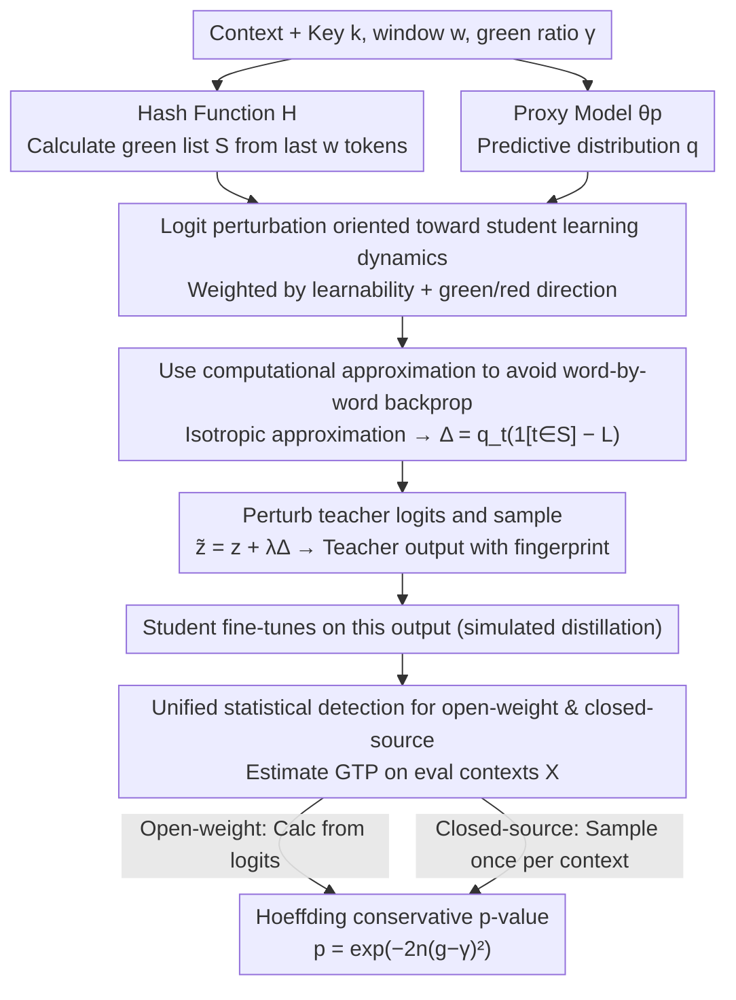

# Antidistillation Fingerprinting

**Conference**: ICML2026  
**arXiv**: [2602.03812](https://arxiv.org/abs/2602.03812)  
**Code**: https://github.com/YixuanEvenXu/antidistillation-fingerprinting  
**Area**: LLM Security  
**Keywords**: Model Fingerprinting, Antidistillation, Text Watermarking, Distillation Detection, Statistical Hypothesis Testing  

## TL;DR
This paper proposes Antidistillation Fingerprinting (ADFP), which utilizes a proxy student model to estimate which watermark tokens are most easily absorbed during the distillation process. This allows for more reliable detection of whether third-party models have been trained on teacher model outputs, without sacrificing the quality of the teacher's generation.

## Background & Motivation
**Background**: The training cost of state-of-the-art LLMs is extremely high, and model owners often only grant access through APIs or limited releases. Meanwhile, third parties can fine-tune smaller student models using teacher model outputs to replicate teacher behavior at a low cost. Existing text watermarking methods, particularly red-and-green-list watermarks, use keys and hash functions to partition candidate tokens into a green list and a red list, then boost the probability of green tokens during sampling. If a student model later exhibits a higher preference for green tokens, this preference can be treated as a trace of distillation.

**Limitations of Prior Work**: Traditional watermarking treats almost all green tokens equally by adding a uniform logit bias. While this embeds a statistical signal in the teacher's output, it does not account for how the student model will update its parameters during fine-tuning. Consequently, to ensure the fingerprint truly enters the student model, the teacher's output often requires heavy perturbation. Strong perturbations lead to a decline in reasoning quality, conversational naturalness, or code accuracy, sometimes causing visible anomalies like repetition or messy formatting.

**Key Challenge**: Fingerprint detection relies on the student model retaining the key-related green-token preference after fine-tuning, whereas ordinary watermarking optimizes whether the teacher's current output favors the green list. These two objectives are not perfectly aligned. Simply being a green token is insufficient; the key is whether training on that token pushes the student model toward "being more likely to generate green tokens in the future."

**Goal**: The authors aim to transform "output watermarking" into a true "model fingerprint" oriented toward distillation detection. On one hand, they seek to provide statistically interpretable p-values for both open-weight and closed-source query-based student evaluation scenarios. On the other hand, they aim to achieve higher detection confidence with smaller teacher quality losses across mathematical reasoning, open dialogue, and code generation tasks.

**Key Insight**: The paper borrows the idea of antidistillation sampling: if a proxy student model can approximate the learning dynamics of the real student, one can select tokens that are more likely to influence the student's future behavior, rather than mechanically amplifying all green tokens. This proxy model does not need to be identical to the real student; it only needs to provide useful optimization directions.

**Core Idea**: Change the watermark sampling objective from "making the current teacher output greener" to "sampling tokens that make the student greener after fine-tuning," using the logit-space gradient of the proxy model to construct fingerprint perturbations oriented toward distillation learning dynamics.

## Method
The core of ADFP is not a new detector, but a rewritten perturbation method for the watermark sampling phase. The detection side still uses the familiar key hashing and green-token statistics from the red-and-green-list series, but the generation side no longer biases the green list uniformly; instead, the perturbation magnitude is dependent on the predicted distribution of the proxy student model.

### Overall Architecture
The method consists of two stages. The first stage is teacher sampling with fingerprinting: the model owner selects a hash function $H$, key $k$, window size $w$, and green-list proportion $\gamma$. At each generation step, the green list $S=H(x_{-w:},k)$ is calculated based on the last $w$ tokens of the context. An ADFP perturbation, based on the predictive distribution of the proxy model $\theta_p$, is added to the teacher logits before sampling. The resulting teacher output is then used by potential student models for fine-tuning.

The second stage is distillation detection: the model owner prepares a set of evaluation contexts $X$ and uses the same key $k$ to calculate the average green-list token probability (GTP) generated by the student model over these contexts. If the student has not been trained on data fingerprinted with that key, the GTP should fluctuate around $\gamma$; if it has, the GTP will be systematically higher. The paper uses Hoeffding's inequality to provide a conservative p-value: when $g_{obs}>\gamma$ is observed, $p=\exp(-2n(g_{obs}-\gamma)^2)$, where $n$ is the number of de-duplicated evaluation contexts.

Detection is split into two scenarios. If the student is an open-weight model, the green-token probability for each context can be calculated directly from logits. If the student is a closed-source model, a next token is sampled once for each context, and the green-token frequency is recorded. Both share the same null hypothesis: student generation is independent of the key.

### Key Designs
**1. Logit Perturbation Oriented toward Student Learning Dynamics: Targeting "Learnable" Tokens**

Traditional red-and-green-listing applies the same logit bias to all green tokens equally. It only cares whether the teacher's current output is green, ignoring whether that token will actually be learned by the student during fine-tuning. As a result, internalizing the fingerprint requires brute-force increases in perturbation, which degrades quality. ADFP changes the perturbation magnitude based on the "learnability" of the token: let $q$ be the prediction distribution of the proxy model in the current context, $S$ be the green list, and $L=\sum_{t\in S}q_t$ be the total green-token probability. The perturbation for token $t$ is $\Delta^{ADS}_t=q_t(\mathbf{1}[t\in S]-L)$. In this equation, $q_t$ allows the method to focus on high-probability tokens that the proxy deems more likely to be sampled (and thus most likely to serve as effective supervision in student training), while $\mathbf{1}[t\in S]-L$ acts as an advantage baseline: green tokens are amplified and red tokens are suppressed, pushing the student away from non-fingerprinted directions. This moves the fingerprint optimization goal from "whether the teacher samples a green token" to "whether the student is greener after training," allowing the fingerprint to be internalized with lower quality costs.

**2. Avoiding Word-by-Word Backpropagation via Computational Approximation: Converting Gradients into a Closed-Form Proxy Score**

If the perturbation is calculated according to the original definition of antidistillation sampling $\Delta_t=\langle\nabla_{\theta_p}\log q_t,\nabla_{\theta_p}L\rangle$, it would require a backward pass for every token in the vocabulary, which is computationally infeasible for online decoding. The paper projects the gradient into logit space and approximates the Gram matrix of logits relative to parameter gradients as isotropic $K\approx cI$. Under this approximation, constant terms independent of the token cancel out during sampling normalization, leaving $q_t(\mathbf{1}[t\in S]-L)$, which can be calculated using only the softmax probabilities from a single forward pass of the proxy model. The authors further prove that if only the final linear adapter layer of the proxy model is trainable, this isotropic property holds exactly. This approximation reduces the complexity to a level where it can be directly integrated into standard LLM sampling pipelines.

**3. Unified Statistical Detection for Open-Weight and Closed-Source Queries: Model Attribution as Conservative Hypothesis Testing**

The detection side does not depend on accessing student weights; instead, it tracks the average GTP generated by the student across a set of evaluation contexts $X$. The paper first de-duplicates $X$ based on the last $w$ tokens, making green lists for different contexts approximately independent under key randomness. Open-weight students allow for calculating the average green-token probability directly from logits; closed-source students require sampling one token per context to construct Bernoulli indicator variables. Under the null hypothesis (that student generation is independent of the key), each term is an independent random variable in $[0,1]$ with a mean of $\gamma$. Therefore, the same Hoeffding upper bound can provide a conservative p-value: $p=\exp(-2n(g_{obs}-\gamma)^2)$ when $g_{obs}>\gamma$. Framing attribution as a statistical probability problem is more robust than "checking if the student replicates specific training samples," and is better suited for real-world scenarios where the watermark signal is diluted by distillation and the student can only be queried via API.

### Loss & Training
ADFP itself is not for training a new model but for modifying the sampling distribution during teacher generation. The sampling distribution in Algorithm 1 can be understood as adding $\lambda\Delta^{ADS}$ to the teacher log probability, then normalizing with temperature $\tau$. $\lambda$ controls the fingerprint strength; larger values typically lead to more distinct fingerprints but are also more likely to degrade teacher output quality.

Student fine-tuning in experiments is simulated via LoRA distillation: GSM8K and OASST1 are fine-tuned for 1 epoch, while MBPP is fine-tuned for 3 epochs due to fewer training samples. The optimizer is AdamW with a learning rate of $1e^{-4}$, batch size of 8, LoRA rank of 128, $\alpha=128$, and dropout of 0.05. The appendix also tests full fine-tuning for 1/3 epoch and 8-bit/4-bit QLoRA to ensure the fingerprint is not limited to a specific fine-tuning method.

## Key Experimental Results

### Main Results
The paper evaluates three task domains: GSM8K mathematical reasoning, OASST1 open dialogue, and MBPP code generation. Teacher, proxy, and student models are intentionally not always identical: for GSM8K/OASST1, DeepSeek-R1-Distill-Qwen-7B is the teacher, Qwen2.5-3B is the proxy, and students can be Qwen2.5-3B or Llama-3.2-3B. For MBPP, Qwen2.5-Coder-7B-Instruct is the teacher, Qwen2.5-Coder-3B-Instruct is the proxy, with matching and non-matching students. The main figures show Pareto curves between p-values and teacher output quality.

| Dimension | ADFP Result | Red-and-Green-List Baseline | Notes |
|-----------|-------------|-----------------------------|-------|
| GSM8K Unsupervised Detection | Achieves lower p-values at the same teacher answer-forced accuracy; e.g., from ~0.09 to 0.01 | Requires stronger perturbation for same detection confidence | In math reasoning, ADFP improves false alarm bounds by nearly an order of magnitude for less quality loss |
| OASST1 Unsupervised Detection | Maintains lower p-value in regions where NLL is close to original teacher | Strong watermarking increases NLL faster | Dialogue tasks show ADFP is not limited to short-answer reasoning |
| MBPP Unsupervised Detection | P-value is significantly lower at similar execution pass rates | Quality-fingerprint curve lags behind | Code generation is sensitive to perturbation, but ADFP still shows Pareto advantage |
| Student Accuracy on GSM8K | Maintains good student accuracy even with strong fingerprints; minimal degradation when proxy equals student | Strong perturbations more easily damage final student accuracy | Indicates ADFP fingerprints are more stealthy, not just "poisoning" the student |

### Ablation Study
The appendix provides several key analyses instead of traditional "component removal": replacing student fine-tuning methods, varying the proportion of fingerprinted data, comparing supervised/unsupervised detection, and measuring ROC/AUC for true positives vs. false alarms. The alternative fine-tuning setting table is most informative, as it tests if ADFP is dependent on the LoRA setup in the main experiments.

| Student Fine-tuning Setting | Open-weight Unsupervised log p-value: ADFP | Open-weight Unsupervised log p-value: RGL | Closed-source Unsupervised log p-value: ADFP | Closed-source Unsupervised log p-value: RGL |
|-----------------------------|--------------------------------------------|-------------------------------------------|----------------------------------------------|---------------------------------------------|
| LoRA (Original)             | -4.013 ± 1.054                             | -1.134 ± 0.638                            | -3.478 ± 1.206                               | -1.740 ± 1.477                              |
| Full FT, 1 epoch            | -1.439 ± 0.681                             | -0.201 ± 0.257                            | -1.871 ± 1.456                               | -0.281 ± 0.220                              |
| Full FT, 3 epochs           | -7.914 ± 1.719                             | -1.064 ± 0.733                            | -8.239 ± 2.805                               | -1.601 ± 0.655                              |
| QLoRA, 8-bit                | -3.385 ± 1.076                             | -0.746 ± 0.584                            | -3.533 ± 1.178                               | -0.661 ± 0.643                              |
| QLoRA, 4-bit                | -3.393 ± 1.041                             | -0.753 ± 0.541                            | -4.000 ± 1.209                               | -0.556 ± 0.518                              |

| Analysis Item | Key Setup | Observations | Implications |
|---------------|-----------|--------------|--------------|
| Partial Fingerprinted Data | GSM8K, ADFP $\lambda=256$, RGL $\delta=7$, Teacher Acc ~52% vs 47% | Both weaken as fingerprint proportion $\alpha$ drops, but ADFP remains stronger in most $\alpha$ intervals | Real attackers may mix data; ADFP signal is not dependent on entire dataset being contaminated |
| Supervised Evaluation | Detection set equals student training data | P-values stronger than unsupervised; ADFP Pareto-superior in most, comparable to RGL on MBPP | If owners have training samples, upper bound is higher; but authors argue unsupervised is more realistic |
| ROC/AUC | GSM8K, ADFP $\lambda=140$, RGL $\delta=6$, Teacher Acc ~67% vs 66% | ADFP AUC higher across all settings; in realistic closed-source scenarios, TPR is 55% vs 24% at FPR=0 | ADFP advantage is concentrated in low false-alarm regions, crucial for model attribution |
| p-value Calibration | 100 non-fingerprinted student trials | Empirical FPR is covered by theoretical p-value upper bound | Statistical detection provides a conservative interpretation of false positives |

### Key Findings
- The advantage of ADFP stems primarily from "stronger fingerprinting at the same quality," rather than simply increasing the perturbation. Unsupervised main plots for GSM8K, OASST1, and MBPP show that ADFP curves dominate or significantly outperform baselines in the quality-detection trade-off.
- The advantage persists but weakens when the proxy model does not match the real student. This aligns with the hypothesis: the better the proxy approximates student dynamics, the more accurate $\Delta^{ADS}$ is, though non-matching proxies still provide better directions than uniform green boosting.
- Open-weight detection is more sample-efficient than closed-source detection, but trends are consistent. The paper emphasizes that closed-source detection requires more queries for the same statistical power but uses the same p-value framework.
- Qualitative examples show that RGL is more prone to repetitions, formulaic errors, and formatting breakdowns under strong fingerprints; ADFP remains more coherent at similar teacher accuracy. This supports the claim of stealthiness, though very strong ADFP still harms output quality.

## Highlights & Insights
- The most significant insight is shifting watermarking from "output distribution bias" to "learning dynamic bias." If the goal is distillation detection, the sampling strategy should optimize the statistical signal in the student *after* training, rather than just whether the teacher samples a green token right now.
- The ADFP formula is concise: $q_t(\mathbf{1}[t\in S]-L)$ simultaneously captures token learnability and green/red direction. This is highly interpretable; high-probability tokens act like effective training labels, whereas low-probability tokens may not be worth pushing even if they are green.
- The statistical detection is handled robustly. The paper does not frame model attribution as a deterministic verdict but outputs a conservative p-value via the Hoeffding bound, which is critical for reducing false accusations.
- This logic can be transferred to other "leave-a-trace after training" scenarios. For example, benchmark contamination detection, API data authorization auditing, or source tagging for dataset providers could all use signals designed to be more easily internalized by downstream training.

## Limitations & Future Work
- The method relies on a proxy model to approximate student learning dynamics. While the paper shows effectiveness when the proxy matches poorly, the advantage may shrink further against larger scales, heterogeneous training pipelines, multi-teacher mixing, or complex data cleaning.
- ADFP still requires perturbing teacher output. Although more efficient than RGL, qualitative examples show that strong fingerprint settings still cause errors or repetition; engineering strategies for when to activate fingerprinting and how to adaptively adjust $\lambda$ are still needed.
- Detection assumes de-duplication of evaluation contexts based on the last $w$ tokens and relies on the independence of hashed green lists. In real API queries, constructing a sufficient number of natural contexts that bypass student service filters is a practical challenge.
- Experiments are limited to 3B/7B models and three benchmarks. The impact of larger teachers, stronger students, instruction-tuning mixtures, RLHF post-processing, de-watermarking attacks, or output paraphrasing on fingerprint retention warrants systematic evaluation.
- The paper discusses legitimate use cases for IP protection, but the same technology could be used to invisibly tag user interaction data. Thus, actual deployment requires transparency policies, key management, and false-positive appeal mechanisms.

## Related Work & Insights
- **vs Red-and-Green-List Watermark**: Traditional schemes apply uniform biases to green list tokens and count frequencies during detection; ADFP keeps the detection framework but weights the generation side by student learning gain, making it easier to internalize at the same quality cost.
- **vs Watermarking Makes Language Models Radioactive**: "Radioactive" watermarking proved that output watermarks can transfer to downstream students; ADFP further asks how to design watermark perturbations specifically suited for distillation transfer.
- **vs Antidistillation Sampling**: Original ADS aimed to defensively degrade student performance; this work converts the same gradient idea into a detectable, statistical fingerprinting tool, emphasizing teacher quality and student utility.
- **vs Membership Inference / Memorization Detection**: MIA often asks if a specific sample was in the training set, which is noisy in LLMs; ADFP asks if the student absorbed a distribution-level signal controlled by a key, shifting the task from single-sample memorization to statistical bias detection.

## Rating
- Novelty: ⭐⭐⭐⭐⭐ Applying antidistillation learning dynamics to watermark fingerprinting is a clean and effective problem definition.
- Experimental Thoroughness: ⭐⭐⭐⭐ Covers math, dialogue, code, open/closed-weight, proxy matching/mismatch, and various fine-tuning settings, though it lacks evaluation against larger models and active evasion attacks.
- Writing Quality: ⭐⭐⭐⭐ Clear main line and strong support between theory and experiments; a minor drawback is the reliance on curves in the main text, requiring some hunting through the appendix for specific values.
- Value: ⭐⭐⭐⭐⭐ Highly relevant for model distillation attribution and API IP protection; provides a general paradigm for "internalizable" watermarking.

<!-- RELATED:START -->

## Related Papers

- [\[ICML 2026\] Beyond Procedure: Substantive Fairness in Conformal Prediction](beyond_procedure_substantive_fairness_in_conformal_prediction.md)
- [\[ICML 2026\] Position: Retire the "Positive Backdoor" Label -- Secret Alignment Requires Strict and Systematic Evaluation](position_retire_the_positive_backdoor_label_--_secret_alignment_requires_strict_.md)
- [\[ICML 2026\] Anchored Decoding: Provably Reducing Copyright Risk for Any Language Model](anchored_decoding_provably_reducing_copyright_risk_for_any_language_model.md)
- [\[ICML 2026\] FedTreeLoRA: Reconciling Statistical and Functional Heterogeneity in Federated LoRA Fine-Tuning](fedtreelora_reconciling_statistical_and_functional_heterogeneity_in_federated_lo.md)
- [\[ICML 2026\] Watermarking LLM Agent Trajectories (ACTHOOK)](watermarking_llm_agent_trajectories.md)

<!-- RELATED:END -->
