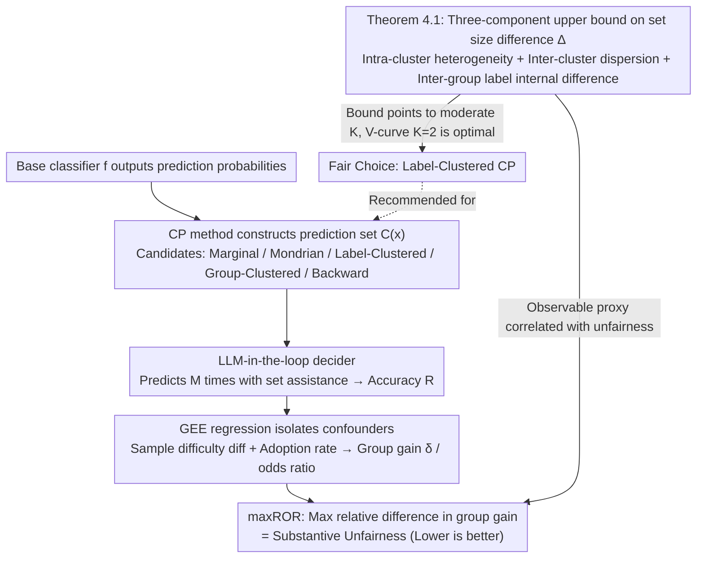

# Beyond Procedure: Substantive Fairness in Conformal Prediction

**Conference**: ICML2026  
**arXiv**: [2602.16794](https://arxiv.org/abs/2602.16794)  
**Code**: https://github.com/layer6ai-labs/llm-in-the-loop-conformal-fairness  
**Area**: AI Safety/Fairness  
**Keywords**: Conformal Prediction, Substantive Fairness, Prediction Set Size Difference, Label Clustering, LLM Evaluator  

## TL;DR
This paper moves beyond the procedural fairness perspective of Conformal Prediction (CP) to focus on the substantive fairness of downstream decisions. It theoretically proves and experimentally validates that **equalizing prediction set size** (rather than equalizing coverage) is the procedural metric strongly correlated with substantive fairness. It proposes a scalable evaluation framework based on LLM-in-the-loop and a Label-Clustered CP method to effectively balance utility and fairness.

## Background & Motivation

**Background**: Conformal Prediction (CP) provides distribution-free uncertainty quantification for machine learning models by constructing prediction sets that satisfy $\mathbb{P}[y \in \mathcal{C}(x)] \geq 1-\alpha$. Regarding fairness, existing research primarily focuses on **procedural fairness**, aimed at ensuring equalized coverage across demographic groups, such as Mondrian CP, which calibrates thresholds independently for each sensitive group.

**Limitations of Prior Work**: Equalized coverage $\neq$ substantive fairness in downstream decisions. A CP method can achieve 90% coverage for all groups while producing compact, useful sets for one group and large, useless sets for another. Cresswell et al. (2025) found through human experiments that Mondrian CP, despite equalizing coverage, actually exacerbates disparate impact in downstream prediction accuracy.

**Key Challenge**: Equalized Coverage and Equalized Set Size are rivalrous objectives—pursuing the former often sacrifices the latter, even though the latter truly influences downstream fairness. However, this relationship previously lacked theoretical explanation and large-scale empirical validation.

**Goal**: (1) Establish a scalable substantive fairness evaluation framework to replace expensive human experiments; (2) Clarify the quantitative relationship between procedural metrics and substantive fairness; (3) Theoretically analyze and verify why Label-Clustered CP effectively reduces set size differences.

**Key Insight**: The authors observe that "accuracy gain" obtained by downstream deciders from prediction sets is the true measure of fairness, rather than the statistical properties of the sets themselves. Utilizing LLMs to approximate human decision-making behavior allows for the low-cost, large-scale evaluation of group differences in this downstream gain.

**Core Idea**: Use an LLM-in-the-loop evaluator instead of human experiments to measure substantive fairness (maxROR), and decompose the prediction set size difference into three interpretable components via theoretical bounds to guide the use of Label-Clustered CP for reducing downstream unfairness.

## Method

### Overall Architecture

The paper does not propose a new CP algorithm but answers a diagnostic question: which **observable procedural metric** truly predicts substantive fairness in downstream decisions? To this end, it views the entire pipeline in three layers: a base classifier $f$ outputs prediction probabilities, a CP method constructs a prediction set $\mathcal{C}(x)$ based on a calibration set, and finally, a decider (human or LLM) makes the final prediction aided by the set. Crucially, fairness is not measured at the second layer (set construction) but at the third layer using "accuracy gain" across groups. The approach is supported by a theoretical bound, an evaluation framework, and a CP selection strategy: the framework measures substantive unfairness as reproducible maxROR, while the theoretical bound explains which procedural metric to use as a proxy and which CP method to select.

### Key Designs

**1. Theoretical Decomposition of Set Size Difference (Theorem 4.1): Translating unobservable fairness into optimizable procedural quantities**

Substantive fairness itself cannot be directly optimized—one cannot observe if a different CP would have been fairer for a specific decider. This paper's breakthrough is proving that the inter-group prediction set size difference $\Delta_{a,b}$ (a fully observable procedural quantity) is the proxy strongly correlated with downstream unfairness. Its upper bound for a label clustering mapping $h:\mathcal{Y}\to[K]$ is decomposed into three interpretable components: (I) Intra-cluster label heterogeneity $\max_k \epsilon_{k,a}$, describing set size differences between different labels in the same cluster; (II) Inter-cluster dispersion $\max_k \mu_{k,a}-\min_k \mu_{k,a}$, describing the variance in expected set sizes across clusters; (III) Inter-group label internal difference $|\sum_y \mathbb{P}(Y=y\mid A=b)(r_{y,a}-r_{y,b})|$, describing set size differences between two groups for the same label. This decomposition provides the logic for choosing the number of clusters $K$: at $K=1$ (Marginal CP), all labels are mixed, inflating component (I); at $K=|\mathcal{Y}|$, rare labels are calibrated individually with insufficient samples, inflating component (II); only a moderate $K$ suppresses both. The empirical V-shaped curve ($K=2$ being optimal) directly reflects this bound.

**2. LLM-in-the-loop Substantive Fairness Evaluation Framework: Replacing expensive human experiments with scalable proxies**

To verify that "set size difference predicts downstream unfairness," one must measure the actual downstream accuracy gain for each group, which traditionally relies on human experiments—Cresswell et al. (2025) spent approximately £1500 for 30,000 responses, making it impossible to scale across methods. This paper uses LLMs to approximate human deciders: for each sample $x_j$ and CP method $t$, the LLM predicts $M$ times with set assistance to get accuracy $R_{jt}$. A GEE regression $\text{logit}(\mathbb{E}[R_{jt}])\sim \text{treat}_t\times\text{group}_j+\text{diff}_j+\text{adoption}_{jt}$ isolates confounders like sample difficulty $\text{diff}_j$ and adoption rate $\text{adoption}_{jt}$ to extract group-specific gain $\delta_{t,a}$. Substantive unfairness is defined as the maximum relative difference in gain: $\text{maxROR}_t=\max_{a,b}(\text{OR}_{t,a}/\text{OR}_{t,b})-1$, where odds ratios are calculated relative to a "no set" control baseline to cancel out common factors like task difficulty. This reduces evaluation cost from £1500 to ~$1 (for 60k predictions) and eliminates human fatigue and learning effects. Experiments confirm qualitative alignment with human evaluations.

**3. Label-Clustered CP as a Fair Choice: Lowering set size difference without sensitive attributes**

Since set size difference is the target to minimize, the authors ask which CP performs best. Intuitive approaches like Mondrian CP calibrate thresholds for each sensitive group, but because they split the calibration set, the reduced sample size per group increases variance, creating artificial set size differences. Label-Clustered CP changes the axis: it clusters $\mathcal{Y}$ into $K$ clusters based on label difficulty, with each cluster sharing a threshold $\hat{q}_k$. A label $y$ enters the set if $s(x_{\text{test}},y)\leq \hat{q}_{h(y)}$. Because thresholds are shared across groups and calibration data is aggregated rather than split, it avoids explicit conditioning on sensitive attributes and the variance inflation of Mondrian. It acts as an adaptive mechanism at the label level while remaining neutral at the group level, indirectly yielding a fairer set distribution. This explains why Mondrian and Group-Clustered CP show the worst substantive unfairness while Label-Clustered performs best.

## Key Experimental Results

### Setup
Covers four modalities (Image/Text/Audio/Tabular) and four datasets (FACET, BiosBias, RAVDESS, ACSIncome), comparing five CP methods (Marginal, Mondrian, Label-Clustered, Group-Clustered, Backward) at $1-\alpha=0.9$.

### Main Results: Substantive Unfairness maxROR (%)

| CP Method | FACET | BiosBias | RAVDESS | ACSIncome | Avg Rank |
|-----------|-------|----------|---------|-----------|----------|
| Marginal | 9.0 | 6.9 | 11 | — | Medium |
| Mondrian | 38 | 8.1 | 79 | — | Worst |
| Label-Clustered | — | — | One of Lowest | One of Lowest | **Best** |
| Group-Clustered | High | — | High | — | Poor |
| Backward | Lowest | Lowest | High | High | Medium |

> Label-Clustered CP shows significantly lower maxROR than Backward on RAVDESS and ACSIncome, while providing higher accuracy gains (greater utility). Mondrian and Group-Clustered show the most severe unfairness on FACET and RAVDESS.

### LLM Evaluator Validation: Alignment with Human Experiments

| Evaluation Type | Dataset | Marginal maxROR% | Mondrian maxROR% | Qualitative Consistency |
|-----------------|---------|-------------------|-------------------|------------------------|
| Human-in-the-loop| FACET | 26 | 51 | ✓ |
| Human-in-the-loop| BiosBias | 12 | 33 | ✓ |
| Human-in-the-loop| RAVDESS | 1.0 | 28 | ✓ |
| LLM-in-the-loop | FACET | 9.0 | 38 | ✓ |
| LLM-in-the-loop | BiosBias | 6.9 | 8.1 | ✓ |
| LLM-in-the-loop | RAVDESS | 11 | 79 | ✓ |

> Across all three datasets, the LLM evaluator replicated the unfairness ranking of Mondrian > Marginal, validating its feasibility as a substitute for human experiments.

### Key Findings: Relationship between Procedural Metrics and Substantive Fairness
- **Coverage gap is negatively correlated with maxROR**: Equalizing coverage actually increases downstream unfairness (regression slopes were negative across all 4 datasets).
- **Set size gap is positively correlated with maxROR**: Reducing the set size difference lowers downstream unfairness (regression slopes were positive across all 4 datasets).
- The prediction set size difference of Label-Clustered CP follows a **V-shaped curve** with respect to the number of clusters $K$, reaching an optimum at $K=2$, validating Theorem 4.1.

## Highlights & Insights
- **Subversive Conclusion**: CP fairness research has long focused on Equalized Coverage; this paper demonstrates this is the wrong goal—Equalized Set Size is the correct proxy for substantive fairness.
- **Low-cost Evaluation**: LLM-in-the-loop reduces fairness evaluation costs from approximately £1500 to $1, enabling systematic comparison across methods and modalities for the first time.
- **Theory-Empirical Loop**: The three-component decomposition in Theorem 4.1 numerically validated the tightness of the bound on RAVDESS, and the V-shaped curve matched the empirical findings.
- **Practical Advice**: Avoid conditioning on demographic attributes (Mondrian). Prioritize Label-Clustered CP and use the set size gap to diagnose and select the hyperparameter $K$.

## Limitations & Future Work
- The LLM evaluator differs from humans in **absolute values** (only qualitative rankings are consistent) and cannot fully replace human experiments.
- The study focuses on correlation; the **causal relationship** between procedural metrics and substantive fairness is not yet established (the authors suggest controlling adoption rate for future work).
- The optimal $K$ for Label-Clustered CP does not perfectly coincide for minimizing set size gap and maxROR; selecting $K$ still requires downstream validation.
- Experiments only covered 4 datasets and a single coverage level $\alpha=0.1$.

## Related Work & Insights
- **Cresswell et al. (2025)** first used human experiments to reveal the disparate impact of Mondrian CP; this paper systematizes and significantly extends that work.
- **Ding et al. (2023)** proposed Clustered Conformal Prediction to improve conditional coverage; this paper discovers its unexpected advantages in fairness.
- **Insight**: The LLM-in-the-loop evaluation paradigm can be generalized to other AI fairness scenarios requiring human assessment (e.g., recommender systems, information retrieval).

## Rating
- Novelty: ⭐⭐⭐⭐ (Shifting CP fairness from procedural metrics to substantive outcomes; LLM as a human substitute is a novel contribution)
- Experimental Thoroughness: ⭐⭐⭐⭐ (Comprehensive comparison across 4 modalities and 5 methods + theoretical validation)
- Writing Quality: ⭐⭐⭐⭐⭐ (Clear logic; theory, empirical evidence, and practical advice are well-integrated)
- Value: ⭐⭐⭐⭐ (Significant value in correcting the research direction for CP fairness)

<!-- RELATED:START -->

## Related Papers

- [\[AAAI 2026\] Breaking the Dyadic Barrier: Rethinking Fairness in Link Prediction Beyond Demographic Parity](../../AAAI2026/ai_safety/breaking_the_dyadic_barrier_rethinking_fairness_in_link_prediction_beyond_demogr.md)
- [\[ICML 2026\] Position: Beyond Sensitive Attributes, ML Fairness Should Quantify Structural Injustice via Social Determinants](position_beyond_sensitive_attributes_ml_fairness_should_quantify_structural_inju.md)
- [\[ICML 2026\] COFT: Counterfactual-Conformal Decoding for Fair Chain-of-Thought Reasoning in Large Language Models](coft_counterfactual-conformal_decoding_for_fair_chain-of-thought_reasoning_in_la.md)
- [\[ICLR 2026\] Beyond Match Maximization and Fairness: Retention-Optimized Two-Sided Matching](../../ICLR2026/ai_safety/beyond_match_maximization_and_fairness_retention-optimized_two-sided_matching.md)
- [\[ICLR 2026\] Fair Conformal Classification via Learning Representation-Based Groups](../../ICLR2026/ai_safety/fair_conformal_classification_via_learning_representation-based_groups.md)

<!-- RELATED:END -->
