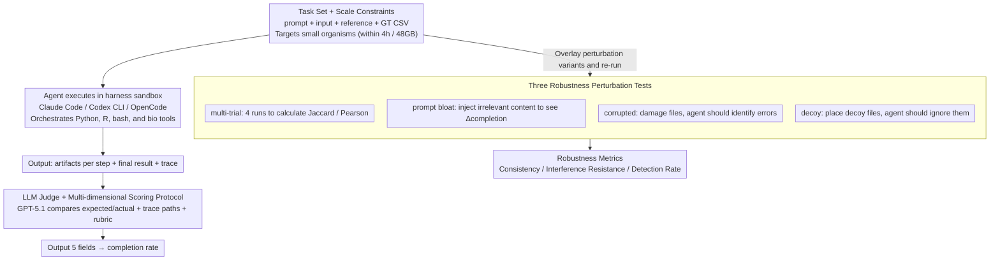

# BioAgent Bench: An AI Agent Evaluation Suite for Bioinformatics

**Conference**: ICML 2026  
**arXiv**: [2601.21800](https://arxiv.org/abs/2601.21800)  
**Code**: https://github.com/bioagent-bench/bioagent-bench  
**Area**: LLM Agent / Benchmark / Bioinformatics  
**Keywords**: agent evaluation, bioinformatics pipeline, LLM judge, robustness perturbation testing

## TL;DR
BioAgent Bench introduces an end-to-end evaluation suite for executing bioinformatics pipelines with LLM agents. It features 10 real-world bioinformatics tasks evaluated across 10 frontier/open-weight models and 3 agent harnesses. Using an LLM judge for scoring and three types of perturbation tests (corrupted, decoy, and prompt-bloat), the study finds that frontier models can complete over 90% of pipelines, yet their robustness remains concerning.

## Background & Motivation
**Background**: Mature benchmarks for LLM agents exist in software engineering (SWE-bench) and general tool usage (AgentBench, ToolBench). Similarly, benchmarks like BioML-bench, LAB-Bench, and BixBench cover biomedical domains. However, existing benchmarks either reduce tasks to QA/code generation or focus on isolated "data analysis" rather than "full pipeline execution."

**Limitations of Prior Work**: Real-world bioinformatics workflows are highly complex, requiring the orchestration of command-line tools, management of heterogeneous file formats, and interpretation of intermediate products. Evaluation is difficult because a single dataset can support multiple reasonable pipelines, parameter choices significantly influence outcomes, and many steps cannot be strictly determined via pass/fail criteria. Hard-match evaluation methods like those used in SWE-bench are inapplicable here.

**Key Challenge**: (1) Authentic bioinformatics tasks are long-running (hours) and resource-intensive (tens of GBs of RAM), while benchmarks require reproducibility and scalability; (2) The existence of multiple valid solutions creates conflict between automated scoring and strict ground truth; (3) Clinical/IP sensitive data cannot be sent to closed-source APIs, necessitating the evaluation of open-weight models, which are generally weaker than frontier models.

**Goal**: (i) Create a set of end-to-end pipeline-style bioinformatics tasks runnable within reasonable compute budgets (<4h, <48GB); (ii) Design a scoring protocol that tolerates multiple solutions using an LLM as a judge; (iii) Implement perturbation tests beyond vanilla settings to examine agent robustness against corrupted data, decoy files, and prompt bloat; (iv) Systematically compare the performance of 5 closed-source and 5 open-weight models under 3 harnesses.

**Key Insight**: By intentionally limiting task scales to "small organisms" (bacteria, viruses, fungi), reference data can be directly packaged as input files. This circumvents infrastructure issues, such as agents needing to download massive genomic files, allowing evaluation to focus specifically on pipeline orchestration capabilities.

**Core Idea**: Use a unified task specification consisting of a "task prompt, input data, reference data, and expected CSV/TSV output format." An LLM judge compares execution traces and outcomes to provide step-level completion scores. This is supplemented by three perturbation tests to verify if "high-level pipeline construction" and "low-level step-level reasoning" hold simultaneously.

## Method

### Overall Architecture
BioAgent Bench addresses whether an LLM agent can reliably execute a bioinformatics workflow from start to finish. The benchmark consists of three components. The **Task Set** provides 10 end-to-end tasks covering subfields like RNA-seq, variant calling, metagenomics, transcriptome quantification, and experimental evolution. Each task follows a unified specification. The **Evaluation Harness** operates within a hashed sandbox directory where the agent runs using Claude Code, Codex CLI, or OpenCode. The agent may invoke Python packages or specialized bioinformatics tools. The **LLM Grader** (GPT-5.1) receives input/reference paths, expected outcomes, actual agent outcomes, traces (file paths only), and a grading rubric. It outputs five fields: `steps_completed`, `steps_to_completion`, `final_result_reached`, `results_match`, and `f1_score`. The primary metric is the completion rate, defined as the ratio of completed necessary steps to total required steps.

### Key Designs

**1. Task Set and Scale Constraints: Enabling end-to-end pipelines within consumer GPU budgets**  
Design Motivation: Real bioinformatics workflows often consume dozens of GBs of RAM and take hours to run, making large-scale reproducible evaluation impossible. BioAgent Bench addresses this by constraining task scales to <4h and <48GB by focusing on "small organisms" (e.g., mouse Alzheimer models, E. coli evolution, viral metagenomics). Since reference data is small enough to include as input files, infrastructure tasks like downloading massive genomes are bypassed, focusing evaluation on pipeline orchestration.

**2. LLM Judge + Multi-dimensional Scoring Protocol: Soft scoring over hard matching**  
Mechanism: Bioinformatics tasks naturally have multiple solutions. BioAgent Bench uses GPT-5.1 as a grader, providing it with input paths, expected/actual CSVs, trace file path trees, and a grading rubric. The rubric prioritizes "pipeline completion" over numerical precision. By analyzing the trace rather than just the final output, the grader can grant partial credit to agents that construct the correct pipeline but fail the final formatting, which aligns more closely with human expert judgment. Trace visibility is restricted to file paths to protect sensitive data and reduce token consumption.

**3. Three Types of Robustness Perturbation Testing: Decoupling "running" from "reasoning"**  
Core Idea: High-level pipeline construction does not equal reliable step-level reasoning. Three orthogonal perturbations are added: **Multi-trial consistency** runs the same task 4 times to calculate Jaccard (for classification) or Pearson (for numerical results) scores to check decision stability. **Prompt bloat** injects irrelevant content into the prompt to observe the change in completion rate ($\Delta$). **Corrupted input** damages FASTQ/BAM files to see if agents identify the error. **Decoy input** places irrelevant files in the directory to see if agents are misled.

### Loss & Training
This is a benchmark; no training is performed. For evaluation, GPT-5.2 in the Codex CLI harness serves as the primary model for robustness assessment, with "high" reasoning effort enabled by default.

## Key Experimental Results

### Main Results
Average completion rate across 10 tasks under the vanilla setting (Codex CLI harness):

| Model Type | Model | Avg Completion% |
|:---|:---|:---|
| Closed Frontier | Claude Opus 4.5 | **100** |
| Closed Frontier | Gemini 3 Pro / GPT-5.2 / Sonnet 4.5 | >90 |
| Best Open-weight | GLM-4.7 | 82.5 |
| Others | Various | As low as ~65 |

**Planning vs Execution**: Planning scores (1-5 scale by GPT-5.1) correlate with end-to-end completion rates ($Pearson r=0.61$), but planning is not always decisive. For example, Gemini-Pro-3 shows weaker planning scores but stronger execution, suggesting the bottleneck for open-weight models lies in multi-turn agentic capabilities rather than domain knowledge.

### Ablation Study
Multi-trial Stability (GPT-5.2 in Codex CLI over 4 trials):

| Task | Jaccard | Pearson | Note |
|:---|:---|:---|:---|
| transcript-quant | 1.000 | 1.000 | Fully deterministic |
| cystic-fibrosis | 1.000 | NA | High consistency |
| deseq | 0.978 | 0.995 | Highly stable |
| viral-metagenomics | 0.667 | 1.000 | Numerical stable, classification jitter |
| metagenomics | 0.395 | 0.746 | Moderate |
| alzheimer | 0.160 | 0.219 | Unstable |
| comparative-genomics | 0.004 | NA | Almost completely inconsistent |
| evolution | 0.000 | NA | Completely inconsistent |

Mean Jaccard is 0.43 and Pearson is 0.73, indicating that the same agent running the same task 4 times overlaps in classification results less than half the time.

Perturbation Testing (GPT-5.2 single trial, Δ% represents completion change after prompt-bloat):

| Task | Identified Corrupted? | Resisted Decoy? | Δ completion (%) |
|:---|:---|:---|:---|
| alzheimer-mouse | ✗ | ✗ | -12.5 |
| comparative-genomics | ✗ | ✓ | -20.0 |
| deseq | ✓ | ✗ | **-100.0** |
| evolution | ✓ | ✗ | +75.0 |
| giab | ✓ | ✗ | — |

### Key Findings
- **Frontier models do not require complex scaffolding**: Claude Opus 4.5 achieved 100% completion using a basic Codex CLI harness, challenging the necessity of complex agentic frameworks.
- **Pipeline construction ≠ step-level reasoning**: Results varied significantly across trials for tasks like comparative-genomics, showing that even when an agent "completes" a task, intermediate decisions (parameters, normalization) are unstable.
- **Low detection of corrupted data**: Most agents fail to recognize damaged inputs and proceed to produce incorrect results. A notable exception is `deseq`, which correctly errors out.
- **Poor decoy robustness**: Agents are easily misled by decoy files, lacking the prior judgment to select the correct inputs.
- **Open-weight models are valuable for privacy**: While frontier models are stronger, open-weight models are necessary for sensitive patient data. This study provides the first systematic baseline for such models in bioinformatics.

## Highlights & Insights
- **Smart compromise between scale and feasibility**: Focusing on small organisms allows reference data to be included in task inputs, a key factor for benchmark scalability.
- **Trace file path tree evaluation**: Evaluating traces via file paths rather than content protects sensitive data and reduces token overhead.
- **Targeted perturbation design**: Separating corrupted (cognition), decoy (attention), and bloat (robustness) allows for precise localization of agent failure modes.
- **Systematic comparison**: Provides a directly reusable leaderboard comparing 10 closed and open-source models.

## Limitations & Future Work
- **Small task scale**: Excludes human-scale workflows (e.g., 30× WGS variant calling), so infrastructure steps like downloading large references are skipped, limiting generalization to production environments.
- **LLM scoring bias**: The grader (GPT-5.1/5.2) might favor specific trace patterns and belongs to the same generation as the models being evaluated.
- **Single-trial perturbation**: Relying on a single trial for robustness results introduces statistical noise. Future work should report 2D tables of perturbations across multiple seeds.
- **Open-weight limitations**: Robustness tests were not fully executed on open-weight models.
- **Quantification of agent failure loops**: The study lacks quantitative metrics (e.g., trace length or loop count) for analyzing error-correction cycles or premature termination.

## Related Work & Insights
- **vs SWE-bench**: While SWE-bench uses strict pass/fail unit tests, BioAgent Bench uses an LLM judge for soft scoring and partial credit, which is better suited for multi-solution scientific workflows.
- **vs BioML-bench**: BioML focuses on ML processes (protein engineering, imaging), while BioAgent Bench focuses on bioinformatics toolchain orchestration.
- **vs LAB-Bench**: LAB-Bench evaluates research skills via multiple-choice questions; BioAgent Bench emphasizes actual execution.
- **Insight**: The protocol of "LLM judge + scale constraints + triple perturbations" can be adapted to other fields involving complex pipelines, such as quantum chemistry or geosciences.

## Rating
- Novelty: ⭐⭐⭐
- Experimental Thoroughness: ⭐⭐⭐
- Writing Quality: ⭐⭐⭐⭐
- Value: ⭐⭐⭐⭐

<!-- RELATED:START -->

## Related Papers

- [\[ICML 2026\] Watermarking LLM Agent Trajectories (ACTHOOK)](watermarking_llm_agent_trajectories.md)
- [\[ICML 2026\] Red-Teaming Agent Execution Contexts: Open-World Security Evaluation on OpenClaw](red-teaming_agent_execution_contexts_open-world_security_evaluation_on_openclaw.md)
- [\[ICML 2026\] Rethinking Evaluation Paradigms in IBP-based Certified Training](rethinking_evaluation_paradigms_in_ibp-based_certified_training.md)
- [\[ICML 2026\] ABC-Bench: An Agentic Bio-Capabilities Benchmark for Biosecurity](abc-bench_an_agentic_bio-capabilities_benchmark_for_biosecurity.md)
- [\[ICLR 2026\] Risk-Sensitive Agent Compositions](../../ICLR2026/ai_safety/risk-sensitive_agent_compositions.md)

<!-- RELATED:END -->
