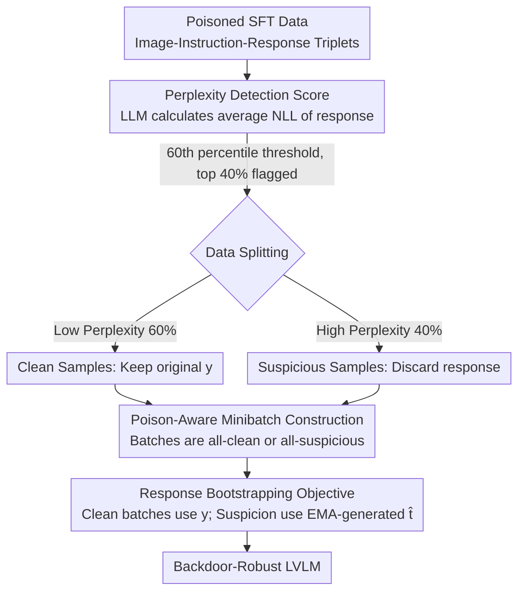

# BYORn: Bootstrap Your Own Responses to Defend Large Vision-Language Models Against Backdoor Attacks

**Conference**: ICML 2026  
**arXiv**: [2606.02947](https://arxiv.org/abs/2606.02947)  
**Code**: https://github.com/ivansabolic/BYORn  
**Area**: LLM Security  
**Keywords**: Backdoor Defense, Vision-Language Models, Robust Fine-tuning, Response Bootstrapping, Data Poisoning

## TL;DR

BYORn identifies poisoned samples by detecting high-perplexity target responses inconsistent with input semantics and dynamically replaces them with clean responses generated by the model itself. This breaks the association between backdoor triggers and malicious outputs, reducing the average Attack Success Rate (ASR) by 40 percentage points while maintaining clean task performance.

## Background & Motivation

**Background**: Supervised Fine-Tuning (SFT) is the dominant approach to adapt pre-trained Large Vision-Language Models (LVLMs) to downstream tasks. By training on annotated image-instruction-response triplets, models achieve strong performance in tasks such as image captioning and visual question answering.

**Limitations of Prior Work**: Recent research reveals that SFT is highly vulnerable to backdoor attacks. An attacker only needs to inject a small number of poisoned samples into the fine-tuning dataset (e.g., embedding visual triggers in images, inserting specific phrases in instructions, or replacing responses with malicious content) to force the model into producing specified malicious outputs when the trigger is encountered at inference. Existing defense methods are either designed for image classification (unable to handle open-ended generation), focus only on single-modal triggers (e.g., ONION only detects textual triggers), or assume specific trigger patterns (failing against diverse attacks).

**Key Challenge**: In open-ended multimodal generation scenarios, defense methods must simultaneously handle triggers in both visual and textual modalities without relying on prior assumptions about trigger types. This makes traditional defense strategies from classification scenarios entirely ineffective.

**Key Insight**: The authors observe that the target responses of poisoned samples are typically semantically inconsistent with the corresponding image-text inputs. Consequently, they exhibit low conditional likelihood (high perplexity) under the pre-trained model. This distributional characteristic provides a foundation for general detection that does not require assumptions about trigger types.

**Core Idea**: Utilize perplexity scores from the pre-trained model to detect suspicious poisoned samples, then replace the targets of flagged samples with clean responses generated by an EMA version of the model, thereby "bootstrapping" clean training signals.

## Method

### Overall Architecture

BYORn aims to "neutralize" poisoned samples mixed into the fine-tuning data without knowing what the triggers look like. It follows a two-step process: first, calculating a perplexity score for each sample's response using the pre-trained model and splitting the data into "clean" and "suspicious" pools based on a percentile threshold; second, performing robust fine-tuning where clean samples are trained on original responses while suspicious samples use responses generated on-the-fly by the model's EMA version. These samples are grouped into specialized minibatches to minimize generation overhead. The optimization objective of this pipeline can be proven equivalent to minimizing an upper bound of the population risk on the clean data distribution.

### Key Designs

**1. Perplexity Detection Score: Identifying poisoning via semantic mismatch without trigger assumptions**

The difficulty of backdoor defense lies in the variety of triggers—they can be hidden in images, instruction words, or both. Traditional methods are easily bypassed if they assume a specific trigger mode. BYORn avoids the trigger entirely and focuses on the response: malicious targets of poisoned samples (e.g., outputting "banana" regardless of the image content) are semantically decoupled from the input, leading to low likelihood from the pre-trained model. For each sample $(\mathbf{x}, \mathbf{q}, \mathbf{y})$, the average negative log-likelihood of the target response is calculated as $s(\mathbf{y}|\mathbf{x},\mathbf{q},\theta) = -\frac{1}{K}\sum_{l=1}^{K}\ln p_\theta(y_l|\mathbf{y}_{<l},\mathbf{x},\mathbf{q})$ (where $K$ is the token count, used for normalization across lengths). By setting a 60th percentile threshold $\delta_{0.6}$, the top 40% highest perplexity samples are flagged as suspicious. This aggressive threshold prioritize high recall for poisoned samples, as the subsequent bootstrapping step will recover misidentified clean samples. This detection requires no clean reference set and is modality-agnostic.

**2. Response Bootstrapping Training Objective: Replacing suspicious responses with self-generated clean signals**

The simplest defense is discarding suspicious samples (BYORn-F in ablations), but removing 40% of the data causes clean performance to collapse. BYORn instead replaces the response while keeping the input. By introducing a latent clean response $\mathbf{t}$ and a poison indicator $u$, clean samples continue using the original response $\mathbf{y}$, while suspicious samples use replacement responses $\hat{\mathbf{t}}$ sampled on-the-fly from the EMA version of the model $\theta_{\text{EMA}}^t = \lambda \cdot \theta_{\text{EMA}}^{t-1} + (1-\lambda) \cdot \theta^{t-1}$. The mixed objective is defined as $\tilde{\mathcal{R}}_{\text{BY}} = \frac{1}{|\mathcal{D}_p|}\sum[(1-P_{\hat{u}})\cdot\mathcal{L}(\theta|\mathbf{y},\cdot) + P_{\hat{u}}\cdot\mathcal{L}(\theta|\hat{\mathbf{t}},\cdot)]$. This cuts the link between triggers and malicious outputs while allowing the model to learn from the normal visual-textual signals, maintaining high data utilization—CIDEr scores improve from 42.4 to 62.0 because of this step. Using the EMA model ensures stable response quality. Theoretically, using the Donsker-Varadhan bound and Hoeffding's Lemma, it can be proven that the gradient of this objective equals the gradient of the population risk upper bound on the clean distribution.

**3. Poison-Aware Minibatch Construction: Concentrating generation overhead to avoid autoregressive bottlenecks**

Bootstrapping requires on-the-fly generation for suspicious samples, which is expensive due to autoregressive decoding. Naive random mixing would require generation steps in every training batch, increasing training time by over 6x. BYORn completes detection once before training and groups samples by clean/suspicious labels. Each minibatch is constructed to be either entirely clean or entirely suspicious. Clean batches skip the generation step, while suspicious batches process generations in concentrated blocks. These suspicious batches are then spread uniformly across the training process. This scheduling reduces the extra overhead from 6x to 2.2x without compromising accuracy.

## Key Experimental Results

### Main Results: Image Captioning (Average across four attacks)

| Model | Defense | Flickr CIDEr↑ | Flickr ASR↓ | COCO CIDEr↑ | COCO ASR↓ |
|-------|---------|---------------|-------------|-------------|-----------|
| LLaVA | SFT (No Defense) | 51.4 | 57.3% | 74.9 | 48.0% |
| LLaVA | ONION | 51.3 | 23.0% | 74.8 | 20.7% |
| LLaVA | BYE | 54.7 | 62.4% | 80.6 | 54.8% |
| LLaVA | **BYORn-F** | 42.4 | **0.3%** | 60.6 | 1.6% |
| LLaVA | **BYORn** | **62.0** | **0.0%** | **90.9** | **0.4%** |
| Qwen-VL | SFT | 60.7 | 100.0% | 66.9 | 89.8% |
| Qwen-VL | **BYORn** | 52.2 | **2.1%** | 59.6 | **2.7%** |
| InternVL | SFT | 57.3 | 99.8% | 64.9 | 71.6% |
| InternVL | **BYORn** | 56.0 | **0.8%** | 65.1 | **2.8%** |

### Ablation Study

| Experimental Setting | CIDEr↑ | ASR↓ | Description |
|----------------------|--------|------|-------------|
| BYORn-F (Filtering) | 42.4 | 0.3% | Discarding 40% of data leads to CIDEr drop |
| BYORn (Full) | 62.0 | 0.0% | Bootstrapping restores performance, exceeding SFT |
| Threshold p=0.3 | 55.6 | 0.0% | Too many clean samples flagged, CIDEr drops slightly |
| Threshold p=0.6 (Default)| 62.2 | 0.0% | Optimal balance point |
| Threshold p=0.95 | 60.4 | 1.1% | Low recall but BYORn remains robust; BYORn-F fails (ASR 57.6%) |
| Poison Rate 1% | 62.0 | 0.0% | Stable across poisoning rates |
| Poison Rate 50% | 61.5 | 0.2% | Effective even under extreme poisoning |
| Adaptive Attack (Patch) | 62.0 | 1.6% | Robust against semantically aligned triggers |
| Adaptive Attack (PGD) | 60.1 | 0.2% | Robust against PGD-optimized triggers |

### Key Findings

- BYORn achieves Pareto optimality (the best trade-off between robustness and generalization) across all models and attacks; on LLaVA, it even surpasses the CIDEr of undefended SFT (62.0 vs 51.4).
- Even when detector recall is only 50% (p=0.95), BYORn suppresses ASR to 1.1%, whereas BYORn-F’s ASR surges to 57.6%—indicating the bootstrapping objective itself possesses inherent robustness.
- Faced with three types of adaptive attacks (semantically aligned triggers, PGD adversarial perturbations, and approximate clean-label attacks), BYORn remains effective, with ASR not exceeding 8.4%.

## Highlights & Insights

- **Perplexity as a Safety Signal**: Using the pre-trained model's perplexity as a poison detector requires no clean reference set or trigger assumptions, making it concise and universal. This logic can be transferred to any scenario requiring the detection of training data anomalies (such as label noise filtering).
- **Bootstrapping Over Simple Filtering**: The core advantage of BYORn over BYORn-F is that it does not discard data. Replacing suspicious targets with model-generated responses breaks backdoor associations while retaining visual-textual information for normal learning. The jump in CIDEr from 42.4 to 62.0 confirms the value of this design.
- **Theoretical Guarantees**: By deriving the objective from the Donsker-Varadhan bound, BYORn is shown to minimize the risk upper bound on the clean distribution, providing theoretical guidance for hyperparameter selection (e.g., thresholds and EMA decay rates).

## Limitations & Future Work

- Current defense relies on the assumption that poisoned responses are semantically inconsistent with inputs. It may fail against true clean-label attacks where malicious responses are semantically plausible, which the authors list as an open challenge.
- The quality of bootstrapped responses is limited by the generation capability of the EMA model, which may introduce noise in early training stages or with smaller model capacities.
- While the poison-aware minibatch strategy effectively reduces overhead, the full BYORn training time remains approximately 3x that of standard SFT (including 20 minutes for detection + ~135 minutes per epoch vs 45 minutes).
- Experiments covered four standard attacks and three adaptive attacks but did not test more complex multi-step attacks or backdoor scenarios in multi-turn dialogues.

## Related Work & Insights

- **ONION**: Detects only textual triggers (removing high-perplexity words); ineffective against visual triggers.
- **BYE**: Filters based on attention scores for image-text pairs; fails against global image triggers (e.g., Blend, VL-Trojan).
- **VL-Trojan / DualKey / BadNets / Blend**: The four representative attacks evaluated, covering image patches, global overlays, and bimodal trigger types.
- **Insights**: The "Detection-Replacement" framework of BYORn can be generalized to LLM instruction tuning safety—detecting malicious annotations in RLHF data using perplexity and replacing them with self-generated responses.

<!-- RELATED:START -->

## Related Papers

- [\[ICML 2026\] From Prompts to Responses: Dual-Sided Data Leakage and Defense in Split Large Language Models](from_prompts_to_responses_dual-sided_data_leakage_and_defense_in_split_large_lan.md)
- [\[CVPR 2026\] Towards Robust Multimodal Large Language Models Against Jailbreak Attacks](../../CVPR2026/ai_safety/towards_robust_multimodal_large_language_models_against_jailbreak_attacks.md)
- [\[ICML 2026\] Forget to Know, Remember to Use: Context-Aware Unlearning for Large Language Models](forget_to_know_remember_to_use_context-aware_unlearning_for_large_language_model.md)
- [\[ICML 2026\] COFT: Counterfactual-Conformal Decoding for Fair Chain-of-Thought Reasoning in Large Language Models](coft_counterfactual-conformal_decoding_for_fair_chain-of-thought_reasoning_in_la.md)
- [\[ICML 2026\] DualOptim+: Bridging Shared and Decoupled Optimizer States for Better Machine Unlearning in Large Language Models](dualoptim_bridging_shared_and_decoupled_optimizer_states_for_better_machine_unle.md)

<!-- RELATED:END -->
