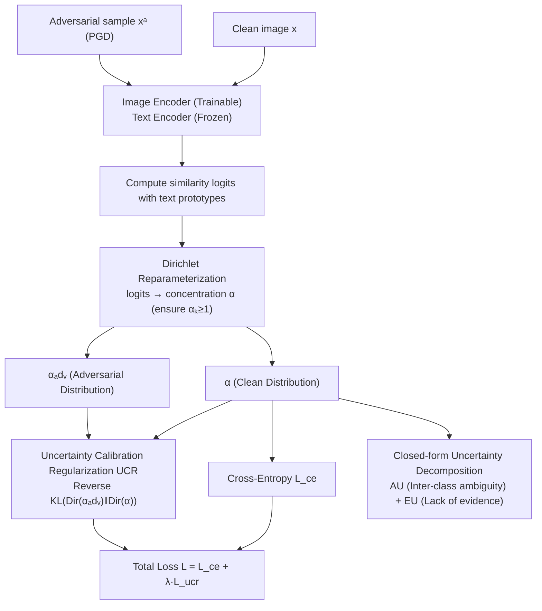

# Calibrating Uncertainty for Zero-Shot Adversarial CLIP

**Conference**: ICML 2026  
**arXiv**: [2512.12997](https://arxiv.org/abs/2512.12997)  
**Code**: https://github.com/VivienLu/UCAT  
**Area**: AI Security  
**Keywords**: Adversarial Robustness, Uncertainty Calibration, CLIP, Dirichlet Distribution, Zero-shot Classification  

## TL;DR

The UCAT framework is proposed to reparameterize CLIP logits as concentration parameters of a Dirichlet distribution. By aligning the Dirichlet distributions of clean and adversarial samples (via reverse KL divergence), UCAT simultaneously calibrates uncertainty and preserves semantic structure during zero-shot adversarial fine-tuning, achieving an optimal balance between robustness and calibration across 16 benchmarks.

## Background & Motivation

**Background**: Vision-Language Models (VLMs) like CLIP achieve powerful zero-shot recognition through contrastive pre-training but are extremely vulnerable to adversarial attacks—tiny pixel-level perturbations can lead to confident misclassifications. Existing Zero-Shot Adversarial Robustness (ZSAR) methods primarily enhance robustness by adversarially fine-tuning the image encoder while attempting to retain zero-shot generalization.

**Limitations of Prior Work**: Mainstream methods adopt a "single-anchor alignment" strategy, pulling adversarial features toward the text embedding of the ground truth label, which ignores relative geometric relationships with other class embeddings. Other methods align softmax distributions, but softmax normalization discards absolute logit scale information, which is critical for reliability reasoning in open-vocabulary scenarios.

**Key Challenge**: The authors discovered a counter-intuitive phenomenon—adversarial perturbations not only reduce accuracy but also **suppress predictive uncertainty**, causing the model to produce falsely high-confidence predictions when under attack. This violates the fundamental expectation that "harder or out-of-distribution inputs should yield higher uncertainty," exposing a **reliability gap** beyond mere accuracy.

**Goal**: To design an adversarial fine-tuning method that simultaneously optimizes accuracy and uncertainty calibration, ensuring the model maintains robustness and provides well-calibrated confidence estimates under adversarial attacks.

**Key Insight**: The authors observe a structural correspondence between the softmax probability of CLIP zero-shot classification and the expectation of a Dirichlet distribution—both are softmax operations on logits. This implies that CLIP logits can be reinterpreted as evidence parameters of a Dirichlet distribution.

**Core Idea**: Reparameterize CLIP logits as Dirichlet concentration parameters and use reverse KL divergence to align clean and adversarial Dirichlet distributions. This maintains inter-class semantic relationships (epistemic uncertainty) while calibrating evidence strength (aleatoric uncertainty).

## Method

### Overall Architecture

UCAT addresses the issue in CLIP adversarial fine-tuning where models become overconfident despite being incorrect under attack. It follows a standard CLIP adversarial fine-tuning backbone—freezing the text encoder and training only the image encoder. Given a clean image $x$ and its corresponding PGD adversarial sample $x^a$, similarity logits with text prototypes are calculated. The key transformation is reinterpreting these logits as Dirichlet concentration parameters, then aligning the adversarial distribution with the clean distribution to recover uncertainty calibration while maintaining robustness.

### Key Designs

**1. Dirichlet Reparameterization: Embedding Uncertainty into CLIP Logits**

Existing methods for aligning softmax probabilities lose the absolute logit scale, which is the key information for judging "sufficiency of evidence" in open-vocabulary settings. UCAT starts from a mathematical coincidence: both CLIP's softmax and the Dirichlet expectation result from a softmax on logits. Thus, concentration parameters are defined as $\alpha_k(x) = \exp(h(\ell_k^{v \to t}(x)))$, where $h(\ell) = (\tau \ell + 1) / \tau'$. Since cosine similarity keeps $\tau \ell_k \in [-1, 1]$, adding 1 maps it to $[0, 2]$, and dividing by the calibration coefficient $\tau'$ before exponentiation ensures positivity. This construction guarantees $\alpha_k \geq 1$, avoiding the corner-concentration effects and numerical instability of the digamma function when $\alpha_k < 1$. Furthermore, when $\tau' = \tau$, the Dirichlet expectation strictly equals the CLIP softmax prediction ($p_k^{\text{Dir}} = p_k^{\text{CLIP}}$), and any $\tau' > 0$ preserves the argmax—extracting closed-form uncertainty parameters without altering the CLIP architecture or original predictions.

**2. Uncertainty Calibration Regularization (UCR): Aligning Two Dirichlets via Reverse KL**

Having Dirichlet parameters is insufficient; the evidence distribution of adversarial samples must resemble that of clean samples. UCR defines the regularization loss as the reverse KL divergence at the Dirichlet level: $\mathcal{L}_{\text{ucr}} = \text{KL}(\text{Dir}(\alpha_{\text{adv}}) \| \text{Dir}(\alpha))$, combined with cross-entropy for the final objective $\mathcal{L} = \mathcal{L}_{\text{ce}} + \lambda \mathcal{L}_{\text{ucr}}$. Two deliberate choices are made here: (1) Aligning at the Dirichlet level rather than the probability level, as probability-level KL erases absolute evidence strength, while Dirichlet-level alignment preserves both relative class structure (shape/epistemic uncertainty) and total evidence (aleatoric uncertainty). (2) Using reverse KL rather than forward KL; reverse KL is mode-seeking, tracking the primary mode of the clean distribution while allowing low evidence on irrelevant classes, whereas forward KL tends to cover all modes and spread out evidence.

**3. Closed-form Uncertainty Decomposition: Simultaneous AU and EU in One Pass**

With Dirichlet parameters, Aleatoric Uncertainty (AU) and Epistemic Uncertainty (EU) can be calculated analytically without redundant forward passes like MC Dropout. AU is defined as the expected Shannon entropy of the categorical distribution under the Dirichlet: $\text{AU}(x) = -\sum_k \frac{\alpha_k}{\alpha_0}(\psi(\alpha_k+1) - \psi(\alpha_0+1))$, characterizing inherent inter-class ambiguity. EU is defined by the inverse of the total evidence: $\text{EU}(x) = C / (\alpha_0 + C)$ (where $\alpha_0 = \sum_k \alpha_k$ is the total concentration and $C$ is the number of classes), characterizing the lack of evidence. Higher $\alpha_0$ yields lower EU, aligning with the intuition that more evidence leads to higher certainty.

### Loss & Training

The total loss is the sum of cross-entropy and UCR regularization: $\mathcal{L} = \mathcal{L}_{\text{ce}} + \lambda \mathcal{L}_{\text{ucr}}$. Adversarial samples are generated via $\ell_\infty$ PGD. The calibration coefficient uses the standard contrastive temperature $\tau' = 0.07$, and the regularization weight is $\lambda = 10^5 / \beta$ (where $\beta = 2/e^{\tau'}$). Only the image encoder is fine-tuned; the text encoder remains frozen.

## Key Experimental Results

### Main Results (Zero-Shot Adversarial Robustness on 16 Single-Label Datasets)

| Method | Clean Avg | PGD-100 Avg | CW Avg | AutoAttack Avg | H (Clean-AA) |
|------|-----------|-------------|--------|----------------|---------------|
| CLIP | 64.45 | 3.46 | 4.06 | 0.51 | 1.01 |
| TeCoA | 43.83 | 29.86 | 29.25 | 28.74 | 34.72 |
| FARE | 53.00 | 12.81 | 12.64 | 2.33 | 4.45 |
| PMG-AFT | 53.72 | 31.63 | 22.25 | 17.88 | 26.83 |
| TGA-ZSR | 49.91 | 31.55 | 31.28 | 30.52 | 37.88 |
| Comp-TGA | 52.09 | 31.40 | 31.16 | 26.24 | 34.90 |
| **UCAT** | **54.17** | **32.20** | **31.41** | **30.58** | **39.09** |

UCAT achieves the highest clean accuracy (54.17%) and the best harmonic mean (H) between clean and AutoAttack performance (39.09), ranking first or second under most attack settings.

### Ablation Study

| Configuration | Clean | PGD-100 | CW | AutoAttack | Note |
|------|-------|---------|-----|------------|------|
| $\mathcal{L}_{\text{ce}}$ (TeCoA Baseline) | 43.83 | 29.86 | 29.25 | 28.74 | Cross-entropy only |
| + KL(p(x)‖p(xᵃ)) | 45.03 | 30.12 | 29.61 | 29.13 | Probability forward KL, slight gain |
| + KL(p(xᵃ)‖p(x)) | 45.05 | 29.98 | 29.28 | 28.80 | Probability reverse KL, slight gain |
| + KL(Dir(α)‖Dir(αₐdᵥ)) | 36.72 | 25.01 | 24.66 | 24.36 | Dirichlet forward KL, performance drop |
| **+ KL(Dir(αₐdᵥ)‖Dir(α))** | **54.17** | **32.20** | **31.41** | **30.58** | **Dirichlet reverse KL, significant gain** |

Ablation reveals two critical design choices: (1) Dirichlet-level alignment is superior to probability-level because it preserves absolute evidence strength. (2) Reverse KL is far superior to forward KL as its mode-seeking nature is better suited for adversarial scenarios.

### Cross-Backbone Generalization

| Backbone | Method | Clean | AutoAttack | H |
|---------|------|-------|------------|---|
| CLIP-B/16 | Base | 63.72 | 0.01 | 0.02 |
| CLIP-B/16 | +UCAT | 52.91 | 30.54 | 39.05 |
| CLIP-B/32 | Base | 64.42 | 5.58 | 10.28 |
| CLIP-B/32 | +UCAT | 54.17 | 30.58 | 39.09 |
| SLIP-B/16 | Base | 46.03 | 0.02 | 0.04 |
| SLIP-B/16 | +UCAT | 38.37 | 20.40 | 26.68 |

UCAT significantly improves robustness across different contrastive pre-trained VLMs, demonstrating it is not dependent on a specific CLIP variant.

## Highlights & Insights

1.  **Adversarial noise suppresses uncertainty** is a major empirical finding—the model becomes more "confident" when attacked, which is more dangerous than a simple drop in accuracy as users cannot rely on confidence to detect errors.
2.  The **mathematical equivalence** between CLIP logits and Dirichlet expectation is an elegant theoretical insight, allowing uncertainty estimation without modifying CLIP's architecture.
3.  The **massive performance gap** caused by Dirichlet-level reverse KL compared to probability-level KL (Clean 43% vs 54%, AA 29% vs 31%) strongly validates the importance of retaining absolute evidence strength.
4.  Multi-label MS-COCO experiments show that the method still holds an advantage in semantically ambiguous scenarios, validating the intuition of using distributional alignment to preserve inter-class relationships.

## Limitations & Future Work

1.  Effectiveness is limited on datasets with strong domain shifts (e.g., PCAM, EuroSAT), as CLIP's inherent clean semantic structure is weak in these domains, leaving Dirichlet alignment without a reliable reference.
2.  Adversarial fine-tuning is currently performed only on the image encoder side; the text encoder is completely frozen, and joint fine-tuning remains unexplored.
3.  While $\tau' = 0.07$ is stable in most cases, the optimal calibration coefficient may vary across different domains.

## Related Work & Insights

-   **TeCoA / FARE / TGA-ZSR**: Previous ZSAR methods primarily focus on single-anchor or softmax alignment, ignoring uncertainty calibration.
-   **Evidential Deep Learning (Sensoy et al., 2018)**: Source of the Dirichlet parameterization idea; however, original EDL was for closed-set classification, while this work is the first to integrate it with CLIP's contrastive framework.
-   **TRADES (Zhang et al., 2019)**: A classic robustness-accuracy trade-off framework; UCAT can be viewed as its Dirichlet-level extension for open-vocabulary VLMs.

## Rating

-   Novelty: 8/10 — The theorist mapping of CLIP logits to Dirichlet evidence is elegant; the discovery of uncertainty suppression under attack is insightful.
-   Experimental Thoroughness: 9/10 — 16 datasets + multi-label + cross-backbone + detailed ablation + calibration analysis; very comprehensive.
-   Writing Quality: 8/10 — Theoretical derivations are rigorous and clear; charts and tables are highly informative.
-   Value: 8/10 — Introduces an uncertainty calibration perspective to VLM adversarial robustness, providing a strong methodological contribution.

<!-- RELATED:START -->

## Related Papers

- [\[CVPR 2026\] Hierarchically Robust Zero-shot Vision-language Models](../../CVPR2026/ai_safety/hierarchically_robust_zero-shot_vision-language_models.md)
- [\[CVPR 2026\] Zero-shot Detection of AI-Generated Image via RAW-RGB Alignment](../../CVPR2026/ai_safety/zero-shot_detection_of_ai-generated_image_via_raw-rgb_alignment.md)
- [\[AAAI 2026\] OAD-Promoter: Enhancing Zero-shot VQA using Large Language Models with Object Attribute Description](../../AAAI2026/ai_safety/oad-promoter_enhancing_zero-shot_vqa_using_large_language_models_with_object_att.md)
- [\[ECCV 2024\] CLIP-Guided Generative Networks for Transferable Targeted Adversarial Attacks](../../ECCV2024/ai_safety/clip-guided_generative_networks_for_transferable_targeted_adversarial_attacks.md)
- [\[AAAI 2026\] Diversifying Counterattacks: Orthogonal Exploration for Robust CLIP Inference](../../AAAI2026/ai_safety/diversifying_counterattacks_orthogonal_exploration_for_robust_clip_inference.md)

<!-- RELATED:END -->
