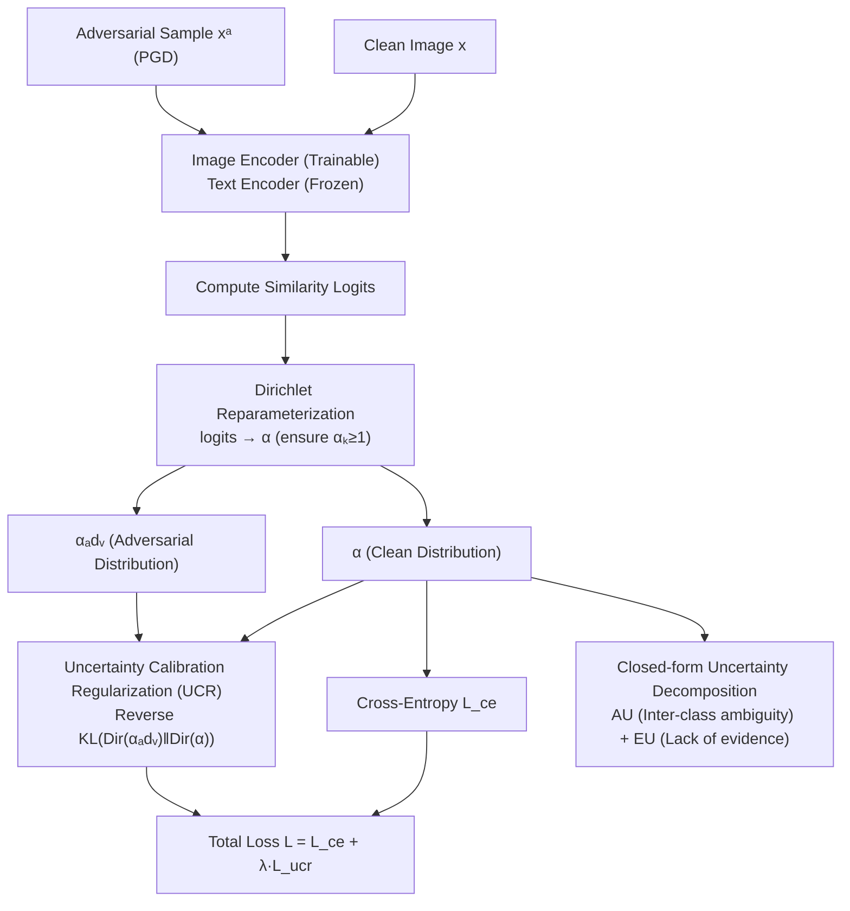

# Calibrating Uncertainty for Zero-Shot Adversarial CLIP

**Conference**: ICML 2026  
**arXiv**: [2512.12997](https://arxiv.org/abs/2512.12997)  
**Code**: https://github.com/VivienLu/UCAT  
**Area**: AI Safety  
**Keywords**: Adversarial Robustness, Uncertainty Calibration, CLIP, Dirichlet Distribution, Zero-Shot Classification  

## TL;DR

The UCAT framework is proposed to reparameterize CLIP logits as concentration parameters of a Dirichlet distribution. By aligning the Dirichlet distributions of clean and adversarial samples via reverse KL divergence, the method simultaneously calibrates uncertainty and preserves semantic structure during zero-shot adversarial fine-tuning, achieving an optimal balance between robustness and calibration across 16 benchmarks.

## Background & Motivation

**Background**: Vision-language models like CLIP achieve strong zero-shot recognition through contrastive pre-training but remain extremely vulnerable to adversarial attacks—minor pixel-level perturbations can lead to confident misclassifications. Existing Zero-Shot Adversarial Robustness (ZSAR) methods primarily enhance robustness by adversarially fine-tuning the image encoder while attempting to preserve zero-shot generalization capabilities.

**Limitations of Prior Work**: Mainstream methods adopt a "single-anchor alignment" strategy, pulling adversarial features toward the text embedding of the ground-truth label, which ignores relative geometric relationships with other class embeddings. Other methods align softmax distributions, but softmax normalization discards absolute logit scale information, which is crucial for reliability reasoning in open-vocabulary scenarios.

**Key Challenge**: The authors identify a counter-intuitive phenomenon—adversarial perturbations not only reduce accuracy but also **suppress predictive uncertainty**, causing the model to produce falsely high-confidence predictions when under attack. This violates the fundamental expectation that uncertainty should increase for harder or out-of-distribution inputs, exposing a **reliability gap** beyond mere accuracy.

**Goal**: Design an adversarial fine-tuning method that simultaneously optimizes accuracy and uncertainty calibration, enabling the model to maintain robustness under attack while providing well-calibrated confidence estimates.

**Key Insight**: The authors observe a structural mathematical correspondence between CLIP’s zero-shot classification softmax probabilities and the expectation of a Dirichlet distribution—both are softmax operations on logits. This implies that CLIP logits can be reinterpreted as evidence parameters of a Dirichlet distribution.

**Core Idea**: Reparameterize CLIP logits as Dirichlet concentration parameters and align clean and adversarial Dirichlet distributions using reverse KL divergence. This maintains inter-class semantic relations (epistemic uncertainty) and calibrates evidence strength (aleatoric uncertainty) simultaneously.

## Method

### Overall Architecture

UCAT addresses the issue in CLIP adversarial fine-tuning where models become overconfident despite incorrect predictions. It follows the standard CLIP adversarial fine-tuning pipeline—freezing the text encoder and training only the image encoder. Given a pair consisting of a clean image $x$ and its corresponding PGD adversarial sample $x^a$, similarity logits are computed against text prototypes. The key transformation is reinterpreting these logits as concentration parameters of a Dirichlet distribution, then aligning the adversarial distribution with the clean distribution to restore uncertainty calibration while maintaining robustness.

### Key Designs

**1. Dirichlet Reparameterization: Embedding Uncertainty in CLIP Logits**

Existing methods aligning softmax probabilities lose the absolute logit scale, which is key to judging "sufficiency of evidence" in open-vocabulary settings. UCAT starts from a mathematical coincidence: both the CLIP zero-shot softmax and the Dirichlet expectation are softmax functions of logits. Thus, concentration parameters are defined as $\alpha_k(x) = \exp(h(\ell_k^{v \to t}(x)))$, where $h(\ell) = (\tau \ell + 1) / \tau'$. Since cosine similarity keeps $\tau \ell_k \in [-1, 1]$, adding 1 maps it to $[0, 2]$, and dividing by a calibration coefficient $\tau'$ before the exponential ensures $\alpha_k \geq 1$. This construction avoids the corner-concentration effect and numerical instability of the digamma function when $\alpha_k < 1$. Furthermore, when $\tau' = \tau$, the Dirichlet expectation exactly equals the CLIP softmax prediction ($p_k^{\text{Dir}} = p_k^{\text{CLIP}}$), providing analytical uncertainty parameters without changing the architecture or original predictions.

**2. Uncertainty Calibration Regularization (UCR): Aligning Distributions via Reverse KL**

To make the evidence distribution of adversarial samples approximate that of clean samples, the UCR loss is defined as a Dirichlet-level reverse KL divergence: $\mathcal{L}_{\text{ucr}} = \text{KL}(\text{Dir}(\alpha_{\text{adv}}) \| \text{Dir}(\alpha))$. The final objective is $\mathcal{L} = \mathcal{L}_{\text{ce}} + \lambda \mathcal{L}_{\text{ucr}}$. Two deliberate choices were made: aligning at the Dirichlet level (rather than probability level) to preserve absolute evidence strength (aleatoric uncertainty) alongside class structure (epistemic uncertainty), and using reverse KL rather than forward KL. Reverse KL is mode-seeking, tracking the primary mode of the clean distribution while allowing low evidence on irrelevant classes, whereas forward KL tends to spread evidence across all modes.

**3. Closed-form Uncertainty Decomposition: AU and EU in One Forward Pass**

With Dirichlet parameters, Aleatoric Uncertainty (AU) and Epistemic Uncertainty (EU) can be calculated analytically without multiple forward passes (unlike MC Dropout). AU is the expected Shannon entropy of the Dirichlet distribution: $\text{AU}(x) = -\sum_k \frac{\alpha_k}{\alpha_0}(\psi(\alpha_k+1) - \psi(\alpha_0+1))$, capturing inherent data ambiguity. EU is defined by the inverse of the total evidence: $\text{EU}(x) = C / (\alpha_0 + C)$ (where $\alpha_0 = \sum_k \alpha_k$ is the total concentration and $C$ is the number of classes). Higher $\alpha_0$ leads to lower EU, aligning with the intuition that more evidence leads to higher certainty.

### Loss & Training

The total loss is the sum of cross-entropy and the UCR regularization: $\mathcal{L} = \mathcal{L}_{\text{ce}} + \lambda \mathcal{L}_{\text{ucr}}$. Adversarial samples are generated via $\ell_\infty$ PGD. The calibration coefficient is set to the standard contrastive temperature $\tau' = 0.07$, and the regularization weight is $\lambda = 10^5 / \beta$ (where $\beta = 2/e^{\tau'}$). Only the image encoder is fine-tuned; the text encoder remains frozen.

## Key Experimental Results

### Main Results (Zero-Shot Adversarial Robustness on 16 Datasets)

| Method | Clean Avg | PGD-100 Avg | CW Avg | AutoAttack Avg | H (Clean-AA) |
|------|-----------|-------------|--------|----------------|---------------|
| CLIP | 64.45 | 3.46 | 4.06 | 0.51 | 1.01 |
| TeCoA | 43.83 | 29.86 | 29.25 | 28.74 | 34.72 |
| FARE | 53.00 | 12.81 | 12.64 | 2.33 | 4.45 |
| PMG-AFT | 53.72 | 31.63 | 22.25 | 17.88 | 26.83 |
| TGA-ZSR | 49.91 | 31.55 | 31.28 | 30.52 | 37.88 |
| Comp-TGA | 52.09 | 31.40 | 31.16 | 26.24 | 34.90 |
| **UCAT** | **54.17** | **32.20** | **31.41** | **30.58** | **39.09** |

UCAT achieves the highest clean accuracy (54.17%) and the best Clean-AA harmonic mean (39.09), ranking first or second under most attack settings.

### Ablation Study

| Configuration | Clean | PGD-100 | CW | AutoAttack | Description |
|------|-------|---------|-----|------------|------|
| $\mathcal{L}_{\text{ce}}$ (TeCoA Baseline) | 43.83 | 29.86 | 29.25 | 28.74 | Cross-entropy only |
| + KL(p(x)‖p(xᵃ)) | 45.03 | 30.12 | 29.61 | 29.13 | Probability-level forward KL |
| + KL(p(xᵃ)‖p(x)) | 45.05 | 29.98 | 29.28 | 28.80 | Probability-level reverse KL |
| + KL(Dir(α)‖Dir(αₐdᵥ)) | 36.72 | 25.01 | 24.66 | 24.36 | Dirichlet-level forward KL |
| **+ KL(Dir(αₐdᵥ)‖Dir(α))** | **54.17** | **32.20** | **31.41** | **30.58** | **Dirichlet-level reverse KL** |

Ablations reveal two key choices: (1) Dirichlet-level alignment is superior to probability-level alignment because it preserves evidence strength; (2) Reverse KL is significantly better than forward KL due to its mode-seeking nature.

### Cross-Backbone Generalization

| Backbone | Method | Clean | AutoAttack | H |
|---------|------|-------|------------|---|
| CLIP-B/16 | Base | 63.72 | 0.01 | 0.02 |
| CLIP-B/16 | +UCAT | 52.91 | 30.54 | 39.05 |
| CLIP-B/32 | Base | 64.42 | 5.58 | 10.28 |
| CLIP-B/32 | +UCAT | 54.17 | 30.58 | 39.09 |
| SLIP-B/16 | Base | 46.03 | 0.02 | 0.04 |
| SLIP-B/16 | +UCAT | 38.37 | 20.40 | 26.68 |

UCAT significantly improves robustness across different contrastive VLM backbones, showing it is not dependent on a specific CLIP variant.

## Highlights & Insights

1. **Suppression of uncertainty by adversarial perturbations** is a significant empirical finding—models become more "confident" when attacked, which is more dangerous than mere accuracy loss.
2. The **mathematical equivalence** between CLIP logits and Dirichlet expectations is an elegant theoretical insight, allowing uncertainty estimation without architectural changes.
3. The **massive performance gap** caused by Dirichlet-level reverse KL compared to probability-level KL (Clean 43→54, AA 29→31) demonstrates the importance of preserving absolute evidence strength.
4. Multi-label experiments on MS-COCO show advantages in semantically ambiguous scenarios, validating the design intuition of preserving inter-class relationships.

## Limitations & Future Work

1. Effectiveness is limited on datasets with strong domain shifts (e.g., PCAM, EuroSAT) where CLIP’s clean semantic structure is inherently weak.
2. Only the image encoder is fine-tuned; the potential of joint fine-tuning with the text encoder remains unexplored.
3. While $\tau' = 0.07$ is stable, the optimal calibration coefficient may vary across different domains.

## Related Work & Insights

- **TeCoA / FARE / TGA-ZSR**: Prior ZSAR methods focused on single-anchor or softmax alignment, neglecting uncertainty calibration.
- **Evidential Deep Learning (Sensoy et al., 2018)**: Source of the Dirichlet parameterization idea; this work adapts it for the first time to the CLIP contrastive learning framework.
- **TRADES (Zhang et al., 2019)**: Classic robustness-accuracy trade-off; UCAT can be viewed as its Dirichlet-level generalization for open-vocabulary VLMs.

## Rating

- Novelty: 8/10 — The mapping of CLIP logits to Dirichlet evidence is theoretically elegant.
- Experimental Thoroughness: 9/10 — Comprehensive evaluation across 16 datasets, multi-label tasks, and backbones.
- Writing Quality: 8/10 — Rigorous theoretical derivation and clear information-rich visualizations.
- Value: 8/10 — Introduces an uncertainty calibration perspective to VLM adversarial robustness.

<!-- RELATED:START -->

## Related Papers

- [\[CVPR 2026\] Hierarchically Robust Zero-shot Vision-language Models](../../CVPR2026/ai_safety/hierarchically_robust_zero-shot_vision-language_models.md)
- [\[AAAI 2026\] OAD-Promoter: Enhancing Zero-shot VQA using Large Language Models with Object Attribute Description](../../AAAI2026/ai_safety/oad-promoter_enhancing_zero-shot_vqa_using_large_language_models_with_object_att.md)
- [\[ECCV 2024\] CLIP-Guided Generative Networks for Transferable Targeted Adversarial Attacks](../../ECCV2024/ai_safety/clip-guided_generative_networks_for_transferable_targeted_adversarial_attacks.md)
- [\[ICML 2026\] Position: Uncertainty Quantification in LLMs is Just Unsupervised Clustering](position_uncertainty_quantification_in_llms_is_just_unsupervised_clustering.md)
- [\[AAAI 2026\] Diversifying Counterattacks: Orthogonal Exploration for Robust CLIP Inference](../../AAAI2026/ai_safety/diversifying_counterattacks_orthogonal_exploration_for_robust_clip_inference.md)

<!-- RELATED:END -->
