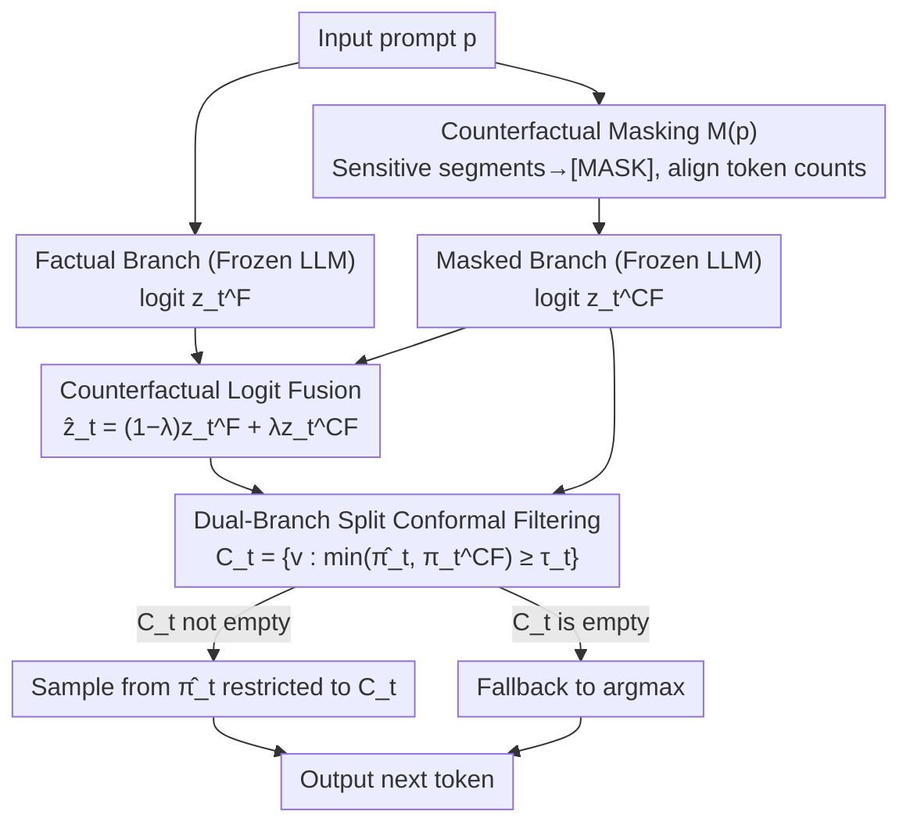

# COFT: Counterfactual-Conformal Decoding for Fair Chain-of-Thought Reasoning in Large Language Models

**Conference**: ICML 2026  
**arXiv**: [2605.30641](https://arxiv.org/abs/2605.30641)  
**Code**: None  
**Area**: LLM Security/Fairness  
**Keywords**: Counterfactual fairness, conformal prediction, chain-of-thought debiasing, decoding-time intervention, training-free debiasing  

## TL;DR

COFT implements a training-free and gradient-free approach for step-by-step token-level counterfactual fairness on frozen LLMs. By constructing counterfactual masked branches during decoding, performing logit fusion, and applying dual-branch split conformal prediction to filter tokens, it reduces bias metrics by 30–55% (median 38%) with negligible impact on task performance.

## Background & Motivation

**Background**: Large Language Models (LLMs) expose and amplify social biases from training data token-by-token during the Chain-of-Thought (CoT) generation process. Even if the final answer appears neutral, the reasoning trajectory may contain harmful stereotypical associations.

**Limitations of Prior Work**: Existing debiasing solutions have significant limitations. Data cleaning and fine-tuning require retraining and may degrade general capabilities. Guided methods using auxiliary classifiers (e.g., DExperts, GeDi) depend on external models and inherit their blind spots. Representation space debiasing (e.g., INLP) applies global linear projections that fail to adapt to specific prompt semantics and may erroneously remove legitimate content.

**Key Challenge**: The aforementioned methods fail to satisfy two critical properties simultaneously: (1) **Step-by-step statistical guarantees**, where there is no assurance that a selected token remains stable after sensitive attribute substitution at each decoding step; (2) **Local counterfactual parity**, as fairness goals are typically defined at an aggregate level rather than through token-level operations.

**Goal**: Design a decoding-time framework that achieves three properties: token-level counterfactual invariance, gradient-free/model-agnostic implementation (applicable to frozen weights), and auditable step-by-step marginal guarantees.

**Key Insight**: Construct both original (factual) and masked branches for each prompt. Locate and eliminate biases driven by sensitive attributes by comparing the logit distribution differences between the two. Subsequently, utilize the distribution-free guarantees of Conformal Prediction to filter unsafe tokens.

**Core Idea**: A three-stage joint implementation of training-free token-level counterfactual fair decoding using counterfactual masking, convex logit interpolation, and dual-branch conformal filtering.

## Method

### Overall Architecture

COFT aims to solve the issue where frozen LLMs expose and amplify social biases while generating reasoning chains. It avoids retraining or external classifiers while providing auditable statistical guarantees at each step. The approach simulates the "factual" and "de-sensitized" worlds simultaneously. Each decoding step involves three serial stages: first, sensitive words in the prompt are replaced with neutral sentinels to obtain a masked prompt $\tilde{p}=M(p)$. Second, convex interpolation is applied to the factual and masked logit sets to attenuate attribute-driven bias. Finally, tokens are filtered using dual-branch conformal thresholds calibrated offline, sampling only from tokens supported with high probability in both "worlds." This pipeline requires only one additional cached forward pass without touching gradients, weights, or auxiliary models.

### Key Designs

**1. Counterfactual Masking: Constructing a "de-sensitized" branch strictly aligned with the original prompt**

To perform token-level counterfactual comparison, a control world must exist that is identical except for the sensitive attributes. COFT defines a deterministic masking operator $M$ that replaces each sensitive segment $s\in S$ (identifiers for gender, race, etc.) with a neutral sentinel token `[MASK]`. The key is **maintaining an identical token count**: if a sensitive segment is split into $k$ tokens by the tokenizer, it is replaced by $k$ sentinel copies. This ensures the factual and masked branches are strictly aligned at every absolute position, allowing for bitwise $z_t^F \leftrightarrow z_t^{CF}$ comparisons. "Masking" is chosen because deleting segments disrupts syntax and attention geometry, while replacing them with another identity injects new bias; masking preserves structure while severing direct lexical associations with sensitive attributes.

**2. Counterfactual Logit Fusion: Mechanically erasing attribute-driven probability bias at the logit source**

With aligned branches, the difference $\Delta_t = z_t^F - z_t^{CF}$ at the same position characterizes how much the sensitive attribute influences the current step. Instead of explicitly modeling this bias, COFT applies convex interpolation to obtain fused logits $\hat{z}_t = (1-\lambda) z_t^F + \lambda z_t^{CF}$, where $\lambda\in[0,1]$ controls debiasing intensity. In probability space, this is equivalent to a normalized geometric mixture of the two branch distributions: $\hat{\pi}_t(v) \propto (\pi_t^F(v))^{1-\lambda}(\pi_t^{CF}(v))^{\lambda}$. A higher $\lambda$ moves the distribution closer to the de-sensitized world. $\lambda$ is selected via the elbow point of the bias-utility Pareto curve on a validation set, typically around $\lambda\approx 0.6$. Placing fusion before filtering is intentional: by first suppressing spurious amplification in the logit space, conformal filtering can operate on already aligned high-probability regions, reducing false rejections and overly conservative thresholds.

**3. Dual-Branch Split Conformal Filtering: Providing distribution-free statistical certification for each sampling set**

Fusion alone is insufficient as it reduces bias without guaranteeing token stability under counterfactuals. COFT designs a dual-branch non-conformity score $s_t(v) = 1 - \min\{\hat{\pi}_t(v), \pi_t^{CF}(v)\}$, where the score is low only if token $v$ has sufficiently high probability in both the fused and masked distributions. During an offline phase, these scores are calculated for all ground-truth next-tokens in a calibration set, and the $(1-\alpha)$ quantile $q_t$ is used as a threshold. During online decoding, a candidate set $C_t = \{v : \min\{\hat{\pi}_t(v), \pi_t^{CF}(v)\} \geq \tau_t\}$ is constructed (where $\tau_t = 1 - q_t$), and sampling is performed from the conditional distribution of $\hat{\pi}_t$ restricted to $C_t$. Using the distribution-free nature of split conformal prediction, a marginal coverage guarantee is obtained for each step. Unlike single-branch conformal methods that only consider the factual world, the dual-branch approach forces tokens to be supported by both worlds, operationalizing "counterfactual parity" as a standard quantile calibration problem.

## Key Experimental Results

### Main Results: Bias Metrics

| Dataset | Metric | Vanilla | SDD | DExperts | DT-CD | COFT | Gain (vs DT-CD) |
|--------|------|---------|-----|----------|-------|------|----------------|
| StereoSet (LLaMA-13B) | Bias↓ | 0.41 | 0.36 | 0.33 | 0.31 | **0.26** | -16% |
| CrowS-Pairs (LLaMA-13B) | Acc↑ | 58.7 | 60.1 | 61.0 | 61.3 | **63.5** | +2.2 |
| BBQ (LLaMA-13B) | Bias Rate↓ | 0.27 | 0.22 | 0.20 | 0.19 | **0.14** | -26% |
| BOLD (LLaMA-13B) | Toxicity↓ | 0.123 | 0.105 | 0.099 | 0.094 | **0.079** | -16% |
| Utrecht (LLaMA-13B) | DP Gap↓ | 0.184 | 0.153 | 0.149 | 0.141 | **0.118** | -16% |
| COMPAS (LLaMA-13B) | Bias Gap↓ | 0.161 | 0.147 | 0.141 | 0.136 | **0.119** | -12% |
| BBQ (Mistral-7B-Inst) | Bias Rate↓ | 0.24 | 0.20 | 0.18 | 0.17 | **0.12** | -29% |
| Utrecht (Mistral-7B-Inst) | DP Gap↓ | 0.173 | 0.146 | 0.141 | 0.136 | **0.112** | -18% |

### Ablation Study

| Config | BiasAvg↓ | UtilityAvg↑ | Description |
|------|----------|-------------|------|
| COFT (Full) | **0.129** | 68.0 | All three stages active |
| w/o Fusion (CP only) | 0.171 | 68.2 | Bias metrics increased by 32% without logit fusion |
| Single-branch CP (factual only) | 0.158 | 68.1 | Fails to guarantee counterfactual stability |
| Fusion only (no CP) | 0.149 | 67.9 | Residual bias remains without statistical certification |

### Key Findings

- **Logit fusion contributes the most**: Removing fusion alone increased BiasAvg from 0.129 to 0.171 (+33%), making it the most significant component as it mechanically attenuates attribute-driven log-odds bias at the source.
- **Dual-branch vs Single-branch CP**: Dual-branch CP further reduced bias by 18% (0.158→0.129) compared to single-branch, validating the necessity of requiring tokens to be supported by both "worlds."
- **Negligible task performance loss**: COFT maintains performance within 0.2 points of Vanilla on GSM8K, StrategyQA, ARC-easy, and PIQA, with almost no difference in PPL or MAUVE.
- **Controllable efficiency overhead**: An additional throughput overhead of approximately 10.2% (equivalent to one cached forward pass) and a peak VRAM increase of $\leq 0.8$ GB.
- **Sensitivity of $\lambda$ and $\alpha$**: The bias-utility Pareto curve remains stable for $\lambda$ within 0.4–0.8, with the default elbow point at $\lambda \approx 0.6$. The optimal risk level for conformal filtering is $\alpha = 0.10$.

## Highlights & Insights

- **Three-stage decoupled design**: The masked→fusion→filtering pipeline allows each component to be analyzed and replaced independently. Fusion compresses the logit difference space before passing it to conformal filtering; their systematic synergy exceeds standalone performance. This "denoise then certify" paradigm is transferable to any scenario requiring decoding-time constraints.
- **Innovative application of Conformal Prediction in fairness**: Extends distribution-free statistical guarantees from traditional "confidence set" scenarios to "counterfactual stability certification." The dual-branch score design transforms fairness constraints into a standard quantile calibration problem, offering methodological generality.
- **Pragmatic training-free advantage**: Requires only one additional cached forward pass ($\leq 11\%$ overhead). It works with any frozen LLM checkpoint without weight access, auxiliary classifiers, or fine-tuning, making it highly practical for API-only deployment scenarios.

## Limitations & Future Work

- **Sensitive segment detection depends on external tools**: COFT controls the use of sensitive segments during decoding once identified, but it is not an all-purpose implicit bias detector; unidentified proxy terms may still escape.
- **Guarantees are marginal, not conditional**: Conformal prediction provides marginal rather than input-conditional coverage guarantees and may become invalid under severe distribution shifts.
- **Sequence-level guarantees require additional handling**: Current step-by-step guarantees do not extend directly to the entire reasoning chain. Joint upper bounds or rollout score calibration are needed for end-to-end control.
- **$\lambda$ selection requires a validation set**: A clean validation split is needed for Pareto elbow point selection, which may require re-tuning when deploying in new domains.

## Related Work & Insights

- **Counterfactual Fairness** (Kusner et al. 2017) provides the core theoretical framework, which COFT operationalizes as token-level local parity; **Conformal Prediction** (Vovk et al. 2005) provides distribution-free guarantee tools, which COFT adapts for dual-branch autoregressive decoding.
- Compared to inference-time methods like DExperts or GeDi, COFT does not require external classifiers and provides statistical guarantees. Compared to representation debiasing like INLP, COFT is prompt-adaptive rather than using a fixed global projection.
- Insight: The "counterfactual masking + conformal filtering" paradigm can be extended to other trustworthy AI goals (e.g., privacy protection, factuality constraints) by defining different masking operators and non-conformity scores to enforce various safety properties.

<!-- RELATED:START -->

## Related Papers

- [\[ICML 2026\] dgMARK: Decoding-Guided Watermarking for Diffusion Language Models](dgmark_decoding-guided_watermarking_for_diffusion_language_models.md)
- [\[ICML 2026\] Forget to Know, Remember to Use: Context-Aware Unlearning for Large Language Models](forget_to_know_remember_to_use_context-aware_unlearning_for_large_language_model.md)
- [\[ICML 2026\] DualOptim+: Bridging Shared and Decoupled Optimizer States for Better Machine Unlearning in Large Language Models](dualoptim_bridging_shared_and_decoupled_optimizer_states_for_better_machine_unle.md)
- [\[ICML 2026\] BYORn: Bootstrap Your Own Responses to Defend Large Vision-Language Models Against Backdoor Attacks](byorn_bootstrap_your_own_responses_to_defend_large_vision-language_models_agains.md)
- [\[ICML 2026\] The Unlearnability Phenomenon in RLVR for Language Models](the_unlearnability_phenomenon_in_rlvr_for_language_models.md)

<!-- RELATED:END -->
