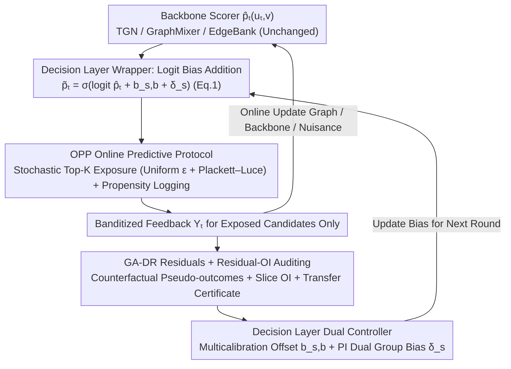

# COPF: An Online Framework for Deployment-Stable Counterfactual Fairness in Evolving Graphs

**Conference**: ICML 2026  
**arXiv**: [2606.00700](https://arxiv.org/abs/2606.00700)  
**Code**: https://github.com/lsnnnnnnnn/COPF (Available)  
**Area**: AI Safety / Fairness / Online Recommendation / Graph Learning  
**Keywords**: Counterfactual Fairness, Performative Prediction, Doubly Robust Estimation, Online Multicalibration, Link Prediction

## TL;DR
COPF treats "online link recommendation on evolving graphs" as a performative decision process, adding a **decision layer wrapper** outside the backbone scorer. It ensures counterfactual identifiability through an online logging protocol with explicit exploration, estimates the "exposed vs. unexposed" counterfactual group gap using a graph-aware doubly robust (GA-DR) estimator, and suppresses fairness spikes post-deployment via Residual-OI auditing and a PI primal–dual controller. It theoretically provides a transfer certificate from plug-in OI to the true counterfactual gap, significantly reducing the worst-case TE gap during the deployment phase with controllable utility loss on TGB and synthetic bipartite streams.

## Background & Motivation

**Background**: Online link recommendation (e.g., "who to follow", product/content recommendation) typically relies on scoring from a link prediction backbone (TGN, GraphMixer, EdgeBank, etc.) on evolving graphs. Candidates are exposed to users via Top-K sampling, and observed feedback/clicks are used for continuous training.

**Limitations of Prior Work**: This pipeline is highly *performative*—the platform's choice of which candidates to expose alters subsequent edges and graph structures (e.g., triadic closure, Matthew effect), thereby changing future training data. Computing fairness metrics directly on logs is contaminated by "exposure bias": a group receiving less exposure results in fewer observed positive samples, leading to further suppression during training—a vicious cycle. Mishler & Dalmasso (2022) also noted that many observable fairness metrics satisfied during training drift significantly after deployment in performative settings.

**Key Challenge**: Fairness on logs $\neq$ counterfactual fairness. When the policy updates, the exposure distribution changes. The counterfactual quantity "what would happen if this candidate was shown vs. not shown" is unidentifiable in standard logs due to a lack of overlap, as well as temporal dependencies and local interference on the graph that invalidate standard IPW/DR estimators.

**Goal**: (a) Propose a *deployment-stable* counterfactual fairness definition comparable across pre- and post-deployment; (b) enable its identification from a single online stream; (c) provide an online auditing and control mechanism to suppress violations without sacrificing substantial utility.

**Key Insight**: Define the fairness objective based on the **counterfactual effect of exposure**. For each candidate edge $(u_t, v)$, compare potential outcomes $Y_t^{(1)}, Y_t^{(0)}$ for "$D_t(v)=1$ (exposed)" vs. "$D_t(v)=0$ (unexposed)," and compare the average treatment effect $\tau_s = \mathbb{E}[Y^{(1)}-Y^{(0)}\mid A=s]$ across groups. This quantity resides at the "decision layer," decoupled from the specific backbone, and remains comparable across deployment windows.

**Core Idea**: A five-component suite comprising "explicit exploration + propensity logging + graph-aware doubly robust estimation + residual-OI auditing + PI dual controller." This transforms counterfactual fairness into an online decision layer applicable to any backbone.

## Method

### Overall Architecture

COPF addresses fairness spikes in online link recommendation on evolving graphs post-deployment. It maintains the internal structure of the backbone $\hat p_t(u_t, v)$ and inserts a decision layer wrapper between scoring and final exposure. Each decision round is viewed as a performative process: the backbone scores candidates, and COPF adds two learnable bias terms to the logits: $\tilde p_t = \sigma(\mathrm{logit}(\hat p_t) + b_{s,b} + \delta_s)$ (Eq.1). It uses stochastic Top-K sampling with explicit exploration to determine exposure, logs propensities, and receives banditized feedback only for exposed candidates. Subsequently, the graph, backbone, nuisance estimators, and fairness auditor/controller are updated online. The workflow follows Algorithm 1 (OPP Runner) across Pre / Deploy / Post phases: Pre-phase uses high exploration ($\epsilon=0.20$) for warmup, while Deploy/Post phases switch to $\epsilon=0.02$ to trigger and observe performative shifts.

### Key Designs

**1. OPP Online Predictive Protocol: Ensuring Counterfactual Identifiability**

The fairness objective is defined via the counterfactual effect of exposure. In a single performative stream, this is typically unidentifiable due to lack of overlap and graph interference. The OPP protocol enforces identifiability through five rules: OPP-0 ensures temporal order; OPP-1 constructs candidate sets $C_t$ using the pre-decision graph $G_{\le t}$; OPP-2 uses a **mixed strategy** (uniform exploration $\epsilon$ + Plackett–Luce Top-K score sampling) to ensure marginal exposure probability $e_t(v)\ge \epsilon K/|C_t|>0$ and logs propensities; OPP-3 updates nuisance and backbone models via online cross-fitting; OPP-4 performs prequential auditing and control on rolling windows. Assumption 3.1 formalizes overlap, local ignorability, and bounded local interference + temporal $\beta$-mixing.

The key trade-off is using *policy-enforced overlap* rather than *clipping-enforced overlap*. Unlike traditional counterfactual fairness methods (Kusner et al. 2017) that rely on existing overlap in batch logs, COPF ensures identifiability via active system exploration.

**2. GA-DR Residuals + Residual-OI Auditing: Certified Online Estimation**

To estimate counterfactual gaps under graph dependencies, COPF defines graph-aware self-normalized doubly robust pseudo-outcomes:

$$\tilde\Gamma_t^{(a)}(u_t,v) = \hat\mu_{a,t}(W_t) + \frac{\mathbf{1}\{D_t(v)=a\}}{\hat e_t^{(a)}(v)}\big(Y_t-\hat\mu_{a,t}(W_t)\big),$$

averaged over windows with graph-aware temporal decay weights $\widehat{\mathbb{E}}_{\mathrm{GA},\mathcal W}$. Two residual sequences are constructed: $\hat r^{(0)}=\tilde\Gamma^{(0)}-\hat p$ (for calibration) and $\hat r^{(\Delta)}=(\tilde\Gamma^{(1)}-\tilde\Gamma^{(0)})-\tau(W_t)$ (for TE parity). Residual-OI computes $\widehat{\mathrm{OI}}_\mathcal{W}(r;\mathcal H)=\sup_{h\in\mathcal H}|\widehat{\mathbb{E}}_{\mathrm{GA},\mathcal W}[h_t r_t]|$ over an auditor family $\mathcal H$ (slices of group × score-bucket). Lemma 4.1 linearizes fairness gaps into residual correlations, providing finite-sample certificates such as $g_{\mathrm{gap}}^{\mathrm{TE}}\le 2(\varepsilon_\Delta+\beta_\Delta)/p_\min^{\mathrm{g}}$. Theorem 4.5 and Corollary 4.6 establish the transfer bound: small plug-in residual OI implies a small true counterfactual gap, with errors bounded by nuisance term products and mixing terms.

**3. Decision Layer Dual Controller: Multi-calibration Offset + PI Dual Group Bias**

To mitigate audited gaps, two additive logit adjustments are used without retraining the backbone. $b_{s,b}$ handles fine-grained calibration: it performs clipped gradient steps on offsets for the $B_{\mathrm{act}}$ most violating slices. $\delta_s$ handles coarse-grained TE/Min control: each constraint maintains a dual $\lambda$ updated by a PI (Proportional-Integral) controller based on violations. The group bias is:

$$\delta_s = \mathrm{clip}\Big(\alpha\lambda_{\mathrm{TE}}(\bar\tau-\hat\tau_s) + \alpha'\lambda_{\mathrm{Min}}[\tau_{\min}-\hat\tau_s]_+\Big),$$

where $\bar\tau$ is the cross-group average effect. A minimum-effect guardrail $g^{\mathrm{Min}}$ prevents "fairness-through-rationing" (achieving parity by reducing exposure for all).

### Loss & Training

The objective is online constrained optimization: maximize ranking utility (MRR/Hits@10) subject to $g_{\mathrm{gap}}^{\mathrm{TE}}\le \rho_{\mathrm{TE}}$ and $g^{\mathrm{Min}}\le \rho_{\mathrm{Min}}$. Optimization uses PI for duals, logit offsets for primals, and online cross-fitting for nuisance $\hat\mu_a$. Per-round complexity is $O(|C_t|dL + |C_t|k + B_{\mathrm{act}})$ via incremental statistics and $k$-neighbor subsampling.

## Key Experimental Results

### Main Results

Evaluated on TGB (**tgbl-wiki**, **tgbl-review**) and a **synthetic bipartite stream** (600 users, 4k items, 200k events). Backbones: EdgeBank, TGN, GraphMixer.

"Synthetic Stream + GraphMixer" results for Deploy/Post phases (mean, worst-case in parentheses):

| Phase | Metric | Base (GraphMixer) | Base + COPF | Change |
|------|------|-------------------|-------------|------|
| Deploy | NDCG@10 | 0.1417 | **0.1996** | ↑ +40.9% |
| Deploy | Hits@10 | 0.2952 | **0.4154** | ↑ +40.7% |
| Deploy | $g_{\mathrm{gap}}^{\mathrm{TE}}$ mean | 0.0103 | **0.0076** | ↓ -26% |
| Deploy | $g_{\mathrm{gap}}^{\mathrm{TE}}$ worst | 0.0477 | **0.0274** | ↓ -43% |
| Deploy | $g_{\max}^{\mathrm{Cal}}$ worst | 0.9178 | **0.7067** | ↓ -23% |

On Wiki+TGN, PRE worst-case $g_{\mathrm{gap}}^{\mathrm{TE}}$ dropped from 0.0528 to 0.0217. In the Post phase, mean $g_{\mathrm{gap}}^{\mathrm{TE}}$ decreased from 0.0090 to 0.0067.

### Ablation Study

- **Full COPF**: Dual offsets + PI dual + multicalibration + GA-DR + Residual-OI.
- **TopK-Stochastic vs. $\epsilon$-greedy**: TopK-Stochastic yields smoother curves; PL sampling introduces less noise than hard greedy for the same exploration rate.
- **Coverage-driven exploration**: Targeted coverage targets reduce slice starvation with minimal ranking impact.
- **Full Window vs. Certificate-aligned**: High alignment confirms the validity of the certificates without cherry-picking sub-populations.

### Key Findings
- **Positioning**: COPF is "non-binding when safe, active when violated." It intervenes minimally if the backbone is inherently fair and only engages when deployment triggers instability.
- **Spike Suppression**: Suppression of worst-case spikes is more pronounced than mean suppression (e.g., 43% vs 26%), highlighting the PI controller's value during transient performative shifts.
- **Utility-Fairness Synergy**: In biased synthetic streams, COPF increased NDCG@10 by 40%. It broke the cycle of "under-exposure $\rightarrow$ weak training signal" for minority groups by injecting necessary exposure via $\delta_s$.
- **Calibration Variance**: $g_{\max}^{\mathrm{Cal}}$ exhibits high variance in banditized settings. It is treated as a diagnostic metric, whereas TE gap remains the primary commitment.

## Highlights & Insights
- **Decoupled Wrapper**: Implementing counterfactual fairness as a decision layer wrapper is an elegant solution that works with any backbone or training objective.
- **Policy-Enforced Overlap**: Ensuring identifiability through uniform exploration instead of post-hoc clipping is a robust design for performative settings.
- **Minimum-Effect Guardrail**: Prevents "negative-sum" fairness (reducing utility for everyone to achieve parity), a concept applicable to RLHF and ad-delivery.
- **Mass-Normalized Certificates**: Automatically relaxes bounds for small groups to avoid "false tight commitments" on low-mass slices.

## Limitations & Future Work
- **Limitations**: TGB lacks real demographic data, relying on synthetic splits; banditized $Y^{(0)}\equiv 0$ feedback models might oversimplify real-world selection effects; convergence analysis of budgeted active auditors remains future work.
- **Assumptions**: Bounded local interference might not hold in scenarios with viral, long-range information propagation.
- **Future Directions**: Extending group attributes from dyad-level to path-level; introducing conformal-style adaptive thresholds; quantifying explicit exploration costs via contextual bandit upper bounds.

## Related Work & Insights
- **vs. Dwork et al. 2025**: Extends Any-Kernel OI to counterfactual residuals $r^{(\Delta)}$ on evolving graphs with transfer theorems.
- **vs. Perdomo et al. 2020**: Focuses on preventing fairness spikes during deployment rather than just finding stable points.
- **vs. Mishler & Dalmasso 2022**: Provides a practical counterfactual alternative to observable fairness metrics that fail in performative environments.

## Rating
- **Novelty**: ⭐⭐⭐⭐ Combines OI, DR, performative prediction, and online control with new transfer theorems.
- **Experimental Thoroughness**: ⭐⭐⭐ Good coverage of backbones and phases, though lacks real demographics and detailed compute costs.
- **Writing Quality**: ⭐⭐⭐⭐ Clear hierarchy of definitions, protocols, and theorems.
- **Value**: ⭐⭐⭐⭐ The decision-layer wrapper and guardrail design are highly transferable to diverse recommendation and ranking scenarios.

<!-- RELATED:START -->

## Related Papers

- [\[NeurIPS 2025\] Fairness-Regularized Online Optimization with Switching Costs](../../NeurIPS2025/ai_safety/fairness-regularized_online_optimization_with_switching_costs.md)
- [\[ACL 2025\] Gender Inclusivity Fairness Index (GIFI): A Multilevel Framework](../../ACL2025/ai_safety/gifi_gender_fairness.md)
- [\[ICML 2026\] Fairness in Aggregation: Optimal Top-$k$ and Improved Full Ranking](fairness_in_aggregation_optimal_top-k_and_improved_full_ranking.md)
- [\[ICLR 2026\] ATEX-CF: Attack-Informed Counterfactual Explanations for Graph Neural Networks](../../ICLR2026/ai_safety/atex-cf_attack-informed_counterfactual_explanations_for_graph_neural_networks.md)
- [\[CVPR 2025\] Lyapunov Stable Graph Neural Flow](../../CVPR2025/ai_safety/lyapunov_stable_graph_neural_flow.md)

<!-- RELATED:END -->
