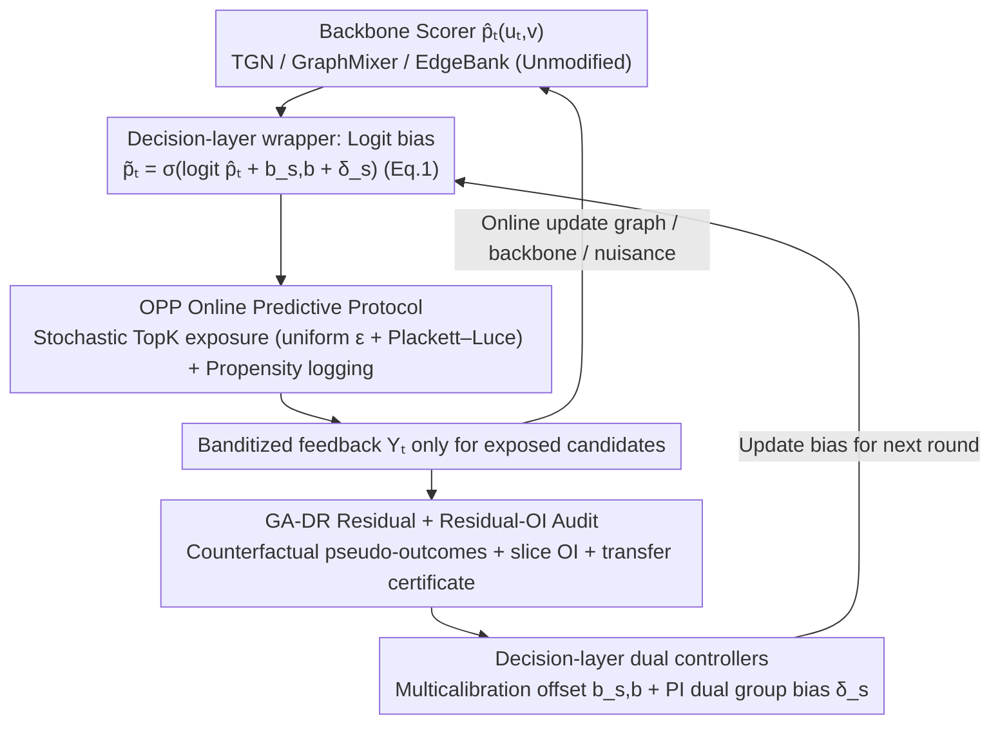

# COPF: An Online Framework for Deployment-Stable Counterfactual Fairness in Evolving Graphs

**Conference**: ICML 2026  
**arXiv**: [2606.00700](https://arxiv.org/abs/2606.00700)  
**Code**: https://github.com/lsnnnnnnnn/COPF (Available)  
**Area**: AI Safety / Fairness / Online Recommendation / Graph Learning  
**Keywords**: Counterfactual Fairness, performative prediction, doubly robust estimation, online multicalibration, link prediction

## TL;DR
COPF treats "online link recommendation on evolving graphs" as a performative decision process by adding a **decision-layer wrapper** outside the backbone scorer. It ensures counterfactual identifiability via an online logging protocol with explicit exploration, estimates the "exposed vs. unexposed" counterfactual group gap using a graph-aware doubly robust (GA-DR) estimator, and suppresses fairness spikes post-deployment using a Residual-OI audit + PI primal–dual controller. Theoretically, it provides a transfer certificate from plug-in OI to true counterfactual gaps, significantly reducing the worst-case TE gap during the Deploy phase with controllable utility loss on TGB and synthetic bipartite streams.

## Background & Motivation

**Background**: Online link recommendation (e.g., "who to follow", product/content recommendation) is typically based on scoring from link prediction backbones (TGN, GraphMixer, EdgeBank, etc.) on evolving graphs, followed by Top-K exposure to users and continued training using observed recurrence/click data.

**Limitations of Prior Work**: This pipeline is highly *performative*—the platform's choice of which candidates to expose alters subsequent observed edges and graph structures (e.g., triadic closure, Matthew effect), thereby changing future training data. Directly calculating fairness metrics on logs is polluted by "exposure bias": a group receiving less exposure leads to fewer observed positive samples, which further suppresses them during training in a vicious cycle. Mishler & Dalmasso (2022) also noted that many observable fairness metrics satisfied during training in performative environments drift after deployment.

**Key Challenge**: Fairness on logs $\neq$ counterfactual fairness. When a policy updates, the exposure distribution changes; the counterfactual quantity "what would happen if this candidate were shown vs. not shown" is inherently unidentifiable in standard logs due to lack of overlap and the fact that temporal dependence and local interference on graphs render standard IPW/DR estimators invalid.

**Goal**: (a) Provide a *deployment-stable* counterfactual fairness definition that is comparable before and after deployment; (b) identify it from an online stream; (c) provide an online audit + control mechanism to suppress violations without significantly sacrificing utility.

**Key Insight**: Define the fairness objective based on the **counterfactual effect of exposure**—comparing two potential outcomes $Y_t^{(1)}$ ($D_t(v)=1$, exposed) vs. $Y_t^{(0)}$ ($D_t(v)=0$, unexposed) for each candidate edge $(u_t, v)$, then comparing the average treatment effect across groups $\tau_s = \mathbb{E}[Y^{(1)}-Y^{(0)}\mid A=s]$. This quantity resides at the "decision layer"—it is decoupled from the specific backbone and can be compared across deployment windows.

**Core Idea**: A five-component suite consisting of "explicit exploration + propensity logging + graph-aware doubly robust estimation + Residual-OI audit + PI dual controller" to implement counterfactual fairness as an online decision layer that can be wrapped around any backbone.

## Method

### Overall Architecture

COPF addresses the issue of fairness metric spikes following the deployment of online link recommendations on evolving graphs. It achieves this by not modifying the internal structure of the backbone $\hat p_t(u_t,v)$, but instead inserting a decision-layer wrapper between the scoring and the final exposure. It treats each round of decision-making as a performative process: the backbone first scores candidates, COPF adds two learnable bias terms to the logits $\tilde p_t = \sigma(\mathrm{logit}(\hat p_t) + b_{s,b} + \delta_s)$ (Eq.1), then uses stochastic TopK sampling with explicit exploration to determine exposure while recording propensities. Banditized feedback is received only for exposed candidates, which is used to update the graph, backbone, nuisance estimators, and fairness audit/controller online. The execution flow follows Algorithm 1 (OPP Runner), divided into Pre / Deploy / Post phases: Pre uses a high exploration rate $\epsilon=0.20$ for warm-up, while Deploy/Post switch to $\epsilon=0.02$ to trigger and observe performative shifts.

### Key Designs

**1. OPP Online Predictive Protocol: Enabling Counterfactual Identifiability**

The true goal of fairness is defined by the "counterfactual effect of exposure"—comparing potential outcomes $D_t(v)=1$ vs. $D_t(v)=0$. In a single performative stream, this counterfactual is typically unidentifiable due to lack of overlap, temporal dependence, and local interference. OPP uses five rules to make it identifiable, serving as a prerequisite for DR estimation and auditing. OPP-0 ensures temporal order; OPP-1 constructs candidate set $C_t$ using the pre-decision graph $G_{\le t}$; OPP-2 is critical—it uses a **mixed strategy** (uniform exploration probability $\epsilon$ + Plackett–Luce Top-K score sampling) to ensure marginal exposure probability $e_t(v)\ge \epsilon K/|C_t|>0$ while recording propensities; OPP-3 performs online cross-fit updates for nuisance and backbone; OPP-4 performs prequential audit + control on a rolling window. Assumption 3.1 formalizes overlap, local ignorability, and bounded local interference + temporal $\beta$-mixing.

The key trade-off here is using *policy-enforced overlap* rather than *clipping-enforced overlap*: traditional counterfactual fairness methods (Kusner et al. 2017, Coston et al. 2020) rely on overlap existing by chance in batch logs, which fails in performative online settings. COPF ensures identifiability through active exploration, with clipping used only to absorb numerical errors into the $\varepsilon_e$ nuisance term (Lemma 4.2).

**2. GA-DR Residual + Residual-OI Audit: Online Estimation with Certificates**

To estimate counterfactual fairness gaps under temporal dependence and local interference, COPF first defines graph-aware self-normalized doubly robust pseudo-outcomes:

$$\tilde\Gamma_t^{(a)}(u_t,v) = \hat\mu_{a,t}(W_t) + \frac{\mathbf{1}\{D_t(v)=a\}}{\hat e_t^{(a)}(v)}\big(Y_t-\hat\mu_{a,t}(W_t)\big),$$

combined with graph-aware temporal decay weights for window averaging $\widehat{\mathbb{E}}_{\mathrm{GA},\mathcal W}$. DR is used instead of naive IPW because the latter suffers from variance explosion at low propensities, and $\mu$-only estimators are biased under model misspecification; DR provides "dual insurance." Self-normalization + GA weights encode temporal decay and local graph structures (e.g., $k$-neighbor subsampling) into the estimation, preventing mixing terms in the transfer bound from being contaminated.

On this basis, two residual sequences are constructed: $\hat r^{(0)}=\tilde\Gamma^{(0)}-\hat p$ (for calibration) and $\hat r^{(\Delta)}=(\tilde\Gamma^{(1)}-\tilde\Gamma^{(0)})-\tau(W_t)$ (for TE parity). Residual-OI computes $\widehat{\mathrm{OI}}_\mathcal{W}(r;\mathcal H)=\sup_{h\in\mathcal H}|\widehat{\mathbb{E}}_{\mathrm{GA},\mathcal W}[h_t r_t]|$ over an auditor family $\mathcal H$ (instantiated as indicator functions for group × score-bucket × optional structural-role slices). Lemma 4.1 linearizes calibration/TE/Min fairness gaps into residual correlations, divided by minimum slice mass to obtain finite-sample certificates $g_{\max}^{\mathrm{Cal}}\le (\varepsilon_0+\beta_0)/p_\min^{\mathrm{gb}}$ and $g_{\mathrm{gap}}^{\mathrm{TE}}\le 2(\varepsilon_\Delta+\beta_\Delta)/p_\min^{\mathrm{g}}$. This division automatically relaxes certificates for low-quality small groups, avoiding overly tight false promises for sparse groups. Finally, Theorem 4.5 + Corollary 4.6 provide the noisy transfer: Small plug-in residual OI $\Rightarrow$ small true counterfactual gap, with error bounded by nuisance terms $C_1\varepsilon_e\varepsilon_\mu + C_2(\varepsilon_e^2+\varepsilon_\mu^2)$ and mixing term $C_3\sqrt{\tau_{\mathrm{mix}}\log|\mathcal H|/W_{\mathrm{eff}}}$.

**3. Decision-layer Dual Controllers: Multicalibration Offsets + PI Dual Group Bias**

Identified gaps are suppressed via two additive logit adjustments in Eq.(1), neither of which requires retraining the backbone. $b_{s,b}$ manages fine-grained multicalibration: each round estimates $\widehat{\mathbb{E}}[r^{(0)}\mid A=s,\hat p\in I]$ on the DR residual buffer for each slice and performs a clipped gradient step on the offsets of the $B_{\mathrm{act}}$ most violative slices. $\delta_s$ manages coarse-grained TE/Min control: it calculates $(g_{\mathrm{gap}}^{\mathrm{TE}}, g_{\max}^{\mathrm{Cal}}, g^{\mathrm{Min}})$ over the $L_{\mathrm{win}}$ window, maintaining a dual $\lambda$ for each constraint driven by soft violations $v_{\mathrm{TE}}=[g_{\mathrm{gap}}^{\mathrm{TE}}-\rho_{\mathrm{TE}}]_+$ using PI (Proportional-Integral) updates. The group bias is given by Eq.(2):

$$\delta_s = \mathrm{clip}\Big(\alpha\lambda_{\mathrm{TE}}(\bar\tau-\hat\tau_s) + \alpha'\lambda_{\mathrm{Min}}[\tau_{\min}-\hat\tau_s]_+\Big),$$

where $\bar\tau$ is the cross-group average effect and $\hat\tau_s$ is the pseudo-outcome from GA-DR; the calibration dual $\lambda_{\mathrm{Cal}}$ is off by default via hierarchical gating (tightening only after TE/Min are met). The controllers are decoupled because multicalibration only targets $r^{(0)}$ and fails at TE parity, while dual controllers ignore slice-level calibration—splitting them allows $b_{s,b}$ to handle "local corrections within score buckets" and $\delta_s$ to handle "group-level exposure reallocation." A critical safety feature is the minimum-effect guardrail $g^{\mathrm{Min}}$, which enforces that "the average treatment effect for any group must not be lower than $\tau_{\min}$" to block the degenerate solution of achieving parity by reducing exposure (fairness-through-rationing).

### Loss & Training

The objective is online constrained optimization: maximize ranking utility (MRR / Hits@10 / NDCG@10 / DeployHit@TopK) subject to $g_{\mathrm{gap}}^{\mathrm{TE}}\le \rho_{\mathrm{TE}}$ and $g^{\mathrm{Min}}\le \rho_{\mathrm{Min}}$. Optimization uses PI updates for duals, logit offsets for primals, and online cross-fitting for the nuisance $\hat\mu_a$. Per Remark 4.7, incremental neighborhood statistics + $k$-neighbor subsampling + $B_{\mathrm{act}}$ active auditors result in an amortized per-round cost of $O(|C_t|dL + |C_t|k + B_{\mathrm{act}})$.

## Key Experimental Results

### Main Results

Datasets: TGB (**tgbl-wiki**, **tgbl-review**) + a **synthetic bipartite stream** (600 users, 4000 items, 200k events, injected group bias). Backbones: EdgeBank / TGN / GraphMixer. Three phases Pre→Deploy→Post (20k rounds each), TopK-Stochastic with $K=10$. Average of 3 seeds.

Comparison for "Synthetic Bipartite + GraphMixer" in Deploy/Post phases (mean, worst-case-in-phase in parentheses):

| Phase | Metric | Base (GraphMixer) | Base + COPF | Gain |
|------|------|-------------------|-------------|------|
| Deploy | NDCG@10 | 0.1417 | **0.1996** | ↑ +40.9% |
| Deploy | Hits@10 | 0.2952 | **0.4154** | ↑ +40.7% |
| Deploy | $g_{\mathrm{gap}}^{\mathrm{TE}}$ mean | 0.0103 | **0.0076** | ↓ -26% |
| Deploy | $g_{\mathrm{gap}}^{\mathrm{TE}}$ worst | 0.0477 | **0.0274** | ↓ -43% |
| Deploy | $g_{\max}^{\mathrm{Cal}}$ worst | 0.9178 | **0.7067** | ↓ -23% |
| Post | NDCG@10 | 0.1193 | **0.1768** | ↑ +48% |
| Post | $g_{\max}^{\mathrm{Cal}}$ mean | 0.5867 | **0.5076** | ↓ -13% |

On TGB real streams, changes were more localized (as the default ID-mod2 placebo split lacks strong group structure): on Wiki+TGN, PRE $g_{\mathrm{gap}}^{\mathrm{TE}}$ worst-case dropped from 0.0528 to 0.0217; Deploy NDCG@10 0.2335→0.2365.

### Ablation Study

| Configuration | Observation |
|------|----------|
| Full COPF | Eq.(1) dual offsets + PI dual + multicalibration + GA-DR + Residual-OI. |
| TopK-Stochastic vs $\epsilon$-greedy | TopK-Stochastic curves are smoother; PL sampling has lower noise than hard greedy at the same exploration rate. |
| Coverage-driven exploration | Moderate coverage targets reduce slice starvation without significantly harming ranking quality. |
| Full window vs certificate-aligned | Both curves show high consistency, indicating conclusions are not due to selective sub-populations. |

### Key Findings
- **COPF's core positioning is "non-binding when safe, active when violated"**: it remains inactive when the backbone is fair but intervenes significantly if deployment triggers instability.
- **Worst-case spike suppression is more pronounced than mean suppression**: The $g_{\mathrm{gap}}^{\mathrm{TE}}$ worst dropped by 43% in Deploy compared to 26% for the mean, showing the PI controller's value in suppressing transient spikes during performative shifts.
- **Utility and fairness are synergistic on synthetic streams**: NDCG@10 improved by 40%. COPF breaks the "low exposure → low training signal → further low exposure" cycle by forcing exposure through $\delta_s$.
- **Calibration $g_{\max}^{\mathrm{Cal}}$ has high variance in banditized settings**—authors treat it as a diagnostic rather than a primary goal.

## Highlights & Insights
- **Decision-layer wrapper** approach provides the cleanest decoupling—it is backbone-agnostic and target-agnostic (vs. TGN-Adv or TGN-Reweight).
- **Policy-enforced overlap**: Ensuring identifiability through system-enforced exploration is more robust than relying on post-hoc assumptions in off-policy fairness work.
- **Minimum-effect guardrail** prevents the "fairness-through-rationing" trap where parity is achieved by harming high-performing groups.
- **Mass-normalized certificates** automatically adapt to group frequency, providing statistically rigorous yet practical bounds.

## Limitations & Future Work
- **Demographics**: TGB lacks real demographic data, relying on synthetic/placebo attributes.
- **Calibration**: The banditized $Y^{(0)}\equiv 0$ feedback model complicates calibration interpretation.
- **Theory**: Assumption 4.3 (plug-in convergence rate) is an input condition; budgeted auditor convergence is left for future work.
- **Interference**: Bounded local interference might fail in long-range viral diffusion scenarios.

## Related Work & Insights
- **vs. Dwork et al. 2025**: Extends the OI framework to performative counterfactual residuals $r^{(\Delta)}$ with transfer theorems.
- **vs. Perdomo et al. 2020**: Focuses on online control to prevent fairness spikes rather than just proving the existence of stable points.
- **vs. training-time methods**: COPF controls logits at deployment-time, allowing it to be layered on top of existing fair representation methods.

## Rating
- Novelty: ⭐⭐⭐⭐ (Combines OI, DR, performative prediction, and online control into a cohesive framework).
- Experimental Thoroughness: ⭐⭐⭐ (Solid across backbones, but lacks real demographics and multi-group tests).
- Writing Quality: ⭐⭐⭐⭐ (Clear definitions, protocols, and logical flow).
- Value: ⭐⭐⭐⭐ (Decoupled wrapper design is highly transferable to various recommendation scenarios).

<!-- RELATED:START -->

## Related Papers

- [\[ICML 2026\] COFT: Counterfactual-Conformal Decoding for Fair Chain-of-Thought Reasoning in Large Language Models](coft_counterfactual-conformal_decoding_for_fair_chain-of-thought_reasoning_in_la.md)
- [\[NeurIPS 2025\] Fairness-Regularized Online Optimization with Switching Costs](../../NeurIPS2025/ai_safety/fairness-regularized_online_optimization_with_switching_costs.md)
- [\[ICLR 2026\] Fairness via Independence: A General Regularization Framework for Machine Learning](../../ICLR2026/ai_safety/fairness_via_independence_a_general_regularization_framework_for_machine_learnin.md)
- [\[ICML 2026\] Stable-GFlowNet: Toward Diverse and Robust LLM Red-Teaming via Contrastive Trajectory Balance](stable-gflownet_toward_diverse_and_robust_llm_red-teaming_via_contrastive_trajec.md)
- [\[ICML 2026\] HEDP: A Hybrid Energy-Distance Prompt-based Framework for Domain Incremental Learning](hedp_a_hybrid_energy-distance_prompt-based_framework_for_domain_incremental_lear.md)

<!-- RELATED:END -->
