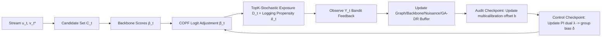

# COPF: An Online Framework for Deployment-Stable Counterfactual Fairness in Evolving Graphs

**Conference**: ICML 2026  
**arXiv**: [2606.00700](https://arxiv.org/abs/2606.00700)  
**Code**: https://github.com/lsnnnnnnnn/COPF (Available)  
**Area**: AI Safety / Fairness / Online Recommendation / Graph Learning  
**Keywords**: Counterfactual fairness, performative prediction, doubly robust estimation, online multicalibration, link prediction

## TL;DR
COPF treats "online link recommendation on evolving graphs" as a performative decision process and adds a **decision-layer wrapper** on top of the backbone scorer. It ensures counterfactual identifiability via an online logging protocol with explicit exploration, estimates the "exposed-vs-unexposed" group gap using a Graph-Aware Doubly Robust (GA-DR) estimator, and suppresses fairness spikes post-deployment using a Residual-OI audit and a PI primal–dual controller. It theoretically provides transfer certificates from plug-in OI to true counterfactual gaps, significantly reducing worst-case TE gaps on TGB and synthetic bipartite streams with controllable utility loss.

## Background & Motivation

**Background**: Online link recommendations (e.g., "who to follow," product/content recommendation) typically score candidates using a backbone (TGN, GraphMixer, EdgeBank, etc.) on evolving graphs, expose them via Top-K, and continue training with observed feedback/click data.

**Limitations of Prior Work**: This pipeline is highly *performative*—the platform's choice of exposure alters future edges and graph structures (e.g., triadic closure, Matthew effect), thus changing subsequent training data. Computing fairness metrics directly on logs is contaminated by "exposure bias": a group receiving less exposure leads to fewer observed positive samples, further suppressing it during training, creating a vicious cycle. Mishler & Dalmasso (2022) also noted that many observable fairness metrics satisfied during training drift significantly after deployment in performative settings.

**Key Challenge**: Fairness on logs $\neq$ Counterfactual fairness. When the policy updates and the exposure distribution changes, the counterfactual quantity "what would happen if this candidate were shown vs. not shown" is unidentifiable in standard logs due to a lack of overlap, as well as temporal dependencies and local interference on graphs that invalidate standard IPW/DR estimators.

**Goal**: (a) Provide a *deployment-stable* counterfactual fairness definition comparable before and after deployment; (b) Make it identifiable from an online stream; (c) Provide online auditing and control mechanisms to suppress violations without sacrificing significant utility.

**Key Insight**: Define the fairness objective on the **counterfactual effect of exposure**—comparing the potential outcomes $Y_t^{(1)}, Y_t^{(0)}$ for $D_t(v)=1$ (exposure) vs. $D_t(v)=0$ (no exposure) for each candidate edge $(u_t,v)$. Then, compare the Average Treatment Effect (ATE) $\tau_s = \mathbb{E}[Y^{(1)}-Y^{(0)}\mid A=s]$ across groups. This "decision-layer" metric is decoupled from the specific backbone and facilitates comparison across deployment windows.

**Core Idea**: A suite of five components: "explicit exploration + propensity logging + graph-aware doubly robust estimation + residual-OI auditing + PI dual control" to implement counterfactual fairness as an online decision layer applicable to any backbone.

## Method

### Overall Architecture

COPF is a **decision-layer framework** that does not modify the internal structure of the backbone $\hat p_t(u_t,v)$. Instead, it inserts a layer between scoring and final exposure:

The workflow follows Algorithm 1 (OPP Runner), divided into Pre / Deploy / Post phases. Pre-deployment uses a high exploration rate $\epsilon=0.20$ for warm-up, while Deploy/Post switches to $\epsilon=0.02$ to trigger performative shifts.

### Key Designs

1. **Online Prequential Protocol (OPP) — Enabling Counterfactual Identifiability**:
    - **Function**: Makes the "counterfactual exposure effect" identifiable from a single stream, serving as a prerequisite for DR estimation and fairness auditing.
    - **Mechanism**: Five OPP rules: OPP-0 (no temporal leakage); OPP-1 (online construction of $C_t$ using pre-decision graph $G_{\le t}$); OPP-2 (**mixed strategy** using uniform exploration $\epsilon$ + Plackett–Luce Top-K score sampling) to ensure marginal exposure probability $e_t(v) \ge \epsilon K/|C_t| > 0$, while logging propensities; OPP-3 (online cross-fitting for nuisance and backbone); OPP-4 (prequential audit and control on rolling windows). Assumption 3.1 formalizes overlap, local ignorability, bounded local interference, and temporal $\beta$-mixing.
    - **Design Motivation**: Traditional counterfactual fairness (Kusner et al. 2017) relies on overlap in batch logs, which fails in performative online scenarios. Here, *policy-enforced* exploration rather than *clipping-enforced* overlap ensures identifiability.

2. **GA-DR Residuals + Residual-OI Auditing + Mass-Normalized Certificates**:
    - **Function**: Provides **estimated certificates** for counterfactual fairness gaps under temporal dependence and local interference.
    - **Mechanism**: Define the graph-aware self-normalized doubly robust pseudo-outcome:
      $$\tilde\Gamma_t^{(a)}(u_t,v) = \hat\mu_{a,t}(W_t) + \frac{\mathbf{1}\{D_t(v)=a\}}{\hat e_t^{(a)}(v)}(Y_t-\hat\mu_{a,t}(W_t))$$
      Window averages $\widehat{\mathbb{E}}_{\mathrm{GA},\mathcal W}$ are computed with graph-aware time-decay weights $w_t$. Two residual sequences are constructed: $\hat r^{(0)}=\tilde\Gamma^{(0)}-\hat p$ (for calibration) and $\hat r^{(\Delta)}=(\tilde\Gamma^{(1)}-\tilde\Gamma^{(0)})-\tau(W_t)$ (for TE parity). Residual-OI computes $\widehat{\mathrm{OI}}_\mathcal{W}(r;\mathcal H)=\sup_{h\in\mathcal H}|\widehat{\mathbb{E}}_{\mathrm{GA},\mathcal W}[h_t r_t]|$, where $\mathcal H$ is an auditor family based on group/score-bucket/structural-role slices. Lemma 4.1 linearizes fairness gaps into residual correlations, normalized by minimum slice mass $p_\min^{\mathrm{gb}}$ to obtain finite-sample certificates.
    - **Design Motivation**: Standard IPW suffers from variance spikes, while $\mu$-only estimators are biased under model misspecification; DR provides "double insurance." Self-normalization and GA-weighting encode temporal decay and local graph structures (e.g., $k$-neighbor subsampling) to prevent mixing terms from contaminating transfer bounds.

3. **Dual Decision-Layer Controllers: Multicalibration Offsets + PI Primal–Dual Group Bias**:
    - **Function**: Actually "pushes back" audited gaps via two additive logit adjustments in Eq.(1): $b_{s,b}$ (fine-grained calibration) and $\delta_s$ (coarse-grained TE/Min control).
    - **Mechanism**: 
        - (i) **Multicalibration Update**: Estimate $\widehat{\mathbb{E}}[r^{(0)}\mid A=s,\hat p\in I]$ for each slice, select $B_{\mathrm{act}}$ most-violating slices, and perform a clipped gradient step on $b_{s,b}$. 
        - (ii) **PI Primal–Dual Controller**: Compute $(g_{\mathrm{gap}}^{\mathrm{TE}}, g_{\max}^{\mathrm{Cal}}, g^{\mathrm{Min}})$ over window $L_{\mathrm{win}}$. Maintain duals $\lambda$ driven by soft violations. Group bias is given by:
          $$\delta_s = \mathrm{clip}\big(\alpha\lambda_{\mathrm{TE}}(\bar\tau-\hat\tau_s) + \alpha'\lambda_{\mathrm{Min}}[\tau_{\min}-\hat\tau_s]_+\big)$$
    - **Design Motivation**: Multicalibration alone cannot suppress TE parity, while dual controllers ignore slice-level calibration. Decoupling them allows for layered granularity—$b_{s,b}$ handles local corrections within score buckets, while $\delta_s$ handles group-level exposure redistribution. A **minimum-effect guardrail** $g^{\mathrm{Min}}$ prevents "fairness-through-rationing" (achieving parity by lowering exposure for everyone).

### Loss & Training
- **Goal**: Online constrained optimization—maximize ranking utility (MRR / Hits@10 / NDCG@10) subject to $g_{\mathrm{gap}}^{\mathrm{TE}}\le \rho_{\mathrm{TE}}$, $g^{\mathrm{Min}}\le \rho_{\mathrm{Min}}$, and optional $g_{\max}^{\mathrm{Cal}}\le \rho_{\mathrm{Cal}}$.
- **Optimization**: Duals updated via PI (Proportional-Integral); primal via logit offsets; nuisances $\hat\mu_a$ via online cross-fitting.
- **Complexity**: Amortized $O(|C_t|dL + |C_t|k + B_{\mathrm{act}})$ per step.

## Key Experimental Results

### Main Results

Datasets: **tgbl-wiki**, **tgbl-review** from TGB, and a **synthetic bipartite stream** with injected group bias. Backbones: EdgeBank, TGN, GraphMixer. Three phases (Pre/Deploy/Post) of 20k steps each, TopK-Stochastic with $K=10$.

Comparison on Synthetic Stream + GraphMixer (mean, worst-case in parentheses):

| Phase | Metric | Base (GraphMixer) | Base + COPF | Gain |
|------|------|-------------------|-------------|------|
| Deploy | NDCG@10 | 0.1417 | **0.1996** | ↑ +40.9% |
| Deploy | Hits@10 | 0.2952 | **0.4154** | ↑ +40.7% |
| Deploy | $g_{\mathrm{gap}}^{\mathrm{TE}}$ mean | 0.0103 | **0.0076** | ↓ -26% |
| Deploy | $g_{\mathrm{gap}}^{\mathrm{TE}}$ worst | 0.0477 | **0.0274** | ↓ -43% |
| Deploy | $g_{\max}^{\mathrm{Cal}}$ worst | 0.9178 | **0.7067** | ↓ -23% |
| Post | NDCG@10 | 0.1193 | **0.1768** | ↑ +48% |

On real TGB streams, changes are more localized: on Wiki+TGN, worst-case $g_{\mathrm{gap}}^{\mathrm{TE}}$ drops from 0.0528 to 0.0217, while NDCG@10 increases slightly. The system proves most effective at supressing spikes during the transition phase.

### Ablation Study

| Configuration | Key Observation |
|------|----------|
| Full COPF | Optimal balance using Eq.(1) offsets + PI duals + GA-DR. |
| TopK-Stochastic vs $\epsilon$-greedy | PL sampling provides smoother curves than hard greedy noise. |
| Coverage-driven exploration | Targeted coverage reduces slice starvation without hurting ranking. |
| Rolling window vs certificate | Observations align with theoretical certificates. |

### Key Findings
- **COPF is "non-binding when safe, active when violated"**: It maintains the status quo when the backbone is fair and intervenes only when deployment triggers instability.
- **Worst-case spike suppression is superior to mean suppression**: The PI controller effectively suppresses transient spikes during performative shifts.
- **Utility and fairness are aligned in biased streams**: In synthetic cases, NDCG@10 rose by 40%. COPF broke the "less exposure $\to$ weak signal $\to$ less exposure" cycle by injecting exposure via $\delta_s$.
- **Calibration $g_{\max}^{\mathrm{Cal}}$ has high variance** in banditized settings—the authors suggest treating it as a diagnostic metric rather than the primary target.

## Highlights & Insights
- **Decision-layer wrapper** approach provides a clean decoupling—it is backbone-agnostic and can be combined with any existing fair-graph representation work.
- **"Policy-enforced overlap"**: Ensuring $e_t(v)\ge \epsilon K/|C_t|$ via explicit exploration is a more robust way to handle identifiability in performative systems than relying on post-hoc log clipping.
- **Minimum-effect guardrail** is an elegant solution to "fairness-through-rationing," ensuring parity isn't achieved by reducing benefits for the majority group.
- **Mass-normalized certificates** automatically relax constraints for small groups to avoid "false tight bounds" for data-sparse slices.

## Limitations & Future Work
- **Limitations**: TGB lacks real demographics; the banditized $Y^{(0)}\equiv 0$ feedback model is simplified; Assumption 4.3 (plug-in convergence rate) is an input condition; bounded local interference may fail in viral diffusion scenarios.
- **Future Work**: Extending group attributes to *path-level* (indirect spillover); introducing conformal-style adaptive thresholds; and quantifying the theoretical lower bound of the utility-fairness Pareto frontier.

## Related Work & Insights
- **vs. Dwork et al. 2025**: Extends Any-Kernel OI to **counterfactual exposure residuals** $r^{(\Delta)}$ in performative scenarios with transfer theorems.
- **vs. Perdomo et al. 2020**: While Perdomo focuses on steady-state convergence, COPF focuses on suppressing transient fairness spikes during deployment shifts.
- **vs. TGN-Adv/Penalty**: Unlike training-time interventions, COPF is a deployment-time control layer that can be layered on top of them.

## Rating
- **Novelty**: ⭐⭐⭐⭐ Combines OI, DR, and performative prediction with online control and transfer certificates.
- **Experimental Thoroughness**: ⭐⭐⭐ Covers 3 backbones and datasets, but lacks real demographics.
- **Writing Quality**: ⭐⭐⭐⭐ Clear hierarchy of definitions, protocols, and algorithms.
- **Value**: ⭐⭐⭐⭐ The wrapper design and guardrail mechanism are highly transferable to any performative recommendation or ranking scenario.

<!-- RELATED:START -->

## Related Papers

- [\[NeurIPS 2025\] Fairness-Regularized Online Optimization with Switching Costs](../../NeurIPS2025/ai_safety/fairness-regularized_online_optimization_with_switching_costs.md)
- [\[ICML 2026\] Optimal Transport under Group Fairness Constraints](optimal_transport_under_group_fairness_constraints.md)
- [\[ICML 2026\] Fairness in Aggregation: Optimal Top-$k$ and Improved Full Ranking](fairness_in_aggregation_optimal_top-k_and_improved_full_ranking.md)
- [\[NeurIPS 2025\] FedFACT: A Provable Framework for Controllable Group-Fairness Calibration in Federated Learning](../../NeurIPS2025/ai_safety/fedfact_a_provable_framework_for_controllable_group-fairness_calibration_in_fede.md)
- [\[ICLR 2026\] ATEX-CF: Attack-Informed Counterfactual Explanations for Graph Neural Networks](../../ICLR2026/ai_safety/atex-cf_attack-informed_counterfactual_explanations_for_graph_neural_networks.md)

<!-- RELATED:END -->
