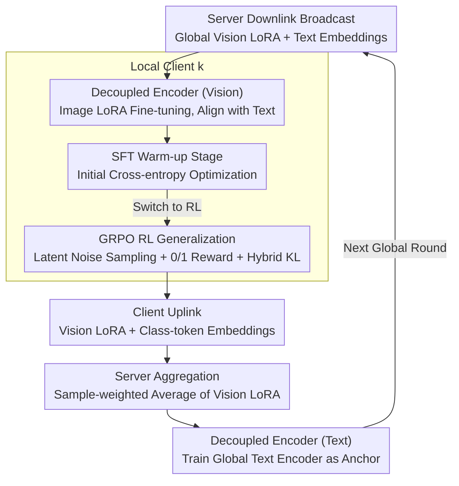

# Decoupled Training with Local Reinforcement Fine-Tuning in Federated Learning

**Conference**: ICML 2026  
**arXiv**: [2605.27900](https://arxiv.org/abs/2605.27900)  
**Code**: To be confirmed  
**Area**: Federated Learning / Vision-Language Models / RL Fine-tuning  
**Keywords**: Federated Learning, CLIP, LoRA, GRPO, Decoupled Training

## TL;DR
FedDTL retains the CLIP image encoder on the client while moving the text encoder to the server as a "global semantic anchor." It employs a two-stage local fine-tuning approach (SFT warm-up followed by GRPO-style RL) to simultaneously mitigate inter-client optimization inconsistency and intra-client overfitting in heterogeneous and full-data federated scenarios.

## Background & Motivation

**Background**: Incorporating pre-trained VLMs like CLIP into downstream tasks in Federated Learning (FL) has become mainstream. Typical approaches involve freezing the backbone and performing Parameter-Efficient Fine-Tuning (PEFT) like prompts, adapters, or LoRA on clients, followed by parameter averaging on the server.

**Limitations of Prior Work**: Under Non-IID and full-data conditions, long-trajectory local optimization leads to two concurrent issues: (i) **Inter-client optimization inconsistency**—local objectives are misaligned, and gradient directions vary, preventing the averaged parameters from forming a coherent global semantic space; (ii) **Intra-client over-specialization**—local PEFT parameters "absorb" biased label frequencies and feature statistics, degrading generalization on unseen classes or domains.

**Key Challenge**: Existing methods predominantly rely on "pure local optimization + server averaging" with additional regularization or alignment losses. They still depend on parameter averaging for cross-client knowledge transfer, failing to systematically resolve **representation-level client drift**. Furthermore, most evaluations are conducted only in few-shot settings, masking the amplification of these problems in full-data scenarios.

**Goal**: To **simultaneously** improve global task adaptation (base classes) and generalization (novel classes) across various federated data distributions, including few-shot, full-data, label skew, and feature shift.

**Key Insight**: The authors observe that CLIP’s intrinsic "modality decoupling and alignment" architecture is highly isomorphic to the "server-client broadcast" structure. Images must be processed on clients to protect privacy, but the text encoder only processes category names, naturally suiting it for relocation to the server. Additionally, the finding from Chu et al. (2025) that "SFT tends to memorize while RL favors generalization" suggests that RL can replace supplementary regularization.

**Core Idea**: **Encoder decoupling across ends + SFT→RL two-stage local fine-tuning**. The server trains the text encoder to provide a unified semantic "anchor," while clients only fine-tune the vision-side LoRA. Local training initiates with SFT warm-up before switching to GRPO-style RL to suppress over-specialization.

## Method

### Overall Architecture
FedDTL aims to suppress both "inter-client optimization inconsistency" and "intra-client overfitting" in a federated scenario with $K$ clients, each holding private data $\mathcal{D}_k=\{(x_i,y_i)\}_{i=1}^{N_k}$. The strategy involves splitting the twin-tower CLIP across physical locations—image encoders remain on clients, while the text encoder is moved to the server—combined with a "two-stage local fine-tuning" (SFT followed by RL) on clients.

The data flow for each global round $t$ is as follows: The server **downlinks** the previous round's global vision LoRA $\Delta\mathbf{W}_g^{t-1}$ and global text embeddings for all categories $\{\bar z_{\text{text}}^{c,t-1}\}_{c=1}^{C}$. Clients use the LoRA-tuned image encoder $\mathcal{V}_k$ to encode local images into $\bar z_v$, and perform classification via cosine similarity and softmax against the received text embeddings. For the first $M$ rounds, SFT is used, followed by RL. After local training, clients **uplink** only the vision LoRA $\Delta\mathbf{W}_k$ and normalized image category embeddings $\bar z_{v,k}$ (class tokens only; in full-data settings, further subsampling is possible). The server performs sample-weighted averaging of vision LoRA and uses the uploaded image embeddings as supervision to train the global text encoder $\mathcal{T}_g$ (also via LoRA), closing the global round loop. This architecture relies on "client vision decoupling + server text unification" and "two-stage local fine-tuning" to address both issues without stacking extra regularization.

### Key Designs

**1. Decoupled Encoder Training: Server Text Encoder as "Global Semantic Anchor"**

This addresses representation-level client drift that "pure local optimization + server averaging" cannot suppress. The modality structure of CLIP naturally aligns with FL constraints—image data must remain local (privacy), while the text encoder processes only category names independent of sample distributions, suitable for server-side hosting. On the client side, only the last $L-l$ layers of the image encoder are fine-tuned via LoRA ($W=W_0+BA$, $r\ll d$), aligning with broadcasted global text embeddings via $p(\hat y=c|x)=\frac{\exp(\text{sim}(\bar z_v,\bar z_{\text{text}}^c)/\tau)}{\sum_j\exp(\text{sim}(\bar z_v,\bar z_{\text{text}}^j)/\tau)}$. On the server side, after receiving image class-token embeddings from all clients, the text LoRA $\Delta\mathbf{W}_{\text{text}}$ is trained using cross-entropy to map "a photo of a [classname]" into a unified text representation aligned with the global vision space.

This is effective because the global text encoder does not depend on any single client's distribution, acting as a common coordinate system for all clients' vision representations, forcing them to converge in the same direction and replacing the "parameter averaging as knowledge transfer" paradigm. An additional benefit is that the uplink only transmits highly compressed class-token embeddings, reducing both privacy exposure and communication bandwidth.

**2. SFT Warm-up for Local Task Adaptation: Initial Stability**

This addresses the low sample efficiency of RL when starting from an underfitted state. For the first $M$ global rounds, clients run standard cross-entropy $\mathcal{L}_{ce}=-\frac{1}{N_k}\sum_{(x_i,y_i)}\sum_c y_i\log p(\hat y=c|x_i)$, optimizing $\min_{\Delta\mathbf{W}_k}\mathcal{L}_{ce}([\mathbf{W}_0,\Delta\mathbf{W}_k];\{\bar z_{\text{text}}^c\},\mathcal{D}_k)$ for $T_e=2$ local epochs per round. This rapidly moves the image encoder to a task-relevant stable initial point.

This stage separates "rapid adaptation" and "overfitting prevention": pure RL is inefficient for classification fine-tuning, while pure SFT drifts toward local biases on long trajectories. SFT handles the warm-up, delegating the refinement to RL.

**3. GRPO-inspired RL Generalization Enhancement: Inhibiting Over-specialization**

This addresses intra-client over-specialization during long-trajectory local training by using RL instead of stacked regularization. After SFT convergence, the image encoder acts as the policy $\pi_{\theta_k}$ (logits as distribution). Since CLIP-style encoders are deterministic for a given image, applying GRPO directly would result in identical outputs for the same group of samples, rendering relative advantages zero. The solution is to inject small Gaussian noise $\varepsilon\sim\mathcal{N}(0,\sigma^2 I)$ into the latent embeddings to generate controllable stochasticity, sampling $G=3$ actions per image, while using the deterministic model for policy updates.

The reward is a 0/1 signal based on "correct classification." Group normalization yields relative advantages $A_{i,j}=(r_{i,j}-\text{mean}_j r_{i,j})/\text{std}_j r_{i,j}$, followed by the GRPO $\epsilon$-clip policy gradient $\mathcal{L}_p=\min[\rho_{i,j}A_{i,j},\text{clip}(\rho_{i,j},1-\epsilon,1+\epsilon)A_{i,j}]$. To prevent the policy from drifting too far, an unbiased KL estimation $\mathbb{D}_{\text{KL}}$ is computed against a hybrid reference model (weighted 0.5/0.5 between the final SFT model and the latest global policy). The objective is:

$$\mathcal{L}_{rl}=-\frac{1}{G}\sum_j\frac{1}{bs}\sum_i\left(\mathcal{L}_p-\beta\mathbb{D}_{\text{KL}}\right),\quad \beta=0.5.$$

The hybrid reference model provides a "task-aware" direction for KL, preventing the policy from being too constrained or too volatile compared to a single reference.

### Loss & Training
Hyperparameters: ViT-B/16 backbone, LoRA rank $r=4$ at layer $l=10$. Adam optimizer, $\eta=1e-3$, batch size 64. $T=20$ global rounds, local $T_e=2$ (SFT) / $3$ (RL) epochs, $K=5$ clients. RL phase: $\sigma=0.1, G=3, \epsilon=0.2, \beta=0.5$. In full-data settings, subsampling of images is used to further reduce communication overhead.

## Key Experimental Results

### Main Results
Average accuracy across 9 label-skew benchmarks (CIFAR10/100, EuroSAT, TinyImageNet, OxfordPet, Flower102, Caltech101/256, Food101):

| Setting | Method | Base | Novel |
|------|------|------|-------|
| Few-shot Non-IID | FedMaPLe | 83.63 | 77.56 |
| Few-shot Non-IID | **FedDTL** | **89.58** | **83.01** |
| Few-shot Dir(0.1) | FedMaPLe | 84.05 | 77.69 |
| Few-shot Dir(0.1) | **FedDTL** | **90.95** | **82.64** |
| Full-data Non-IID | FedMaPLe | 80.56 | 69.41 |
| Full-data Non-IID | **FedDTL** | **91.64** | **77.72** |
| Full-data Dir(0.1) | FedMaPLe | 89.27 | 70.10 |
| Full-data Dir(0.1) | **FedDTL** | **92.40** | **76.59** |

For feature shift (DomainNet, Full-one / Full-Dir(0.1)), FedDTL achieved 93.38 / 93.47 compared to FedMaPLe's 91.94 / 90.51.

### Ablation Study
Mean results across 7 datasets (Base / Novel / Harmonic Mean (HM)):

| Configuration | Few_Non-IID Base / Novel / HM | Full_Non-IID Base / Novel / HM |
|------|------|------|
| FedLoRA (Baseline) | 78.32 / 78.86 / 78.56 | 58.11 / 70.51 / 63.12 |
| + Decoupled Training | 86.42 / 79.52 / 82.60 | 86.68 / 73.57 / 79.20 |
| + Two-stage Local FT | 79.46 / 83.84 / 81.47 | 47.91 / 76.43 / 57.86 |
| **FedDTL (Ours)** | **90.06 / 83.58 / 86.51** | **90.58 / 80.62 / ≈85** |

### Key Findings
- Adding Decoupled Training alone increased base accuracy in Full_Non-IID from 58 to 87 (+28), indicating this module effectively addresses inter-client inconsistency. However, novel performance gain was limited without RL.
- Two-stage local fine-tuning alone significantly degraded base accuracy in Full_Non-IID (to 47.91), showing RL is unstable under heterogeneity without a "global semantic anchor."
- While baselines saw significant novel class performance drops when moving from few-shot to full-data (e.g., pFedMMA novel dropped from 74.91 to 65.56), FedDTL remained robust, demonstrating the effectiveness of the two-stage design in inhibiting long-trajectory overfitting.

## Highlights & Insights
- **Modality Decoupling as FL Broadcast Isomorphism**: This unique structural alignment—images staying local (privacy) and text being global—creates a "global semantic anchor" naturally without extra components.
- **RL as an Alternative to Regularization**: The method uses RL to combat overfitting rather than stacking regularization terms. By solving the engineering challenge of deterministic encoders via "latent noise sampling + hybrid reference models," it provides a stable GRPO variant for vision.
- **Diagnostic Value of Full-data Evaluation**: Unlike many federated VLM papers that report only few-shot results, this work highlights how full-data scenarios expose the combined fragility of inter-client inconsistency and intra-client overfitting.

## Limitations & Future Work
- Communication cost scales linearly with the number of categories $C$ due to text embedding broadcasting, lacking a compression scheme for the downlink.
- Experiments are restricted to ViT-B/16; performance on larger backbones (e.g., ViT-L, Eva-CLIP) and sensitivity to LoRA hyperparameters ($r$, $l$) remains untested.
- The RL phase requires $G$ times more forward passes ($G=3$), increasing client computational demand, which may be prohibitive for resource-constrained edge devices.
- Privacy analysis is qualitative; formal Differential Privacy (DP) guarantees or empirical tests against embedding inversion attacks are absent.

## Related Work & Insights
- **vs FedMaPLe / PromptFL**: These rely on complex prompt tuning for cross-client knowledge transfer. FedDTL replaces this paradigm by training the text encoder on the server, showing significant gains in full-data settings (DomainNet Full-one 91.94→93.38).
- **vs FedPGP / pFedMMA**: These use additional alignment or regularization losses within SFT. FedDTL's RL stage avoids the "loss term stacking" complexity, improving HM from ~57 to ~85 in Full_Non-IID.
- **vs FedPPO / AFedPG**: While these also introduce RL to FL, they focus on system heterogeneity (stragglers, asynchronous updates). FedDTL's RL directly optimizes parameters to handle statistical heterogeneity, making the research problems orthogonal.

## Rating
- Novelty: ⭐⭐⭐⭐ The structural alignment of CLIP with FL and the latent-noise GRPO adaptation are impactful contributions.
- Experimental Thoroughness: ⭐⭐⭐⭐ Extensive coverage across 11 datasets, multiple distributions, and few-shot/full-data settings.
- Writing Quality: ⭐⭐⭐⭐ Clear motivation on the dual issues of drift and overfitting, though the RL implementation details are dense.
- Value: ⭐⭐⭐⭐ Addresses the critical stability issue of Federated VLM in full-data heterogeneous scenarios with transferable mechanisms.

<!-- RELATED:START -->

## Related Papers

- [\[ICML 2026\] FedTreeLoRA: Reconciling Statistical and Functional Heterogeneity in Federated LoRA Fine-Tuning](fedtreelora_reconciling_statistical_and_functional_heterogeneity_in_federated_lo.md)
- [\[ICML 2026\] Towards Fine-Grained Robustness: Attention-Guided Test-Time Prompt Tuning for Vision-Language Models](towards_fine-grained_robustness_attention-guided_test-time_prompt_tuning_for_vis.md)
- [\[ICML 2026\] PFT: Phonon Fine-tuning for Machine Learned Interatomic Potentials](pft_phonon_fine-tuning_for_machine_learned_interatomic_potentials.md)
- [\[ICCV 2025\] LoRA-FAIR: Federated LoRA Fine-Tuning with Aggregation and Initialization Refinement](../../ICCV2025/ai_safety/lora-fair_federated_lora_fine-tuning_with_aggregation_and_initialization_refinem.md)
- [\[ICML 2026\] TCAP: Tri-Component Attention Profiling for Unsupervised Backdoor Detection in MLLM Fine-Tuning](tcap_tri-component_attention_profiling_for_unsupervised_backdoor_detection_in_ml.md)

<!-- RELATED:END -->
