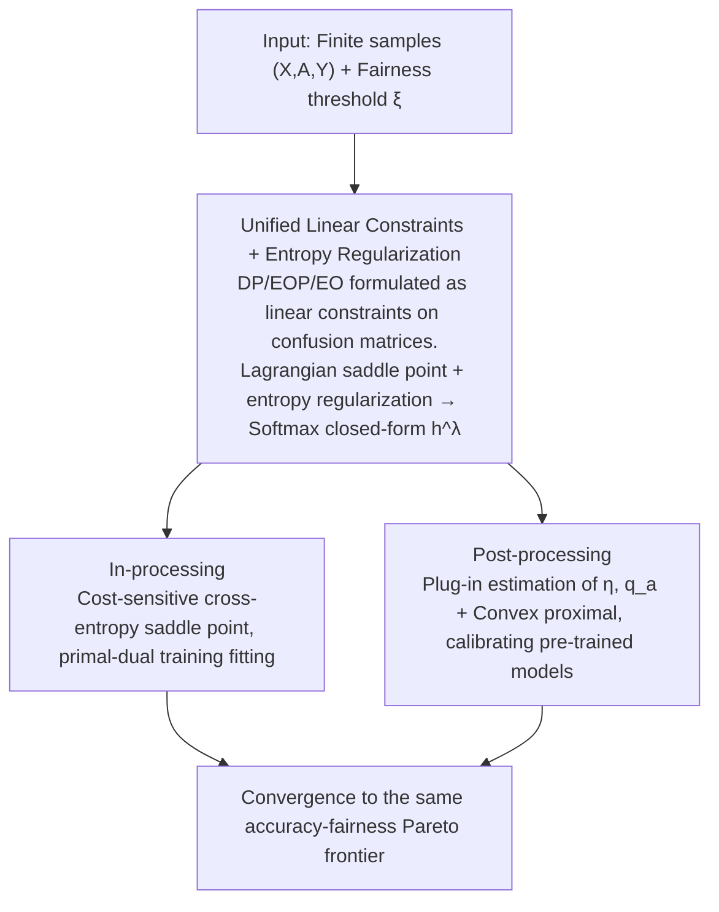

# Demystifying the Optimal Fair Classifier in Multi-Class Classification

**Conference**: ICML 2026  
**arXiv**: [2606.00656](https://arxiv.org/abs/2606.00656)  
**Code**: None  
**Area**: AI Safety / Fairness / Multi-class  
**Keywords**: Fair Classification, Multi-class Classification, Pareto Frontier, In-processing, Post-processing

## TL;DR
This paper provides an analytically tractable form (a closed-form solution with entropy regularization) for the Bayes optimal classifier in multi-class fair classification problems. Based on this, it derives a unified framework, OptFair: the training phase utilizes a reduction to saddle-point optimization of cost-sensitive cross-entropy, while the deployment phase uses plug-in estimation to solve a convex proximal gradient problem. Both methods theoretically converge to the accuracy-fairness Pareto frontier.

## Background & Motivation

**Background**: Group fairness (DP, EOP, EO) has become a standard constraint in high-stakes decision-making (healthcare, credit, judiciary). Existing methods either modify the objective during training (in-processing) or adjust the output after inference (post-processing), and these two are typically designed independently.

**Limitations of Prior Work**: (1) Fairness metrics are inherently **non-decomposable and non-differentiable**. In multi-class settings, where outputs shift from scalars to vectors on a simplex, directly applying binary classification methods is cumbersome. (2) In-processing heavily relies on **surrogate metrics** (hinge/Adv loss), leading to uncontrollable surrogate gaps and unstable convergence. (3) Post-processing either serves a single fairness criterion or lacks an explicit characterization of what the "optimal classifier looks like," leaving the performance upper bound unclear. (4) The entire field of multi-class fair learning **lacks an analytic characterization of the Pareto frontier**, making it impossible to determine whether performance drops are due to algorithmic weaknesses or the nature of the problem itself.

**Key Challenge**: To be "universal across multiple fairness criteria, applicable to both in/post-processing stages, and capable of approaching optimality," one must first establish a **Bayes optimal analytic form valid for multi-class settings and various DP/EOP/EO criteria**. Otherwise, various implementations can only perform local approximations in the dark.

**Goal**: To solve this in two steps: first, answer the theoretical question "what is the form of the optimal multi-class fair classifier?"; second, provide two corresponding algorithms for in-processing and post-processing, proving that both converge to the aforementioned optimal solution.

**Key Insight**: DP/EOP/EO are formulated as **linear constraints on group-specific confusion matrices $C^a$**, denoted as $|\sum_a \langle D^{a,k}, C^a(h) \rangle| \le \xi$, which are then integrated into the objective using a Lagrangian. To address analytical intractability, the approach draws inspiration from entropic Optimal Transport (OT) by adding **entropy regularization** $E(h) = -\mathbb{E}_X [\sum_i h_i \log h_i]$. This convexifies the argmax into a softmax, yielding a closed-form solution.

**Core Idea**: A closed-form softmax solution for the multi-class fair optimal classifier, $h^{\lambda^*}_i(x) \propto \exp(\beta^{\lambda^*}_i(x)/\tau)$, is provided via an entropy-regularized Lagrangian saddle-point formulation. "Training fitting" and "inference calibration" are reduced to cost-sensitive classification and convex proximal optimization, respectively, unified under the OptFair framework.

## Method

### Overall Architecture

This paper addresses the theoretical and algorithmic pair of "how to find and approach the accuracy-fairness optimal classifier in a multi-class setting." The approach involves writing the original constrained optimization $\min_h R(h)$ s.t. $|D_k(h)| \le \xi$ as a unified Lagrangian saddle point $L(h, \lambda) = R(h) + \lambda^\top D(h) - \xi \|\lambda\|_1$. It first analytically characterizes the form of the optimal classifier and then pursues two paths—training stage (in-processing) and deployment stage (post-processing)—to approximate it, proving that both converge to the same Pareto frontier. The input consists of finite samples $(X, A, Y)$ and a fairness threshold $\xi$, while the output is an attribute-blind randomized classifier $h: \mathcal{X} \to \Delta_m$.

### Key Designs

**1. Unified Linear Constraints + Entropy Regularization: Convexifying the $\arg\max$ Optimal Solution into a Softmax Closed-form**

The most difficult aspect of multi-class fairness is that fairness metrics are non-decomposable and non-differentiable, and the output is a vector on a simplex rather than a scalar. This paper first unifies criteria like DP/EOP/EO into linear constraints on group-specific confusion matrices $C^a$, $|\sum_a \langle D^{a,k}, C^a(h)\rangle| \le \xi$, allowing multi-class and multi-criteria problems to share a single theoretical framework. After dualization, Theorem 4.2 provides the optimal solution without regularization: $h^*(x) \in \mathrm{conv}\{e_y : y \in \arg\max_j \beta^{\lambda^*}_j(x)\}$, where the decision vector is $\beta^{\lambda}(x) = \sum_a p_a(x)\, M(a,\lambda)^\top \eta(x,a)$. The reweighting matrix $M(a,\lambda) = I - \frac{1}{\omega_a}\sum_k \lambda_k D^{a,k}$ specifies how each true-predicted pair should be weighted for a sample in group $a$ to satisfy fairness constraints.

However, this solution contains an $\arg\max$, making the dual optimization non-differentiable. Borrowing from entropic OT, entropy regularization $-\tau E(h)$ is added to the primal problem, convexifying the $\arg\max$ into a softmax. Theorem 4.3 provides the closed-form solution $h^{\lambda^*}_i(x) = \exp(\beta^{\lambda^*}_i(x)/\tau) / \sum_j \exp(\beta^{\lambda^*}_j(x)/\tau)$. The dual objective then becomes a convex smooth + L1 structure: $\min_\lambda \tau \mathbb{E}_X [\log \sum_j \exp(\beta^\lambda_j(X)/\tau)] + \xi\|\lambda\|_1$, which can be solved in one pass using standard proximal methods. The temperature $\tau$ controls the degree of randomization: as $\tau \to 0$, it reverts to the hard $\arg\max$ (consistent with Theorem 4.2), while a moderate $\tau$ ensures nearly deterministic inference and smooth training gradients. This form also reduces to classic threshold rules in the binary case (Menon & Williamson 2018), ensuring theoretical consistency.

**2. In-processing: Reducing Fair Training to a Saddle-point Problem of Cost-sensitive Cross-entropy**

In the training phase, $\eta$ and $p_a$ are unknown, so the "$\min_h L(h, \lambda)$" step must be reduced to a differentiable classification problem with an explicit calibrated loss for SGD. This paper defines a cost-sensitive loss $\ell_{\mathrm{cal}}(y, f(x;\theta), a, \lambda) = -\sum_i [M'(a,\lambda)]_{y,i}\, \log \mathrm{softmax}_i(f(x;\theta))$, where $M'(a,\lambda) = M(a,\lambda) + \kappa \mathbf{1}_{m\times m}$ includes a constant term to ensure each entry is strictly positive, making it a valid cost matrix. Theorem 5.1 proves that $h^*(x;f)$ induced by $\arg\min_f \mathbb{E}[\ell_{\mathrm{cal}}]$ is equivalent to the optimal $h^*(x;\beta^\lambda)$, meaning the loss is calibrated for the inner min—this addresses the drawback of prior in-processing methods that used hinge/adversary surrogate objectives with uncontrollable surrogate gaps. Algorithm 1 employs standard primal-dual optimization: in each round, it performs $R$ steps of $\theta$ gradient updates followed by one proximal update for $\lambda$: $\lambda_{t+1} = \mathrm{prox}_{\eta_\lambda(\xi\|\cdot\|_1 + I_{\Lambda})}(\lambda_t + \eta_\lambda D(h_{t+1}))$. Convergence is guaranteed by mixed Nash analysis (Theorem 5.2): the mixed strategy $(\bar h_T, \bar \lambda_T)$ converges to an approximate equilibrium point $\rho_T \le \bar\nu_T + uB_\Lambda \sqrt{K/T}$ as iterations $T$ increase. Theorem 5.3 further provides a generalization bound of $O(\gamma_d(N, m^2/\delta))$, quantifying the distance from the Pareto frontier based on the training algorithm and data scale.

**3. Post-processing: Plug-in Estimation + Convex Proximal to Calibrate Arbitrary Pre-trained Models without Retraining**

In the deployment phase, pre-trained scores $\hat\eta$ already exist; the goal is to produce a fairness-calibrated probabilistic classifier without retraining. This paper trains an auxiliary model $\hat q_a(x) \approx P(A|X, Y)$ and substitutes the sample estimate $\hat\beta^\lambda(x) = [\sum_a \mathrm{Diag}(\hat q_a(x))\, \hat M(a, \lambda)]^\top \hat\eta(x)$ back into the closed-form softmax (Eq. 15). The optimal $\hat\lambda^*$ is obtained by solving the empirical dual $\hat H(\lambda) = \hat f(\lambda) + \xi\|\lambda\|_1$. A key advantage here is that $\hat q_a$ decouples the "attribute-blind" requirement—traditional post-processing often requires sensitive attributes during inference or serves only a single criterion, whereas this approach does not require true attributes at inference time. Proposition 5.5 proves that $\hat f(\lambda)$ is convex and L-smooth, so Algorithm 2 uses proximal gradient descent on $\lambda$ to converge quickly to the global optimum. The error is decomposed in Theorem 5.6 into three terms: $\epsilon_1$ (auxiliary model bias, including $\|q_a - \hat q_a\|_1$), $\epsilon_2$ (finite samples), and $\epsilon_3$ (frequency estimation bias). By tuning $\tau$, a worst-case bound of order $O(\sqrt\epsilon)$ can be achieved.

### Loss & Training

In-processing uses $\ell_{\mathrm{cal}}$ (cost-sensitive cross-entropy) + primal-dual optimization: the inner loop learns $\theta$ with step $\eta_\theta$, and the outer loop updates $\lambda$ with a prox step $\eta_\lambda = B_\Lambda / (u\sqrt{KT})$ to satisfy $\|\lambda\|_1 \le B_\Lambda$. Post-processing utilizes proximal gradient to solve $\hat H(\lambda)$. For a deterministic classifier: in-processing runs $\ell_{\mathrm{cal}}$ to convergence with a fixed $\bar\lambda$; post-processing directly takes $\arg\max h(x)$. A small temperature $\tau$ ensures the softmax output is nearly one-hot.

## Key Experimental Results

### Main Results

Four standard fairness benchmarks (Adult / ENEM / ACSIncome / CelebA; the latter three involve $\ge 4$ classes) were used to plot accuracy-fairness Pareto curves by scanning $\xi$ under both DP and EO criteria. Top-left is better.

| Stage | Dataset / Criterion | OptFair Performance | Main Comparisons |
|-------|---------------------|---------------------|------------------|
| In-proc | ENEM / DP | Pareto frontier significantly pushed outward; DP is ~30% lower than second best at the same accuracy | ERM / AdvDebias / Weight-ERM / FairBatch / F-divergence |
| In-proc | ACSIncome / EO | Accuracy ~0.47 is significantly higher than baselines (~0.42–0.44) at EO ≈ 0.1 | Same as above |
| Post-proc | CelebA / DP | Accuracy ~0.74–0.76 at same DP, outperforming FairProjection, LinearPost, FRAPPÉ | Same as above |
| Post-proc | Adult / EO | Consistently stays at the outer edge of the frontier across the entire trade-off range | Same as above |

Qualitative conclusions: (1) In-processing shows a more pronounced advantage as it directly approximates the theoretical Pareto frontier; (2) on Adult/EO, fairness constraints actually **improved** accuracy by reducing inherent bias.

### Ablation Study

On ENEM/ACSIncome, in-processing was trained to a certain fairness threshold and then followed by post-processing (In-Post-1 / In-Post-2 with different thresholds), compared against single-stage baselines:

| Configuration | Description | Result |
|---------------|-------------|--------|
| OptFair-in (only) | In-processing only | Upper bound, closest to Pareto frontier |
| OptFair-post (only) | Post-processing only | Close to in-only, slightly inferior |
| In-Post-1 / In-Post-2 | In-training followed by post-calibration | Falls between the two; **no additive gain** |

### Key Findings

- In + Post do not stack: In-processing debiases at the representation layer, while post-processing modifies the output distribution. They operate in different domains, so serial concatenation usually provides no further improvement, merely interpolating between the two curves.
- In scenarios like Adult/EO, adding fairness constraints **actually improves accuracy**, suggesting data bias leads ERM to learn suboptimal boundaries; fairness act as a regularizer.
- The smaller the entropy temperature $\tau$, the closer the output is to being deterministic, increasing the accuracy upper bound but making gradients less stable. Theorem 5.6 provides the optimal order of $\tau$ to balance the $\tau \log m$ and $1/\tau$ terms.

## Highlights & Insights

- **Dual Role of Entropy and Lagrangian**: This approach turns the "optimal fair classifier" from a convex hull containing $\arg\max$ into a closed-form softmax (analytic) and transforms the dual problem into a convex + L-smooth + L1 structure (solvable via convex optimization). This logic can be transferred to any discrete output problem with linear constraints and non-differentiable decisions (e.g., fairness in ranking/segmentation).
- **Unified Algorithm via $\beta^\lambda$ and $M(a,\lambda)$**: Since in-processing and post-processing share the same underlying structure, one can use in-processing for a warm-start $\bar\lambda$ during training and then fine-tune with post-processing during deployment. This is engineering-elegant even if accuracy gains don't stack.
- **Cost-sensitive Loss**: Mapping fairness constraints to calibrated cross-entropy offers a cleaner paradigm for the in-processing community compared to surrogate-based losses. The dual variable $\lambda$ naturally provides the cost weights for each $(a, y, \hat y)$, which is much more intuitive than manual reweighting designs.

## Limitations & Future Work

- **Quality of Auxiliary Model $\hat q_a$**: The upper bound of post-processing depends on the auxiliary model. $\epsilon_1$ in Theorem 5.6 includes $\|q_a - \hat q_a\|_1$; when groups are imbalanced or attributes are hard to predict (e.g., rare racial intersections), the worst-case bound is dominated by this term. This was not specifically stress-tested.
- **Ablation Gaps in Image/Multimodal Data**: The authors noted that sensitive attributes are difficult to feed directly into image data, so the In + Post ablation was only performed on tabular data. For datasets like CelebA with clear gender attributes, this should have been possible but was avoided.
- **Lack of Automated Temperature $\tau$ Selection**: In experiments, a small value for $\tau$ was chosen empirically without a cross-validation process or an analysis of whether optimal $\tau$ varies across different fairness criteria.
- **Practical Control for Joint Multi-criteria ($K \ge 2$)**: While the theory supports multiple simultaneous linear constraints, experiments only demonstrate single-criterion trade-offs. The nature of the Pareto surface under simultaneous DP+EO constraints remains unexplored.

## Related Work & Insights

- **vs. Agarwal et al. 2018 (Reductions for binary fairness)**: This is a multi-class extension. However, the inner loop's calibrated loss shifts from 0/1 importance-weighted to a **cost-sensitive softmax form** (Theorem 5.1), and entropy regularization is introduced to the dual for solvability.
- **vs. Xian & Zhao 2024 / Denis et al. 2024 (Multi-class post-processing)**: These assume continuous output distributions and are mostly attribute-aware. This paper uses entropic relaxation to remove the continuity assumption and achieves attribute-blind inference via the auxiliary model $\hat q_a$.
- **vs. FairProjection (Alghamdi et al. 2022) / LinearPost / FRAPPÉ**: These either target a single criterion or lack a characterization of the optimal classifier form. OptFair-post expresses the "optimal solution" as a closed-form softmax, making its objective "approaching optimality" rather than "heuristic calibration."
- **Insight**: Using "linear-constrained Bayes optimal + entropic relaxation" as a general pattern could be applied to other scenarios like fairness in ranking or retrieval. Calibrated cost-sensitive loss might also replace reward shaping commonly used in LLM alignment.

## Rating
- Novelty: ⭐⭐⭐⭐ Introducing entropy regularization (OT-style) to characterize the Bayes optimal multi-class fair classifier and unifying in/post-processing fills a theoretical gap.
- Experimental Thoroughness: ⭐⭐⭐ Datasets and baselines are complete, but joint multi-criteria experiments are missing, and joint ablation on images was avoided.
- Writing Quality: ⭐⭐⭐⭐ Clear mapping between Theorem, Algorithm, and Experiment; consistent notation and self-contained Appendix.
- Value: ⭐⭐⭐⭐ The fair ML community can directly reuse this calibrated loss and plug-in framework; it is highly deployment-friendly.

<!-- RELATED:START -->

## Related Papers

- [\[ICML 2026\] Fair Decisions from Calibrated Scores: Achieving Optimal Classification While Satisfying Sufficiency](fair_decisions_from_calibrated_scores_achieving_optimal_classification_while_sat.md)
- [\[CVPR 2026\] Your Classifier Can Do More: Towards Balancing the Gaps in Classification, Robustness, and Generation](../../CVPR2026/ai_safety/your_classifier_can_do_more_towards_balancing_the.md)
- [\[ICLR 2026\] Fair Conformal Classification via Learning Representation-Based Groups](../../ICLR2026/ai_safety/fair_conformal_classification_via_learning_representation-based_groups.md)
- [\[ICML 2026\] Fair Dataset Distillation via Cross-Group Barycenter Alignment](fair_dataset_distillation_via_cross-group_barycenter_alignment.md)
- [\[ICML 2026\] Fairness in Aggregation: Optimal Top-$k$ and Improved Full Ranking](fairness_in_aggregation_optimal_top-k_and_improved_full_ranking.md)

<!-- RELATED:END -->
