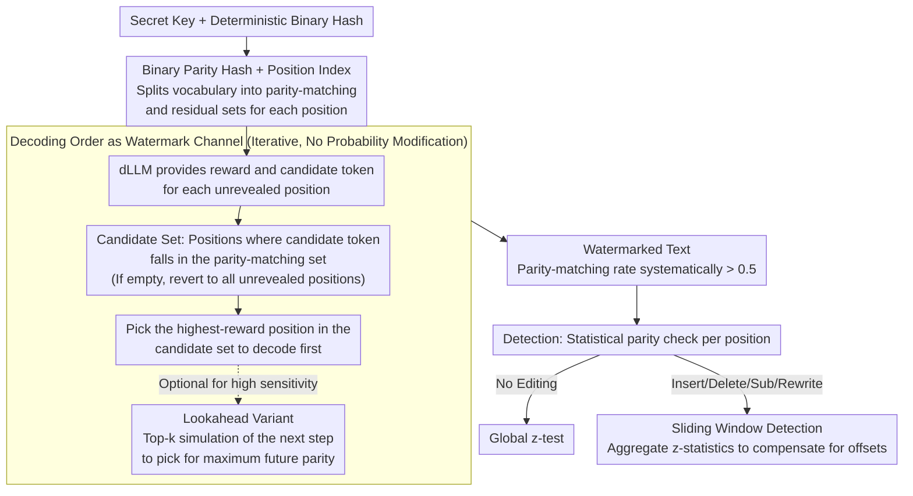

# dgMARK: Decoding-Guided Watermarking for Diffusion Language Models

**Conference**: ICML 2026  
**arXiv**: [2601.22985](https://arxiv.org/abs/2601.22985)  
**Code**: https://dgmark-watermarking.github.io  
**Area**: LLM Security / Watermarking / Diffusion Language Models  
**Keywords**: dLLM Watermarking, Decoding Order, Parity Hashing, Robust Detection, Probability-Free Reweighting

## TL;DR
dgMARK utilizes the "decoding order degree of freedom" inherent in Diffusion Language Models (dLLMs) as a watermarking channel. By prioritizing the decoding of positions that satisfy parity conditions based on a binary hash, it embeds statistically detectable watermarks in models like LLaDA/Dream without modifying token probability distributions, maintaining robustness against insertion, deletion, substitution, and rewriting.

## Background & Motivation

**Background**: LLM content provenance primarily relies on watermarking. Mainstream approaches (e.g., Kirchenbauer et al.’s green/red lists) embed signals by biasing token probabilities, which leads to noticeable quality loss. Distortion-free variants (GumbelMax, long pseudo-random sequences) preserve the distribution but are slow and depend on fixed causal contexts. Recently, the rise of Diffusion Language Models (dLLMs; LLaDA, Dream, Mercury, Gemini Diffusion), which reveal tokens in an arbitrary order, has begun to challenge the autoregressive paradigm.

**Limitations of Prior Work**: Existing watermarking schemes assume left-to-right generation and require "prior context" as a hashing seed. dLLMs lack a fixed prefix, so classic schemes are either inapplicable or modified to "still bias probabilities," continuing to pay a quality price. A few concurrent dLLM watermarking works (Bagchi, Wu, Gloaguen, Raban, etc.) still mainly focus on altering token selection probabilities.

**Key Challenge**: dLLMs offer a new control knob (decoding order), which ideally should be order-independent (any permutation should yield the same distribution). In reality, however, dLLMs are highly sensitive to order due to imperfect training approximations (Kim et al. 2025). This discrepancy is precisely a potential watermarking channel that has not been systematically exploited.

**Goal**: To design a watermark that does not touch token probabilities at all—embedding signals solely by guiding the decoding order—while (1) being compatible with universal decoding strategies like confidence/entropy/margin and (2) maintaining detection rates under insertion, deletion, substitution, and rewriting attacks.

**Key Insight**: It is observed that at each step, a dLLM calculates a reward $r_j$ and samples a candidate $v_j$ for each unrevealed position $j$, prioritizing the one with the maximum $r_j$. By using a binary hash tied to the position index to prioritize candidates that satisfy a parity condition, one can systematically push the parity-matching rate of watermarked text above 0.5 without altering probabilities.

**Core Idea**: Shift watermarking from "distorting token probabilities" to "distorting decoding order." A binary hash derived from a secret key splits the vocabulary into "parity-matching" and "residual" sets for each position. During decoding, precedence is given to positions where the candidate falls into the parity-matching set and has the highest reward. Statistical detection then checks if the parity-matching rate is significantly higher than 0.5.

## Method

### Overall Architecture

dgMARK aims for a "zero-touch" watermark regarding token probabilities: since a dLLM must pick one unrevealed position to decode first at each step, the signal is hidden in the "who to decode first" selection rather than biasing "what to decode." The entire pipeline is driven by a secret key $\xi$ and a deterministic hash $f: \mathcal{V} \times \Xi \to \{0,1\}$. This hash splits the vocabulary at position $i$ into a parity-matching set $\mathcal{G}_i = \{v \in \mathcal{V} \mid f(v, \xi) \equiv i \pmod 2\}$ and a residual set $\mathcal{R}_i = \mathcal{V} \setminus \mathcal{G}_i$ (the hash construction ensures a balanced split for any $\xi$). During generation, the dLLM provides a reward and a candidate $(r_j, v_j)$ for each unrevealed position $j$ as usual. dgMARK only prioritizes decoding the position with the highest reward among those where the candidate token happens to fall into the parity-matching half. Detection involves counting parity alignment position-by-position and performing a z-test to see if the proportion is significantly above 0.5; for editing attacks, a sliding window is applied to compensate for alignment offsets.

### Key Designs

**1. Decoding Order as Watermark Channel: Embedding Signals Without Touching $p_\theta$**

Classic watermarks (green/red lists, GumbelMax) operate on token probabilities; biasing logits results in quality loss, while distribution-preserving distortion-free variants incur extra computational overhead. dgMARK changes the knob: it leaves $p_\theta(y_j \mid y_\mathcal{I}, x)$ untouched and only modifies "who to decode first." This seems contradictory—if dLLMs were ideal order-independent models where any permutation yielded the same distribution, changing the order would be undetectable. However, real dLLMs are highly sensitive to order due to imperfect training (Kim et al. 2025). This "defect" becomes a watermarking resource: systematically prioritizing parity-matching positions pushes the parity-matching rate significantly above 0.5, whereas unwatermarked text remains at 0.5. Consequently, the watermark is decoupled from model probabilities, avoiding quality degradation and overhead while remaining plug-and-play with any underlying decoding strategy.

**2. Binary Parity Hash + Position Index: Ensuring Detectability and Resistance to Counting Attacks**

With the channel identified, a robust encoding is needed. dgMARK uses a key-derived hash $f(v, \xi)$ to give each token a 0/1 label and compares it with the position index $i$. A token $v$ is in the parity-matching set $\mathcal{G}_i$ only if $f(v, \xi) \equiv i \pmod 2$. During decoding, the model prioritizes the position $k^\star = \arg\max_{j: v_j \in \mathcal{G}_j} r_j$. Position dependence is critical: the vocabulary split alternates by position, preventing the watermark from being broken by "counting high-frequency words" as in static green lists. The balanced binary split ensures a parity-matching rate of exactly 0.5 under the null hypothesis (unwatermarked), allowing for direct z-test detection. The secret key can also be rotated or hierarchical for multi-level authorization.

**3. Sliding Window Detection: Compensating for Alignment Offsets from Editing Attacks**

Parity is calculated positionally. If text is inserted or deleted, the global position indices shift, disrupting the alignment for all subsequent positions. Worse, these shifts can cause some windows to not only mismatch but flip their parity below 0.5, causing a naive global count to misclassify a robust watermark. dgMARK addresses this by detecting over overlapping sliding windows: for each window of length $w$ starting at $s$, a local z-score $z_s$ is calculated. A bilateral aggregate statistic $z_{\text{win}} = \frac{1}{S}\sum_s z_s^2$ is used to capture windows that are either significantly high or flipped low. As long as some sub-intervals remain consistent after being fragmented by edits, they can be detected. This is lighter and easier to analyze than complex error-correction codes.

**4. Lookahead Variant: Boosting Signal Strength in Sparse Steps**

The basic version greedily picks the highest-reward parity-matching position. However, committing early might exhaust positions that would have been better for future parity opportunities. The Lookahead variant takes the top-k parity-matching candidates and simulates the next step for each. It counts how many parity-matching candidates would remain in the next step (a lookahead score $g^{(j)} = \sum_\ell \mathbb{1}[v_\ell^{(j)} \in \mathcal{G}_\ell]$) and chooses the path that maximizes future parity opportunities. While $k=1$ reduces to the basic version, larger values increase watermark strength at the cost of running the decoding strategy again each step, effectively doubling the inference cost.

## Key Experimental Results

### Detection vs. Text Quality (LLaDA-8B-Instruct, confidence decoding)

| Method | Detection AUC↑ | Perplexity↓ | MAUVE↑ |
|:---|:---:|:---:|:---:|
| No Watermark | 0.50 | 1.00× | 1.000 |
| Prob. Bias (KGW) | 0.98 | 1.18× | 0.86 |
| dgMARK | **0.97** | **1.01×** | **0.97** |
| dgMARK + Lookahead | **0.99** | 1.03× | 0.95 |

dgMARK's detection rate rivals the probability-biasing baseline, yet its perplexity and MAUVE scores are nearly identical to the unwatermarked model, demonstrating that the ordering channel is "almost free."

### Post-Editing Robustness (20% substitution rate)

| Attack | Prob. Bias AUC | dgMARK AUC | dgMARK + Window AUC |
|:---|:---:|:---:|:---:|
| 20% Substitution | 0.81 | 0.85 | **0.94** |
| 10% Insertion | 0.70 | 0.79 | **0.92** |
| 10% Deletion | 0.68 | 0.77 | **0.91** |
| Rewriting (GPT-4) | 0.62 | 0.71 | **0.85** |

Sliding window detection significantly compensates for alignment offsets caused by insertions/deletions. dgMARK is also more robust than probability biasing under rewriting attacks, as ordering signals are harder for rewriters to erase than specific token choices.

### Key Findings
- **Order channel offers near-zero quality cost**: Perplexity increases by only 1%, making it nearly indistinguishable from unwatermarked text; this suggests that changing the order is far less intrusive than changing probabilities.
- **Stable across decoding strategies**: dgMARK integrates with confidence, entropy, and margin decoding, maintaining detection AUC > 0.95, proving its plug-and-play nature.
- **Sliding Window > Global Detection**: Under all editing attacks, detection AUC improves by 5–10 points, highlighting its role in robustness.
- **Diminishing returns for Lookahead**: It pushes AUC from 0.97 to 0.99 but at 2× the inference cost, making it suitable mainly for high-sensitivity scenarios.

## Highlights & Insights
- **Identified a unique dLLM watermarking channel**: The decoding order degree of freedom is a knob that does not exist in the autoregressive paradigm. By turning a known dLLM sensitivity (often viewed as a bug) into a feature, the work provides a novel framing.
- **Completely probability-free**: It is one of the few LLM watermarking schemes that truly leaves $p_\theta$ untouched. Theoretically, the KL divergence between the watermarked and unwatermarked distributions is zero.
- **Plug-and-play philosophy**: dgMARK acts as a wrapper compatible with confidence, entropy, and margin decoding. This means existing dLLM deployments can be watermarked without modifying training or inference frameworks.
- **Generality of sliding window detection**: The problem of global alignment disruption by editing attacks exists in all position-dependent watermarks; this solution is transferable to other schemes.

## Limitations & Future Work
- Dependency on dLLM "order sensitivity"—if future dLLMs become perfectly order-invariant, the watermark signal may vanish (an "adversarial training" risk).
- Lookahead doubles inference costs, and multi-step lookahead would be exponentially expensive, raising the cost for strong watermark modes.
- Binary parity provides 1 bit per position; channel capacity is limited. Embedding complex signatures (e.g., timestamps) requires expansion to $k$-bit hashing.
- Primary validation on LLaDA and Dream; generalization to larger scales or different dLLM architectures remains to be fully explored.
- Under strong rewriting attacks, AUC still drops to 0.85; aggressive rewriters could potentially degrade it further.

## Related Work & Insights
- **vs Autoregressive Green/Red Lists (Kirchenbauer et al.)**: Those rely on fixed causal contexts that dLLMs lack, and biasing probabilities incurs quality costs that dgMARK avoids.
- **vs Distortion-free Watermarks (Aaronson-Kirchner, Christ et al.)**: Those preserve distributions via GumbelMax or long sequences but are computationally expensive; dgMARK achieves preservation with almost zero overhead on dLLMs.
- **vs Concurrent dLLM Watermarking (Bagchi / Wu / Gloaguen / Raban)**: Other works still focus on probability shaping or controlled sampling; dgMARK is the first to use decoding order exclusively.
- **Insight**: Any generative system that is theoretically order-independent but practically order-sensitive (e.g., image or video diffusion) could potentially reuse the "order channel watermarking" concept.

## Rating
- Novelty: ⭐⭐⭐⭐⭐ Using decoding order as a channel is a genuinely fresh framing, pioneering a non-probabilistic path for dLLM watermarks.
- Experimental Thoroughness: ⭐⭐⭐⭐ Covered two dLLMs, three decoding strategies, and four attack types across multiple baselines; however, more head-to-head comparisons with concurrent dLLM watermarking works would be beneficial.
- Writing Quality: ⭐⭐⭐⭐ Clear motivation and intuitive algorithm diagrams; theoretical analysis of how order sensitivity translates to detectable statistics could be deeper.
- Value: ⭐⭐⭐⭐⭐ With the rapid industrialization of dLLMs (Mercury, Gemini Diffusion), provenance watermarking is a critical need. This work provides a high-quality, low-overhead, and robust solution.

<!-- RELATED:START -->

## Related Papers

- [\[ICML 2026\] COFT: Counterfactual-Conformal Decoding for Fair Chain-of-Thought Reasoning in Large Language Models](coft_counterfactual-conformal_decoding_for_fair_chain-of-thought_reasoning_in_la.md)
- [\[ICML 2026\] Towards Fine-Grained Robustness: Attention-Guided Test-Time Prompt Tuning for Vision-Language Models](towards_fine-grained_robustness_attention-guided_test-time_prompt_tuning_for_vis.md)
- [\[ICML 2026\] Anchored Decoding: Provably Reducing Copyright Risk for Any Language Model](anchored_decoding_provably_reducing_copyright_risk_for_any_language_model.md)
- [\[ICML 2026\] The Unlearnability Phenomenon in RLVR for Language Models](the_unlearnability_phenomenon_in_rlvr_for_language_models.md)
- [\[ICML 2026\] In-Training Defenses Against Emergent Misalignment in Language Models](in-training_defenses_against_emergent_misalignment_in_language_models.md)

<!-- RELATED:END -->
