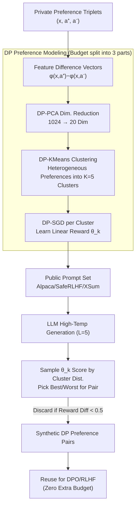

# Differentially Private Preference Data Synthesis for Large Language Model Alignment

**Conference**: ICML 2026  
**arXiv**: [2605.30808](https://arxiv.org/abs/2605.30808)  
**Code**: https://github.com/gfengyu/Differentially-Private-Preference-Data-Synthesis  
**Area**: LLM Safety / Differential Privacy / Preference Alignment  
**Keywords**: Differential Privacy, Preference Data Synthesis, Bradley-Terry, DP-PCA, DPO/RLHF

## TL;DR
DPPrefSyn replaces "DP fine-tuning on private preference data" with "learning a distribution of DP preference reward models and synthesizing DP preference data using public prompts." By leveraging the geometric structure of Bradley-Terry linear rewards, DP-PCA, and DP-KMeans clustering to capture user preference heterogeneity, it achieves a 56.5% GPT-4o win-rate on Anthropic-HH at $\varepsilon=2$, outperforming both non-private fine-tuning (55.95%) and DP-FT (37.0%).

## Background & Motivation

**Background**: LLM preference alignment (RLHF / DPO) relies on triplet data consisting of a prompt, a pair of responses, and a human preference label. These datasets (e.g., Anthropic-HH, OpenAssistant, TL;DR) often contain sensitive information in prompts (health, identity, political leanings), and the annotations themselves may leak annotator preferences.

**Limitations of Prior Work**: Existing DP alignment works fall into three categories: (1) Label-DP (Chowdhury 2024, Zhang 2025), which only protects labels while prompts remain exposed; (2) Private fine-tuning for specific algorithms like DP-PPO (Wu 2023a), which is incompatible with DPO; and (3) DP synthesis of instructions (Yu 2024) that does not target preference pairs. All three offer "partial protection" or are "algorithm-specific" and are constrained by limited private data, as human preference labels are extremely expensive.

**Key Challenge**: Preference data exhibits strong heterogeneity (different users prioritize different aspects: accuracy, politeness, creativity), but DP-SGD has extremely low sample efficiency on high-dimensional embeddings. Furthermore, there is a desire for DP outputs to be reusable for DPO, RLHF, or various downstream LLMs without further depleting the privacy budget.

**Goal**: (1) Protect all private signals including prompts, responses, and labels; (2) Maintain compatibility with any alignment algorithm such as DPO or RLHF; (3) Surpass the utility of baselines that only perform DP fine-tuning on private data.

**Key Insight**: Shift the task from "privately fine-tuning an alignment model" to "learning a distribution of preference reward models with DP → using them to construct synthetic preference pairs on public prompts." Public prompts do not consume budget, allowing the entire budget to be spent on building preference models. Synthetic data can be reused indefinitely via DP post-processing.

**Core Idea**: Bradley-Terry + Linear Reward → Preference equals the sign of $\langle \theta, \phi(x, a^+) - \phi(x, a^-) \rangle$. Use the geometric structure of feature difference vectors to cluster heterogeneous preferences. Employ DP-PCA for dimensionality reduction to save samples, DP-KMeans for clustering, and DP-SGD to learn linear rewards for each cluster. Finally, sample from the cluster distribution on public prompts and use corresponding reward models to select best/worst pairs.

## Method

### Overall Architecture

DPPrefSyn avoids direct DP fine-tuning of alignment models on private preference triplets. Instead, it uses the privacy budget to "compress human preferences into a family of low-dimensional linear reward models" and then uses these models to synthesize preference pairs on public prompts. The pipeline consists of three steps: first, calculate feature difference vectors for each private triplet $(x_i, a_i^+, a_i^-)$ and apply DP-PCA for dimensionality reduction followed by DP-KMeans clustering to divide heterogeneous users into $K=5$ clusters. Second, train a linear reward $\theta_k$ for each cluster using DP-SGD. Third, generate candidates using an LLM on public prompts (which do not consume budget), sample reward models according to the cluster distribution to score them, and pick the best and worst responses to form synthetic preference pairs. Since the synthetic data is a post-processing product of DP outputs, it can be reused for DPO, RLHF, and different models without additional budget costs.

### Key Designs

**1. Bradley-Terry Linear Reward + Geometric Clustering: Expressing Heterogeneous Preferences via Cluster Rewards**
A single global reward cannot capture heterogeneity where different users value different aspects. However, modeling each user individually leads to high-dimensional multi-model issues. This work leverages the geometric structure of the Bradley-Terry model: preference probability $\mathbb{P}[a^+ \succ a^-] = \sigma(\langle \theta, \phi(x,a^+) - \phi(x,a^-)\rangle)$ is determined solely by the sign of the inner product between parameter $\theta$ and the feature difference vector $\phi(x,a^+)-\phi(x,a^-)$. Thus, users with similar preferences naturally have aligned difference vector directions. Clustering these vectors corresponds to grouping homogeneous preferences, which can be approximated by a cluster-specific linear $\theta_k$. Linear rewards are chosen to balance expressiveness and DP-friendliness, as DP-SGD sample efficiency is much higher for linear models than deep ones.

**2. Phased Budget Allocation with DP-PCA + DP-KMeans + DP-SGD: Trading Precision for Sample Efficiency**
Original embeddings are up to 1024 dimensions; learning rewards directly at this dimension with DP-SGD requires more samples than available in expensive human preference datasets. The solution is to use DP-PCA to project difference vectors into $p=20$ dimensions, retaining primary signals while discarding noise. The total privacy budget is split: $\varepsilon_0$ for PCA, $\varepsilon_1$ for KMeans, and the remainder $\varepsilon - \varepsilon_0 - \varepsilon_1$ for DP-SGD. Since clusters are disjoint, DP-SGD training satisfies the parallel composition theorem, meaning the total budget is constrained by the smallest cluster rather than linear accumulation.

**3. Preference Pair Construction via Public Prompts + Candidate Scoring: Focusing Budget on Preference Modeling**
Synthesizing prompts consumes privacy budget and often yields poor quality. Therefore, this paper uses public prompt sets (Alpaca / SafeRLHF / XSum), dedicating the entire DP budget to preference modeling. For each public prompt $\tilde x_j$, an LLM generates $L=5$ candidates with high temperature. A cluster $k$ is sampled according to a DP histogram $\bm p \leftarrow \bm h / |\mathcal{D}_{\text{priv}}|$, and the corresponding $\theta_k$ scores candidates to form pairs $(\tilde a^+, \tilde a^-)$ from the highest and lowest scores. Pairs with a reward difference $< 0.5$ are discarded to ensure quality. The distribution shift between public and private prompts is mitigated by the assumption that "user preferences are decoupled from prompt distribution."

## Key Experimental Results

### Main Results: GPT-4o Win-rate (Pythia-2.8B + SFT+DPO)

| Task | $\varepsilon=0$ (base) | DP-FT $\varepsilon=2$ | **DPPrefSyn $\varepsilon=2$** | DP-FT $\varepsilon=\infty$ (Non-private) |
|------|---------|-------------|---------------|-----------|
| OpenAssistant | 2.11 | 6.18 | **11.04** | 8.20 |
| Anthropic-HH | 12.14 | 37.02 | **56.48** | 38.72 |
| TL;DR | 11.64 | 35.2 | **53.8** | 39.5 |

Under $\varepsilon = 2$ (strong privacy), DPPrefSyn significantly outperforms DP-FT and even surpasses the completely non-private DP-FT baseline ($\varepsilon = \infty$) in some cases—**DP is no longer just a utility cost, but serves as a form of regularization.**

### Privacy vs. Performance Curve (Anthropic-HH)

| $\varepsilon$ | DP-FT win-rate | DPPrefSyn win-rate |
|---|---|---|
| 0.5 | 35.00 | **55.08** |
| 1 | 36.27 | **55.96** |
| 2 | 37.02 | **56.48** |
| 4 | 36.74 | **56.51** |
| 8 | 36.94 | **56.86** |
| ∞ | 38.72 | 57.53 |

DPPrefSyn remains stable above 55% across almost all $\varepsilon$ values, while DP-FT plateaus between 35-37%. DPPrefSyn's budget insensitivity stems from applying the budget to low-dimensional linear rewards, which is far more efficient than training an entire LLM.

### Ablation Study (OpenAssistant, $\varepsilon = 2$)

| Configuration | Win-rate |
|------|---------|
| Full DPPrefSyn | 11.04 |
| w/o DP-PCA (Direct 1024-dim DP-SGD) | 6.32 |
| w/o KMeans Clustering (Single Global Reward) | 8.41 |
| Using DP Synthetic Prompts instead of Public | 7.95 |
| GPT-2 Fine-tuned Reward instead of Linear | 11.21 |

DP-PCA provides the largest contribution (−4.7 points), and clustering for heterogeneity is second (−2.6 points). Linear rewards perform similarly to full GPT-2, validating the linear structure.

### Key Findings
- **DP Synthetic Data > Direct DP Fine-tuning**: DPPrefSyn wins over DP-FT at all $\varepsilon$ levels, challenging the conventional wisdom that synthetic data necessarily loses information.
- **Dimensionality Reduction is Key for DP**: Removing DP-PCA causes a 4.7-point drop, indicating that direct DP-SGD in 1024 dimensions learns almost nothing.
- **Heterogeneous Preference Modeling works**: Clustering provides a 2.6-point gain, confirming that human preferences are indeed multi-modal.
- **Post-processing Reuse**: Once the synthetic dataset is generated, it can be applied to different models/algorithms (SFT, DPO, RLHF) with zero additional budget.

## Highlights & Insights
- **Ingenious combination of DP-PCA + Linear Rewards + Clustering**: Each component targets a specific pain point of high-dimensional DP training (sample efficiency, expressiveness, heterogeneity).
- **Maximizing Post-processing benefits**: Once synthesis is complete, the data exists outside DP control and can be reused indefinitely—a fundamental advantage over DP fine-tuning.
- **"DP as Regularization" phenomenon**: DPPrefSyn outperforming the non-private baseline at $\varepsilon=2$ suggests that DP noise on heterogeneous data acts as a regularizer, preventing overfitting to specific annotator biases.
- **Insight into Public vs. Private Prompts**: The authors argue that "user preference is decoupled from prompt distribution," allowing public prompts to carry private preference signals. This could extend to tasks like recommendation or advertising.

## Limitations & Future Work
- The linear reward assumption may be too strong; it lacks expressiveness for non-linear preferences like complex logical or long-range dependencies.
- The choice of $K = 5$ clusters is empirical rather than principled; too many or too few clusters hurt performance.
- If public prompt distributions deviate severely from private ones, coverage may be insufficient; a quantitative analysis of distribution shift is lacking.
- Downstream alignment is only validated on Pythia-2.8B; biases from DP-PCA may amplify at larger model scales (e.g., 13B+).

## Related Work & Insights
- **vs. DP-FT / DP-PPO / DP-RLHF**: These directly fine-tune alignment models and must re-spend budget for every algorithm or model change. DPPrefSyn is "one-time DP, multi-time reuse."
- **vs. Label-DP**: Earlier works only protected labels while exposing prompts; DPPrefSyn protects the entire triplet.
- **vs. Aug-PE (Xie 2024)**: While Aug-PE focuses on general text synthesis via LLM API iteration, DPPrefSyn specializes in preference pairs by leveraging BT geometric structures.
- **Insight**: The paradigm of shifting "DP direct training" to "DP learning an abstraction → Synthetic Data → Reuse" can be generalized to all supervised tasks requiring annotation protection (medical, legal, recommendations).

## Rating
- Novelty: ⭐⭐⭐⭐⭐ First to perform DP preference pair synthesis; systematic strategy combining BT geometry, DP-PCA, and clustering.
- Experimental Thoroughness: ⭐⭐⭐⭐⭐ 3 tasks × 5 $\varepsilon$ levels × multiple models × detailed ablations; comprehensive head-to-head with DP-FT.
- Writing Quality: ⭐⭐⭐⭐ Clear three-step algorithm and budget allocation explanation; intuitive diagrams.
- Value: ⭐⭐⭐⭐⭐ DP alignment is a compliance necessity for enterprise LLM deployment; providing a ready-to-use pipeline for the industry.

<!-- RELATED:START -->

## Related Papers

- [\[ICLR 2026\] A Bayesian Nonparametric Framework for Private, Fair, and Balanced Tabular Data Synthesis](../../ICLR2026/ai_safety/a_bayesian_nonparametric_framework_for_private_fair_and_balanced_tabular_data_sy.md)
- [\[ICML 2026\] Privacy Amplification in Differentially Private Zeroth-Order Optimization with Hidden States](privacy_amplification_in_differentially_private_zeroth-order_optimization_with_h.md)
- [\[ICML 2026\] Federated Variational Preference Alignment with Gumbel-Softmax Prior for Personalized User Preferences](federated_variational_preference_alignment_with_gumbel-softmax_prior_for_persona.md)
- [\[ICLR 2026\] Secure Outlier-Aware Large Language Model Inference](../../ICLR2026/ai_safety/secure_outlier-aware_large_language_model_inference.md)
- [\[ICML 2026\] PRISM: Gauge-Invariant Tangent-Space Differentially Private LoRA](prism_gauge-invariant_tangent-space_differentially_private_lora.md)

<!-- RELATED:END -->
