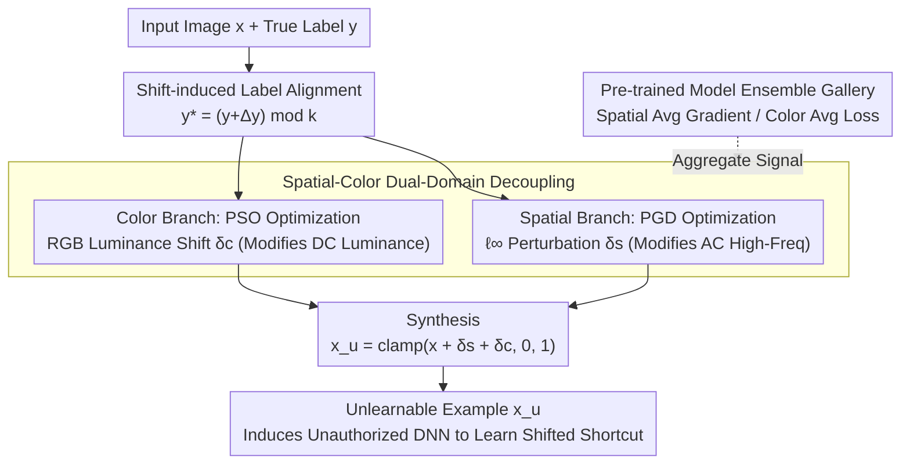

# Dual-branch Robust Unlearnable Examples

**Conference**: ICML 2026  
**arXiv**: [2605.01718](https://arxiv.org/abs/2605.01718)  
**Code**: https://github.com/wxldragon/DUNE (Available)  
**Area**: AI Security / Data Protection / Unlearnable Examples  
**Keywords**: Unlearnable Examples, Data Poisoning, Spatial-Color Dual-Domain, Ensemble Perturbation, Robust Defense

## TL;DR
This paper proposes DUNE, which extends the perturbation of Unlearnable Examples (UEs) from a single spatial domain to a "spatial + color" dual-domain optimization. By aligning perturbation features with shift-induced labels and utilizing pre-trained model ensembles, DUNE maintains robustness against 7 mainstream defenses (including ECLIPSE, ISS-J, and COIN) on CIFAR-10 / ImageNet. The average test accuracy is further reduced by 14.95%–50.82% compared to 12 SOTA UE schemes.

## Background & Motivation

**Background**: Training data crawled from the web makes "unauthorized training of DNNs" a significant risk. Unlearnable Examples (UEs) protect data owners by adding imperceptible perturbations that lead DNNs to learn incorrect shortcut features (perturbation $\leftrightarrow$ label mapping). Prevailing methods (EM, REM, LSP, SEP, CUDA, OPS, etc.) optimize perturbations within an $\ell_p$-norm ball in the spatial domain.

**Limitations of Prior Work**: (1) **Heuristic shortcut**: Methods like CUDA / LSP use empirical convolutional or linear blocks as perturbations, lacking principled optimization and being easily broken by adaptive defenses like COIN; (2) **Domain-constrained**: Single spatial domain perturbations have simple frequency structures, allowing noise-suppression defenses like ISS-J (frequency compression) or ECLIPSE (diffusion purification) to remove them; (3) The radar chart in Fig. 2 shows that existing UEs degrade to near-baseline accuracy under certain defenses, indicating narrow robustness margins.

**Key Challenge**: To be robust, UEs require "perturbation diversity"; however, within a single $\ell_p$ domain, all perturbations share the same frequency structure and distribution family, allowing defenses to remove them in batches once the family is identified. Expanding to multiple domains introduces the optimization challenge of making multi-domain perturbations synergistically establish shortcut mappings.

**Goal**: (1) Design a UE framework capable of simultaneously optimizing perturbations in multiple domains; (2) Ensure multi-domain perturbations are orthogonal/complementary to avoid overlap that compromises stealthiness; (3) Use ensemble learning to enhance the cross-architecture transferability of perturbations.

**Key Insight**: Images can be decomposed into DC components (block mean luminance) + AC components (high-frequency spatial details). Spatial perturbations primarily affect AC, while color perturbations (luminance shifts) primarily affect DC—making them naturally orthogonal. Simultaneously, the perturbation objective is shifted from "aligning with ground-truth labels" to "aligning with shift-induced labels" $y^*=(y+\Delta y)\mod k$, decoupling the learned shortcut from the true labels.

**Core Idea**: The UE optimization is decomposed into two independent sub-problems—the spatial branch uses PGD to optimize $\ell_\infty$ perturbations $\delta_s$, while the color branch uses PSO to optimize RGB three-channel luminance shifts $\delta_c$. Both push features toward shift-induced classes, and a gallery of pre-trained models is used for ensemble enhancement to boost robustness.

## Method

### Overall Architecture
DUNE addresses the pain point where UE perturbations in a single spatial domain have overly simple frequency structures that are easily defeated by frequency compression or diffusion purification. The overall goal remains adding perturbations to induce the model to learn incorrect shortcuts: $\min_{\delta_u}\mathbb{E}_{(x,y)}[\mathcal{L}_{CE}(f_\theta(\psi(x;\delta_u)), y^*)]$, subject to $\delta_u\in\Phi_s\times\Phi_c$, with training labels replaced by shifted $y^*=(y+\Delta y)\mod k$. Crucially, the authors demonstrate that this joint optimization can be decoupled into two independent branches: the spatial branch uses PGD within an $\ell_\infty$ ball to optimize $\delta_s$, and the color branch uses gradient-free PSO to search for RGB luminance shifts $\delta_c$. Both branches aggregate signals from a gallery of pre-trained models to enhance cross-architecture robustness, finally superimposed as $x_u=\text{clamp}(x+\delta_s+\delta_c, 0, 1)$.

### Key Designs

**1. Shift-induced Label Alignment: Making Shortcut Mappings Deterministic**

The optimization goal of traditional UEs is "min loss"—making the model classify perturbed samples into the original class $y$. However, this establishes a shortcut entangled with the true label, which adaptive defenses can reverse. DUNE instead pushes features toward a fixed offset class $y^*=(y+\Delta y)\mod k$, changing the objective to $\mathcal{L}_{CE}(f_\theta(\psi(x;\delta_d)), y^*)$. Since all samples in a class share the same offset $\Delta y$, the entire dataset forms a "uniformly rotated" perturbation $\rightarrow$ label mapping (Fig. 4). The model learns this misaligned shortcut; during testing with clean samples, the shortcut fails and generalization collapses. Compared to randomized targets, this mapping is **deterministic** and explicitly decoupled from original labels, making it more stable and harder for defenders to reverse-engineer.

**2. Spatial-Color Dual-Domain Decoupling: Ensuring Geometric Non-Interference**

Single-domain perturbations are fragile because they share a frequency family that defenses can batch-clear. DUNE splits the perturbation into $\delta_u\triangleq\delta_s\oplus\delta_c$, solving two non-overlapping sub-problems independently. The spatial branch performs $T$ PGD steps, iterating along $g_t=\nabla_{x_i^t}\mathcal{L}_{CE}(f_\theta(x_i^t), y_p^*)$ and clipping $x_i^{t+1}=\text{clip}_{\epsilon}(x_i^t-\beta\cdot\text{sign}(g_t))$. The color branch separates the image into R/G/B channels and adds a luminance shift $\Delta x_r,\Delta x_g,\Delta x_b$ to each, using PSO to find the shift combination that minimizes "ensemble loss + naturalness constraint $\lambda\mathcal{L}_{nc}$", with the entire class sharing one $\delta_c$. The branches are orthogonal because images decompose into DC (mean luminance) and AC (spatial detail): spatial perturbations mostly modify AC, while color shifts modify DC. Thus, ECLIPSE-style Gaussian purification only affects AC, and ISS-J high-frequency compression also only damages AC, leaving the DC color shifts intact—the branches serve as redundant backups, as they do not overlap in the geometric dimensions of the defense.

**3. Pre-trained Model Ensemble: Pulling Perturbations Out of Single-Architecture Overfitting**

Perturbations generated using a single surrogate (e.g., ResNet18) tend to overfit that architecture and fail on others like VGG19. DUNE maintains a gallery of model architectures with different initializations $\{f_{\theta_j}\}_{j=1}^M$. Both branches aggregate signals across this gallery: the spatial branch takes the average gradient $g_t=\frac{1}{M}\sum_j \nabla\mathcal{L}_{CE}(f_{\theta_j}(x), y_p^*)$, and the color branch takes the average loss $\mathcal{L}_{color}=\frac{1}{M}\sum_j\mathcal{L}_{CE}(f_{\theta_j}(x+\delta_c), y_p^*)+\lambda\mathcal{L}_{nc}$. This is equivalent to bringing transferability-boosting techniques from adversarial attacks into the UE domain—averaging gradients across architectures broadens the perturbation’s frequency spectrum, maintaining robustness against unseen defense models.

### Loss & Training
- Spatial Branch: $\mathcal{L}_{CE}(f_\theta(x+\delta_s), y^*)$, $\ell_\infty\le\epsilon$ (CIFAR-10 $\epsilon=8/255$), $T=20$ PGD steps.
- Color Branch: $\mathcal{L}_{color}=\frac{1}{M}\sum_j\mathcal{L}_{CE}+\lambda\mathcal{L}_{nc}$, PSO particle search, aggregated over $N$ samples per class.
- Ensemble Models $M$ typically consists of 3–5 surrogates; shift offset $\Delta y$ is fixed within the number of classes $k$ (CIFAR-10 usually $\Delta y=1$).
- Training Data: CIFAR-10, ImageNet subsets; Evaluation architectures: ResNet18 (intra), VGG19 (cross).

## Key Experimental Results

### Main Results

Test accuracy on CIFAR-10 with ResNet18 training under different defenses (lower is better, indicating more robust UEs), comparing 12 UE schemes across 7 defenses:

| Defense \ UE | EM | REM | CUDA | SEM | **DUNE** |
|----------|-----|-----|------|-----|----------|
| w/o defense | 18.26 | 25.81 | 25.48 | 15.94 | **13.26** |
| AT | 69.72 | 59.12 | 49.32 | 32.43 | **24.96** |
| AA | 82.08 | 45.83 | 40.78 | 39.29 | **19.55** |
| OP | 64.37 | 29.45 | 28.66 | 15.99 | **12.81** |
| ISS-G | 89.09 | 38.87 | 22.89 | 31.94 | **10.18** |
| ISS-J | 78.91 | 81.33 | 43.31 | 81.58 | **28.88** |
| ECLIPSE | 82.07 | 87.16 | 34.18 | 85.82 | **57.49** |
| COIN | 19.49 | 33.67 | 72.02 | 24.22 | **19.21** |
| **AVG** | 63.00 | 51.47 | 39.58 | 40.90 | **23.29** |

VGG19 cross-architecture evaluation (surrogate=ResNet18) also shows DUNE leading comprehensively; DUNE is the only method among 12 to remain consistently below 30% in the AVG column.

### Ablation Study

| Configuration | CIFAR-10 ResNet18 w/o defense | After AT Defense |
|------|--------|--------|
| Spatial branch only (PGD + shift label) | ≈18 | ≈45 |
| Color branch only (PSO + shift label) | ≈25 | ≈40 |
| Dual-branch (no ensemble) | ≈15 | ≈35 |
| **DUNE Full (Dual-branch + ensemble)** | **13.26** | **24.96** |

(Detailed ablation numbers are provided in Table 3 of the paper; trends are summarized here.)

### Key Findings
- **Dual-domain > Single-domain**: Neither branch alone is robust against both ECLIPSE and ISS-J; the dual-branch combination is required to resist both frequency compression and diffusion purification.
- **Smoother loss landscape** (Fig. 3): The loss landscape of models trained with DUNE is significantly smoother than those trained with LSP/EM/REM, indicating that the perturbation distribution is more robust to small fluctuations, consistent with the sharpness $\leftrightarrow$ robustness theory by Pham et al. 2024.
- **Ensemble margin is significant**: Cross-architecture (VGG19) performance degrades most when the model gallery is removed, proving that ensemble is the key to transferability.
- **Robust to adaptive defense**: The authors designed two adaptive defenses (assuming the defender knows the spatial-color domain info), and DUNE maintains low accuracy across four architectures.

## Highlights & Insights
- **Orthogonal Domain Decomposition**: The physical decoupling of DC vs. AC provides a geometric intuition for why the two branches do not interfere, which is more profound than simply adding new loss terms.
- **Shift-induced Label**: Shifting from "minimizing true-label loss" to "aligning with shift-induced labels" is a small but powerful paradigm shift—providing a deterministic rather than random shortcut, making it harder to reverse-engineer.
- **PSO for Color Branch**: Color perturbations have low dimensionality (3 scalars per class), and the gradient is not directly differentiable for hue/luminance operations; the derivative-free nature of PSO is a fitting engineering choice.
- **Ensemble as UE Transferability Booster**: Bringing mature ensemble tricks from the adversarial attack community into UE is a strategy that can be directly migrated to other data poisoning tasks.

## Limitations & Future Work
- Evaluation architectures are relatively small (ResNet18, VGG19); UE robustness on ViTs or large models remains unverified.
- The color branch shares one shift per class, meaning color shifts are identical for samples in the same class, potentially failing under certain hue-based augmentations; personalized color perturbations are a natural extension.
- ECLIPSE (diffusion-based defense) still allows 57.49% test accuracy, suggesting high-quality purifiers are partially effective; future work needs to further counter diffusion models.
- The shift offset $\Delta y$ requires manual selection in multi-class scenarios; $\Delta y=1$ was used without an optimal search, and large class counts (e.g., ImageNet 1000) may need more granular design.
- Computational overhead: Dual-branch + PSO + ensemble makes UE generation 5–10$\times$ slower than single PGD, posing significant costs for large-scale datasets.
- Tested only on image classification; UE designs for tasks like object detection or segmentation have not been explored.

## Related Work & Insights
- **vs. EM (Huang et al. 2021)**: The classic min-min optimization UE pioneer, restricted to a single spatial domain; DUNE is its multi-domain, multi-model robust successor.
- **vs. REM (Fu et al. 2022)**: REM uses tri-level optimization to resist AT but remains in the $\ell_\infty$ domain and fails under ISS-J/ECLIPSE; DUNE solves frequency diversity via dual-domain.
- **vs. CUDA (Sadasivan et al. 2023)**: Heuristic convolutional perturbations easily broken by COIN; DUNE uses principled optimization to avoid heuristic inversion.
- **vs. ECLIPSE/ISS-J style defenses**: DUNE is the first work to extend UEs to spatial+color dual domains to bypass both types of defenses.

## Rating
- Novelty: ⭐⭐⭐⭐ Orthogonal dual-domain decomposition + shift-induced labels are novel and self-consistent designs in the UE field.
- Experimental Thoroughness: ⭐⭐⭐⭐⭐ The matrix of 12 UEs $\times$ 7 defenses $\times$ 2 datasets $\times$ 2 architectures + 2 adaptive defenses is very solid.
- Writing Quality: ⭐⭐⭐⭐ Clear logic chain from motivation to design to experiments; DC/AC physical intuition is well-explained.
- Value: ⭐⭐⭐⭐ Provides a significantly more robust UE tool for data owners with controllable impact on stealthiness.

<!-- RELATED:START -->

## Related Papers

- [\[ICLR 2026\] Why Do Unlearnable Examples Work: A Novel Perspective of Mutual Information](../../ICLR2026/ai_safety/why_do_unlearnable_examples_work_a_novel_perspective_of_mutual_information.md)
- [\[ICML 2026\] Exposing Vulnerabilities in Explanation for Time Series Classifiers via Dual-Target Adversarial Attack](exposing_vulnerabilities_in_explanation_for_time_series_classifiers_via_dual-tar.md)
- [\[ICML 2026\] Hidden in Plain Tokens: Simply Robust, Gradient-Free Watermark for Synthetic Audio](hidden_in_plain_tokens_simply_robust_gradient-free_watermark_for_synthetic_audio.md)
- [\[ICML 2026\] From Prompts to Responses: Dual-Sided Data Leakage and Defense in Split Large Language Models](from_prompts_to_responses_dual-sided_data_leakage_and_defense_in_split_large_lan.md)
- [\[CVPR 2026\] Verifying Neural Network Robustness with Dual Perturbations](../../CVPR2026/ai_safety/verifying_neural_network_robustness_with_dual_perturbations.md)

<!-- RELATED:END -->
