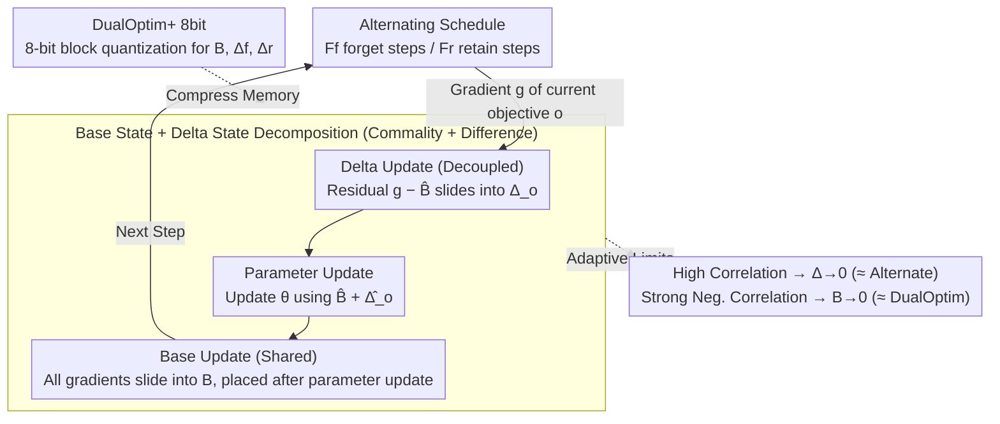

# DualOptim+: Bridging Shared and Decoupled Optimizer States for Better Machine Unlearning in Large Language Models

**Conference**: ICML 2026  
**arXiv**: [2605.21539](https://arxiv.org/abs/2605.21539)  
**Code**: https://github.com/CityU-MLO/DualOptimPlus  
**Area**: LLM Security / Machine Unlearning / Optimizers  
**Keywords**: Machine Unlearning, Optimizer States, Gradient Conflicts, 8-bit Quantization, AdamW

## TL;DR
DualOptim+ decomposes Adam optimizer states into a "shared base state + decoupled delta states," allowing LLM machine unlearning to adaptively transition between shared and decoupled optimizers as forget/retain gradients fluctuate between conflict and synergy. Theoretically, it reduces to Alternate optimization (under positive correlation) and DualOptim (under negative correlation), while an 8-bit quantized variant reduces extra memory overhead back to baseline levels.

## Background & Motivation

**Background**: Machine unlearning (MU) requires models to erase the influence of a forget set while maintaining the utility of a retain set. MU in LLMs relies primarily on the joint optimization of a forget loss $\mathcal{L}_f$ (GA / NPO / ME / RMU) and a retain loss $\mathcal{L}_r$ (CE / KL). Optimization strategies have evolved through three generations:
- **Joint** (single-step backpropagation after summation, the de facto standard prior to DualOptim) — simple, but gradient merging leads to performance degradation.
- **Alternate** (using only one objective's gradient per step, alternating) — alleviates degradation but is sensitive to hyperparameters and unstable.
- **DualOptim** (two independent AdamW optimizers for two objectives, each maintaining its own state) — effective for vision tasks, but gains on LLMs are marginal.

**Limitations of Prior Work**: The authors observe that the cosine similarity between forget/retain gradients in LLM unlearning **fluctuates drastically** during training—positive correlation (signal sharing) in early stages and negative or even orthogonal correlation in later stages. Joint optimization discards adversarial signals by using a single shared state; DualOptim discards synergistic signals through complete decoupling. Both target only one specific correlation pattern, failing to achieve optimal results throughout the LLM training process.

**Key Challenge**: A binary "shared vs. decoupled" choice cannot adapt to the dynamic changes in gradient correlation during LLM training. An ideal optimizer should adaptively transition between the two based on current correlation.

**Goal**: (1) Construct a plug-and-play optimizer framework that dynamically interpolates between shared and decoupled states based on the directional correlation of $\nabla \mathcal{L}_f$ and $\nabla \mathcal{L}_r$; (2) cover scenarios such as fictitious unlearning, real-world unlearning, safety alignment, and multi-tasking; (3) resolve the memory inflation caused by additional optimizer states.

**Key Insight**: Decompose AdamW's first and second moments into a "shared base + per-objective delta"—the base is updated using all gradients (capturing commonalities), while the delta is updated using the "objective gradient − base" (capturing differences). Parameters are updated using the sum of the base and the corresponding delta. This naturally yields an adaptive transition: for high correlation, delta $\to 0$ (degrading to Alternate); for strong negative correlation, base $\to 0$ (degrading to DualOptim).

**Core Idea**: Base/delta decomposition + adaptive transition = an "optimal intermediate between shared and decoupled states" at the optimizer level.

## Method

### Overall Architecture

DualOptim+ aims to allow the LLM unlearning optimizer to slide adaptively between "sharing a single state" and "using independent states" as the correlation between forget/retain gradients changes. It splits every AdamW optimizer state (first moment $m$, second moment $v$) into two layers: a **base state** $B$ shared by all objectives, responsible for capturing directions agreed upon by both forget and retain tasks, and per-objective **delta states** $\Delta_f, \Delta_r$ that store unique, adversarial components. Each step uses the base plus the current objective's delta to update parameters. Combined with an alternating schedule of $F_f$ forget steps and $F_r$ retain steps, the base is updated after parameter updates to maintain a stable shared reference.

### Key Designs

**1. Base and Delta State Decomposition: Splitting states into "Commonality + Difference" layers without losing signals**

As mentioned, Joint optimization merges two objective gradients into one state, smoothing out adversarial signals, while DualOptim fully decouples them, losing synergistic signals. DualOptim+ avoids this binary choice. When updating objective $o$, the base slides with all gradients $B \leftarrow \beta B + (1-\beta)\nabla\mathcal{L}_o$ to learn directions agreed upon by both tasks. The delta only absorbs the residual after subtracting the base: $\Delta_o \leftarrow \beta \Delta_o + (1-\beta)(\nabla\mathcal{L}_o - \hat B)$, capturing the adversarial components unique to that objective. The second moments $v_B, v_{\Delta_o}$ use squared gradients similarly, with bias correction $\hat B = B/(1-\beta^t)$. The final parameter update combines both layers:

$$\theta \leftarrow \theta - \eta\,\frac{\hat B + \hat \Delta_o}{\sqrt{|\hat v_B + \hat v_{\Delta_o}|} + \epsilon}$$

This ensures adversarial signals are not merged (as in Joint) and synergistic signals are not lost (as in DualOptim).

**2. Adaptive Transition: Automatic transition inherent to the optimizer structure without explicit detection**

The most elegant feature of this decomposition is that the relative magnitudes of base and delta change automatically with gradient correlation. Theorem 3.2 provides closed-form limits: let $\mathbb{E}_t[g_{f,t}] = mG$ and $\mathbb{E}_t[g_{r,t}] = nG$. When forget/retain gradients are positively correlated ($m=n$), $B \to mG$ and $\Delta_{f,r}\to 0$, reducing to Alternate (only shared state). Under strong negative correlation ($m = -\frac{1-\beta^{F_r}}{\beta^{F_r}(1-\beta^{F_f})}n$), $B \to 0$ and only the delta remains active, reducing to DualOptim (fully decoupled). Thus, DualOptim+ provides a continuous interpolation between these limits, allowing it to reside at the optimal intermediate point throughout the fluctuations of LLM training.

**3. DualOptim+ 8bit: Quantizing additional states to 8-bit to match vanilla AdamW memory usage**

The base + delta structure roughly doubles the optimizer states compared to vanilla AdamW. The authors employ block-wise quantization from bitsandbytes 8-bit Adam for $B, \Delta_f$, and $\Delta_r$. This compresses the extra overhead back to baseline levels. Performance between the 8-bit and fp32 versions is nearly identical (OVR difference < 0.3 points).

### Loss & Training

The frequency of forget/retain alternation is controlled by $F_f$ and $F_r$, typically set to 1:1. The base update is deliberately scheduled **after** the parameter update to provide a stable shared reference for the delta.

## Key Experimental Results

### TOFU Fictitious Unlearning (Phi-1.5, IDK+GD Objectives)

| Forget Ratio | Method | UFE↑ | TFE↑ | MU↑ | OVR↑ |
|----------|------|------|------|-----|------|
| 10% | Joint | 78.1 | 50.6 | 60.2 | 62.3 |
| 10% | Alternate | 80.7 | 56.8 | 64.5 | 66.6 |
| 10% | DualOptim | 81.2 | 58.3 | 65.0 | 67.4 |
| 10% | **DualOptim+** | **84.8** | **62.7** | **68.1** | **70.9** |
| 10% | DualOptim+ 8bit | 84.5 | 62.4 | 67.9 | 70.7 |

OVR Gain is ~3.5 points; unlearning efficiency (UFE/TFE) and model utility (MU) improve simultaneously without trade-offs.

### Real-world Unlearning & Safety Alignment (Excerpts)

| Task | Data | Joint OVR | DualOptim OVR | **DualOptim+ OVR** |
|------|------|---------|--------------|------|
| WMDP-Bio (Llama 2-7B) | Real Unlearning | 51.2 | 54.7 | **58.9** |
| WMDP-Cyber | Real Unlearning | 49.6 | 52.3 | **56.4** |
| Harm-Refuse | Safety Alignment | 62.8 | 66.1 | **70.2** |

Consistently leads by 4–5 points across tasks.

### Key Findings
- **Gradient correlations fluctuate dynamically**: Figure 2(b) shows cosine similarity swinging between [-0.5, 0.7], proving that static shared or static decoupled strategies are suboptimal.
- **DualOptim+ serves as an appropriate intermediate**: Observed update similarities in the 0.4–0.6 range align with theoretical limits.
- **Quantization is nearly lossless**: The gap between 8-bit and fp32 OVR is < 0.3 points.
- **Cross-optimizer transferability**: The base/delta decomposition is also effective when applied to other optimizers like Muon.

## Highlights & Insights
- **Architectural Adaptivity**: Unlike multi-objective optimization that relies on manual weight scheduling or explicit projections, this method embeds "transitioning" into the optimizer state structure itself.
- **Clean Theoretical Limits**: Theorem 3.2 provides asymptotic behaviors where the boundaries correspond to existing methods (Alternate and DualOptim), offering strong theoretical grounding.
- **Engineering Awareness**: The inclusion of 8-bit quantization makes the method practical for LLM deployment by negating the 2x state memory overhead.
- **Broad Potential**: The base/delta decomposition is essentially a multi-objective optimizer framework, showing promise for RLHF/DPO + KL regularization and multi-expert distillation.

## Limitations & Future Work
- Extension to more than two objectives is non-trivial, as $k$ objectives require $1 + k$ states, further inflating memory.
- $F_f$ and $F_r$ remain manual hyperparameters; automated scheduling based on real-time correlation would be ideal.
- Evaluations are primarily on models under 7B (Phi-1.5, Llama-2-7B); effects on 70B+ models remain untested.

## Related Work & Insights
- **vs. DualOptim**: DualOptim fully decouples states and loses synergistic signals; DualOptim+ introduces a shared base for adaptive transition.
- **vs. Joint / Alternate**: These are single-point strategies (degraded or shared), whereas DualOptim+ represents a continuous family of states.
- **Insight**: Any training problem involving multiple objectives with dynamic correlations can benefit from base/delta decomposition, turning the "share vs. decouple" decision from a hyperparameter into a mathematical automation.

## Rating
- Novelty: ⭐⭐⭐⭐
- Experimental Thoroughness: ⭐⭐⭐⭐⭐
- Writing Quality: ⭐⭐⭐⭐
- Value: ⭐⭐⭐⭐

<!-- RELATED:START -->

## Related Papers

- [\[ICML 2026\] Forget to Know, Remember to Use: Context-Aware Unlearning for Large Language Models](forget_to_know_remember_to_use_context-aware_unlearning_for_large_language_model.md)
- [\[ICML 2026\] COFT: Counterfactual-Conformal Decoding for Fair Chain-of-Thought Reasoning in Large Language Models](coft_counterfactual-conformal_decoding_for_fair_chain-of-thought_reasoning_in_la.md)
- [\[ICML 2026\] BYORn: Bootstrap Your Own Responses to Defend Large Vision-Language Models Against Backdoor Attacks](byorn_bootstrap_your_own_responses_to_defend_large_vision-language_models_agains.md)
- [\[ICML 2026\] The Unlearnability Phenomenon in RLVR for Language Models](the_unlearnability_phenomenon_in_rlvr_for_language_models.md)
- [\[ICML 2026\] Differentially Private Preference Data Synthesis for Large Language Model Alignment](differentially_private_preference_data_synthesis_for_large_language_model_alignm.md)

<!-- RELATED:END -->
