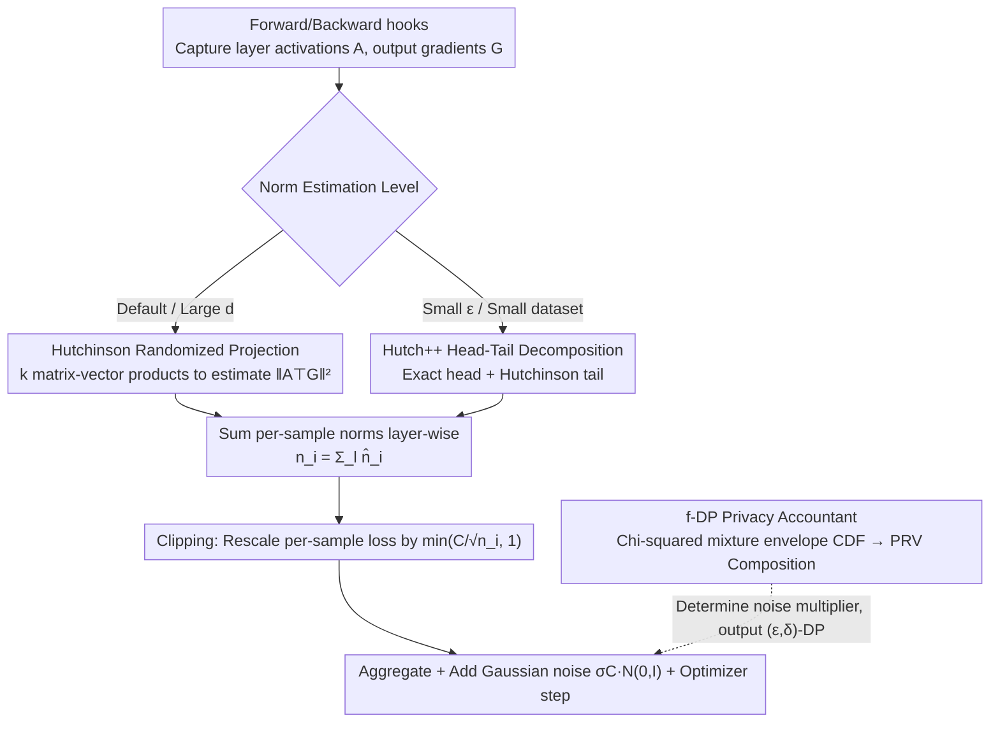

# Efficient DP-SGD for LLMs with Randomized Clipping

**Conference**: ICML 2026  
**arXiv**: [2605.24879](https://arxiv.org/abs/2605.24879)  
**Code**: None  
**Area**: LLM Security / Differential Privacy / Efficient Training  
**Keywords**: DP-SGD, Randomized Clipping, Stochastic Trace Estimation, Hutchinson, Long-context LLM

## TL;DR
This paper proposes DP-SGD-RC, which replaces the exact per-sample gradient norm computation in DP-SGD with Hutchinson / Hutch++ stochastic trace estimation. This reduces the clipping memory overhead for long-context LLM training from $O(B\min\{T^2,d^2\})$ to $O(BkT+kp)$. Accompanied by a tight $f$-DP analysis based on a chi-squared mixture envelope CDF, the method maintains accuracy in Llama-3.2-1B long-context fine-tuning while reducing peak memory of the largest linear layer by approximately 40% and saving about 2× FLOPs.

## Background & Motivation

**Background**: DP-SGD is the de facto standard for providing provable privacy protection in LLM training. It adds two operations to standard SGD: per-sample gradient clipping and Gaussian noise addition. To avoid the astronomical memory overhead of $O(BLd^2)$ in naive implementations, the community mainly relies on Fast Gradient Clipping (FGC, $O(Bd^2)$) and Ghost Clipping (GC, $O(B)$ for linear-like layers) to keep DP-SGD computing costs close to non-private training.

**Limitations of Prior Work**: The aforementioned memory savings only hold for "non-sequential" inputs. For text inputs with sequence length $T$, the memory complexity of the best of FGC and GC degrades to $O(B\min\{d^2,T^2\})$. Frontier LLMs often have contexts of $O(100\text{K})$, and this "quadratic" overhead directly hits the limits of GPU capacity; even fine-tuning a 1B model with a 4K context becomes constrained.

**Key Challenge**: The bottleneck of DP-SGD is not the noise addition but "calculating the exact per-sample gradient norm $\|A_i^\top G_i\|_F^2$." This step requires explicitly storing either gradients ($d^2$) or matrices like $AA^\top$ or $GG^\top$ ($T^2$). As long as "exact norms + strict clipping" are pursued, the quadratic term in sequence length remains inescapable.

**Goal**: To reduce the memory and computational overhead of long-context DP-SGD from $T^2/d^2$ magnitude to $O(BkT)$, comparable to non-private training, without significant privacy or utility costs. This requires simultaneously solving three things: (i) finding a mathematically equivalent but memory-efficient way to calculate the norm; (ii) performing a new privacy analysis for the "randomized" clipping; and (iii) integrating the analysis into a functional numerical accountant.

**Key Insight**: The authors rewrite the norm calculation as a trace estimation—$\|A^\top G\|_F^2 = \mathrm{trace}(G^\top AA^\top G)$. Once viewed as a trace, classical stochastic trace estimators (Hutchinson, Hutch++) can be used to approximate it using only $k$ "matrix-vector products," compressing the storage to $O(k(T+d+p))$, where $k\approx 32$ is sufficient.

**Core Idea**: Replace the "exact norm + deterministic clipping" of DP-SGD with "stochastic trace estimated norm + same clipping rule." Analyze the privacy loss of this "clipping scale randomization" in $f$-DP form, and finally use a PRV-based numerical accountant to output standard $(\varepsilon, \delta)$-DP.

## Method

### Overall Architecture
DP-SGD-RC does not reinvent DP-SGD but modifies only the most expensive step. The original DP-SGD performs a "first backward pass to calculate each sample's gradient norm → rescale each per-sample loss by $\min(C/\sqrt{n_i}, 1)$ → second backward pass for aggregation + noise addition + optimizer step." Its memory bottleneck lies entirely in "exact norm calculation." This paper replaces that step with stochastic trace estimation: for each linear-like layer, a forward hook obtains the activation $A\in\mathbb{R}^{B\times T\times d}$ and a backward hook obtains the output gradient $G\in\mathbb{R}^{B\times T\times p}$. A norm estimation routine (defaulting to Hutchinson, switching to Hutch++ for small $\varepsilon$) returns an approximation $\hat n_i^{(l)}$. These are summed layer-wise to get $n_i=\sum_l \hat n_i^{(l)}$, while the rest of the process remains unchanged. The implementation uses forward/backward hooks with only one pass per layer, costing 1 forward + 2 backward passes—comparable to FGC, but with significantly lower peak memory. A new $f$-DP privacy accountant quantifies the privacy loss from "randomized clipping scales" to set the noise multiplier.

### Key Designs

**1. Hutchinson Randomized Projection for Norm Estimation: Diluting "Exact Norm" into $k$ Matrix-Vector Products**

The root of quadratic memory in DP-SGD is calculating the exact layer norm $\|A^\top G\|_F^2$—either by explicitly storing $d\times p$ per-sample gradients ($O(d^2)$) or explicitly storing $T\times T$ intermediate matrices ($O(T^2)$). Both are prohibitive for long contexts. The key observation is that DP-SGD only needs the "norm" scalar, which does not need to be exact. After rewriting the norm as a trace $\|A^\top G\|_F^2 = \mathrm{trace}(G^\top AA^\top G) = \mathrm{trace}(O)$, one can apply the Hutchinson estimator $\widehat{n} = \mathrm{trace}(P^\top OP) = \|(P^\top G^\top)^\top A\|_F^2$, where the projection matrix $P\in\mathbb{R}^{p\times k}$ and $P_{uv}\sim\mathcal{N}(0, 1/k)$. Implementation-wise, one calculates $Y = A^\top(GP)$ then takes $\|Y\|_F^2$. This avoids constructing per-sample gradients or $T\times T$ matrices, reducing intermediate storage per layer from $O(\min\{d^2, T^2\})$ to $O(k(T+d+p))$. Classical analysis guarantees $k=O(\log(1/\beta)/\alpha^2)$ for $(1\pm\alpha)$ relative accuracy; $k=32$ is sufficient in experiments. This eliminates the quadratic terms for both sequence length $T$ and layer widths $p, d$.

**2. Hutch++ Head-Tail Decomposition: Reducing Variance for Small $\varepsilon$**

At small $\varepsilon$, noise is high and more sensitive to norm error, making Hutchinson's variance a weakness. Hutch++ splits the spectrum of $O=(A^\top G)(A^\top G)^\top$ into "head" and "tail": it first uses a set of random matrices $S$ to estimate an orthonormal basis $Q$ for $\mathrm{Col}(OS)$ for a low-rank approximation $\mathrm{trace}(Q^\top OQ)$ to handle the "head" precisely, then runs Hutchinson only on the "tail" in the residual subspace $(I-QQ^\top)$. The estimate is $\|(QG^\top)A\|_F^2 + \|(PG^\top)A - (((PG^\top)A)Q)Q^\top\|_F^2$. Theoretically, the error improves from $O(\log(1/\beta)/\alpha^2)$ to $O(\sqrt{\log(1/\beta)}/\alpha)$. The cost is $3\times$ more matrix-vector multiplications and one QR decomposition, so it is not the default: when $d$ is large, the privacy envelopes of Hutch and Hutch++ nearly overlap, making the faster Hutch more efficient. However, in extreme scenarios like the BBC dataset with $\varepsilon=0.7$, Hutch++ acts as a mild regularizer due to lower variance, improving accuracy from 64.3% to 70.6%.

**3. $f$-DP Privacy Accountant based on Chi-Squared Mixture Envelopes: Enabling Randomized Clipping**

Once the clipping scale is randomized, although the noise remains Gaussian, the "scale" is random, so traditional RDP/PRV accountants cannot be directly applied. This paper explicates this randomness: single-step privacy analysis reduces to a trade-off function $T(Z, \mathcal{N}(Z/\sigma, 1) \,\|\, Z, \mathcal{N}(0, 1))$, where $Z = \|Q_0\|/R(Q_0)$ is the "true norm divided by the estimated norm." For Hutchinson, $Z^2(\lambda) \sim \|\lambda\|_1 / \sum_i \lambda_i \chi^2(k)$ depends on the spectrum $\lambda$ of the gradient. Using stochastic ordering and majorization tools, authors prove that over the simplex $\lambda\in\Delta^{d-1}$, the envelope CDF has a three-segment structure—an equal-weighted $\chi^2$ mixture on the left, a two-element mixture $\frac{\lambda}{ik}\chi^2(ik) + \frac{1-\lambda}{jk}\chi^2(jk)$ in a narrow middle interval, and a single $\chi^2$ on the right—and provide a bisection algorithm to determine the boundaries. Once the distribution of $Z$ (envelope CDF) is calculable, the problem reduces to calculating weighted integrals of two $\Phi$ functions. The Gaussian kernel is integrated by parts against the envelope CDF to obtain $\alpha(t), \beta(t)$, which then pass through PRV / subsampling amplification / composition to output $(\varepsilon, \delta)$-DP. During derivation, they found and corrected a bug in a 2003 theorem by Székely–Bakirov regarding chi-squared mixture envelopes.

### Loss & Training
The training objective is identical to DP-SGD: the original task loss (categorical cross-entropy / NLL) plus $\ell_2$ clipping of per-sample gradients to threshold $C$, followed by adding isotropic Gaussian noise $\sigma C \cdot \mathcal{N}(0, I)$. Optimizers used are SGD or Adam. Experiments set $\delta \in \{10^{-5}, 10^{-6}\}$, $\varepsilon \in \{0.7, 2, 9\}$, $k=32$, and a fixed context length of 4096, covering both full fine-tuning and LoRA.

## Key Experimental Results

### Main Results

Full fine-tuning of Llama-3.2-1B, mean and standard deviation across 3 random seeds:

| Dataset (Task) | Metric | Non-private | DP-SGD (FGC) $\varepsilon=9$ | DP-SGD-RC ($k=32$) $\varepsilon=9$ | DP-SGD $\varepsilon=2$ | DP-SGD-RC $\varepsilon=2$ |
|---|---|---|---|---|---|---|
| BBC (Classification) | Acc ↑ | 95.20±0.51% | 96.33±0.59% | 96.40±0.22% | 94.06±0.12% | 95.60±0.37% |
| BillSum (Summary) | ROUGE-1 ↑ | 0.4928±0.0027 | 0.4882±0.0011 | 0.4864±0.0013 | 0.4831±0.0005 | 0.4796±0.0018 |
| HotpotQA (QA) | EM ↑ | 61.06±0.39% | 61.44±0.05% | 61.42±0.08% | 61.35±0.03% | 61.31±0.09% |

LoRA fine-tuning yields similar results: BBC drops < 0.4%, BillSum ROUGE drops 0.005, magnitudes consistent with full fine-tuning.

### Ablation Study

Hutch vs Hutch++ under low budget $\varepsilon=0.7, \delta=10^{-5}$ (BBC Full Fine-tuning):

| Method | Proj. Dim $k$ | Noise Multiplier | Accuracy (%) |
|---|---|---|---|
| DP-SGD (FGC) | N/A | 4.073 | 67.07±5.26 |
| DP-SGD-RC w/ Hutch | 32 | 4.354 | 64.29±6.77 |
| DP-SGD-RC w/ Hutch++ | 32 | 4.354 | **70.59±3.49** |

Efficiency Ablation (Llama-3.2-1B largest linear layer $8192\times 2048$, $T=4096$, $k=32$, relative to DP-SGD baseline):

| Metric | Hutch Savings | Hutch++ Savings |
|---|---|---|
| Peak Memory (inc. inputs) | 39.18% | 38.57% |
| Peak Memory (exc. inputs) | 99.22% | 97.65% |
| FLOPs (Max layer / Min layer) | 98.05% / 92.19% | 92.17% / 68.69% |
| Latency (A100 80GB) | ≈3× faster than Hutch++ | — |

### Key Findings
- **Norm estimation precision is not always better**: In small $\varepsilon$ regions, Hutch++ is an order of magnitude more accurate than Hutch (Fig. 11), but authors argue the noisy norm acts as a form of regularization; thus, Hutch++ outperforms Hutch by 6 percentage points at $\varepsilon=0.7$. For $\varepsilon \ge 2, d \gtrsim 128$, the envelopes merge, making Hutch more cost-effective.
- **Memory saving ceiling is determined by the projection matrix**: When $k$ increases to 4096, the random projection matrix $P\in\mathbb{R}^{p\times k}$ begins to consume significant memory, negating savings. Authors suggest 1-bit $\{-1, +1\}$ matrices (Achlioptas style) could further compress this.
- **Larger layers benefit more**: The $8192\times 2048$ layer achieves ~40% peak memory savings, while the $2048\times 512$ layer saves only ~15%. This implies the method will be more advantageous for frontier-scale LLMs.

## Highlights & Insights
- **"Per-sample norm" recast as "trace estimation"**: Translating "per-sample gradient norm"—a long-standing engineering bottleneck in DP-SGD—into trace estimation allows for 30 years of stochastic linear algebra tools to be applied. This perspective of mapping private ML sub-problems to linear algebra is highly reusable.
- **Tight $f$-DP analysis template for randomized clipping**: Their "envelope CDF + PRV numerical integration" pipeline is generalizable. By replacing the distribution of $Z$, one can integrate any "Gaussian noise with randomized scale" mechanism into existing accountants.
- **Correction of Székely–Bakirov (2003)**: Authors use simulation counter-examples in Appendix B.6 to show the old theorem's characterization of the middle interval envelope was incorrect and provide the correct three-region form—a mathematical byproduct useful for anyone dealing with chi-squared mixture distributions.

## Limitations & Future Work
- **Conservative Hutch++ privacy analysis**: To remain tractable, authors assume the adversary knows the internal state of the head low-rank estimate, resulting in a conservative noise multiplier. Relaxing this could make Hutch++ superior in medium $\varepsilon$ regimes.
- **Memory benefits unique to linear-like layers**: Attention, convolutional, and linear layers benefit $O(k(T+d+p))$, but RMSNorm / element-wise / custom operators still require explicit per-sample gradient construction.
- **Projection matrix as Achilles' heel**: At $k\ge 4096$, the matrix itself occupies substantial memory. Future work involves 1-bit or sparse hashing projections, requiring recalculation of the envelope CDF.
- **Modest experimental scale**: Evaluation was limited to Llama-3.2-1B and context 4096; the method's superiority should theoretically maximize at $T \gg d$ (e.g., 100K context), which remains unverified.

## Related Work & Insights
- **vs DP-SGD-JL (Bu et al., 2021)**: DP-SGD-JL applies JL projections on flattened gradients for $T=1$. This paper targets $T>1$ by projecting on the factorized form $A^\top G$, requiring 1 forward + 2 backward passes instead of $k+1$ passes. It is a strict generalization for sequential data.
- **vs Fast Gradient Clipping (FGC, Lee & Kifer 2021)**: FGC avoids explicit per-sample gradients via loss rescaling but still materializes gradients by layer ($O(BTd^2)$). DP-SGD-RC eliminates this "materialization," removing the quadratic terms.
- **vs Ghost Clipping (GC, Li et al. 2021)**: GC calculates norms at $O(BT^2)$, becoming inefficient for long contexts. DP-SGD-RC is an orthogonal approach—trading approximation for memory—and can be combined with engineering optimizations like Book-keeping.

## Rating
- Novelty: ⭐⭐⭐⭐⭐ Maps per-sample norm to trace estimation; first to remove $T^2/d^2$ terms for long-context DP-LLMs.
- Experimental Thoroughness: ⭐⭐⭐⭐ Llama-3.2-1B across various tasks and $\varepsilon$; complete memory/FLOPs ablation; lacks frontier-scale (70B+) validation.
- Writing Quality: ⭐⭐⭐⭐ Independent yet cohesive sections for algorithm, analysis, and accounting; high formula density in the privacy section.
- Value: ⭐⭐⭐⭐⭐ Directly loosens the engineering bottleneck for long-context DP-LLMs; the envelope-CDF + PRV template is highly reusable.

<!-- RELATED:START -->

## Related Papers

- [\[ICML 2026\] Gradient Transformer: Learning to Generate Updates for LLMs](gradient_transformer_learning_to_generate_updates_for_llms.md)
- [\[ICML 2026\] Multilingual Unlearning in LLMs: Transfer, Dynamics, and Reversibility](multilingual_unlearning_in_llms_transfer_dynamics_and_reversibility.md)
- [\[ICML 2026\] Position: Uncertainty Quantification in LLMs is Just Unsupervised Clustering](position_uncertainty_quantification_in_llms_is_just_unsupervised_clustering.md)
- [\[ICML 2026\] Old Habits Die Hard: How Conversational History Geometrically Traps LLMs](old_habits_die_hard_how_conversational_history_geometrically_traps_llms.md)
- [\[ICLR 2026\] INO-SGD: Addressing Utility Imbalance under Individualized Differential Privacy](../../ICLR2026/ai_safety/ino-sgd_addressing_utility_imbalance_under_individualized_differential_privacy.md)

<!-- RELATED:END -->
