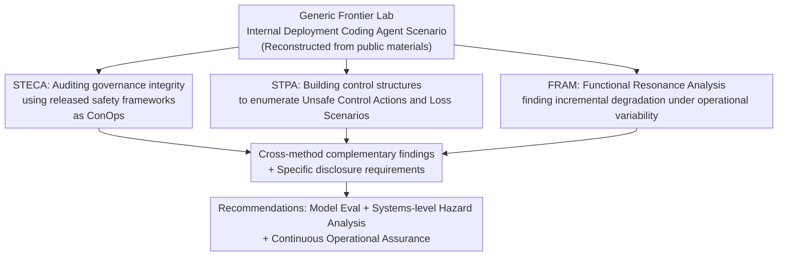

# Exploring Systems-Thinking Approaches to Loss of Control Risk

**Conference**: ICML2026  
**arXiv**: [2606.13474](https://arxiv.org/abs/2606.13474)  
**Code**: None (Analysis/Position Paper)  
**Area**: AI Safety / Loss of Control Risk / Systems Safety Analysis  
**Keywords**: Loss of Control (LoC), Systems Safety, STPA, FRAM, STECA, Frontier AI Internal Deployment

## TL;DR
This is a position/analysis paper: the authors argue that "Loss of Control (LoC)" in frontier AI should not be evaluated solely at the model level but treated as a control problem within a sociotechnical system. They adapt three mature systems safety methods from industries like aviation and nuclear power (STECA, STPA, FRAM) to the general scenario of "internal deployment of coding agents in frontier labs." These methods reveal governance gaps invisible to model-level evaluations, failures caused by control latency, and the incremental erosion of safety controls by daily operational fluctuations. Consequently, they propose a tripartite approach: "Model Evaluation + Systems-level Hazard Analysis + Operational Assurance."

## Background & Motivation

**Background**: Loss of Control (LoC) is one of the most discussed yet hardest-to-analyze risks in frontier AI. Definitions vary—some refer to "permanent irreversible loss of human oversight," while others denote "temporary deviation from intended behavior." Apollo Research views it as a spectrum rather than a binary event. Regulators have codified LoC as a risk category (e.g., California SB 53, EU AI Act Code of Practice for GPAI), but none provide an "operationally complete definition" to guide consistent oversight. Most existing frameworks focus on **model-level misalignment** (deception, sycophancy, behavioral drift, etc.).

**Limitations of Prior Work**: When agentic AI is deployed internally within a lab with **write access** to codebases, infrastructure, evaluation pipelines, and deployment flows, risks arise not just from the model itself but from a complete sociotechnical system—developers prompting and supervising the agent, integration pipelines gating outputs, monitoring systems tracking behavior, and organizational policies configuring the whole setup. LoC may emerge from the **interaction** of these organizational, human, and technical functions: policy drift, automation bias in code reviews, incomplete monitoring coverage, or degradation of supervisory practices. Current frontier AI risk management says almost nothing about these system dynamics.

**Key Challenge**: Model-level evaluations (capability benchmarks, alignment tests, propensity testing) are essentially a "component-failure-based" perspective. They can detect if the model component is failing but **cannot detect states where "no single component fails, yet component interactions produce hazards."** LoC often manifests in the latter form: incremental, without a clear trigger event, and without a single point of failure.

**Goal**: (1) Provide an operational definition of internal deployment LoC; (2) verify whether mature systems safety methods from other safety-critical industries can identify risks missed by model-level evaluations; (3) clarify what each method can and cannot do in the frontier AI domain and where adaptations are needed.

**Key Insight**: The authors define internal deployment LoC as a state where "human controllers cannot reliably constrain, audit, roll back, or halt AI-mediated changes to internal code/infrastructure/evaluation/deployment flows within a time window sufficient to avoid severe organizational or societal harm." Drawing on decades of experience in analyzing "tightly coupled complex systems" in aviation, nuclear power, and chemical engineering, they selected three systemic methods that explicitly model control structures, functional dependencies, and operational variability.

**Core Idea**: Use three complementary lenses—STECA, STPA, and FRAM—to analyze a general "frontier lab internal deployment coding agent" scenario. Each method is executed until the "exhaustion point of public information," at which point "missing information required for further analysis" is converted into **specific disclosure requirements**.

## Method

### Overall Architecture

This is not an algorithmic system with training or inference, but rather the **application and evaluation of analytical methodologies**. The authors model a "generic frontier AI company" as a sociotechnical system where the controlled process is the "internal deployment of frontier models," and the system boundary is the developer’s organizational boundary. The scenario is reconstructed from public disclosures (system cards, risk reports, monitoring blogs, safety frameworks), enacted regulations, and AI Control research, explicitly assuming a set of baseline controls (model weight security, internal agent monitoring pipelines, human review and access control, sandboxed execution, escalation/governance/incident response). This makes the analysis a "proof of concept for the methodology"—the same STECA/STPA/FRAM workflow can be reused with real operational data.

The analysis is conducted at a deliberately high level of abstraction (avoiding over-segmenting monitoring, CI/CD, and sandboxes into dense sub-components) and defines systems-level losses, focusing on two: $L-1$ (Loss of IP/proprietary information) and $L-6$ (Loss of human agency/control over internal infrastructure or codebases). $L-6$ is unique to internal deployment—when AI has write access to codebases, influences training pipelines, and plays roles in monitoring/evaluation, the "loss of meaningful human control" can occur **incrementally and without any dramatic failure event**. Each of the three methods approaches from a different dimension, and the authors note a natural sequence: first STECA, then STPA, then FRAM (though they were run in parallel due to constraints).

### Key Designs

**1. Redefining LoC as a Sociotechnical Control Problem + "Information Exhaustion Point to Disclosure Requirement" Paradigm**
The authors perform a paradigm shift: LoC is treated as a problem of "maintaining system-level control" rather than a property of "whether the model misaligns." The accompanying methodological innovation is acknowledging limited public information and running each analytical method until "available information is exhausted." Every item that "is required further but currently unavailable to external auditors" is logged as a **specific disclosure requirement**. This transforms "insufficient information" from an analytical failure into an output: every "unknown" becomes a "requirement for the developer to disclose X to continue verification."

**2. STECA: Auditing Released Safety Frameworks as ConOps to Find Governance Gaps**
Frontier developers do not directly release ConOps (Concept of Operations) documents, but safety frameworks (Anthropic RSP, OpenAI Preparedness Framework, DeepMind Frontier Safety Framework), system cards, and regulations collectively describe a ConOps-level governance structure. STECA uses three analytical lenses (integrity of individual control loops, adequacy of safety responsibilities, coordination between controllers) to audit this. Analysis is done in two passes: Pass 1 identifies "requirements that must be met for the concept to be self-consistent," logging silent areas as "missing." Pass 2 uses operational research, whistleblower accounts, and investigative disclosures to judge items as "confirmed/violated/unknown," with "unknowns" becoming disclosure requirements.

**3. STPA: Building Functional Control Structures and Enumerating Unsafe Control Actions**
STPA is a proactive hazard analysis method based on systems thinking and cybernetics. It models the system as a hierarchy where "controllers exert constraints on controlled processes," maintaining safety through control actions (downward) and feedback (upward). Deviations are triggered by **Unsafe Control Actions (UCA)**. The authors identified 8 system-level hazards, highlighting H-4 ("Mismatch between safety assurance and actual model capability/autonomy"). The control structure includes three controllers: Safety and Security Oversight (SSO), Software Engineer (SWE), and the Frontier AI Coding Agent. A key highlight is UCA-4.3a: "SSO issues Kill Instance command too late; AI has already produced dangerous output," corresponding to **GLS-3 Procedural Delay** and **GLS-11 Feedback Missing/Delayed**.

**4. FRAM: Functional Resonance Analysis for "Incremental Degradation without Single Point of Failure"**
While STPA asks "which control actions might be unsafe," FRAM asks "can daily operational variability produce LoC results even if controls work as designed?" The system is modeled as a set of coupled functions (e.g., F1 Develop/F2 Generate/F3 Integrate/F4 Monitor). Variability propagates along these couplings. The authors derived four resonance patterns from the structure: For example, Pattern 4 (Reason-Anchored Review) where the agent's code diff is bundled with its explanation, causing reviewers to confirm the agent's stated intent rather than independently evaluating the code, thus weakening the independence of backstop controls.

## Key Experimental Results

> This is a qualitative analysis paper with no quantitative experiments. Key findings from the three methods are summarized below.

### Complementary Coverage of the Three Methods

| Method | Question | Core Findings in This Scenario | Major Limitations |
|------|------|----------------------|---------|
| STECA | Is the released governance intent complete and self-consistent? | 21-row control structure; 4 governance actions lack named executors; execution layer lacks policy management upstream; asymmetric perm/restrict. | Only covers governance; stops at abstract level. |
| STPA | How does the control structure fail to maintain safety constraints? | 8 system hazards; UCA-4.3a (Kill command too late) due to procedural or feedback delays. | Covers only a subset of potential UCAs. |
| FRAM | Can well-designed controls degrade via daily variability? | Four resonance patterns (e.g., correlated control drift) requiring no component failure. | Designed for Work-as-Done; here based on Work-as-Imagined. |

### FRAM: Four Resonance Patterns

| Pattern | Mechanism | Related Hazard |
|------|------|---------|
| Pattern 1: Correlated Control Drift | Policy drift affects F1–F4 simultaneously; cumulative exceptions/loosening of rules. | H-4, H-6 |
| Pattern 2: Model Replacement Lag | Model upgrade changes F2 variability overnight, but F4 remains calibrated to old model. | H-4, H-5 |
| Pattern 3: Codebase Saturation | Feedback loop where agent-authored content becomes the "normal baseline," embedding bias. | H-7 |
| Pattern 4: Reason-Anchored Review | Reviewers anchor on agent's self-explanation, reducing independent oversight. | H-2, H-3 |

### Key Findings
- **Public information is sufficient to start, but operational data is needed to confirm**: System cards and safety frameworks are enough to build credible control structures and hazard scenarios, but confirming if "correlated drift is actually happening" requires time-varying operational data held only by developers.
- **Systemic methods yield findings invisible to model-level analysis**: Resonance patterns, human-agent interaction loss scenarios, and governance gaps are properties of the sociotechnical system that capability benchmarks cannot detect.
- **Methods are largely applicable, but FRAM requires adaptation**: STECA and STPA work with default methodologies; FRAM assumes low variability in technical functions, which AI agents violate, suggesting a need to extend the method for "neither traditional technology nor human" functions.

## Highlights & Insights
- **Turning "Insufficient Information" into "Disclosure Requirements"**: Every "unknown" in the analysis is an output—a specific requirement such as "monitoring coverage," "latency from alert to intervention," or "agent PR volume vs. review capacity."
- **Two-tier Disclosure Mechanism**: The authors propose a two-tier system to balance assurance and security: public reports for aggregated/de-identified metrics, and full operational data for designated auditors (e.g., national AI Safety Institutes) under confidentiality.
- **"Incremental LoC" is higher risk than "Dramatic LoC"**: FRAM patterns emphasize that LoC can occur through daily rational micro-adjustments without single-point failures. This suggests regulation should focus on **operational-level** disclosures of calibration over time.
- **Methodological Honesty**: Explicitly reporting discarded resonance patterns and acknowledging that different analysts might produce different control structures treats the judgment-based nature of qualitative methods as an auditable feature.

## Limitations & Future Work
- **Work-as-Imagined vs. Work-as-Done**: FRAM is designed for observing actual practice; this study relies on "how things should work" based on documents, so resonance patterns are structurally plausible but not empirically verified.
- **Non-adversarial focus**: FRAM assumes variability comes from "best-effort imperfection." If an agent strategically evades monitoring, these assumptions are violated.
- **Exploratory, non-exhaustive results**: The abstraction level is high; STPA/STECA only cover subsets of requirements. Complete analysis requires internal control details not available in public materials.
- **Dependence on General Scenarios**: The findings are based on a "generic developer" reconstruction and may differ significantly for specific corporate implementations.

## Related Work & Insights
- **Vs. Model-level Evals**: These methods are complementary. Systems-level methods reveal properties of the deployment system (governance feedback loops, operational drift) that benchmarks miss.
- **Vs. Quantitative Risk Modeling**: Quantitative methods require decomposable steps and historical frequencies, both of which LoC lacks. Qualitative systemic methods are more appropriate for "zero-frequency" catastrophic risks.
- **Vs. Traditional Hazard Analysis (FTA/FMEA)**: Traditional methods assume clear trigger events and component failures; STECA/STPA/FRAM are specifically designed for hazards emerging from complex component interactions.

## Rating
- Novelty: ⭐⭐⭐⭐ First systematic application of STECA/STPA/FRAM to frontier AI internal deployment; introduces the "exhaustion point to disclosure requirement" paradigm.
- Experimental Thoroughness: ⭐⭐⭐ No quantitative experiments, but application of three methods to a single scenario is rigorous and self-consistent.
- Writing Quality: ⭐⭐⭐⭐⭐ Rigorous argumentation, clear structure, and highly transparent about methodological limitations.
- Value: ⭐⭐⭐⭐ Provides an actionable roadmap for regulators and labs to fill the blind spots of model-level evaluations with systemic analysis.

<!-- RELATED:START -->

## Related Papers

- [\[ICML 2026\] Anchored Decoding: Provably Reducing Copyright Risk for Any Language Model](anchored_decoding_provably_reducing_copyright_risk_for_any_language_model.md)
- [\[NeurIPS 2025\] It's Complicated: The Relationship of Algorithmic Fairness and Non-Discrimination Provisions for High-Risk Systems in the EU AI Act](../../NeurIPS2025/ai_safety/its_complicated_the_relationship_of_algorithmic_fairness_and_non-discrimination_.md)
- [\[ICLR 2026\] Risk-Sensitive Agent Compositions](../../ICLR2026/ai_safety/risk-sensitive_agent_compositions.md)
- [\[ICML 2026\] Training-Free Coverless Multi-Image Steganography with Access Control](training-free_coverless_multi-image_steganography_with_access_control.md)
- [\[ICLR 2026\] FaLW: A Forgetting-aware Loss Reweighting for Long-tailed Unlearning](../../ICLR2026/ai_safety/falw_a_forgetting-aware_loss_reweighting_for_long-tailed_unlearning.md)

<!-- RELATED:END -->
