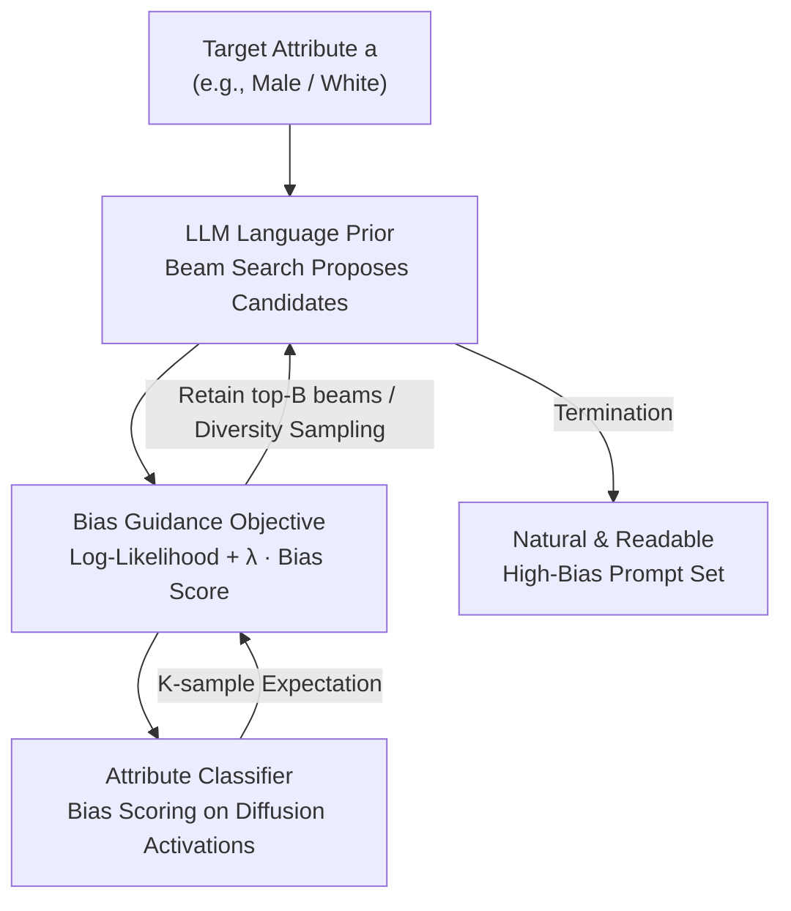

# Exposing Hidden Biases in Text-to-Image Models via Automated Prompt Search

**Conference**: ICML2026  
**arXiv**: [2512.08724](https://arxiv.org/abs/2512.08724)  
**Code**: TBD  
**Area**: AI Safety / Bias Auditing  
**Keywords**: Text-to-Image Bias, Automated Prompt Search, Gradient-free Decoding, Fairness Auditing, Diffusion Models

## TL;DR
This paper proposes BGPS (Bias-Guided Prompt Search), which utilizes a lightweight attribute classifier trained on internal activations of a diffusion model to guide the beam search decoding of an LLM. It automatically generates prompts that are naturally readable yet steer generated images significantly toward specific genders/ethnicities, exposing hidden biases in text-to-image models (including debiased ones) that are difficult for humans to conceive.

## Background & Motivation
**Background**: Text-to-Image (TTI) diffusion models (e.g., SD 1.5, SDXL, Flux, DALL·E) produce impressive image quality but have been repeatedly shown to replicate or even amplify social biases regarding gender, race, and age. Existing practices for evaluating and mitigating these biases rely heavily on **manually or LLM-curated prompt datasets**: either hand-writing test prompts like "a photo of a {profession}" or using an LLM to generate a batch, followed by statistical analysis of demographic distributions in the generated images.

**Limitations of Prior Work**: Curation has two major flaws. First, it is costly. Second, it **covers only a small fraction of the prompt space**, failing to identify "unobtrusive but bias-triggering" prompts. The paper provides an intuitive example: "an engineer mentally focusing on a complex design problem, with a serious expression and wearing glasses" generates 100% male faces on SD 1.5, while "a doctor with compassionate eyes, warm smile, hands gently folded" generates 85% females. These biases are encoded by **descriptive qualifiers and contextual cues** rather than explicit gendered terms. Even worse, **already debiased models** may appear balanced on curated benchmarks but remain defenseless against such context-triggered residual biases.

**Key Challenge**: Bias auditing has long been stuck in a dilemma between "coverage vs. interpretability." Curation-based prompts are realistic and readable but have narrow coverage. Conversely, **gradient-based hard prompt optimization** (e.g., PEZ) can find high-bias regions but produces gibberish like "nurse kerala matplotlib tbody," which is neither interpretable nor useful for understanding bias mechanisms.

**Goal**: To automatically search for prompts that are **both naturally readable and maximize bias exposure**, expanding the auditing search space from manual curation to the model's own linguistic space.

**Key Insight**: The authors adapt the VGD (Visually-Guided Decoding, Kim et al. 2025) framework—a gradient-free framework using CLIP to guide LLM hard prompt inversion—by making a critical substitution: replacing the "image matching objective" with a "demographic attribute bias score." This transforms an image inversion tool into a bias discovery tool while inheriting the LLM's language prior to ensure readability.

**Core Idea**: By using the LLM's language likelihood as a prior and the attribute classifier on internal diffusion activations as a guidance signal, the approach jointly maximizes "prompt naturalness + image bias" during beam search to automatically "fish out" hidden biased prompts.

## Method

### Overall Architecture
BGPS formalizes "finding biased prompts" as a joint maximization problem: given a target attribute value $a$ (e.g., "male"), find a prompt $\bm{s}$ that maximizes the product of the "probability of generated image attribute $A=a$" and the "language prior probability of the prompt." Intuitively, the first term pushes the prompt into biased regions, while the second pulls it back to the "naturally readable" region.

The pipeline consists of: LLM proposes candidate continuations token-by-token → for each candidate, sample $K$ images from the diffusion model, extract intermediate activations, and calculate bias scores via an attribute classifier → use the weighted sum of "bias score + language likelihood" for beam search scoring → retain top-$B$ beams for further generation until termination. The process is **gradient-free** (no backpropagation through the diffusion process), requiring only gray-box access to intermediate activations.

### Key Designs

**1. Bias-Guided Joint Objective: Replacing Image Inversion with Demographic Bias Score**

Addressing the pain point that "gradient optimization finds bias but yields gibberish, while LLM curation is readable but narrow," the authors define a joint probability maximization objective to capture the best of both worlds: maximizing the probability that prompt $\bm{s}$ and "Attribute $A=a$" occur together. Using the law of total probability and assuming diffusion noise is independent of the prompt, the objective is:

$$\max\;\mathbb{P}(A=a,\bm{s})=\mathbb{E}_{\bm{x}_T,\bm{\epsilon}_{1:T}\sim\mathcal{N}(0,I)}\big[\mathbb{P}(A=a\mid \bm{x}_T,\bm{\epsilon}_{1:T},\bm{s})\big]\,\mathbb{P}(\bm{s}).$$

After taking the logarithm and estimating the expectation with $K$ samples, the scoring function becomes:

$$\max_{\bm{s}} J(a,\bm{s})=\log\mathbb{P}(\bm{s})+\lambda\log\Big(\tfrac{1}{K}\sum_{i=1}^{K}\mathbb{P}(A=a\mid \bm{x}_T^i,\bm{\epsilon}_{1:T}^i,\bm{s})\Big).$$

The first term $\log\mathbb{P}(\bm{s})$ is the LLM's language likelihood, which constrains the prompt to natural, compliant regions. The second term is the bias score, steering the prompt toward $a$. $\lambda$ serves as a balance; as $\lambda$ increases from 10 to 100, bias increases but perplexity also rises.

**2. Lightweight Attribute Classifier on Diffusion Activations**

The $\mathbb{P}(A=a\mid\cdot)$ term must be efficiently estimated. Following bias mitigation literature, the authors pre-train **linear classification heads** on the **Stable Diffusion 1.5 UNet intermediate activations** to estimate the probability of attribute $a$. Linear heads are chosen for their speed within the search loop. To handle the expectation $\mathbb{E}[\cdot]$, they average scores across $K$ generated images per prompt to ensure the "average bias tendency" is measured rather than a random outlier.

**3. Diversity-Expanding Beam Search Decoding**

The prompt is generated token-by-token using an autoregressive LLM. To avoid the deterministic nature of standard beam search which only outputs a single prompt, the authors introduce expansion factors $E$ and $E'$. They sample $B \times E$ candidates from an expanded LLM beam pool. Crucially, they sample the **first token** directly from the LLM's full logit distribution to explore the prompt space more broadly, as the initial token significantly influences the guidance direction.

### Loss & Training
There is no end-to-end training. The only components requiring training are the **linear attribute classification heads** on SD 1.5 activations. The search phase is entirely gradient-free. Hyperparameters include $\lambda$ (bias vs. naturalness trade-off), $K$ (samples per prompt), and $B/E/E'$ (beam search parameters). The default LLM prior uses Mistral-7B-v0.2 with instructions to generate attribute-neutral, user-like prompts.

## Key Experimental Results

### Main Results
Evaluations were conducted on SD 1.5 (Base) and two debiased variants: **FT** (Fine-tuning via LoRA) and **DL** (Difflens test-time debiasing). Metrics include **Mean Frequency (Mean Freq, ↑)** of the target attribute, **Perplexity (PPL, ↓)** for naturalness, and **Attribute Leakage Rate (↓)** (percentage of prompts explicitly mentioning the attribute).

| Method | Mean Freq (Base) ↑ | PPL (Base) ↓ | Leakage % (Base) ↓ | Note |
|------|------|------|------|------|
| Human-curated | 0.53 | 96 | 0 | Almost no bias amplification |
| LLM | 0.69 | 71 | 1 | LLM only |
| LLM (biased) | 0.85 | 119 | 2 | LLM instructed to be biased |
| PEZ (Gradient) | 0.80 | 1387 | 94 | High bias but **unnatural**; mostly leakage |
| BGPS (λ=10) | 0.76 | **53** | 2 | Most natural |
| **BGPS (λ=100)** | **0.91** | 129 | 17 | Maximum bias |

Key Comparison: While PEZ achieves high attribute frequencies, its PPL is extremely high (1387) and 94% of its prompts are gibberish that explicitly contains the attribute name. BGPS maintains naturalness (PPL **17–26x lower** than PEZ) while pushing male frequency to 0.91.

### Key Findings
- **$\lambda$ as a Control Knob**: $\lambda=10$ yields the most natural prompts, while $\lambda=100$ maximizes bias. Both are far more natural than PEZ.
- **Systematic Language Associations**: Technical/intellectual words ("screens," "focusing") correlate with males; artistic/emotional words ("creating," "cozy") correlate with females—indicating bias is embedded in broad semantic associations.
- **Subtle Modifiers Amplify Bias**: Adding "with intense focus" to "scientist" shifts the distribution from 65% male to 95% male.
- **Bias Beyond Professions**: Associations between people and certain objects or activities also trigger significant biases.

## Highlights & Insights
- **Elegant Target Swap**: By replacing the CLIP matching term in VGD with an activation-based bias score, the authors transform an inversion tool into an auditing tool while preserving readability.
- **Gradient-Free and Gray-Box**: It requires only intermediate activations rather than full backpropagation, making it more practical for auditing deployed models where only partial access is available.
- **Breaking the Coverage or Interpretability Dilemma**: BGPS successfully bridges the gap, providing natural prompts that expose wide-reaching biases and can be used to improve debiasing training sets.

## Limitations & Future Work
- **Dependence on Gray-Box Access**: Requires internal activations to train classifiers, making it inapplicable to black-box APIs.
- **Classifier Bottleneck**: The search direction depends entirely on the accuracy of the linear heads; errors in the classifier directly pollute the results.
- **Leakage Trade-off**: At high bias levels ($\lambda=100$), attribute leakage increases to ~17%, indicating a limit to "natural yet stealthy" bias generation.
- **Future Directions**: Extending to intersectional attributes (e.g., gender × race × age) and using discovered prompts to systematically improve debiasing methods.

## Related Work & Insights
- **vs. PEZ / Gradient-based Optimization**: Both find high-bias regions, but PEZ produces gibberish (PPL >1000). BGPS is gradient-free and natural, providing genuine auditing value for non-technical stakeholders.
- **vs. Human / LLM Curation**: Curated prompts are realistic but miss "tail" regions of the prompt space. BGPS automatically explores these hidden failure modes.
- **vs. Bias Mitigation (Difflens / LoRA)**: BGPS complements these by exposing residual biases that survive these mitigation techniques, forming a "discovery → mitigation" loop.

## Rating
- Novelty: ⭐⭐⭐⭐⭐ First method to automatically discover "interpretable and bias-maximizing" prompts.
- Experimental Thoroughness: ⭐⭐⭐⭐ Solid across multiple models (SD, Flux) and attributes, though conclusions partly rely on classifier accuracy.
- Writing Quality: ⭐⭐⭐⭐ Clear motivation and rigorous objective formulation.
- Value: ⭐⭐⭐⭐⭐ Provides a practical, interpretable tool for auditing TTI bias in real-world scenarios.

<!-- RELATED:START -->

## Related Papers

- [\[CVPR 2026\] Hidden Dangers of Compositional Generation: Diagnosing Semantic Safety Failures in Text-to-Image Models](../../CVPR2026/ai_safety/hidden_dangers_of_compositional_generation_diagnosing_semantic_safety_failures_i.md)
- [\[CVPR 2026\] PROMPTMINER: Black-Box Prompt Stealing against Text-to-Image Generative Models via Reinforcement Learning and VLM-Guided Optimization](../../CVPR2026/ai_safety/promptminer_black-box_prompt_stealing_against_text-to-image_generative_models_vi.md)
- [\[CVPR 2026\] Towards Human-Imperceptible Backdoor Attacks on Text-to-Image Diffusion Models](../../CVPR2026/ai_safety/towards_human-imperceptible_backdoor_attacks_on_text-to-image_diffusion_models.md)
- [\[CVPR 2026\] JANUS: A Lightweight Framework for Jailbreaking Text-to-Image Models via Distribution Optimization](../../CVPR2026/ai_safety/janus_a_lightweight_framework_for_jailbreaking_text-to-image_models_via_distribu.md)
- [\[CVPR 2026\] GenBreak: Red Teaming Text-to-Image Generation Using Large Language Models](../../CVPR2026/ai_safety/genbreak_red_teaming_text-to-image_generation_using_large_language_models.md)

<!-- RELATED:END -->
