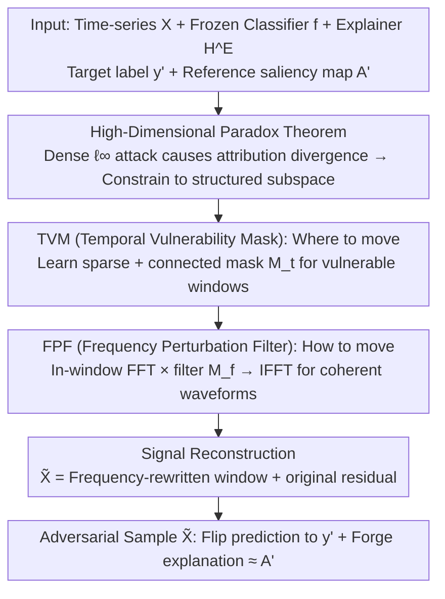

# Exposing Vulnerabilities in Explanation for Time Series Classifiers via Dual-Target Adversarial Attack

**Conference**: ICML 2026  
**arXiv**: [2602.02763](https://arxiv.org/abs/2602.02763)  
**Code**: https://github.com/Bohan7/TSEF  
**Area**: Time Series / Explainable AI / Adversarial Robustness  
**Keywords**: Time Series Explainers, Adversarial Attack, Explanation Faithfulness, Frequency Domain Perturbation, Dual-Target Optimization  

## TL;DR
This paper proposes TSEF—a dual-target attack framework for joint "Time Series Classifier + Explainer" systems. By learning a "Temporal Vulnerability Mask + Frequency Perturbation Filter," it simultaneously pushes model predictions to a target label and align explanations with a reference saliency map within an $\ell_\infty$ budget. It demonstrates that the common "stable explanation = trustworthy decision" assumption in existing time-series interpretability pipelines is fundamentally flawed.

## Background & Motivation

**Background**: High-risk time-series scenarios such as healthcare, finance, and industry commonly adopt Interpretable Time-Series Deep Learning Systems (ITSDLS). These consist of a classifier providing predictions and an explainer (e.g., TimeX++, IG, perturbation-based methods) generating a $T \times D$ saliency map to highlight important time-channel pairs. Clinicians often rely on these maps to "double-check" model judgments, such as in ECG alarm scenarios.

**Limitations of Prior Work**: Existing evaluations often equate "explanation stability" with "model trustworthiness," treating the invariance of explanations under slight perturbations as evidence of robustness. Meanwhile, adversarial attack literature focuses primarily on flipping labels. Explanation attacks in vision/NLP (Ghorbani 2019, Zhang 2020, Ivankay 2022) only scatter or disrupt attributions without the capability to simultaneously "flip the label + forge a credible explanation."

**Key Challenge**: When an attacker controls both "what the model says" and "why it says it," explainability shifts from a safety barrier to a deception tool. Two specific characteristics of time series make this joint control harder than in vision/NLP: (1) **Pattern-level sensitivity**: Time-series models are sensitive to structures like trends and cycles; point-wise small noise is insufficient for stable explanation transfer. (2) **High-dimensional paradox**: While the $T \times D$ space allows for a large budget, dense perturbations within an $\ell_\infty$ ball cause attribution quality to diverge outside target regions at a rate of $O(d - |\Omega|)$, making it difficult to match sparse, connected target explanations.

**Goal**: To prove that time-series explainers are untrustworthy under adversarial conditions, provide the first white-box attack algorithm for simultaneous "target classification + target explanation," and reveal this vulnerability via quantitative metrics.

**Key Insight**: Theoretically prove that "dense $\ell_\infty$ step updates cause attribution quality outside the target region to grow linearly with dimensionality" (Theorem 4.1). This implies that attacks must be restricted to a **structured subspace**—modifying a few "time windows" and "spectral directions" rather than applying point-wise salt-and-pepper noise.

**Core Idea**: Decompose the attack into two sub-problems: "**where to move**" (Temporal Vulnerability Mask) and "**how to move**" (Frequency Perturbation Filter). The former learns a continuous time window via sparse and connectivity regularization, while the latter modifies the spectrum in the FFT domain before performing IFFT to return to the time domain—naturally generating trend/cycle-level coherent perturbations to drive both prediction and explanation.

## Method

### Overall Architecture
TSEF addresses a dual-target attack problem: in a white-box setting with full access to a frozen classifier $f$ and explainer $\mathcal{H}^E$, the attacker seeks a perturbation $\delta$ such that the adversarial sample $\tilde{\mathbf{X}} = \mathbf{X} + \delta$ ($\|\delta\|_\infty \leq \epsilon$) is predicted as the target label ($f(\tilde{\mathbf{X}}) = y'$) and the explainer output matches a reference saliency map $\mathbf{A}'$ (minimizing $d(\mathcal{H}^E(\tilde{\mathbf{X}}), \mathbf{A}')$). After proving that dense perturbations fail, the method nests two sub-problems: learning an inner temporal mask $\mathbf{M}_t \in [0,1]^{T \times D}$ to identify vulnerable windows and an outer frequency filter $\mathbf{M}_f \in [0,2]^{K \times D}$ to shape the perturbation. The final sample combines the frequency-rewritten window with the original signal: $\tilde{\mathbf{X}} = \mathcal{F}^{-1}(\mathcal{F}(\mathbf{M}_t \odot \mathbf{X}) \odot \mathbf{M}_f) + (1 - \mathbf{M}_t) \odot \mathbf{X}$.

### Key Designs

**1. Theoretical Characterization of High-Dimensional Paradox: Why Dense Attacks Fail**
The starting point is Theorem 4.1: consider a dense sign step $\delta = -\varepsilon \cdot \mathrm{sign}(g_c)$ where $g_c$ is the classification loss gradient, and let $\Omega$ be the sparse support of the reference explanation ($|\Omega| \ll d$). The theorem proves that attribution quality outside the target region has a lower bound growing linearly with dimension: $\mathbb{E}[\|\mathbf{A}(\tilde{\mathbf{X}})\|_{1, \Omega^c}] \geq c \varepsilon (d - |\Omega|)$, leading to $\mathbb{E}[\|\mathbf{A}(\tilde{\mathbf{X}}) - \mathbf{A}'\|_1] \geq c \varepsilon (d - |\Omega|)$. This implies that in high-dimensional time series, dense perturbations inevitably scatter attribution across $\Omega^c$. This justifies why structured subspaces (limited windows and spectral directions) are necessary.

**2. Temporal Vulnerability Mask (TVM): Deciding "Where to move"**
TVM learns a sparse and temporally connected mask $\mathbf{M}_t$ in the inner loop, focusing the $\ell_\infty$ budget on windows most capable of flipping predictions and shaping explanations. The inner loss includes a classification term $\lambda_{\mathrm{cls}} L_{\mathrm{cls}}(f(\mathbf{X}'), y')$ and an explanation term $\lambda_{\mathrm{exp}} d(\mathcal{H}^E(\mathbf{X}'), \mathbf{A}')$, where $\mathbf{X}' = \mathbf{X} \odot (1 - \mathbf{M}_t)$. Two structural regularizers are added: a sparsity term $\mathcal{L}_{\mathrm{spa}} = \frac{1}{TD} \sum \mathrm{KL}(\mathrm{Bern}(\mathbf{M}_t[t,d]) \| \mathrm{Bern}(r))$ pulling probabilities toward a prior $r=0.3$, and a connectivity term $\mathcal{L}_{\mathrm{con}} = \frac{1}{TD} \sum (\mathbf{M}_t[t+1,d] - \mathbf{M}_t[t,d])^2$ to encourage continuous windows. Optimization uses Gumbel-Sigmoid with Straight-Through Estimators and a magnitude-independent sign step: $\mathbf{M}_t \leftarrow \Pi_{[0,1]}(\mathbf{M}_t - \eta_t \mathrm{sign}(\nabla \mathcal{L}_t))$.

**3. Frequency Perturbation Filter (FPF): Deciding "How to move"**
FPF performs multiplicative filtering in the frequency domain within the windows defined by TVM, ensuring perturbations are coherent trends/cycles rather than point-wise high-frequency jitter. It transforms the windowed signal $\widehat{W} = \mathcal{F}(\mathbf{M}_t^* \odot \mathbf{X})$, applies filter $\mathbf{M}_f$, and performs IFFT: $\widetilde{W} = \mathcal{F}^{-1}(\widehat{W} \odot \mathbf{M}_f)$. Parameters are $\mathbf{M}_f = \Pi_{[0,2]}(1 + \alpha_{\mathrm{freq}} \tanh(\Theta_f))$, with scaling factor $\alpha_{\mathrm{freq}} = \gamma \epsilon' / (\|\Delta \mathbf{X}_{\mathrm{base}}\|_\infty + \tau)$ to keep perturbations within $\ell_\infty \leq \epsilon'$. $\Theta_f$ is updated via sign steps to focus on directional contributions rather than energy-dominant bands, effectively "painting" saliency onto reference locations using coherent waveforms.

### Loss & Training
The framework uses bi-level alternating optimization: the inner loop updates $\mathbf{M}_t$ to fix the vulnerable window $\mathbf{M}_t^*$. The outer loop optimizes frequency parameters $\Theta_f$ with the window fixed, targeting $J_{\mathrm{atk}} = d(\mathcal{H}^E(\tilde{\mathbf{X}}), \mathbf{A}') + \lambda L_{\mathrm{cls}}(f(\tilde{\mathbf{X}}), y')$. Distance $d$ can be MSE, cosine, or KL divergence. Only test samples correctly classified by the original model are targeted to ensure a true label "flip."

## Key Experimental Results

### Main Results
Evaluated on six benchmarks (LowVar, SeqComb-UV, SeqComb-MV, ECG, PAM, Epilepsy) against three explainers (TimeX++, TimeX, Integrated Gradients) and seven baselines. F1/ASR measure classification success; AUPRC/AUP/AUR measure explanation alignment with the reference map. Comparison on LowVar with TimeX++:

| Method | F1↑ | ASR↑ | AUPRC↑ | AUP↑ | AUR↑ | Note |
|------|-----|------|--------|------|------|------|
| PGD | 0.833 | 0.846 | 0.258 | 0.194 | 0.318 | Flips label but scatters expl. |
| BlackTreeS | 0.728 | 0.740 | 0.361 | 0.271 | 0.375 | Similar to above |
| ADV² | 0.777 | 0.795 | 0.617 | 0.522 | 0.609 | Vision joint attack transfer |
| Random | 0.014 | 0.014 | 0.786 | 0.643 | 0.730 | No label flip |
| **TSEF (Ours)** | **0.837** | **0.848** | **0.845** | **0.760** | **0.800** | Simultaneous flip + forged expl. |

Comparison on ECG with TimeX++:

| Method | F1↑ | ASR↑ | AUPRC↑ | AUP↑ | AUR↑ |
|------|-----|------|--------|------|------|
| PGD | 0.902 | 0.946 | 0.639 | 0.715 | 0.431 |
| ADV² | 0.887 | 0.935 | 0.705 | 0.773 | 0.448 |
| **TSEF (Ours)** | **0.911** | **0.951** | **0.713** | **0.776** | **0.450** |

### Ablation Study

| Config | F1 (Cls) | AUPRC (Expl) | Description |
|------|----------|-------------|------|
| Full TSEF | High | High | Both TVM and FPF enabled |
| w/o TVM | Similar | Significant Decrease | Explanation scatters to irrelevant steps |
| w/o FPF | Similar | Moderate Decrease | Scattered time-domain noise, slow convergence |
| w/o Sparse KL | Similar | Decrease | Mask opens fully, equivalent to dense attack |
| w/o Connectivity | Similar | Decrease | Fragmented mask, fails to fit target region |

### Key Findings
- **Prediction Stability $\neq$ Explanation Faithfulness**: Traditional PGD/ADV² achieve high ASR ($\approx 0.85$) but low AUPRC ($< 0.5$), meaning explainers keep providing "seemingly plausible" but false saliency maps during label flips.
- **Structured Perturbation is Mandatory**: Random attacks have high AUPRC but zero ASR. TSEF succeeds in both, verifying the necessity of the "where + how" decomposition.
- **Universal Explainer Vulnerability**: TimeX, TimeX++, and IG are all vulnerable, showing this is a systemic flaw in the "saliency map as an interpretability proxy" paradigm.

## Highlights & Insights
- **Theory-Driven Design**: Theorem 4.1 clearly explains why dense attacks fail, providing a logical bridge to the TVM/FPF components.
- **Transferable Decomposition Paradigm**: Separating "where" and "how" introduces a structural prior for the attacker. This can apply to other modalities like audio or EEG.
- **Targeting XAI Core Assumptions**: The paper questions the deeper assumption that users can trust a model based on its explanation during the auditing process.

## Limitations & Future Work
- White-box threat model requiring gradient access.
- Limited explainer coverage (no counterfactual or prototype-based explainers).
- Adaptive defense (e.g., adversarial training with TSEF) remains an open question.
- Per-sample bi-level optimization is slow for real-time applications like ICU monitoring.

## Related Work & Insights
- **vs Ghorbani et al. 2019**: They proved vision explanation vulnerability but focused on disruption; TSEF performs dual-target (label + designated saliency) control for time series.
- **vs ADV² (Zhang et al. 2020)**: ADV² uses a unified $\ell_\infty$ ball; TSEF outperforms it by using structured subspaces specifically tailored for temporal data.
- **vs Ding 2023 / Gu 2025**: These works only attack predictions; TSEF is the first to bridge adversarial robustness with interpretability auditing.

## Rating
- Novelty: ⭐⭐⭐⭐⭐ 
- Experimental Thoroughness: ⭐⭐⭐⭐⭐ 
- Writing Quality: ⭐⭐⭐⭐ 
- Value: ⭐⭐⭐⭐⭐ 

<!-- RELATED:START -->

## Related Papers

- [\[ICML 2025\] TIMING: Temporality-Aware Integrated Gradients for Time Series Explanation](../../ICML2025/ai_safety/timing_temporality-aware_integrated_gradients_for_time_series_explanation.md)
- [\[ICML 2026\] TimeGuard: Channel-wise Pool Training for Backdoor Defense in Time Series Forecasting](timeguard_channel-wise_pool_training_for_backdoor_defense_in_time_series_forecas.md)
- [\[ICML 2026\] Dual-branch Robust Unlearnable Examples](dual-branch_robust_unlearnable_examples.md)
- [\[ICLR 2026\] Concept-based Adversarial Attack: a Probabilistic Perspective](../../ICLR2026/ai_safety/concept-based_adversarial_attack_a_probabilistic_perspective.md)
- [\[AAAI 2026\] Rethinking Target Label Conditioning in Adversarial Attacks: A 2D Tensor-Guided Generative Approach](../../AAAI2026/ai_safety/rethinking_target_label_conditioning_in_adversarial_attacks_a_2d_tensor-guided_g.md)

<!-- RELATED:END -->
