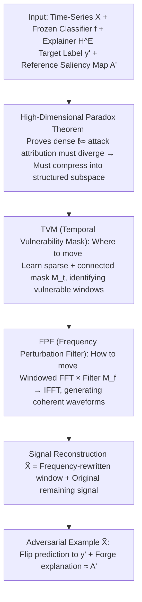

# Exposing Vulnerabilities in Explanation for Time Series Classifiers via Dual-Target Adversarial Attack

**Conference**: ICML 2026  
**arXiv**: [2602.02763](https://arxiv.org/abs/2602.02763)  
**Code**: https://github.com/Bohan7/TSEF  
**Area**: Time Series / Explainable AI / Adversarial Robustness  
**Keywords**: Time Series Explainer, Adversarial Attack, Explanation Faithfulness, Frequency Domain Perturbation, Dual-Target Optimization  

## TL;DR
This paper proposes TSEF—a dual-target attack framework for the joint "Time Series Classifier + Explainer" system. By learning a "Temporal Vulnerability Mask + Frequency Perturbation Filter," it pushes model predictions to a target label while simultaneously forcing the explanation towards an attacker-specified reference saliency map within $\ell_\infty$ budgets. This demonstrates that the "explanation stability = decision trustworthiness" assumption in current time-series interpretability pipelines is fundamentally invalid.

## Background & Motivation

**Background**: In high-stake time-series scenarios such as healthcare, finance, and industry, Interpretable Time-Series Deep Learning Systems (ITSDLS) consisting of a "Classifier + Explainer" are widely adopted. The classifier provides predictions, while the explainer (e.g., TimeX++, IG, perturbation methods) generates a $T \times D$ saliency map to indicate which time-channel pairs are most important. Clinicians often rely on these saliency maps to "double-check" model judgments when reviewing ECG alarms.

**Limitations of Prior Work**: Existing evaluations default to the assumption that "explanation stability = model trustworthiness," using the invariance of explanations under slight perturbations as evidence of robustness. Meanwhile, adversarial attack literature predominantly focuses on flipping prediction labels. Existing explanation attacks in vision/NLP (Ghorbani 2019, Zhang 2020, Ivankay 2022) only scatter or destroy attribution without the capability to simultaneously "flip the label + forge a credible explanation."

**Key Challenge**: When an attacker controls both "what the model says" and "why it says so," interpretability shifts from a safety barrier to a facade. Two specific characteristics of time series make this joint control harder than in vision/NLP: (1) **Pattern-level control**: Time-series models are sensitive to structural patterns like trends and cycles; point-wise small noise is insufficient for stable explanation transfer. (2) **High-dimensional paradox**: Although the $T \times D$ input space allows a large budget, dense perturbations within the $\ell_\infty$ ball cause attribution quality to diverge outside target regions at a rate of $O(d - |\Omega|)$, making it difficult to match sparse, connected target explanations.

**Goal**: Prove that time-series explainers are untrustworthy under adversarial conditions by providing the first white-box attack algorithm capable of achieving "target classification + target explanation" simultaneously, along with quantitative metrics to reveal this vulnerability.

**Key Insight**: It is theoretically proven that "dense $\ell_\infty$ step updates cause attribution quality outside the target region to grow linearly with dimensionality" (Theorem 4.1). Consequently, attacks must be restricted to a **structured subspace**—modifying only a few "time windows" and "spectral directions" rather than point-wise perturbations.

**Core Idea**: The attack is decomposed into two sub-problems: "**where to move**" (temporal vulnerability mask) and "**how to move**" (frequency perturbation filter). The former uses sparse + connectivity regularization to learn continuous time windows, while the latter modifies the spectrum in the FFT domain before performing IFFT back—naturally generating coherent perturbations at the trend/cycle level that drive both prediction and explanation.

## Method

### Overall Architecture
TSEF addresses a dual-target attack problem: in a white-box setting where the attacker has full access to a frozen classifier $f$ and explainer $\mathcal{H}^E$, the goal is to find a perturbation $\delta$ within an $\ell_\infty$ budget such that the adversarial example $\tilde{\mathbf{X}} = \mathbf{X} + \delta$ ($\|\delta\|_\infty \leq \epsilon$) is predicted as the target label ($f(\tilde{\mathbf{X}}) = y'$) and its explanation closely matches a reference saliency map $\mathbf{A}'$ ($d(\mathcal{H}^E(\tilde{\mathbf{X}}), \mathbf{A}')$ is minimized). The paper first uses a theorem to prove this cannot be achieved via point-wise dense perturbations, then splits the attack into two nested sub-problems: an inner loop learning a temporal mask $\mathbf{M}_t \in [0,1]^{T \times D}$ to identify windows worth perturbing, and an outer loop learning a filter $\mathbf{M}_f \in [0,2]^{K \times D}$ on the FFT spectrum of that window to shape the perturbation. The final adversarial example merges the "frequency-rewritten window" with the rest of the original signal: $\tilde{\mathbf{X}} = \mathcal{F}^{-1}(\mathcal{F}(\mathbf{M}_t \odot \mathbf{X}) \odot \mathbf{M}_f) + (1 - \mathbf{M}_t) \odot \mathbf{X}$.

### Key Designs

**1. High-Dimensional Paradox: Proving why dense attacks inevitably fail**

The starting point is answering "why dense $\ell_\infty$ PGD cannot directly attack both prediction and explanation." The paper provides Theorem 4.1 based on first-order analysis: consider a dense sign step $\delta = -\varepsilon \cdot \mathrm{sign}(g_c)$ ($g_c$ being the classification loss gradient), and let $\Omega$ be the sparse support of the reference explanation ($|\Omega| \ll d$). The theorem proves that attribution quality outside the target region has a lower bound that grows linearly with dimensionality: $\mathbb{E}[\|\mathbf{A}(\tilde{\mathbf{X}})\|_{1, \Omega^c}] \geq c \varepsilon (d - |\Omega|)$, hence $\mathbb{E}[\|\mathbf{A}(\tilde{\mathbf{X}}) - \mathbf{A}'\|_1] \geq c \varepsilon (d - |\Omega|)$. This implies that on high-dimensional time series, dense perturbations inevitably scatter attribution quality into $\Omega^c$. This theoretical insight invalidates naive baselines using "joint loss + single $\ell_\infty$ ball" and motivates the structural subspace approach.

**2. Temporal Vulnerability Mask (TVM): Deciding "Where to Move"**

TVM learns a sparse and temporally connected mask $\mathbf{M}_t$ in the inner optimization, permitting modifications only in windows best suited for flipping predictions while shaping target explanations. Its inner loss include a classification term $\lambda_{\mathrm{cls}} L_{\mathrm{cls}}(f(\mathbf{X}'), y')$ and an explanation term $\lambda_{\mathrm{exp}} d(\mathcal{H}^E(\mathbf{X}'), \mathbf{A}')$, where $\mathbf{X}' = \mathbf{X} \odot (1 - \mathbf{M}_t)$—meaning if masking a segment still pushes the model toward the target, that segment is a vulnerable zone. Two structural regularizations are added: a sparsity term using KL divergence to pull activation probabilities toward a prior $r=0.3$, $\mathcal{L}_{\mathrm{spa}} = \frac{1}{TD} \sum \mathrm{KL}(\mathrm{Bern}(\mathbf{M}_t[t,d]) \| \mathrm{Bern}(r))$; and a connectivity term $\mathcal{L}_{\mathrm{con}} = \frac{1}{TD} \sum (\mathbf{M}_t[t+1,d] - \mathbf{M}_t[t,d])^2$ to penalize jumps. Optimization uses Gumbel-Sigmoid with a Straight-Through Estimator, and $\mathbf{M}_t$ is updated via an amplitude-agnostic projection sign step $\mathbf{M}_t \leftarrow \Pi_{[0,1]}(\mathbf{M}_t - \eta_t \mathrm{sign}(\nabla \mathcal{L}_t))$. The sign step ensures updates are driven by directional contribution to the loss rather than signal magnitude, selecting entire QRS complexes in ECGs rather than scattered points.

**3. Frequency Perturbation Filter (FPF): Deciding "How to Move"**

FPF performs multiplicative filtering in the frequency domain within the windows identified by TVM. This ensures that when the perturbation returns to the time domain, it manifests as coherent trends or periodic waveforms rather than point-wise high-frequency jitter. Signal $W = \mathbf{M}_t^* \odot \mathbf{X}$ is transformed via FFT to $\widehat{W}$, multiplied by filter $\mathbf{M}_f$, and transformed back via IFFT to $\widetilde{W} = \mathcal{F}^{-1}(\widehat{W} \odot \mathbf{M}_f)$. The filter is parameterized as $\mathbf{M}_f = \Pi_{[0,2]}(1 + \alpha_{\mathrm{freq}} \tanh(\Theta_f))$, where $\alpha_{\mathrm{freq}}$ adaptively constrains time-domain perturbations within $\|\delta\|_\infty \leq \epsilon'$. Conjugate symmetry is enforced on the complex spectrum to ensure real-valued signals. By generating coherent waveforms (trends/low-frequency envelopes) rather than scattered noise, FPF allows the explainer to converge precisely onto the target saliency map.

### Loss & Training
The framework utilizes a two-level alternating optimization: the inner loop updates $\mathbf{M}_t$ to select the vulnerable window $\mathbf{M}_t^*$, which is passed to the outer loop. The outer loop optimizes the frequency parameters $\Theta_f$ while the window is fixed, targeting $J_{\mathrm{atk}} = d(\mathcal{H}^E(\tilde{\mathbf{X}}), \mathbf{A}') + \lambda L_{\mathrm{cls}}(f(\tilde{\mathbf{X}}), y')$. Distance $d$ can be MSE, cosine similarity, or KL divergence. Attacks are only performed on samples correctly classified by the original model to ensure a true "flip" occurs.

## Key Experimental Results

### Main Results
Evaluation spans six benchmarks (Synthetic: LowVar, SeqComb-UV, SeqComb-MV; Real: ECG, PAM, Epilepsy) × three explainers (TimeX++, TimeX, Integrated Gradients) × seven baselines. F1/ASR measure classification attack success; AUPRC/AUP/AUR measure explanation alignment with the target.

**Results on LowVar with TimeX++ Explainer**:

| Method | F1↑ | ASR↑ | AUPRC↑ | AUP↑ | AUR↑ |
|:---|:---:|:---:|:---:|:---:|:---:|
| PGD | 0.833 | 0.846 | 0.258 | 0.194 | 0.318 |
| BlackTreeS | 0.728 | 0.740 | 0.361 | 0.271 | 0.375 |
| ADV² | 0.777 | 0.795 | 0.617 | 0.522 | 0.609 |
| Random | 0.014 | 0.014 | 0.786 | 0.643 | 0.730 |
| **TSEF (Ours)** | **0.837** | **0.848** | **0.845** | **0.760** | **0.800** |

**Results on ECG with TimeX++ Explainer**:

| Method | F1↑ | ASR↑ | AUPRC↑ | AUP↑ | AUR↑ |
|:---|:---:|:---:|:---:|:---:|:---:|
| PGD | 0.902 | 0.946 | 0.639 | 0.715 | 0.431 |
| ADV² | 0.887 | 0.935 | 0.705 | 0.773 | 0.448 |
| **TSEF (Ours)** | **0.911** | **0.951** | **0.713** | **0.776** | **0.450** |

### Ablation Study

| Configuration | F1 (Classification) | AUPRC (Explanation) | Description |
|:---|:---:|:---:|:---|
| TSEF Full | High | High | Both TVM and FPF enabled |
| w/o TVM | Similar | Significant Drop | Explanation scatters to irrelevant time steps |
| w/o FPF | Similar | Moderate Drop | Time domain noise is scattered; slow convergence |
| w/o Sparsity KL | Similar | Drop | Mask stays open; equivalent to dense attack |
| w/o Connectivity | Similar | Drop | Fragmented mask; fails to fit continuous targets |

### Key Findings
- **Prediction Stability $\neq$ Explanation Faithfulness**: Traditional PGD/ADV² achieve ASR $\approx 0.85$ but fail to push AUPRC above 0.5, proving explainers can maintain "plausible but scattered" saliency maps and labels flip, which is a dangerous failure mode for clinical use.
- **Structured Perturbations are Essential**: Random attacks achieve high AUPRC (0.786) but 0 ASR. Only TSEF optimizes both, validating the "Where + How" decomposition.
- **Universal Vulnerability**: TimeX, TimeX++, and IG are all vulnerable to this framework, indicating a systemic flaw in the "saliency map as an interpretability proxy" paradigm.
- **Stealth of Frequency Perturbations**: Modifying a few frequency bands results in time-domain signals that still look like reasonable ECG waveforms while precisely relocating attribution.

## Highlights & Insights
- **Theory-Driven Design**: Theorem 4.1 clearly explains why dense attacks fail, providing a rare and compelling "proof of impossibility followed by a solution" structure.
- **Transferable Attack Paradigm**: Separating "where" and "how" introduces a structural prior symmetric to common defense assumptions. This logic can transfer to speech, EEG, or video temporal localization.
- **Addressing the Core Post-hoc Interpretability Assumption**: This work doesn't just show DNNs are attackable; it questions the deeper assumption that users can rely on explanations for decision auditing.

## Limitations & Future Work
- White-box threat model requiring gradient access; black-box transferability is not yet systematically evaluated.
- Only covered mask-based and gradient-based explainers; prototype-based or counterfactual explanations are excluded.
- Adaptive defense (e.g., incorporating TSEF in adversarial training) remains an open question.
- Two-level optimization is slow for real-time ICU monitoring applications.

## Related Work & Insights
- **vs Ghorbani et al. 2019**: They prove vision explanations are perturbable but only for "disruption." Ours is dual-target (specified label + specified map) and addresses the high-dimensional paradox.
- **vs ADV² (Zhang et al. 2020)**: ADV² performs joint attacks using a unified $\ell_\infty$ ball. Ours outperforms it by 5-10 pp in AUPRC due to the structured subspace approach.
- **vs Ding 2023 / Gu 2025**: These focus solely on classification attacks; TSEF bridges adversarial robustness and interpretability auditing.

## Rating
- Novelty: ⭐⭐⭐⭐⭐ First to control both time-series prediction and explanation; strong theoretical grounding.
- Experimental Thoroughness: ⭐⭐⭐⭐⭐ Comprehensive coverage across six datasets and three explainer families.
- Writing Quality: ⭐⭐⭐⭐ Theoretical and algorithmic sections are clear; some frequency scaling details require appendix reference.
- Value: ⭐⭐⭐⭐⭐ Vital for high-risk AI auditing; the testbed is highly reusable for defense research.

<!-- RELATED:START -->

## Related Papers

- [\[ICML 2025\] TIMING: Temporality-Aware Integrated Gradients for Time Series Explanation](../../ICML2025/ai_safety/timing_temporality-aware_integrated_gradients_for_time_series_explanation.md)
- [\[ICML 2026\] TimeGuard: Channel-wise Pool Training for Backdoor Defense in Time Series Forecasting](timeguard_channel-wise_pool_training_for_backdoor_defense_in_time_series_forecas.md)
- [\[AAAI 2026\] Rethinking Target Label Conditioning in Adversarial Attacks: A 2D Tensor-Guided Generative Approach](../../AAAI2026/ai_safety/rethinking_target_label_conditioning_in_adversarial_attacks_a_2d_tensor-guided_g.md)
- [\[AAAI 2026\] Angular Gradient Sign Method: Uncovering Vulnerabilities in Hyperbolic Networks](../../AAAI2026/ai_safety/angular_gradient_sign_method_uncovering_vulnerabilities_in_h.md)
- [\[NeurIPS 2025\] Dual-Flow: Transferable Multi-Target, Instance-Agnostic Attacks via In-the-wild Cascading Flow Optimization](../../NeurIPS2025/ai_safety/dual-flow_transferable_multi-target_instance-agnostic_attacks_via_in-the-wild_ca.md)

<!-- RELATED:END -->
