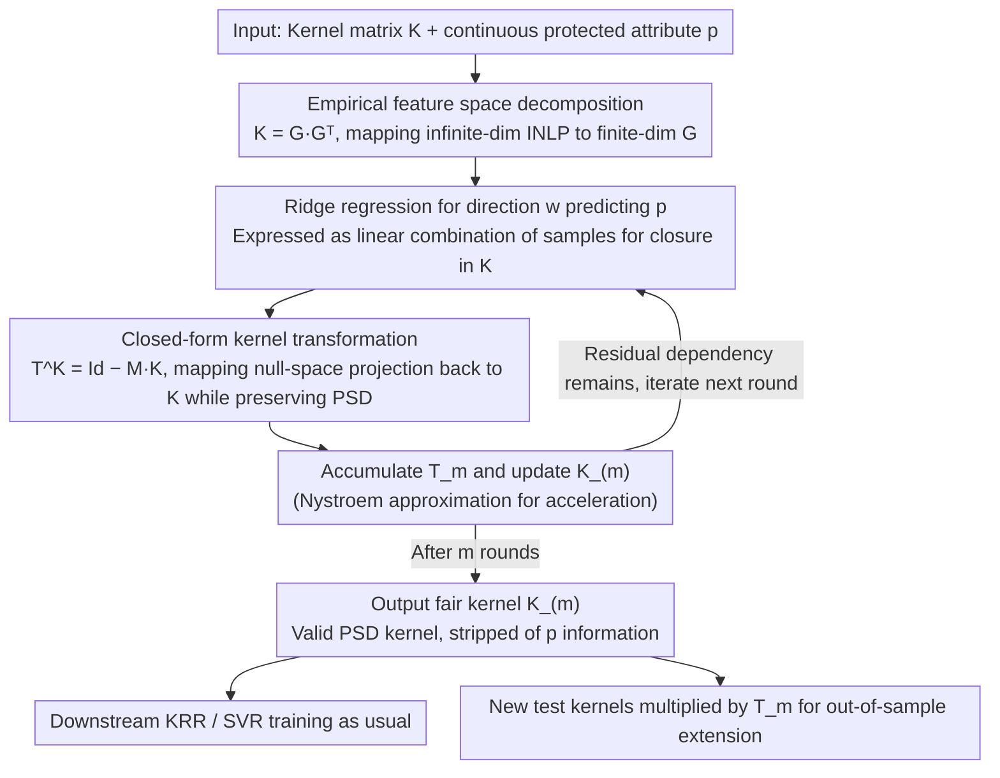

# Extending Fair Null-Space Projections for Continuous Attributes to Kernel Methods

**Conference**: ICML 2026  
**arXiv**: [2511.03304](https://arxiv.org/abs/2511.03304)  
**Code**: https://github.com/Felix-St/FairKernelDecomposition (Available)  
**Area**: AI Safety / Algorithmic Fairness / Kernel Methods  
**Keywords**: Continuous Fairness, Null-Space Projection, Kernel Methods, Empirical Feature Space, SVR

## TL;DR
This paper extends the "Iterative Null-Space Projection (INLP)" fairness method, originally designed for linear models, to kernel methods. By deriving a closed-form transformation $\mathbf{T}$ in the empirical feature space that acts directly on the kernel matrix $\mathbf{K}$, the transformed $\mathbf{K}_{(m)}$ remains a positive semi-definite (PSD) kernel while being stripped of predictive information regarding continuous protected attributes. This allows any kernel-based algorithm (KRR, SVR) to be converted into a "continuously fair" version with a single step, achieving competitive or superior fairness–accuracy Pareto fronts on Crimes, ACSIncome, and ACSTravelTime.

## Background & Motivation
**Background**: Mainstream fair machine learning research primarily assumes that both protected attributes and targets are discrete—such as "race" buckets or binary "gender"—and defines metrics like Demographic Parity or Equalized Odds based on these. However, "age," which is explicitly mentioned in EU anti-discrimination laws, is continuous, and "race" often appears as continuous values like "percentage of Black population" in social science surveys. Cutting them into buckets is both unnatural and leads to information loss. "Continuous fairness" (where both target and protected attributes are continuous) is thus a neglected setting that is truly needed in practice.

**Limitations of Prior Work**: Mainstream methods for handling continuous fairness embed a fairness metric (HGR, GDP, PF) into the optimization objective as a regularization term or adversarial constraint. These approaches tie the solution to specific metrics, models, and optimizers; changing a fairness score requires resetting the loss. Another route, INLP (Ravfogel et al., 2020), is more elegant: it iteratively finds directions that predict the protected attribute and projects the data onto their null space. While INLP is a "model-agnostic + metric-agnostic" preprocessing method, it has only been validated on linear models or neural network embeddings and **cannot be directly applied to kernel methods**. Kernel-induced feature spaces are often infinite-dimensional (e.g., RBF kernels), making it impossible to naively store feature vectors for projection.

**Key Challenge**: To bring the decoupling advantages of INLP—"strip information first, then feed to any downstream model"—to kernel methods (especially Kernel Ridge Regression / Support Vector Regression for regression tasks), one must find a method to **perform null-space projection using only the $n\times n$ kernel matrix $\mathbf{K}$**. This requires bypassing infinite-dimensional feature spaces while ensuring the projected matrix remains a valid (PSD) kernel to maintain the convexity of downstream optimization.

**Goal**: (1) Derive a closed-form transformation acting directly on $\mathbf{K}$ that is equivalent to null-space projection in the feature space; (2) Prove the transformation is PSD-preserving, extensible to test points, and integrable across multiple iterations; (3) Validate its effectiveness as a general preprocessing tool on real-world "continuous fairness" datasets.

**Key Insight**: The authors utilize the "empirical feature space" as a classic tool. The kernel matrix $\mathbf{K}=\mathbf{Q}\boldsymbol{\Lambda}\mathbf{Q}^\top = \mathbf{G}\mathbf{G}^\top$, where $\mathbf{G}\coloneq \mathbf{Q}\boldsymbol{\Lambda}^{1/2}$ is an $n$-dimensional explicit representation that is isometrically isomorphic to the subspace spanned by the training set. Performing INLP on $\mathbf{G}$ is a finite-dimensional operation, and all operations can then be rewritten back to $\mathbf{K}$ using the kernel trick.

**Core Idea**: "Perform INLP in the empirical feature space, then algebraically wrap all projections on $\mathbf{G}$ into a single right-multiplication transformation $\mathbf{T}^{\mathbf{K}}=\mathrm{Id}-\mathbf{M}\mathbf{K}$ for the kernel matrix." This is the method the paper calls Fair Kernel Decomposition (FKD).

## Method

### Overall Architecture
The paper resolves the contradiction that INLP can only be performed on finite-dimensional features while kernel feature spaces (especially RBF) are often infinite-dimensional. The core transformation of FKD is: instead of touching the infinite-dimensional space, it uses the empirical feature space to decompose the kernel matrix as $\mathbf{K}=\mathbf{G}\mathbf{G}^\top$, completes INLP on the finite-dimensional $\mathbf{G}$, and then algebraically maps all projections back into a right-multiplication transformation $\mathbf{T}^{\mathbf{K}}=\mathrm{Id}-\mathbf{M}\mathbf{K}$ on the kernel matrix $\mathbf{K}$. The entire process follows an "outer iteration, inner closed-form update" flow: each round fits a ridge regression direction that predicts the protected attribute $\mathbf{p}$, constructs its null-space projection, compresses it into a kernel transformation, and accumulates it into the total transformation $\mathbf{T}_{(m)}$. This outputs a $\mathbf{K}_{(m)}$ stripped of $\mathbf{p}$ information that is still a valid PSD kernel. Any downstream kernel method (KRR, SVR) can be trained as usual, and new test points can be extrapolated using the same $\mathbf{T}_{(m)}$.

### Key Designs

**1. Null-Space Projection in Empirical Feature Space: Moving INLP from infinite to finite dimensions**

The standard INLP routine is to "iteratively find directions that predict protected attributes and project data onto their null space." This is impossible for infinite-dimensional kernels like RBF because the feature vectors cannot be stored. The authors' breakthrough point is the empirical feature space: the PSD kernel matrix is decomposed as $\mathbf{K}=\mathbf{Q}\boldsymbol{\Lambda}\mathbf{Q}^\top=\mathbf{G}\mathbf{G}^\top$, where $\mathbf{G}\coloneq\mathbf{Q}\boldsymbol{\Lambda}^{1/2}$ is an $n$-dimensional explicit representation that is isometric to the subspace spanned by the training set and satisfies $k(\mathbf{x}_i,\mathbf{x}_j)=\langle\mathbf{g}_i,\mathbf{g}_j\rangle$. Thus, INLP can be run on this finite-dimensional $\mathbf{G}$: first, determine the direction $\mathbf{w}=\mathbf{G}^\top(\mathbf{G}\mathbf{G}^\top+\tilde{\alpha}\mathrm{Id})^{-1}\mathbf{p}$ via ridge regression. This formulation is key, as it expresses $\mathbf{w}$ as a "linear combination of samples," allowing subsequent operations to be closed using only $\mathbf{K}$. Then, the null-space projection $\mathbf{P}^{\mathbf{G}}=\mathrm{Id}-\mathbf{w}(\mathbf{w}^\top\mathbf{w})^{-1}\mathbf{w}^\top$ is applied. Over multiple iterations, $\mathbf{G}_{(m)}=\mathbf{G}_{(0)}\prod_{i=0}^{m-1}\mathbf{P}^{\mathbf{G}_{(i)}}$, and Lemma 3.1 guarantees that the product of iterative projections remains a projection. Multiple iterations are necessary because a single projection only removes the most significant predictive direction; residual nonlinear dependencies must be stripped gradually.

**2. Closed-form Kernel Transformation $\mathbf{T}^{\mathbf{K}}=\mathrm{Id}-\mathbf{M}\mathbf{K}$: Mapping projections back to the kernel while maintaining PSD**

Projecting on $\mathbf{G}$ is not enough; downstream kernel methods require a kernel matrix. The entire process of "projecting and then computing $\mathbf{G}'{\mathbf{G}'}^\top$" must be mapped back to an operation on the kernel matrix without destroying positive semi-definiteness (otherwise, SVR's quadratic programming is no longer convex). Theorem 3.2 provides such a right-multiplication transformation: define $\tau_{\text{norm}}\coloneq(\mathbf{w}^\top\mathbf{w})^{-1}$ and $\mathbf{M}\coloneq(\mathbf{K}_{(m)}+\tilde{\alpha}\mathrm{Id})^{-1}\mathbf{p}\,\tau_{\text{norm}}\,\mathbf{p}^\top(\mathbf{K}_{(m)}+\tilde{\alpha}\mathrm{Id})^{-1}$. The single-round update is $\mathbf{K}_{(m)}=\mathbf{K}_{(m-1)}(\mathrm{Id}-\mathbf{M}\mathbf{K}_{(m-1)})$. The cumulative form $\mathbf{T}_m=\prod_{i=0}^{m-1}\mathbf{T}^{\mathbf{K}_{(i)}}$ means $\mathbf{K}_{(m)}=\mathbf{K}_{(0)}\mathbf{T}_m$. Applying the same $\mathbf{T}_m$ to the test kernel naturally handles out-of-sample extension. Corollary 3.3 proves this transformation is PSD-preserving. Choosing the right-multiplication form $\mathrm{Id}-\mathbf{M}\mathbf{K}$ rather than a general similarity transformation is precisely what preserves PSD. The elegance of this design is that all "fairness" logic is encapsulated in kernel preprocessing, independent of downstream optimization or specific fairness scores. It is "model-agnostic + metric-agnostic." To extend to multiple protected attributes, one simply replaces $\mathbf{p}\in\mathbb{R}^n$ with a matrix $\mathbf{p}\in\mathbb{R}^{n\times l}$ without needing to rewrite the theory.

**3. Nystroem Approximation + Implementation: Compressing $\mathcal{O}(n^3)$ inversion to a practical level**

The exact version requires an $n\times n$ matrix inversion each round, with a total complexity of $\mathcal{O}(m\cdot n^3)$, which is prohibitive for large datasets. Algorithm 1 breaks down each round into maintaining $\mathbf{B}=(\mathbf{K}_{(i-1)}+\tilde{\alpha}\mathrm{Id})^{-1}$, $\tau_{\text{norm}}=(\mathbf{p}^\top\mathbf{B}\mathbf{K}_{(i-1)}\mathbf{B}\mathbf{p})^{-1}$, $\mathbf{M}=\mathbf{B}\mathbf{p}\tau_{\text{norm}}\mathbf{p}^\top\mathbf{B}$, and $\mathbf{T}^{\mathbf{K}_i}=\mathrm{Id}-\mathbf{M}\mathbf{K}_{(i-1)}$. Since the bottleneck is the inversion of $\mathbf{K}$, the Drineas & Mahoney Nystroem approximation is used instead. Furthermore, not explicitly storing $\mathbf{T}_{(i)}$ and carefully ordering matrix multiplications saves memory (details in Appendix C). Experiments in §4.5 show that the fairness–accuracy Pareto front of the approximate version nearly coincides with the exact version, proving that this engineering approximation does not lose critical properties—though the authors admit $\mathcal{O}(n^2)$ storage of the kernel matrix remains a ceiling for large-scale extension.

### Loss & Training
The method itself does not introduce new loss functions. The inner ridge regression uses an existing closed-form solution. Downstream models are trained using their respective standard objectives (KRR: closed-form; SVR: standard dual QP). Fairness is achieved through preprocessing the kernel matrix. Hyperparameters mainly include the number of iterations $m$ (controlling stripping intensity) and ridge regularization $\tilde{\alpha}$ (controlling the "granularity" of information removal). The RBF bandwidth and KRR/SVR hyperparameters are locked via grid-search on a non-fair baseline.

## Key Experimental Results

### Main Results
The evaluation uses typical fair regression datasets: Communities & Crimes (predicting crime rate, protected attribute = % Black population), ACSIncome (Montana, protected attribute = age), and ACSTravelTime (Montana, protected attribute = age). Predictive accuracy is measured by MAE, and fairness is reported using HGR [DP], GDP [DP], and PF [EO]. All results use 5-fold cross-validation and are presented as "MAE vs fairness" Pareto fronts (Figure 1). Baselines include KRR-FKL (Pérez-Suay 2017, HSIC + KRR), NN-HGR (Mary 2019), and a dummy regressor predicting the mean.

| Dataset | Fairness Metric | Best Performing Method | Notes |
| :--- | :--- | :--- | :--- |
| Crimes | HGR | NN-HGR / KRR-FKL (strong reg.); SVR-FKD (slight lead in weak reg.) | Closer gap between the three on GDP/PF |
| Crimes | GDP / PF | SVR-FKD (clear lead in weak reg. region) | Pareto front overall more bottom-left |
| ACSIncome | GDP (all) | **SVR-FKD** significantly best | KRR-FKD suppressed by KRR-FKL, but both beat NN-HGR |
| ACSTravelTime | All 3 metrics | **Only SVR-FKD** improves fairness while maintaining low MAE; others degrade to dummy level | Highlights necessity of nonlinear projection |

### Ablation Study

| Configuration | Key Finding | Explanation |
| :--- | :--- | :--- |
| SVR-FKD vs SVR-INPL (Linear projection + Nonlinear SVR, Fig. 3) | SVR-INPL improves fairness much slower; at high $m$, MAE increases but fairness plateaus | Proves linear null-space projection cannot capture nonlinear dependencies between data and protected attributes |
| Multi-protected Attributes (Crimes, Fig. 2a) | "multi" (Black + White %) shows better Pareto for White % side compared to "single", with Black % side nearly unchanged | Theorem 3.2 naturally supports $\mathbf{p}\in\mathbb{R}^{n\times l}$ without performance collapse |
| Inner Ridge $\tilde{\alpha}$ Scan (Crimes, Fig. 2b) | Larger $\tilde{\alpha}$ increases MAE damage per round; small $\tilde{\alpha}$ corresponds to "finer information stripping" | Suggests small $\tilde{\alpha}$ + using $m$ to adjust stripping intensity |
| Nystroem Approximation (Crimes, Fig. 4) | Different ratios of components for inverse approximation yield Pareto curves qualitatively similar to exact version | Engineering trade-off for significant acceleration without losing fairness performance |

### Key Findings
- SVR + FKD is the strongest combination: it reaches the Pareto front on almost all three datasets. The authors hypothesize that SVR’s $\epsilon$-insensitive loss is more robust to the kernel structure after preprocessing, whereas KRR is overtaken by the HSIC route (KRR-FKL) in some fairness metrics.
- The "need for nonlinear projection" is most evident in ACSTravelTime—all baseline methods' predictive power collapses to dummy levels, while only FKD manages to hold both fairness and MAE. This indicates that the coupling between protected attributes and targets in the real world is often nonlinear.
- The role of inner ridge regularization $\tilde{\alpha}$ is not classic "overfitting prevention" but rather "controlling info stripping granularity." This provides intuition for tuning: use small $\tilde{\alpha}$ and treat $m$ as the primary knob.
- Multi-protected attribute extension is nearly "free": simply increasing the dimensionality of $\mathbf{p}$ requires no theoretical or algorithmic changes—a practical dividend of the "model-agnostic + metric-agnostic + attribute-count-agnostic" preprocessing paradigm.

## Highlights & Insights
- The combination of "Empirical Feature Space + INLP" is a clean paradigm reshuffling: the empirical feature space is an old tool in kernel learning (Schölkopf 1999), and INLP is an old trick in NLP debiasing (Ravfogel 2020). However, fitting them into the "continuous fairness + regression + arbitrary kernel" gap requires Theorem 3.2 to closure the projection as a PSD-preserving kernel transformation, which is a non-trivial contribution.
- The "preprocessing instead of constraints" decoupling is highly transferable: as long as a downstream model is based on a kernel matrix, one can simply replace the original kernel with $\mathbf{K}_{(m)}$ without modifying training code. This is a very different engineering approach from mainstream methods that use fairness as a loss term, making it easier to embed into existing ML pipelines as a pluggable fairness constraint.
- The structure of $\mathbf{T}^{\mathbf{K}}=\mathrm{Id}-\mathbf{M}\mathbf{K}$—"right-multiplying a saddle-point structure"—is worth remembering: it preserves PSD, allows closed-form iterative stacking, scales to multiple attributes, and can be accelerated by Nystroem. This form for "attribute stripping" in kernels might be as valuable as INLP is for NLP embeddings.
- The reinterpretation of $\tilde{\alpha}$ as a knob for "information stripping vs. signal retention" is enlightening. It suggests that when using classic tools, we cannot always rely on classic intuition.

## Limitations & Future Work
- Storage bottleneck remains: $\mathcal{O}(n^2)$ storage for the kernel matrix is an inherent ceiling for kernel methods. Nystroem only solves $\mathcal{O}(n^3)$ inversion time. To scale FKD to hundreds of thousands of samples, one might need to use Random Fourier Features or perform projections directly in the low-rank Nystroem representation.
- Conservative experimental setup: The three datasets are classic fairness benchmarks, but Bao et al. (2021) have questioned the rationality of such data. Sample sizes are small (ACS used Montana, a small state, for computational feasibility), so actual usability on large-scale tasks remains to be verified.
- Metric evaluation is highly dependent on hyper-parameters: different $m / \tilde{\alpha}$ choices produce different Pareto points; the paper does not provide an automated principle for selecting $m$. Comparing with different paradigms like NN-HGR is also affected by architecture choices, as admitted in the footnotes.
- Scope limited to regression + continuous protected attributes: The authors explicitly leave "classification + continuous protected attributes," "regression + discrete protected attributes," Gaussian Processes, and direct projection in feature space for future work. Other downstream scenarios like "privacy" (stripping identity features) are potential directions.
- Missing link to modern deep models: Many ML systems are end-to-end neural networks. This method acts directly on the kernel matrix. To embed it in deep models, it would need to act on intermediate representations with an external kernel, a bridge the paper does not explore.

## Related Work & Insights
- **vs. Ravfogel 2020 (INLP)**: Both use "iterative searching for predictive directions then projecting." This work expands the scope from linear models/embeddings to kernel-induced feature spaces (including infinite dimensions). The key addition is Theorem 3.2, which compresses the projection into a PSD-preserving kernel transformation for regression + continuous attributes.
- **vs. Pérez-Suay 2017 (KRR-FKL)**: They use HSIC to insert independence goals into KRR optimization (modifying objectives). This paper is "preprocessing the kernel matrix"—model/metric agnostic and compatible with SVR. While KRR-FKD is weaker than KRR-FKL, SVR-FKD wins in most cases, showing that the preprocessing paradigm offers higher flexibility in downstream model selection.
- **vs. Mary 2019 (NN-HGR)**: Neural networks + HGR upper bound regularization is a strong baseline. This work performs better on GDP and PF metrics, especially on small-to-medium data. FKD does not rely on gradient training or neural architecture selection, making it more robust.
- **vs. Tan 2020 (GP fair subspace)**: Both involve subspace methods, but Tan looks for alignment subspaces in the hypothesis space, while this work projects directly on the feature space where data resides, offering a more intuitive geometric meaning.

## Rating
- Novelty: ⭐⭐⭐⭐ Cleanly extends INLP to a closed-form, PSD-preserving kernel version. Solid technical work and fills a real gap.
- Experimental Thoroughness: ⭐⭐⭐⭐ 3 datasets × 3 fairness metrics × multiple baselines + several ablations (multi-attribute, $\tilde{\alpha}$ scan, linear vs. nonlinear, Nystroem). Covers all dimensions of interest, but datasets are small.
- Writing Quality: ⭐⭐⭐⭐ Rigorous derivations, clear motivation, and well-articulated social science context for continuous fairness.
- Value: ⭐⭐⭐⭐ Provides practitioners with a pluggable, PSD-preserving, and extensible tool for continuous fairness in kernel methods; especially valuable for SVR in real-world anti-discrimination prediction tasks.

<!-- RELATED:START -->

## Related Papers

- [\[CVPR 2026\] Batman: Benign Knowledge Alignment Through Malicious Null Space in Federated Backdoor Attack](../../CVPR2026/ai_safety/batman_benign_knowledge_alignment_through_malicious_null_space_in_federated_back.md)
- [\[ICML 2026\] Position: Beyond Sensitive Attributes, ML Fairness Should Quantify Structural Injustice via Social Determinants](position_beyond_sensitive_attributes_ml_fairness_should_quantify_structural_inju.md)
- [\[ICML 2026\] Demystifying the Optimal Fair Classifier in Multi-Class Classification](demystifying_the_optimal_fair_classifier_in_multi-class_classification.md)
- [\[ICML 2026\] Fair Dataset Distillation via Cross-Group Barycenter Alignment](fair_dataset_distillation_via_cross-group_barycenter_alignment.md)
- [\[ICML 2026\] PRISM: Gauge-Invariant Tangent-Space Differentially Private LoRA](prism_gauge-invariant_tangent-space_differentially_private_lora.md)

<!-- RELATED:END -->
