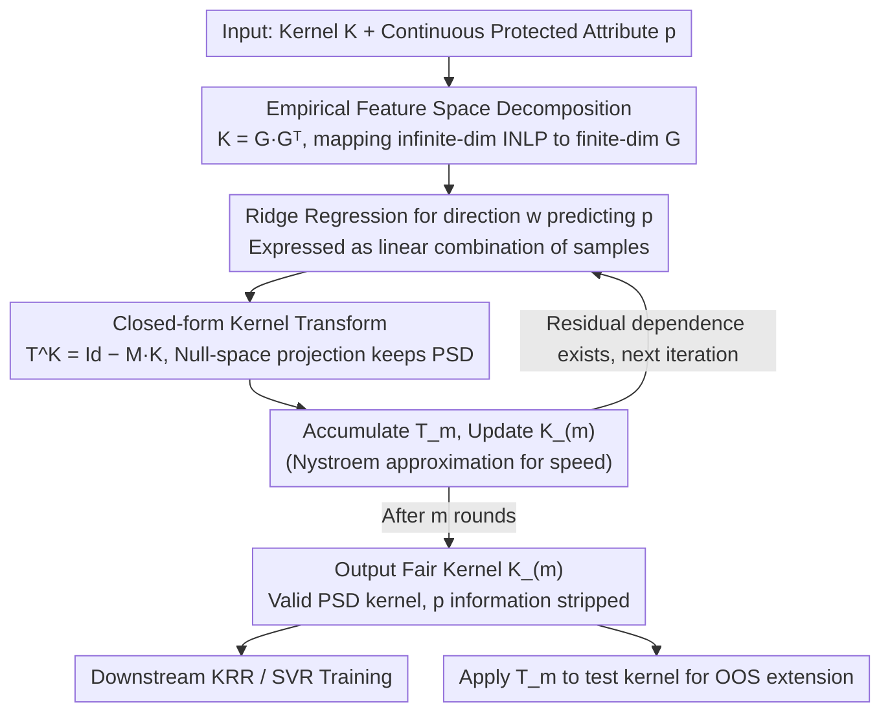

# Extending Fair Null-Space Projections for Continuous Attributes to Kernel Methods

**Conference**: ICML 2026  
**arXiv**: [2511.03304](https://arxiv.org/abs/2511.03304)  
**Code**: https://github.com/Felix-St/FairKernelDecomposition (Available)  
**Area**: AI Safety / Algorithmic Fairness / Kernel Methods  
**Keywords**: Continuous Fairness, Null-Space Projection, Kernel Methods, Empirical Feature Space, SVR

## TL;DR
This paper extends the "Iterative Null-Space Projection (INLP)" fairness method, originally designed by Ravfogel et al. for linear models, to kernel methods. By deriving a closed-form transformation $\mathbf{T}$ that directly acts on the kernel matrix $\mathbf{K}$ via the empirical feature space, the authors ensure that the transformed $\mathbf{K}_{(m)}$ remains a positive semi-definite (PSD) kernel while being stripped of predictive information regarding continuous protected attributes. This allows any kernel-based algorithm (KRR, SVR) to be converted into a "continuously fair" version, achieving competitive or superior fairness–accuracy Pareto fronts on Crimes, ACSIncome, and ACSTravelTime datasets.

## Background & Motivation
**Background**: Most mainstream fair machine learning research assumes that both protected attributes and targets are discrete—such as "race" bins or binary "gender"—and defines metrics like Demographic Parity or Equalized Odds accordingly. However, protected attributes like "age," as explicitly mentioned in EU anti-discrimination laws, are inherently continuous. In social science surveys, "race" often appears as a continuous value like "percentage of the Black population." Forcing these into bins is unnatural and leads to information loss. "Continuous fairness" (where both target and protected attributes are continuous) is thus a neglected but practically essential setting.

**Limitations of Prior Work**: Existing approaches to continuous fairness typically embed fairness metrics (HGR, GDP, PF) as regularization terms or adversarial constraints into the optimization objective. Such methods are tied to specific metrics, models, and optimizers; changing the fairness score requires redefining the loss. Another approach, INLP (Ravfogel et al., 2020), is more elegant: it iteratively finds directions that predict the protected attribute and projects the data onto their null space. While INLP is a model-agnostic and metric-agnostic preprocessing method, it has only been validated on linear models or neural network embeddings and **cannot be directly applied to kernel methods**. The feature spaces induced by kernels (like RBF) are often infinite-dimensional, making it impossible to naively store feature vectors for projection.

**Key Challenge**: To bring the decoupling advantage of INLP ("strip information first, then feed to any downstream model") to kernel methods—particularly Kernel Ridge Regression (KRR) and Support Vector Regression (SVR)—one must find a way to **perform null-space projection using only the $n \times n$ kernel matrix $\mathbf{K}$**. This requires bypassing infinite-dimensional feature spaces while ensuring the projected matrix remains a valid PSD kernel to maintain the convexity of downstream optimization.

**Goal**: (1) Derivation of a closed-form transformation acting directly on $\mathbf{K}$, equivalent to null-space projection in the feature space; (2) Proof that the transformation preserves PSD property, allows out-of-sample extension to test points, and supports multiple iterations; (3) Validation of its effectiveness as a general preprocessing tool on real-world "continuous fairness" datasets.

**Key Insight**: The authors utilize the classical tool of the "empirical feature space." The kernel matrix $\mathbf{K} = \mathbf{Q} \boldsymbol{\Lambda} \mathbf{Q}^\top = \mathbf{G} \mathbf{G}^\top$, where $\mathbf{G} \coloneq \mathbf{Q} \boldsymbol{\Lambda}^{1/2}$ is an $n$-dimensional explicit representation that is geometrically isometric to the subspace spanned by the training set. Performing INLP on $\mathbf{G}$ is a finite-dimensional operation, which can then be rewritten back onto $\mathbf{K}$ using the kernel trick.

**Core Idea**: "Perform INLP in the empirical feature space, then algebraically collapse all projections on $\mathbf{G}$ into a single right-multiplication transformation $\mathbf{T}^{\mathbf{K}} = \mathrm{Id} - \mathbf{M} \mathbf{K}$ on the kernel matrix." This is the method the paper terms Fair Kernel Decomposition (FKD).

## Method

### Overall Architecture
This paper addresses the contradiction that INLP can only be performed on finite-dimensional features, while kernel feature spaces (especially RBF) are often infinite-dimensional. The core of FKD is: rather than touching the infinite-dimensional space, decompose the kernel matrix as $\mathbf{K} = \mathbf{G} \mathbf{G}^\top$, perform INLP on the finite-dimensional $\mathbf{G}$, and fold the projection back into a transformation $\mathbf{T}^{\mathbf{K}} = \mathrm{Id} - \mathbf{M} \mathbf{K}$ on $\mathbf{K}$. The process follows an "outer iterative, inner closed-form update" loop: each round fits a ridge regression direction to predict the protected attribute $\mathbf{p}$, constructs its null-space projection, compresses it into a kernel transform, and accumulates it into the total transform $\mathbf{T}_{(m)}$. This outputs a "fair" kernel $\mathbf{K}_{(m)}$ stripped of $\mathbf{p}$ information but still PSD. Any downstream kernel method (KRR, SVR) is trained normally, and test kernels are transformed using the same $\mathbf{T}_{(m)}$.

### Key Designs

**1. Null-Space Projection in Empirical Feature Space: Solving INLP for Infinite Dimensions**

Standard INLP iteratively identifies directions predicting protected attributes and projects data onto their null space. For infinite-dimensional kernels like RBF, the feature vectors cannot be stored. The authors solve this using the empirical feature space: decomposing the PSD kernel matrix $\mathbf{K} = \mathbf{Q} \boldsymbol{\Lambda} \mathbf{Q}^\top = \mathbf{G} \mathbf{G}^\top$. $\mathbf{G} \coloneq \mathbf{Q} \boldsymbol{\Lambda}^{1/2}$ is an $n$-dimensional explicit representation isometric to the subspace spanned by the training data, satisfying $k(\mathbf{x}_i, \mathbf{x}_j) = \langle \mathbf{g}_i, \mathbf{g}_j \rangle$. INLP is performed on $\mathbf{G}$: first find $\mathbf{w} = \mathbf{G}^\top (\mathbf{G} \mathbf{G}^\top + \tilde{\alpha} \mathrm{Id})^{-1} \mathbf{p}$ via ridge regression. This formulation is crucial as it expresses $\mathbf{w}$ as a "linear combination of samples," allowing subsequent operations to use only $\mathbf{K}$. Multi-round projection $\mathbf{G}_{(m)} = \mathbf{G}_{(0)} \prod_{i=0}^{m-1} \mathbf{P}^{\mathbf{G}_{(i)}}$ is performed, where Lemma 3.1 guarantees the product of projections remains a projection. Iteration is necessary because a single projection only removes the most prominent predictive direction.

**2. Closed-form Transformation $\mathbf{T}^{\mathbf{K}} = \mathrm{Id} - \mathbf{M} \mathbf{K}$: Preserving PSD Property**

Projecting $\mathbf{G}$ is insufficient; downstream models require a kernel matrix. The "projection then compute $\mathbf{G}' {\mathbf{G}'}^\top$" sequence must be folded into a direct kernel operation without breaking PSD property (otherwise, SVR's quadratic programming is no longer convex). Theorem 3.2 provides this one-step right-multiplication: defining $\tau_{\text{norm}} \coloneq (\mathbf{w}^\top \mathbf{w})^{-1}$ and $\mathbf{M} \coloneq (\mathbf{K}_{(m)} + \tilde{\alpha} \mathrm{Id})^{-1} \mathbf{p} \, \tau_{\text{norm}} \, \mathbf{p}^\top (\mathbf{K}_{(m)} + \tilde{\alpha} \mathrm{Id})^{-1}$, the single-round update is $\mathbf{K}_{(m)} = \mathbf{K}_{(m-1)} (\mathrm{Id} - \mathbf{M} \mathbf{K}_{(m-1)})$. The cumulative form $\mathbf{T}_m = \prod_{i=0}^{m-1} \mathbf{T}^{\mathbf{K}_{(i)}}$ allows $\mathbf{K}_{(m)} = \mathbf{K}_{(0)} \mathbf{T}_m$, and applying the same $\mathbf{T}_m$ to test kernels provides natural out-of-sample extension. Corollary 3.3 proves this transform preserves PSD. The choice of the right-multiplication form $\mathrm{Id} - \mathbf{M} \mathbf{K}$ over general similarity transforms is precisely to maintain the PSD property.

**3. Nystroem Approximation + Implementation: Optimizing $\mathcal{O}(n^3)$ Complexity**

The exact version requires inverting $n \times n$ matrices each round, resulting in $\mathcal{O}(m \cdot n^3)$ complexity, which is prohibitive for large datasets. Algorithm 1 breaks down each round into maintaining $\mathbf{B} = (\mathbf{K}_{(i-1)} + \tilde{\alpha} \mathrm{Id})^{-1}$, $\tau_{\text{norm}}$, and $\mathbf{M}$. The bottleneck is the inversion of $\mathbf{B}$, which is replaced by the Nystroem approximation (Drineas & Mahoney). Memory is further saved by avoiding explicit storage of $\mathbf{T}_{(i)}$ and optimizing matrix multiplication order (details in Appendix C). Section 4.5 shows that the fairness–accuracy Pareto front of the approximate version nearly matches the exact one, though $\mathcal{O}(n^2)$ storage remains a limitation for massive scaling.

### Loss & Training
The method introduces no new loss function. The inner ridge regression uses a standard closed-form solution. Downstream models are trained using their standard objectives (KRR: closed-form; SVR: dual QP). Fairness is achieved via kernel matrix preprocessing. Hyperparameters include the number of iterations $m$ (controlling stripping strength) and ridge regularization $\tilde{\alpha}$ (controlling the "granularity" of information removal). RBF bandwidth and model hyperparameters are locked via grid search on a non-fair baseline first.

## Key Experimental Results

### Main Results
Evaluation is performed on three standard fairness regression benchmarks: Communities & Crimes (target = crime rate, protected = % Black population), ACSIncome (Montana, protected = age), and ACSTravelTime (Montana, protected = age). Prediction accuracy is measured by MAE, and fairness is reported using HGR [DP], GDP [DP], and PF [EO]. Results are 5-fold cross-validated and presented as "MAE vs fairness" Pareto fronts (Figure 1). Baselines include KRR-FKL (HSIC + KRR), NN-HGR, and a dummy regressor.

| Dataset | Fairness Metric | Best Performing Method | Notes |
|---------|-----------------|------------------------|-------|
| Crimes | HGR | NN-HGR / KRR-FKL (High reg.); SVR-FKD (Slightly better in low reg.) | Gaps are smaller in GDP/PF |
| Crimes | GDP / PF | SVR-FKD (Significant lead in low reg. region) | Pareto front shifted bottom-left |
| ACSIncome | GDP (Overall) | **SVR-FKD** (Significantly the best) | KRR-FKD is suppressed by KRR-FKL, but both outperform NN-HGR |
| ACSTravelTime | All 3 metrics | **Only SVR-FKD** | Other methods collapse to dummy levels while maintaining MAE |

### Ablation Study

| Configuration | Key Finding | Explanation |
|---------------|-------------|-------------|
| SVR-FKD vs SVR-INPL (Linear projection + non-linear SVR) | SVR-INPL improves fairness much slower; after $m \in \{160, 180, 200\}$, fairness plateaus while MAE worsens | Linear projection fails to capture non-linear dependencies between data and protected attributes |
| Multi-protected Attributes (Crimes: Black + White pop. %) | "Multi" improves Pareto on the White % side compared to "Single" (Black-only protection) | Theorem 3.2 naturally supports $\mathbf{p} \in \mathbb{R}^{n \times l}$ without performance collapse |
| Ridge Reg. $\tilde{\alpha}$ Sweep | Higher $\tilde{\alpha}$ harms MAE more per round; smaller $\tilde{\alpha}$ allows "finer" information stripping | Suggests using small $\tilde{\alpha}$ and tuning strength via $m$ |
| Nystroem Approximation | Pareto curves are qualitatively consistent with exact versions | Allows significant speedup without losing fairness performance |

### Key Findings
- SVR + FKD is the strongest combination: It dominates the Pareto front in nearly all datasets. The authors hypothesize that SVR’s $\epsilon$-insensitive loss is more robust to the preprocessed kernel structure.
- The necessity of non-linear projection is most evident in ACSTravelTime, where baseline methods collapse to dummy performance, but FKD retains predictive power while improving fairness.
- The role of $\tilde{\alpha}$ is not standard "overfitting prevention" but rather a "granularity knob" for information stripping.
- Multi-attribute extension is practically free: Only the dimension of $\mathbf{p}$ needs to be increased; the theory and algorithm remain the same.

## Highlights & Insights
- The combination of "Empirical Feature Space + INLP" is a clean paradigm shift. While both are known tools, combining them for "continuous fairness + regression + arbitrary kernels" requires Theorem 3.2's PSD-preserving closed-form transformation, which is a non-trivial contribution.
- The philosophy of "preprocessing vs. constraints" allows logic decoupling. Since fairness is handled in the kernel matrix, no changes are needed for downstream training code—making it easier to integrate into existing ML pipelines as a pluggable constraint.
- The "right-multiplication of a saddle-point structure" ($\mathbf{T}^{\mathbf{K}} = \mathrm{Id} - \mathbf{M} \mathbf{K}$) is a valuable mathematical form: it preserves PSD, allows iterative stacking, handles multi-attributes, and is Nystroem-compatible.
- Redefining the ridge parameter $\tilde{\alpha}$ as an "information stripping granularity" tool provides a useful heuristic for hyperparameter tuning.

## Limitations & Future Work
- **Storage Bottleneck**: $\mathcal{O}(n^2)$ storage for the kernel matrix remains the fundamental limit of kernel methods. Nystroem only solves the $\mathcal{O}(n^3)$ time complexity. Scaling to millions of samples would require Random Fourier Features or performing projections directly within low-rank Nystroem representations.
- **Conservative Experimental Setup**: The datasets are standard fairness benchmarks, but the sample sizes are relatively small (e.g., choosing Montana for ACS). Usability on large-scale real-world tasks remains to be seen.
- **Hyperparameter Sensitivity**: The choice of $m$ and $\tilde{\alpha}$ significantly impacts the Pareto points, and the paper lacks an automated principle for selecting these.
- **Restricted Scope**: Currently focuses on regression with continuous protected attributes. Future work includes classification with continuous attributes, Gaussian Processes, and feature-space projections.
- **Modern Deep Learning Integration**: Most modern systems are end-to-end neural networks. This method acts on kernel matrices and would require using kernels as neural layers to be directly compatible with deep learning.

## Related Work & Insights
- **vs. Ravfogel 2020 (INLP)**: Both use "iterative projection," but this paper extends the scope to kernel-induced (including infinite-dimensional) spaces via Theorem 3.2.
- **vs. Pérez-Suay 2017 (KRR-FKL)**: KRR-FKL modifies the optimization objective using HSIC. This paper is "preprocessing-based"—metric-agnostic and combinable with SVR. While KRR-FKD is sometimes weaker than KRR-FKL, SVR-FKD often outperforms it.
- **vs. Mary 2019 (NN-HGR)**: NN-HGR is a strong neural baseline. FKD performs better in GDP/PF metrics and on small-to-medium datasets, without the need for architecture selection or gradient-based tuning.
- **Insight**: The "preprocessing + closed-form transform" abstraction can be applied to other scenarios requiring information removal, such as privacy (stripping identity), domain generalization (stripping domain IDs), and disentangled representations.

## Rating
- **Novelty**: ⭐⭐⭐⭐ Solidly fills a gap by extending INLP to kernels with PSD preservation.
- **Experimental Thoroughness**: ⭐⭐⭐⭐ Comprehensive across metrics and multi-attribute/approximation ablations, though datasets are small.
- **Writing Quality**: ⭐⭐⭐⭐ Rigorous derivations and clear motivation regarding continuous fairness.
- **Value**: ⭐⭐⭐⭐ Provides a pluggable, PSD-preserving tool for kernel-based continuous fairness, especially valuable for SVR.

<!-- RELATED:START -->

<!-- Paper links or references could go here -->

<!-- RELATED:END -->

## Related Papers

- [\[CVPR 2026\] Batman: Benign Knowledge Alignment Through Malicious Null Space in Federated Backdoor Attack](../../CVPR2026/ai_safety/batman_benign_knowledge_alignment_through_malicious_null_space_in_federated_back.md)
- [\[ICML 2026\] Position: Beyond Sensitive Attributes, ML Fairness Should Quantify Structural Injustice via Social Determinants](position_beyond_sensitive_attributes_ml_fairness_should_quantify_structural_inju.md)
- [\[ICML 2026\] Demystifying the Optimal Fair Classifier in Multi-Class Classification](demystifying_the_optimal_fair_classifier_in_multi-class_classification.md)
- [\[ICML 2026\] Fair Dataset Distillation via Cross-Group Barycenter Alignment](fair_dataset_distillation_via_cross-group_barycenter_alignment.md)
- [\[ICML 2026\] Fair Decisions from Calibrated Scores: Achieving Optimal Classification While Satisfying Sufficiency](fair_decisions_from_calibrated_scores_achieving_optimal_classification_while_sat.md)

<!-- RELATED:END -->
