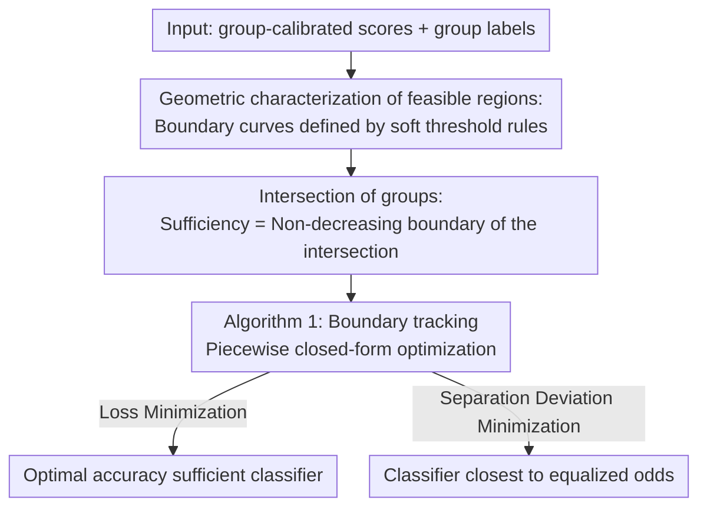

# Fair Decisions from Calibrated Scores: Achieving Optimal Classification While Satisfying Sufficiency

**Conference**: ICML 2026  
**arXiv**: [2602.07285](https://arxiv.org/abs/2602.07285)  
**Code**: https://github.com/etambenger/fair-decisions-from-calibrated-scores (Paper promises to release)  
**Area**: AI Safety / Algorithmic Fairness  
**Keywords**: Algorithmic Fairness, Sufficiency, Predictive Parity, Calibrated Scores, Post-processing

## TL;DR
This paper addresses a long-neglected pain point: "even if scores are fully group-calibrated across populations, applying a single threshold to them will violate sufficiency (predictive parity)." The authors provide an **exact solution** for the optimal binary classifier under sufficiency constraints with finite discrete scores. By geometrically characterizing the $(\mathrm{PPV}, \mathrm{FOR})$ feasible region, they derive a post-processing algorithm that depends only on scores and group labels. They prove this algorithm simultaneously solves two types of objectives: "loss minimization" and "minimizing deviation from separation under sufficiency."

## Background & Motivation

**Background**: Algorithmic fairness research typically revolves around three mutually incompatible statistical criteria: independence (demographic parity), separation (equalized odds), and sufficiency (predictive parity). The standard approach for the first two is post-processing: training a score $S$ and then thresholding or randomizing by group (Hardt et al., 2016; Corbett-Davies et al., 2017). A frequently cited "benign conclusion" is that if the score $S$ itself satisfies a certain criterion, any post-processing (e.g., a single threshold) will preserve that criterion.

**Limitations of Prior Work**: This benign conclusion **does not hold** for sufficiency. Even if $S$ is the true conditional probability $P(Y=1\mid X,A)$ (which naturally satisfies sufficiency), applying a global threshold to it to obtain a binary decision $R$ will almost always violate predictive parity. This is the root cause of the "calibrated scores but biased decisions" case in the COMPAS recidivism risk score (Chouldechova, 2017; Canetti et al., 2019).

**Key Challenge**: The sufficiency equation $P(Y=1\mid R,A)=P(Y=1\mid R)$ is a constraint on the group conditional distribution of the **discrete binary outcome** $R$. Since a single threshold induces different $\Pr(R=1\mid A=a)$ across groups, it destroys the consistency of PPV/FOR between groups. Existing works either allow abstention (Canetti et al., 2019), make strong assumptions that scores are continuous with full support (Baumann et al., 2022), or only approximate sufficiency (Celis et al., 2019; Delaney et al., 2024). **No existing method** provides an "exact optimal sufficient classifier under finite discrete group-calibrated scores."

**Goal**: In a setting closest to practical deployment (finite discrete scores, group-calibrated), answer three questions: (i) which $(\mathrm{PPV},\mathrm{FOR})$ pairs are achievable by a sufficient classifier? (ii) among these feasible pairs, how to precisely find the one that minimizes expected loss? (iii) since sufficiency and separation cannot be strictly satisfied simultaneously, can the deviation from separation be minimized while strictly satisfying sufficiency?

**Key Insight**: The authors discovered that, given a score distribution within a group, all (possibly randomized) binary classifiers constructed from that score form a **star-convex region** $\mathcal{C}$ with a closed-form description in the 2D plane of $(\mathrm{PPV},\mathrm{FOR})$ pairs. Its boundary is achieved by "soft threshold rules." Once the feasible regions $\mathcal{C}^a$ of each group are geometricized, sufficiency reduces to "selecting a point in the intersection $\mathcal{C}^0\cap\mathcal{C}^1$."

**Core Idea**: Reformulate the problem of "finding the optimal sufficient classifier" as "1D optimization along the 2D curve boundary of the feasible region intersection," and design a boundary tracking algorithm with $O(m^0+m^1)$ segments to solve both loss minimization and separation deviation minimization within the same framework.

## Method

### Overall Architecture
The method solves the problem of precisely finding the optimal binary classifier satisfying sufficiency when scores are already group-calibrated but thresholding would still violate sufficiency. The core mechanism is to move the search for decision rules to the 2D $(\mathrm{PPV},\mathrm{FOR})$ plane. Each group induces a feasible region $\mathcal{C}^a$ from its score distribution. Sufficiency is equivalent to "picking a point in the intersection of the two groups' feasible regions," reducing the search from infinite-dimensional randomized rules to 1D optimization along the intersection boundary. This process is purely post-processing, requiring only group-calibrated scores and group labels.

### Key Designs

**1. Geometric Characterization of $(\mathrm{PPV},\mathrm{FOR})$ Feasible Regions: Compressing infinite-dimensional rule search into a 2D curve**

Within a single group, all binary rules $R$ (including randomized ones) constructed from score $S$ correspond to a point $(p,q)=(\mathrm{PPV}(R),\mathrm{FOR}(R))$ in the plane. This paper provides the exact closed-form of this feasible region $\mathcal{C}$. By sorting scores in descending order $s_1>\dots>s_m$ and introducing the selection rate $\mu=P(R=1)$, the base equation $\pi=\mu p+(1-\mu)q$ (derived from calibration and the Markov chain $Y\leftrightarrow S\leftrightarrow R$) implies that for a fixed $\mu$, all $(p,q)$ lie on the same line passing through the center $(\pi,\pi)$ with slope $-\mu/(1-\mu)$. Maximizing $p$ for a fixed $\mu$ is a linear program with scores as coefficients, which reduces to the greedy solution of the fractional knapsack problem (Dantzig, 1957): select the largest score bins and use randomization for the last bin—this is a soft threshold rule where $P(R^*=1\mid s_i)$ takes the score value only at some $k^*(\mu)$.

Substituting back into the base equations gives the piecewise closed-form boundary $p^*(\mu)=s_k+c_k/\mu$ (where $c_k=\sum_{i<k}P(s_i)(s_i-s_k)$). The entire boundary $\partial\mathcal{C}$ consists of $m-1$ hyper-curve arcs and two straight edges, with arc endpoints corresponding precisely to the hard thresholds at $\mu_k=\sum_{i\le k}P(s_i)$. This characterization is crucial because $\mathcal{C}$ is star-convex relative to the center $(\pi,\pi)$; any interior point can be reproduced by a convex combination of boundary points and $(\pi,\pi)$, so the optimal solution must lie on the boundary, narrowing the search from an infinite-dimensional rule space to a 1D parameterized curve.

**2. Multi-group Sufficiency = Non-decreasing boundary of the intersection of feasible regions**

Sufficiency requires both groups to share the same $(\mathrm{PPV},\mathrm{FOR})$ pair, i.e., $p^0=p^1=p,\,q^0=q^1=q$, which translates to the geometric condition $(p,q)\in\mathcal{C}^0\cap\mathcal{C}^1$. The non-trivial boundary of each $\mathcal{C}^a$ can be written as a non-decreasing function $q^a(p)$ (Equation 7), and the intersection boundary is given by the pointwise maximum $q(p)=\max\{q^0(p),q^1(p)\}$, which remains a non-decreasing curve. Let $J_{k,l}$ be the interval on the $p$-axis subdivided by the breakpoints $\{p_k^0\},\{p_l^1\}$ of both groups. On each segment, $q^0,q^1$ are rational functions, and their difference reduces to the sign of a quadratic function $\Phi_{k,l}(p)$. Since there are at most 2 intersection points per segment, the "top" boundary group switches only a finite number of times.

This characterization reveals a counter-intuitive phenomenon: the optimal point on the intersection boundary typically does not correspond to a hard threshold rule for any group (Figure 2 provides a counter-example where even the intersection doesn't pass through any group's breakpoint). At least one group must use a randomized decision. This geometrically explains "why sufficiency optimality cannot be achieved by group-dependent hard thresholds alone" and shows that randomization is necessary.

**3. Algorithm 1: Simultaneous solution of two objectives via boundary tracking**

With the intersection boundary, finding the optimal classifier reduces to traversing all $J_{k,l,i}$ sub-segments (further subdivided by roots of $\Phi_{k,l}$) along $\partial(\mathcal{C}^0\cap\mathcal{C}^1)$, solving for the segment optimum in closed form, and taking the global optimum. The algorithm maintains the current active group $a\in\{0,1\}$ and indices $(k,l)$, spending $O(1)$ per segment for a total of approximately $m^0+m^1$ segments. Crucially, two types of objectives often discussed as opposites can be solved in closed form within each segment: for loss minimization, substituting $\mu=(\pi-q)/(p-q)$ back into expected loss yields $L=\pi\ell_{01}+\frac{\pi-q}{p-q}\bigl(\ell_{10}-p(\ell_{01}+\ell_{10})\bigr)$, where the first-order condition for $p$ reduces to a quadratic equation. For minimizing deviation from separation, expanding the TV distance yields $\Delta_{\mathrm{sep}}(R)=K\bigl(\frac{1-\mu}{p-\pi}-\frac{\mu(p-\pi)}{\pi(1-\pi)}\bigr)$, where the derivative with respect to $p$ is non-positive, meaning the minimum also lies on the boundary and has a closed-form solution for each segment.

Because both objectives share the same geometric framework, practitioners can explicitly plot both optimal curves and choose based on the application scenario without being locked into a pre-specified loss function—this is the significance of unifying the "accuracy optimal" and "closest to equalized odds" objectives into one algorithm.

### Loss & Training
The method is pure post-processing: it does not retrain the scoring model or require original features. It only uses group-calibrated scores and group labels to output decision rules $P(R=1\mid S,A)$. In cases where calibration is only approximate in real-world scenarios (e.g., using out-of-fold predictions for binning calibration), the authors provide robustness bounds in Appendix J and verify on ACS Income that the magnitude of predictive parity violation is very small (PPV gap $4.8\times 10^{-3}$).

## Key Experimental Results

### Main Results

| Dataset | Setting | Unconstrained Bayes Accuracy | Ours Optimal Sufficient Accuracy | Fairness Result |
| :--- | :--- | :--- | :--- | :--- |
| FICO (White/Black, 200 score bins) | Group-level calibrated | 0.8819 (PPV: 0.91/0.79; FOR: 0.20/0.13) | 0.8676 | Joint PPV $=0.91$, Joint FOR $=0.23$, strict sufficiency |
| COMPAS (White/Black, 10 decile scores) | Using pooled $P(Y=1\mid d)$ as group-calibrated | —— | —— | Optimal point lies at breakpoint of $\partial\mathcal{C}^1$ (Black group threshold $\ge 5$), White group must randomize |
| ACS Income (CA, Gender) | Logistic + out-of-fold 100-bin calibration | 0.8190 | 0.8167 | mean PPV gap $4.8\times 10^{-3}$, mean FOR gap $3.7\times 10^{-3}$ |

### Ablation Study

| Observation | Conclusion | Explanation |
| :--- | :--- | :--- |
| Optimal point vs Hard thresholds | FICO/COMPAS both require randomization for at least one group | Validates the theoretical prediction that sufficiency optima generally cannot be achieved by hard thresholds alone. |
| Loss-optimal vs $\Delta_{\mathrm{sep}}$-optimal | Fig 2 Left: overlap; Fig 2 Right: separate | The two objectives may land on different positions of the boundary for different problems; the algorithm provides both. |
| PPV/FOR drift under approx calibration | Levels of $\sim 4\times 10^{-3}$ on ACS | Acceptable for engineering practice and far smaller than the worst-case bounds in Appendix J. |

### Key Findings
- The **geometric perspective** directly yields **structural insights**: the intersection boundary rarely overlaps with any group's hard threshold breakpoint, implying that any deployment framework that disallows randomization or group-dependent rules is **theoretically incapable** of reaching sufficiency optimality.
- The accuracy cost is **modest**: from 0.8819 to 0.8676 on FICO, and from 0.8190 to 0.8167 on ACS, only $\sim 1\%$ to $1.6\%$. This is because the incompatibility between sufficiency and accuracy is much weaker than that between separation and accuracy (a conclusion that echoes Dwork et al., 2012).
- One algorithm covers both "accuracy optimal" and "closest to separation": in many instances, they coincide or are close. Engineering-wise, one can "view both curves before deciding" without needing to retrain.

## Highlights & Insights
- **Translating fairness into 2D geometry** is the most elegant feature of this paper. Once $\mathcal{C}^a$ and their intersection are plotted on the $(\mathrm{PPV},\mathrm{FOR})$ plane, the entire theory is almost "self-explanatory," making it very easy to communicate with domain experts. This "geometry first, algorithm second" paradigm could be transferred to separation or multi-group settings.
- The **optimality of soft thresholds** (Theorem 3.3) is equivalent to the fractional knapsack greedy solution, suggesting that many fairness post-processing tasks that "look like complex optimizations" are essentially sorting + boundary search, with low enough complexity for online deployment.
- **Acknowledging the inevitability of randomization** is key. While many real-world scenarios (credit, bail) resist "randomized decisions for the same score," this paper provides geometric evidence that under strict multi-group sufficiency, **rejecting randomization equals rejecting optimality**—providing a hard constraint for policy discussions.

## Limitations & Future Work
- As the number of groups increases, the condition for multiple $\mathcal{C}^a$ to have a non-empty intersection becomes stricter; **strict sufficiency may have no feasible solution**. The authors suggest future research relax this to minimizing PPV/FOR gaps under multiple groups.
- Assumes scores are **group-calibrated**. Although multicalibration (Hébert-Johnson et al., 2018) and isotonic/Platt scaling can approximate this, calibration errors in practice will propagate into predictive parity violations. Appendix J provides worst-case bounds, but systematic evaluation under distribution shift or label noise is lacking.
- Experiments are more "case studies." Only three datasets (FICO / COMPAS / ACS Income) were used, and a systematic comparison of relative precision loss against recent tools like OxonFair (Delaney et al., 2024) in a unified benchmark is missing.
- Current formulas only cover binary $A$. While the authors claim multi-group extension is "direct," the multivariate generalization of $\Phi_{k,l}$ and its complexity are not provided.
- Decisions are "group-dependent + possibly randomized," which might be unacceptable under certain legal/ethical frameworks. The deployability of the method needs to be discussed alongside specific regulations.

## Related Work & Insights
- **vs Canetti et al. (2019)**: They satisfy sufficiency by introducing an "abstain" action. This paper does not require abstention and finds the optimum directly on the $(\mathrm{PPV},\mathrm{FOR})$ plane—more suitable for practical deployment where a 0/1 decision is mandatory.
- **vs Baumann et al. (2022)**: Also pursue sufficiency post-processing without abstention but assume scores are continuous with full support. This paper specifically targets **finite discrete scores**, which matches the setting of real scoring systems like COMPAS, significantly expanding applicability.
- **vs Hardt et al. (2016) (separation/equalized odds post-processing)**: That paper provided the "textbook answer" for separation post-processing; this paper is the sufficiency counterpart and additionally provides a trade-off by "minimizing the distance to separation under sufficiency"—unifying two traditionally opposing paths into a single framework.
- **vs Zeng et al. (2022) (fair Bayes-optimal under predictive parity)**: They only constrain PPV equality for positive decisions. This paper constrains both PPV and FOR, covering full predictive parity with more rigorous theory.

## Rating
- Novelty: ⭐⭐⭐⭐ First to provide an exact solution for sufficiency optimality in the realistic "finite discrete group-calibrated scores" setting, unifying loss/separation objectives via a geometric perspective.
- Experimental Thoroughness: ⭐⭐⭐ Three classic cases are sufficient to demonstrate the method, but quantitative comparison against baselines like OxonFair / Zeng 2022 on the same benchmark is missing.
- Writing Quality: ⭐⭐⭐⭐⭐ Definitions, theorems, geometric plots, and algorithm pseudocode proceed logically. Almost every conclusion is illustrated, making it highly readable.
- Value: ⭐⭐⭐⭐ Provides a clear proof of "why calibration is not enough" and solves it. Directly instructive for high-stakes decisions in credit, criminal justice, and healthcare.

<!-- RELATED:START -->

## Related Papers

- [\[ICML 2026\] Demystifying the Optimal Fair Classifier in Multi-Class Classification](demystifying_the_optimal_fair_classifier_in_multi-class_classification.md)
- [\[ICML 2026\] Fair Dataset Distillation via Cross-Group Barycenter Alignment](fair_dataset_distillation_via_cross-group_barycenter_alignment.md)
- [\[ICLR 2026\] Fair Conformal Classification via Learning Representation-Based Groups](../../ICLR2026/ai_safety/fair_conformal_classification_via_learning_representation-based_groups.md)
- [\[ICML 2026\] Fairness in Aggregation: Optimal Top-$k$ and Improved Full Ranking](fairness_in_aggregation_optimal_top-k_and_improved_full_ranking.md)
- [\[ICML 2026\] Extending Fair Null-Space Projections for Continuous Attributes to Kernel Methods](extending_fair_null-space_projections_for_continuous_attributes_to_kernel_method.md)

<!-- RELATED:END -->
