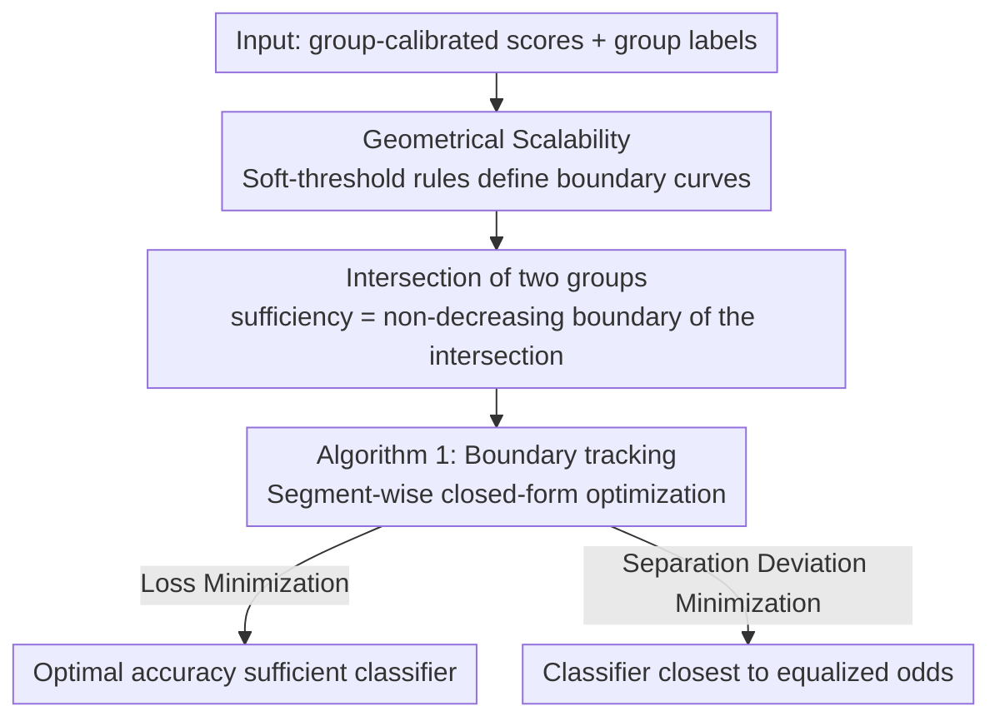

# Fair Decisions from Calibrated Scores: Achieving Optimal Classification While Satisfying Sufficiency

**Conference**: ICML 2026  
**arXiv**: [2602.07285](https://arxiv.org/abs/2602.07285)  
**Code**: https://github.com/etambenger/fair-decisions-from-calibrated-scores (Paper promises future release)  
**Area**: AI Safety / Algorithmic Fairness  
**Keywords**: Algorithmic Fairness, Sufficiency, Predictive Parity, Calibrated Scores, Post-processing

## TL;DR
This paper addresses the long-overlooked issue that even when scores are fully group-calibrated, applying a single threshold to them violates sufficiency (predictive parity). It provides an **exact solution** for the optimal binary classifier under sufficiency constraints with finite discrete scores. By geometrically characterizing the $(\mathrm{PPV}, \mathrm{FOR})$ feasible region, the authors derive a post-processing algorithm that relies solely on scores and group labels. They prove this algorithm simultaneously solves both "loss minimization" and "minimizing deviation from separation under sufficiency" objectives.

## Background & Motivation

**Background**: Research in algorithmic fairness generally revolves around three mutually incompatible statistical criteria: independence (demographic parity), separation (equalized odds), and sufficiency (predictive parity). The standard approach for the first two is post-processing: training a score $S$, followed by group-specific thresholding or randomization (Hardt et al., 2016; Corbett-Davies et al., 2017). A frequently cited "benign conclusion" is that if the score $S$ already satisfies a criterion, any post-processing (e.g., a single threshold) will preserve it.

**Limitations of Prior Work**: This benign conclusion **does not hold** for sufficiency. Even if $S$ is the true conditional probability $P(Y=1\mid X,A)$ (which naturally satisfies sufficiency), a binary decision $R$ obtained by applying a global threshold will almost always violate predictive parity. This is the root cause of "calibrated scores but biased decisions" observed in the COMPAS recidivism risk score case (Chouldechova, 2017; Canetti et al., 2019).

**Key Challenge**: The sufficiency equality $P(Y=1\mid R,A)=P(Y=1\mid R)$ is a constraint on the group conditional distribution of **discrete binary outcomes** $R$. However, a single threshold induces different selection rates $\Pr(R=1\mid A=a)$ across groups, destroying the consistency of PPV/FOR between them. Existing works either allow abstention (Canetti et al., 2019), assume continuous scores with full support (Baumann et al., 2022), or only approximate sufficiency (Celis et al., 2019; Delaney et al., 2024). **No existing method** provides the "exact optimal sufficient classifier under finite discrete group-calibrated scores."

**Goal**: In a setting closest to practical deployment (finite discrete, group-calibrated scores), this paper answers three questions: (i) Which $(\mathrm{PPV},\mathrm{FOR})$ pairs are achievable for a sufficient classifier? (ii) How can the one that minimizes expected loss be found exactly among these feasible pairs? (iii) Since sufficiency and separation cannot be strictly satisfied simultaneously, can the deviation from separation be minimized while strictly satisfying sufficiency?

**Key Insight**: The authors discovered that given a score distribution within a group, all (possibly randomized) binary classifiers constructible from those scores form a **star-convex region** $\mathcal{C}$ in the 2D plane with a closed-form description, where the boundary is achieved by "soft-threshold rules." Once the feasible regions $\mathcal{C}^a$ for each group are geometricized, sufficiency reduces to "selecting a point within the intersection $\mathcal{C}^0\cap\mathcal{C}^1$."

**Core Idea**: Reformulate "finding the optimal sufficient classifier" as "one-dimensional optimization along the 2D curve boundary of the intersection of feasible regions." A boundary-tracking algorithm with $O(m^0+m^1)$ segments is designed to solve both loss minimization and separation deviation minimization in the same framework.

## Method

### Overall Architecture
The method solves for the optimal sufficient binary classifier when scores are group-calibrated but thresholding would violate sufficiency. The Mechanism involves moving the search for decision rules to the $(\mathrm{PPV},\mathrm{FOR})$ 2D plane—each group induces a feasible region $\mathcal{C}^a$ based on its score distribution. Sufficiency is equivalent to "selecting a point in the intersection of the feasible regions of both groups," reducing the problem from an infinite-dimensional search for randomized rules to a one-dimensional optimization along the intersection boundary. The entire process is purely post-processing, requiring only group-calibrated scores and group labels.

### Key Designs

**1. Geometric Characterization of the $(\mathrm{PPV},\mathrm{FOR})$ Feasible Region: Compressing Infinite-Dimensional Search into a 2D Curve**

Within a single group, all binary rules $R$ (including randomized ones) constructible from score $S$ correspond to a point $(p,q)=(\mathrm{PPV}(R),\mathrm{FOR}(R))$ in the plane. This paper provides an exact closed-form for this feasible region $\mathcal{C}$. By sorting scores in descending order $s_1>\dots>s_m$ and introducing the selection rate $\mu=P(R=1)$, the basic equality $\pi=\mu p+(1-\mu)q$ (derived from calibration and the Markov chain $Y\!\leftrightarrow\! S\!\leftrightarrow\! R$) implies that for a fixed $\mu$, all $(p,q)$ lie on a line passing through the center $(\pi,\pi)$ with slope $-\mu/(1-\mu)$. Maximizing $p$ for a fixed $\mu$ is a linear program with scores as coefficients, which reduces to the greedy solution of a fractional knapsack (Dantzig, 1957): selecting the largest score bins and randomizing the last bin—this is the soft-threshold rule where $P(R^\*=1\mid s_i)$ is fractional only at some $k^\*(\mu)$.

Substituting back into the basic equality yields a piecewise closed-form for the boundary $p^\*(\mu)=s_k+c_k/\mu$ (where $c_k=\sum_{i<k}P(s_i)(s_i-s_k)$). The entire boundary $\partial\mathcal{C}$ consists of $m-1$ hyper-curve arcs and two straight edges, where the arc endpoints correspond to the hard thresholds $\mu_k=\sum_{i\le k}P(s_i)$. This characterization is crucial because $\mathcal{C}$ is star-convex regarding the center $(\pi,\pi)$; any internal point can be recovered by a convex combination of a boundary point and $(\pi,\pi)$, meaning the optimal solution must lie on the boundary.

**2. Multi-group Sufficiency = Non-decreasing Boundary of the Intersection of Feasible Regions**

Sufficiency requires the two groups to share the same $(\mathrm{PPV},\mathrm{FOR})$ pair, i.e., $p^0=p^1=p,\,q^0=q^1=q$. This translates to the geometric condition $(p,q)\in\mathcal{C}^0\cap\mathcal{C}^1$. The non-trivial boundary of each $\mathcal{C}^a$ can be written as a non-decreasing function $q^a(p)$. The intersection boundary is given by the pointwise maximum $q(p)=\max\{q^0(p),q^1(p)\}$, which remains a non-decreasing curve. By partitioning the $p$-axis into intervals $J_{k,l}$ based on the union of breakpoints $\{p_k^0\}$ and $\{p_l^1\}$ from both groups, $q^0$ and $q^1$ are rational functions on each segment. Their difference is determined by the sign of a quadratic function $\Phi_{k,l}(p)$, with at most two intersection points per segment. Thus, the identity of the "upper" boundary switches only a finite number of times.

This characterization reveals a counter-intuitive phenomenon: the optimal point on the intersection boundary usually does not correspond to a hard threshold rule for either group (Figure 2 shows cases where the boundary does not even pass through the breakpoints of either group). At least one group must use a randomized decision. This geometrically explains why sufficiency optimality cannot be reached via group-specific hard thresholds alone and demonstrates that randomization is necessary.

**3. Algorithm 1: Simultaneous Solution of Two Objectives via Boundary Tracking**

With the intersection boundary defined, finding the optimal classifier reduces to traversing all sub-segments $J_{k,l,i}$ along $\partial(\mathcal{C}^0\cap\mathcal{C}^1)$ (subdivided by the roots of $\Phi_{k,l}$), solving for the optimum locally in closed-form, and taking the global optimum. The algorithm maintains the active group $a\in\{0,1\}$ and the index $(k,l)$, spending $O(1)$ per segment for a total of approximately $m^0+m^1$ segments. Crucially, two types of objectives often discussed in opposition can be solved in closed-form for each segment: for loss minimization, substituting $\mu=(\pi-q)/(p-q)$ into expected loss yields $L=\pi\ell_{01}+\frac{\pi-q}{p-q}\bigl(\ell_{10}-p(\ell_{01}+\ell_{10})\bigr)$, where the first-order condition for $p$ reduces to a quadratic equation; for separation deviation minimization, expanding the TV distance yields $\Delta_{\mathrm{sep}}(R)=K\bigl(\frac{1-\mu}{p-\pi}-\frac{\mu(p-\pi)}{\pi(1-\pi)}\bigr)$, where the derivative with respect to $p$ is non-positive, meaning the minimum also falls on the boundary with a closed-form.

Because both objectives share the same geometric framework, practitioners can explicitly plot both optimal curves and choose based on the application context, rather than being restricted to a pre-specified loss function.

### Loss & Training
The method is pure post-processing: it does not retrain the scoring model and does not require raw features. It only uses group-calibrated scores and group labels to output the decision rule $P(R=1\mid S,A)$. In cases where calibration is only approximate in practice (e.g., using out-of-fold predictions for binning calibration), the authors provide robustness bounds in Appendix J and verify on ACS Income that the violation of predictive parity is minimal (PPV gap $4.8\times 10^{-3}$).

## Key Experimental Results

### Main Results
| Dataset | Setup | Unconstrained Bayes Accuracy | Ours (Optimal Sufficient Accuracy) | Fairness Results |
| :--- | :--- | :--- | :--- | :--- |
| FICO (White/Black, 200 bins) | Group-level calibrated | 0.8819 (PPV: 0.91 / 0.79; FOR: 0.20 / 0.13) | 0.8676 | Shared PPV $=0.91$, shared FOR $=0.23$, strict sufficiency |
| COMPAS (White/Black, 10 decile scores) | Pooled $P(Y=1\mid d)$ as group-calibrated | —— | —— | Optimal point falls on a hard threshold for Black group ($\ge 5$); White group must randomize |
| ACS Income (CA, Gender) | Logistic + out-of-fold 100-bin calibration | 0.8190 | 0.8167 | Mean PPV gap $4.8\times 10^{-3}$, mean FOR gap $3.7\times 10^{-3}$ |

### Ablation Study
| Observation | Conclusion | Description |
| :--- | :--- | :--- |
| Hard Threshold Optimality | Both FICO/COMPAS require randomization for at least one group | Validates the theoretical prediction that sufficiency optimality typically cannot be achieved via hard thresholds alone. |
| Loss-optimal vs $\Delta_{\mathrm{sep}}$-optimal | Fig 2 Left: Coincide; Fig 2 Right: Diverge | The two may lie at different positions on the boundary depending on the problem; the algorithm provides both. |
| PPV/FOR Drift under Approx. Calib. | $\sim 4\times 10^{-3}$ on ACS | Acceptable in engineering practice and far smaller than the worst-case bounds in Appendix J. |

### Key Findings
- **Geometric perspective** yields direct **structural insights**: the intersection boundary rarely overlaps with any group's hard threshold breakpoints, meaning any deployment framework that disallows randomization or group-dependent rules is **theoretically incapable** of reaching sufficiency optimality.
- The accuracy cost is **modest**: Drop from 0.8819 to 0.8676 on FICO and from 0.8190 to 0.8167 on ACS ($\sim 1\%$–$1.6\%$), as the incompatibility between sufficiency and accuracy is much weaker than that between separation and accuracy (consistent with Dwork et al., 2012).
- A single algorithm balances "accuracy optimality" and "closest proximity to separation": as these often coincide or are close, engineers can "inspect both curves before deciding" without retraining.

## Highlights & Insights
- **Translating fairness into 2D geometry** is the most elegant aspect of this work: once $\mathcal{C}^a$ and their intersection are plotted on the $(\mathrm{PPV},\mathrm{FOR})$ plane, the theory becomes intuitive. This "geometry-first, algorithm-second" paradigm is transferable to separation or multi-group settings.
- **Optimality of soft-thresholding** (Theorem 3.3) is equivalent to the fractional knapsack greedy algorithm, suggesting that many "seemingly complex optimization" fairness post-processings are essentially sorting and boundary searches with low complexity suitable for online deployment.
- **Acknowledging the inevitability of randomization** is critical. While many real-world scenarios (credit, bail) resist "randomized decisions for the same score," the geometric evidence provided here shows that under strict multi-group sufficiency, **refusing randomization is a refusal of optimality**—providing a solid constraint for policy discussions.

## Limitations & Future Work
- As the number of groups increases, the condition for multiple $\mathcal{C}^a$ having a non-empty intersection becomes more stringent; **strict sufficiency may have no feasible solution**. Future research is suggested to relax this to minimizing PPV/FOR gaps.
- The assumption of **group-calibrated** scores is key. While multicalibration (Hébert-Johnson et al., 2018) and isotonic/Platt scaling can approximate this, calibration errors propagate to predictive parity violations. Worst-case bounds are provided, but systematic evaluation under distribution shift or label noise is lacking.
- Experiments are "case studies" on FICO / COMPAS / ACS Income; a quantitative comparison of relative accuracy loss against recent tools like OxonFair (Delaney et al., 2024) on unified benchmarks is missing.
- The current formulation covers binary $A$; while extension to more groups is claimed to be "direct," the multi-variate generalization of $\Phi_{k,l}$ and its complexity are not detailed.
- Decision outcomes are "group-dependent + potentially randomized," which may be unacceptable under certain judicial or ethical frameworks. The deployability of the method requires discussion regarding specific regulations.

## Related Work & Insights
- **vs Canetti et al. (2019)**: They satisfy sufficiency by introducing an "abstain" action; this paper requires no abstention, finding the optimum directly in the $(\mathrm{PPV},\mathrm{FOR})$ plane—closer to practical deployment where binary 0/1 decisions are mandatory.
- **vs Baumann et al. (2022)**: Also pursues sufficiency post-processing without abstention but assumes continuous scores with full support. This work specifically targets **finite discrete scores**, which is the setting for real systems like COMPAS, significantly broadening applicability.
- **vs Hardt et al. (2016)**: While that is the "textbook answer" for separation post-processing, this paper provides the sufficiency equivalent and an additional trade-off: "minimizing the distance to separation under sufficiency"—unifying two traditionally opposing paths.
- **vs Zeng et al. (2022)**: They only constrain PPV equality for positive decisions; this paper constrains both PPV and FOR, covering the full predictive parity with more rigorous theory.

## Rating
- Novelty: ⭐⭐⭐⭐ First to provide an exact solution for sufficiency optimality under the realistic "finite discrete group-calibrated" setting, unifying loss and separation via a geometric perspective.
- Experimental Thoroughness: ⭐⭐⭐ Three classic cases demonstrate utility, but lacks quantitative benchmark comparisons with baselines like OxonFair or Zeng 2022.
- Writing Quality: ⭐⭐⭐⭐⭐ Logical progression from definitions to theorems, geometry, and pseudo-code; nearly every conclusion is illustrated, making it highly readable.
- Value: ⭐⭐⭐⭐ Provides a clear proof of "why calibration is not enough" and solves the issue, with direct guidance for high-stakes decisions in credit, criminal justice, and healthcare.

<!-- RELATED:START -->

<!-- RELATED:END -->

## Related Papers

- [\[ICML 2026\] Demystifying the Optimal Fair Classifier in Multi-Class Classification](demystifying_the_optimal_fair_classifier_in_multi-class_classification.md)
- [\[ICML 2026\] Fair Dataset Distillation via Cross-Group Barycenter Alignment](fair_dataset_distillation_via_cross-group_barycenter_alignment.md)
- [\[ICML 2026\] Extending Fair Null-Space Projections for Continuous Attributes to Kernel Methods](extending_fair_null-space_projections_for_continuous_attributes_to_kernel_method.md)
- [\[ICML 2026\] Fairness in Aggregation: Optimal Top-$k$ and Improved Full Ranking](fairness_in_aggregation_optimal_top-k_and_improved_full_ranking.md)
- [\[ICML 2026\] Optimal Transport under Group Fairness Constraints](optimal_transport_under_group_fairness_constraints.md)

<!-- RELATED:END -->
