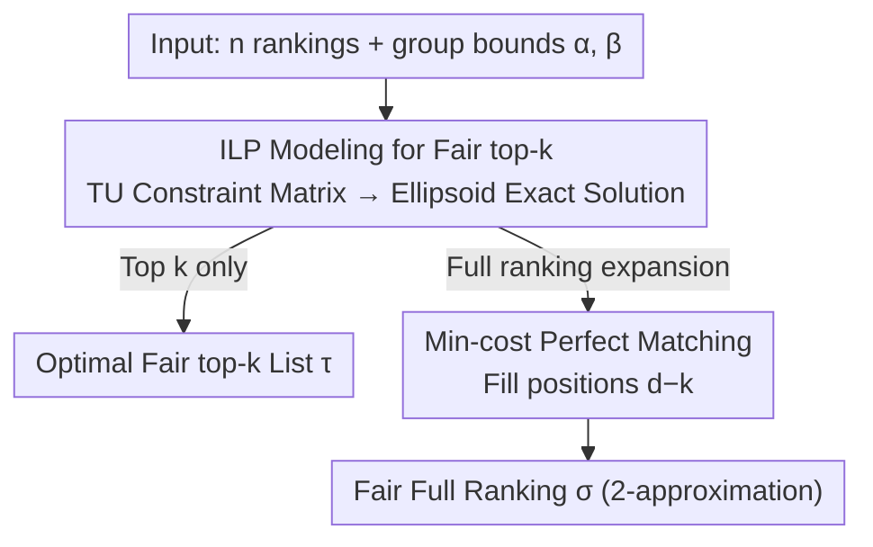

# Fairness in Aggregation: Optimal Top-$k$ and Improved Full Ranking

**Conference**: ICML 2026  
**arXiv**: [2605.23265](https://arxiv.org/abs/2605.23265)  
**Code**: https://github.com/Aussiroth/Spearman-FRA  
**Area**: AI Safety / Algorithmic Fairness  
**Keywords**: Fair rank aggregation, Spearman footrule, Top-k, Totally Unimodular Matrix, LP relaxation

## TL;DR
Under the Spearman footrule distance, this work proves that the ILP constraint matrix is totally unimodular, providing the first polynomial-time optimal algorithm for fair top-$k$ rank aggregation. It further improves the approximation ratio for fair (full) rank aggregation from 3 to 2 using a two-step strategy: solving fair top-$k$ first and then completing it into a full permutation via minimum-cost perfect matching.

## Background & Motivation

**Background**: Rank aggregation, which merges multiple preference rankings into a single consensus ranking, is a core primitive in scenarios like hiring, recommendation, Web search, and meta-search. One classic metric is the Spearman footrule, defined as the rank-wise $L_1$ distance $F(\pi_1, \pi_2) = \sum_i |\pi_1(i) - \pi_2(i)|$. It differs from Kendall-tau by at most a factor of 2 (Diaconis & Graham, 1977) but is more computationally friendly, being solvable in polynomial time for unconstrained cases (Dwork et al., WWW'01).

**Limitations of Prior Work**: Directly applying unconstrained algorithms to scenarios with fairness constraints amplifies the under-representation of marginalized groups. Existing fair versions only achieve a 3-approximation (Wei et al., SIGMOD'22; Chakraborty et al., NeurIPS'22): they first find the nearest fair ranking for each input ranking and then select the one with the minimum total distance—a meta-algorithm derived directly from the triangle inequality that remained the state-of-the-art for years. Worse, this 3-approximation only covers full rankings, offering no specialized guarantees for top-$k$ scenarios (e.g., hiring or recommendation focusing only on the first $k$ items).

**Key Challenge**: There is a significant complexity gap between fair and unconstrained settings—unconstrained is poly-time solvable, yet fair versions were stuck at a 3-approximation with no clear path forward. This gap was explicitly listed as an open problem by Wei et al. The fundamental technical difficulty is that after formulating the problem as an ILP, standard LP relaxation + rounding techniques often violate minority protection / restricted dominance constraints.

**Goal**: To decompose the problem into two sub-problems: (i) provide an optimal polynomial algorithm for fair top-$k$ rank aggregation; (ii) provide a better approximation ratio for fair full rank aggregation.

**Key Insight**: Instead of performing rounding on LP solutions (which inevitably violates fairness constraints), one can prove that the constraint matrix of the LP is **totally unimodular (TU)**. This ensures that the LP naturally has integer optimal solutions, allowing the use of the ellipsoid method to solve the LP and directly obtain the ILP optimum.

**Core Idea**: For fair top-$k$, an exact solution is obtained via "TU structure + ellipsoid method." For fair full ranking, a two-step method is used: "solving fair top-$k$ + minimum-cost perfect matching expansion," which, combined with a lemma decomposing the Spearman footrule into leftward/rightward displacements, improves the approximation ratio to 2.

## Method

### Overall Architecture

The problem is split into two progressive sub-tasks: first solving the "top-$k$ only" fair rank aggregation exactly, and then expanding this top-$k$ solution into a fair full ranking. Formally, $d$ candidates are partitioned into $g$ groups $G_1, \ldots, G_g$, with given lower bounds $\alpha_a$ and upper bounds $\beta_a$. The input is $n$ rankings $S \subseteq \mathcal{S}_d$. A $(\bar\alpha, \bar\beta)$-$k$-fair ranking requires that the number of candidates from group $G_a$ in the top $k$ positions falls within $[\lfloor \alpha_a k \rfloor, \lceil \beta_a k \rceil]$. The objective is to minimize the sum of Spearman footrule distances from the consensus to all input rankings. Fair top-$k$ outputs a list $\tau$ of $k$ candidates (with items outside $\tau$ penalized as being at position $k+1$, following the extension by Fagin et al.), while fair full ranking outputs a complete permutation $\sigma$ of all $d$ candidates.

### Key Designs

**1. ILP Modeling and TU Proof for Fair top-$k$: Strictly Satisfying Fairness instead of "Approximating"**

A common difficulty in fair combinatorial optimization is that standard LP relaxation + rounding often destroys fairness constraints (e.g., in fair correlation clustering or fair $k$-clustering, solutions often have factor violations). This work takes a different path—foregoing rounding and directly proving the constraint matrix of the LP relaxation is totally unimodular (TU). This ensures the LP optimum is inherently integer. The model uses $x_{ij} \in \{0,1\}$ to indicate if candidate $i$ is placed at position $j$ ($j \le k$), with cost $w_{ij} = \sum_{\pi \in S} |\pi(i) - j|$. Constraints include "each candidate at most one position," "each position exactly one candidate," and the group bounds $\lfloor \alpha_a k \rfloor$ / $\lceil \beta_a k \rceil$. The TU property is proved using the characterization by Wolsey-Nemhauser: for any set of rows $R$, one must construct a partition $R = R_1 \cup R_2$ such that the difference of sums for each column across sides is $\le 1$. The authors arrange this by row type—offsetting group upper and lower bounds on the same side, placing position constraints in $R_2$, and assigning candidate constraints based on group membership. TU property is the key lever that jumps the problem from a 3-approximation to an exact solution.

**2. Two-step Fair Full Rank Aggregation: Embedding Fairness into Top-$k$ and Reducing Expansion to Unconstrained Matching**

Since "fair perfect matching" is NP-hard (Appendix D), full ranking cannot be solved in one step. This work splits it into "solving fair top-$k$" then "filling the remaining $d-k$ positions." The first step does not use the original objective directly but solves a variant: $2 \sum_{\pi} \sum_{i \in D_\tau} (\pi(i) - \tau(i)) \cdot \mathbb{1}_{\tau(i) < \pi(i)}$, which counts only leftward displacements multiplied by 2. Since this only changes objective coefficients and not the constraint matrix, TU holds, and an optimal fair top-$k$ list $\tau$ is found in polynomial time. The second step is a "Minimum Cost Top-$k$ List Completion" sub-problem: fixing $\tau$ and filling the remaining $d-k$ candidates into positions $k+1, \ldots, d$ to minimize the total objective. This is equivalent to min-cost perfect matching on a complete bipartite graph with $2d$ vertices, solvable in $O(nd^2 + d^3)$. Consequently, fairness is strictly handled in the top-$k$ part via TU, while expansion reduces to a standard matching problem without fairness constraints.

**3. 2-Approximation Analysis via Displacement Decomposition: Aligning Footrule with the Sub-algorithm Objective**

To improve the 3-approximation to 2, the difficulty lies in bounding $F(\pi,\sigma)$. This work adopts the observation by Mathieu-Mauras that the Spearman footrule equals twice the sum of leftward displacements (as leftward and rightward displacements must balance), i.e., $F(\pi,\sigma) = 2 \sum_i (\pi(i)-\sigma(i)) \mathbb{1}_{\sigma(i)<\pi(i)}$. Thus, only the leftward displacement needs analysis. Let $L, R$ be the top $k$ / bottom $d-k$ element sets of the output $\sigma$, and $L^*, R^*$ be those of the optimal solution $\sigma^*$. For the top $k$ segment, optimality of algorithm $\mathcal{A}$ gives $\overleftarrow{\mathrm{Obj}}(\sigma_L) \le \overleftarrow{\mathrm{Obj}}(\sigma^*_{L^*})$. For the bottom $d-k$ segment, a reference ranking $\tilde\sigma$ is constructed—copying elements from $R \cap R^*$ to their positions in $\sigma^*$ and placing $R \setminus R^*$ elements (which must be in $L^*$) arbitrarily. Since they are moved rightward in $\tilde\sigma$, leftward displacement does not increase, yielding $\overleftarrow{\mathrm{Obj}}(\sigma_R) \le \overleftarrow{\mathrm{Obj}}(\tilde\sigma_R) \le \mathrm{OPT}$. Summing both gives $\mathrm{Obj}(\sigma) \le \overleftarrow{\mathrm{Obj}}(\sigma^*_{L^*}) + \mathrm{OPT} \le 2\,\mathrm{OPT}$. This decomposition also implies robustness to metrics; since Spearman and Kendall-tau differ by at most a factor of 2, it directly implies a 4-approximation for Kendall-tau.

### Loss & Training
This work utilizes combinatorial optimization algorithms and does not involve training. The final execution relies on the ellipsoid method for LP and Edmonds-Karp for min-cost perfect matching, resulting in polynomial total complexity (Gurobi 12.0.3 was used in experiments to solve the ILP).

## Key Experimental Results

### Main Results

Datasets: (i) Movielens subset—preference rankings from 7 users for 268 movies across 8 genres; (ii) Fantasy Football—weekly rankings over 16 weeks of 57 players by 25 experts, split by conference. Proportional fairness constraints were set using $\bar\alpha = \bar\beta$ based on actual group ratios in the input.

| Dataset | Algorithm | Gap to Optimal | vs KT (Kendall-tau SOTA) | vs BFI (3-approx SOTA) |
|--------|------|-----------|--------------------------|------------------------|
| Movielens | Ours (Algorithm 3) | 2%–3% | 5%–11% Lower | 13%–15% Lower |
| Football (week 4) | Ours (Algorithm 3) | ≤ 1% | 1%–2% Lower | 5%–10% Lower |

### Ablation Study

| Configuration | Dataset | Result |
|------|--------|------|
| Algorithm 1 (Basic 2-approx) | Movielens | Better than BFI, weaker than Algorithm 3 |
| Algorithm 3 (Best of two 2-approx) | Movielens / Football | Consistently wins in practice |
| Metric: Kendall-tau (Theoretical 4-approx) | Movielens | 8%–10% lower than BFI (3-approx), within 2% of KT, sometimes better |
| Metric: Kendall-tau | Football | Within 2% of KT, still 4%–10% better than BFI |

### Key Findings
- While the theoretical bound is a 2-approximation, empirical results consistently stay within 3% (or even 1%) of the optimum, suggesting that the constant 2 is not tight and there is room for tighter analysis.
- Selecting the better of two 2-approximation algorithms provides stable gains, showing their "worst-case" scenarios do not overlap.
- The algorithm is robust to distance metrics: although designed for Spearman footrule, it outperforms BFI and approaches KT on Kendall-tau, proving the "fair top-$k$ then matching" framework is universal for $L_1$-style metrics.

## Highlights & Insights
- **Bypassing LP Rounding with TU**: In literature on fair clustering and matching, fairness has always been a rounding disaster. This is the first work to "embed" fairness directly into integer optimal solutions via TU, a highly transferable approach.
- **Objective Shifting to Preserve TU**: Switching from the exact objective to a "leftward displacement only" objective keeps the constraint matrix unchanged (preserving TU) while aligning the objective with the inequalities required for 2-approximation analysis—a clever "objective hack."
- **Displacement Decomposition + Reference Ranking**: Splitting the optimal ranking $\sigma^*$ into $R \cap R^*$ and $R \setminus R^*$ to localize the loss between fair and unconstrained settings is a useful technique for fair aggregation analysis under other metrics.

## Limitations & Future Work
- **Non-tight 2-approximation**: The 10x–100x gap between theory and empirical results remains; lower bounds or tighter analysis are still open.
- **Weak Fairness Definitions**: Focus is limited to top-$k$ proportional fairness, ignoring block fairness, overlapping groups, or latent attributes.
- **Metric Limitations**: Analysis relies on the symmetry of leftward/rightward displacements in Spearman footrule; Ulam or weighted Kendall are not yet covered. The 4-approximation for Kendall-tau is inferior to the 2-approximation by Chakraborty et al. (2025b).
- **NP-hardness of Fair Perfect Matching**: This blocks a unified "one-step fair full ranking" route. Future breakthroughs might require relaxing fairness in matching or changing the problem structure.

## Related Work & Insights
- **vs BFI (Chakraborty et al., NeurIPS'22 / Wei et al., SIGMOD'22)**: BFI achieves a 3-approximation by finding the nearest fair ranking for each input. This work re-engineers the framework to achieve a 2-approximation, marking a significant theoretical breakthrough.
- **vs KT (Chakraborty et al., 2025b)**: KT is the SOTA for Kendall-tau (18/7-approx, implying 36/7-approx for Spearman). This work is strictly better for Spearman and remains competitive with KT even when evaluated on Kendall-tau.
- **vs (Celis et al., NeurIPS'18) Closest Fair Ranking**: They find the nearest fair ranking for a *single* input, whereas this work finds a fair *consensus* for a group—a harder problem where Celis et al.'s approach as a building block fails to yield strong approximations.
- **Insight**: The TU + ellipsoid technique can be transferred to other fair combinatorial optimization problems where rounding fails (e.g., fair matroid intersection, fair flow).

## Rating
- Novelty: ⭐⭐⭐⭐ Using TU to bypass fair LP rounding is a fresh perspective and solves an open problem by Wei et al.
- Experimental Thoroughness: ⭐⭐⭐ Two standard fair RA datasets plus cross-metric robustness; however, scales are relatively small ($d \le 268$), lacking large-scale stress tests.
- Writing Quality: ⭐⭐⭐⭐ Clear definitions and theorems; the TU proof construction is detailed, though the barrier for non-combinatorial-optimization readers is high.
- Value: ⭐⭐⭐⭐ First optimal algorithm for fair top-$k$ and improvement of full-ranking approx from 3 to 2; a clear advancement in fair ranking literature with practical applicability.

<!-- RELATED:START -->

## Related Papers

- [\[ICML 2026\] Optimal Transport under Group Fairness Constraints](optimal_transport_under_group_fairness_constraints.md)
- [\[CVPR 2026\] RankOOD: Class Ranking-based Out-of-Distribution Detection](../../CVPR2026/ai_safety/rankood_-_class_ranking-based_out-of-distribution_detection.md)
- [\[ICML 2026\] Demystifying the Optimal Fair Classifier in Multi-Class Classification](demystifying_the_optimal_fair_classifier_in_multi-class_classification.md)
- [\[ICML 2026\] Fair Decisions from Calibrated Scores: Achieving Optimal Classification While Satisfying Sufficiency](fair_decisions_from_calibrated_scores_achieving_optimal_classification_while_sat.md)
- [\[ICLR 2026\] Certifying the Full YOLO Pipeline: A Probabilistic Verification Approach](../../ICLR2026/ai_safety/certifying_the_full_yolo_pipeline_a_probabilistic_verification_approach.md)

<!-- RELATED:END -->
